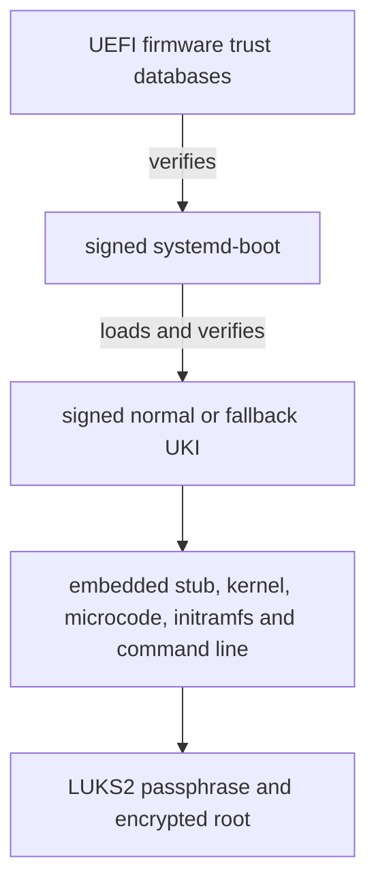
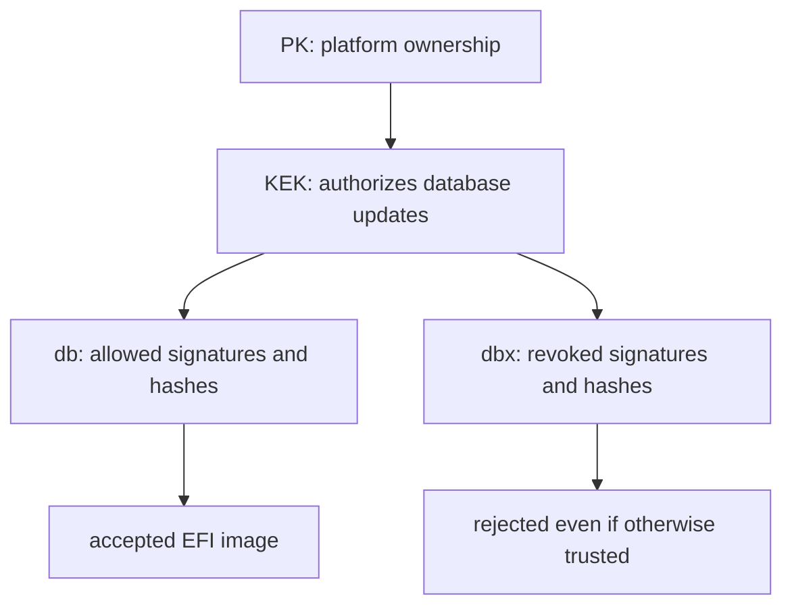
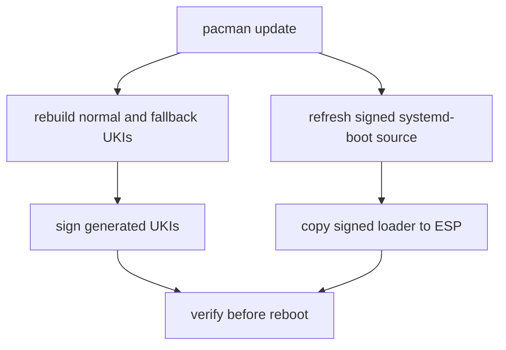

# Secure Boot trust, signing, and recovery

Secure Boot is a firmware-enforced execution policy. It answers a narrow but
important question before an EFI program runs: is this image authorized by the
machine's current trust policy?

It does not encrypt storage, ask who the user is, or prove that every component
of the running system is harmless. Understanding those boundaries is more
useful than treating a green “Secure Boot enabled” status as a general security
seal.

This guide explains the owner-controlled design used by the project. The
installation runbook remains the canonical procedure for creating and enrolling
keys; this article focuses on concepts, maintenance, and safe recovery.

## The project trust chain

The normal path contains two signature-verification steps:



The first verification is performed under firmware policy. systemd-boot then
uses UEFI image-loading services for the selected UKI, so Secure Boot policy
continues to apply. The whole UKI is signed as one PE/COFF EFI executable.

The canonical files are:

| Role | Path |
| --- | --- |
| Package-owned systemd-boot source | `/usr/lib/systemd/boot/efi/systemd-bootx64.efi` |
| Locally signed source used by `bootctl` | `/usr/lib/systemd/boot/efi/systemd-bootx64.efi.signed` |
| Installed loader | `/boot/EFI/systemd/systemd-bootx64.efi` |
| Firmware fallback loader path | `/boot/EFI/BOOT/BOOTX64.EFI` |
| Normal UKI | `/boot/EFI/Linux/arch-linux.efi` |
| Fallback UKI | `/boot/EFI/Linux/arch-linux-fallback.efi` |
| Private owner keys and sbctl state | `/var/lib/sbctl` |

The fallback loader path is a second path to systemd-boot. The fallback UKI is
a second Linux boot artifact with a broader initramfs. They solve different
failure modes.

## Four different security questions

| Mechanism | Principal question | Project component |
| --- | --- | --- |
| Secure Boot | May this EFI image execute? | Firmware databases and signed loader/UKIs |
| UKI signature | Has the assembled early-boot artifact changed since signing? | Signed PE/COFF image |
| LUKS2 | Can this party decrypt the protected block device? | Passphrase, keyslot, volume key |
| User authentication | May this identity open a session or gain privilege? | PAM, password, sudo, polkit |

These mechanisms reinforce one another but are not substitutes. A correctly
signed UKI can still ask for the wrong LUKS device if the trusted signer embedded
a bad command line. A valid LUKS passphrase can decrypt a disk even when Secure
Boot is disabled. A logged-in administrator can modify the system after unlock.

## Secure Boot variables and hierarchy

UEFI stores Secure Boot policy in authenticated firmware variables. The common
names form a hierarchy:



### Platform Key (PK)

The PK establishes control of the platform's Secure Boot configuration. Its
presence normally moves the firmware out of Setup Mode and into User Mode.
Possession of the corresponding private key authorizes changes at the top of
the hierarchy.

“Platform Key” does not mean disk-encryption key, TPM endorsement key, or user
password. It belongs only to the Secure Boot policy hierarchy.

### Key Exchange Key database (KEK)

KEK entries authorize signed updates to the allowed and forbidden signature
databases. Multiple organizations can therefore be authorized to maintain
those databases without sharing one private key.

### Signature database (`db`)

`db` contains certificates and/or hashes accepted for EFI image verification.
The project's own db certificate permits EFI images signed with its private db
key. Microsoft certificates are also enrolled for hardware and recovery-media
compatibility.

### Forbidden signature database (`dbx`)

`dbx` contains revoked certificates, image hashes, or related revocation data.
An image can chain to a trusted certificate and still be rejected because it
or its signer has been revoked. Keeping revocation state current matters: an
old, validly signed but vulnerable bootloader is not made safe by its signature.

The databases store public trust material. The corresponding private keys are
not supposed to be written into firmware variables.

## Setup Mode, User Mode, and enforcement

Setup Mode is a key-management state, normally entered when no PK is enrolled.
It permits establishing a new platform trust hierarchy. It is not the desired
steady state and should not be confused with a firmware screen labelled
“Custom Mode”; vendor terminology varies.

After owner keys are enrolled and a PK is present, Setup Mode should be
disabled. Secure Boot enforcement must also be enabled. These are independent
observations: “Setup Mode disabled” does not by itself prove enforcement, and
“keys exist on disk” does not prove they are enrolled in firmware.

```bash
sudo sbctl status
bootctl status
```

The expected installed state is:

- sbctl is installed and has an owner GUID;
- Setup Mode is disabled;
- Secure Boot is enabled;
- firmware variables contain the intended trust hierarchy;
- every executable on the canonical path is signed acceptably.

Some firmware offers modes called Standard, Custom, Audit, Deployed, or Setup.
Do not infer precise UEFI semantics from a translated menu label. Verify the
effective state from Linux as well as the firmware interface.

## Public certificates and private signing keys

Public-key signatures separate two capabilities:

- a public certificate lets firmware verify a signature;
- the matching private key creates new trusted signatures.

The public certificate can be enrolled broadly. The private key is signing
authority and must remain secret. In this project, `sbctl create-keys` creates
PK, KEK, and db material below `/var/lib/sbctl/keys` plus an owner GUID.

```bash
sudo find /var/lib/sbctl -maxdepth 3 -printf '%M %u:%g %p\n'
sudo sbctl list-enrolled-keys
```

Do not paste private-key contents into diagnostics, commit them, copy them to
the ESP, or store them on an unencrypted cloud drive. File-backed sbctl keys are
appropriate here because `/var` resides inside the LUKS2-protected root
filesystem. They are nevertheless available to root while the machine is
unlocked.

This creates an important threat boundary: malware with effective root access
can modify an EFI image and ask the locally available db key to sign it. Secure
Boot is strongest against offline ESP tampering and unauthorized pre-boot code;
it does not make a fully compromised running administrator context trustworthy.

## Why retain Microsoft certificates

The runbook enrolls owner keys with:

```bash
sbctl enroll-keys --microsoft
```

Some firmware components and Option ROMs are signed through Microsoft-managed
UEFI certificate chains. Removing those certificates can prevent display,
storage, networking, external recovery media, or another operating system from
working under Secure Boot. Upstream sbctl explicitly recommends retaining them
when hardware firmware depends on them.

This is a trade-off, not a free compatibility switch:

| Policy | Advantage | Cost |
| --- | --- | --- |
| Owner certificates only | Smallest accepted signer set under direct control | Greater risk of rejecting hardware firmware and common recovery media |
| Owner + Microsoft certificates | Better hardware and ecosystem compatibility | Firmware accepts a broader external trust ecosystem |
| Vendor defaults only | Least custom maintenance | No owner-controlled signing path and policy depends on vendor defaults |

For these ThinkPads, owner plus Microsoft certificates is the canonical balance.
Do not bypass an Option ROM warning with sbctl's explicitly dangerous override.
Investigate the hardware dependency instead.

Trusting a Microsoft certificate does not mean every Microsoft-signed image is
necessarily usable forever: dbx can revoke known-vulnerable signers or image
hashes, and the exact enrolled certificates define the effective scope.

## What signing a UKI protects

A unified kernel image packages boot-critical material into one EFI executable.
The project UKIs include at least:

- systemd's EFI stub;
- the Linux kernel;
- AMD microcode;
- the initramfs;
- the kernel command line;
- OS and UKI metadata.

Signing the assembled UKI authenticates the bytes of those embedded sections.
Changing the initramfs, `rd.luks.name=`, `zswap.enabled=0`, or the kernel after
assembly invalidates the signature. The image must be rebuilt and signed again.

```bash
sudo bootctl kernel-identify /boot/EFI/Linux/arch-linux.efi
sudo bootctl kernel-inspect /boot/EFI/Linux/arch-linux.efi
```

The standalone `/boot/vmlinuz-linux` is an input to UKI generation. No canonical
boot entry executes it directly, so an unsigned report for that file is expected.
Signing every file that resembles a kernel would not improve the actual path;
the question is which bytes firmware can execute.

### Signed does not mean good

A valid signature establishes origin under a key and integrity since signing.
It does not prove that:

- the signer reviewed the code correctly;
- the kernel or initramfs has no vulnerability;
- the embedded command line expresses the intended policy;
- revocation databases are current;
- runtime userspace remains unmodified after boot;
- the firmware itself is free of compromise.

The private db key can sign a broken or malicious UKI just as correctly as a
good one. Verification must therefore combine signature status with inspection
of the artifact and a controlled build/update process.

## What `sbctl` manages

`sbctl` handles several related but distinct states:

| State | Typical location | Purpose |
| --- | --- | --- |
| Private keys and certificates | `/var/lib/sbctl/keys` | Create signatures and manage hierarchy |
| Owner GUID | `/var/lib/sbctl/GUID` | Identify the local owner namespace |
| Saved file records | `/var/lib/sbctl/files.db` | Remember which paths and outputs require signing |
| Enrolled public trust | UEFI authenticated variables | Firmware's active verification policy |
| Signed EFI binaries | `/usr` and ESP paths | Artifacts firmware may execute |

These states are not automatically equivalent. A path in `files.db` might no
longer exist; a file might have been replaced after signing; firmware variables
can be reset while local keys remain; or the private keys can be lost while
firmware still trusts their public certificates.

Useful inspections are:

```bash
sudo sbctl status
sudo sbctl list-files
sudo sbctl list-enrolled-keys
sudo sbctl verify
```

`sbctl verify` searches EFI binaries on the ESP and checks saved records and
signatures from the project's db key. It is stronger evidence than looking only
for a “signed” string, but it still does not simulate every firmware decision,
revocation path, or next reboot.

## The signed systemd-boot source

The `systemd` package owns the unsigned source executable below `/usr`. The
project creates a sibling signed output:

```bash
sudo sbctl sign --save --output /usr/lib/systemd/boot/efi/systemd-bootx64.efi.signed /usr/lib/systemd/boot/efi/systemd-bootx64.efi
```

`bootctl install` and `bootctl update` prefer the `.efi.signed` source when it
exists and distribute it to the normal and fallback locations on the ESP. This
keeps package ownership separate from local signing policy:

- pacman may replace the package-owned unsigned source;
- sbctl regenerates its saved signed output;
- bootctl distributes that signed output to installed locations.

The ESP copies do not each need an independent sbctl saved record when they are
copies of the tracked signed source. They still need to be signed and verified.

## Update lifecycle

Kernel, microcode, initramfs configuration, command-line, systemd, and sbctl
updates can affect boot artifacts. A safe transaction follows this relationship:



The exact hooks/services are implementation details worth auditing after
package changes. Do not assume that enabling Secure Boot once makes every
future artifact signed automatically.

After a boot-related transaction, check:

```bash
findmnt /boot
sudo mkinitcpio -P
sudo bootctl update
sudo sbctl verify
sudo bootctl list
sudo bootctl kernel-inspect /boot/EFI/Linux/arch-linux.efi
sudo bootctl kernel-inspect /boot/EFI/Linux/arch-linux-fallback.efi
```

Run rebuild/update commands only when that maintenance action is intended; the
read-only checks are sufficient for an ordinary audit. Never reboot merely to
“see whether it worked” after generation, signing, or ESP writes reported an
error. Keep the running system available while repairing the next boot.

Before any UKI write, verify that `/boot` is the mounted ESP. Otherwise a valid
new file can be written into the root filesystem's hidden `/boot` directory
while firmware continues reading an older ESP.

## Normal and fallback UKIs

Both UKIs must be signed. Their distinction is initramfs composition, not trust:

| Artifact | Main purpose | Does not protect against |
| --- | --- | --- |
| Normal UKI | Efficient routine boot with host-specific autodetection | Broken new kernel, bad common config, lost keys |
| Fallback UKI | Broader driver set when normal initramfs omitted something | Same kernel/package regression or shared bad command line |

Because both are normally rebuilt in the same transaction, fallback is not an
older-known-good version. A future robust rollback design would retain an older
kernel/UKI separately and define its update and cleanup policy.

## Threat model by scenario

| Scenario | What Secure Boot contributes | Remaining boundary |
| --- | --- | --- |
| Attacker modifies UKI on powered-off laptop | Modified image should fail verification | ESP contents remain visible; denial of service is still possible |
| Attacker replaces systemd-boot | Replacement should be rejected | Firmware/NVRAM attacks are a different layer |
| Laptop is stolen while powered off | Helps prevent unauthorized early boot code | LUKS supplies confidentiality; passphrase strength still matters |
| Malicious root process while unlocked | Little protection if local signing key is usable | Runtime hardening, updates, least privilege, and backups matter |
| Vulnerable but validly signed old loader | Signature can still validate | dbx/revocation and updates must reject known-bad artifacts |
| User boots an unsigned Arch ISO | Firmware rejects it under enforcement | Temporarily disabling enforcement may be needed for recovery |
| Firmware keys are reset to defaults | Owner-signed images may become untrusted | Offline sbctl backup and firmware access are needed to restore policy |

Secure Boot principally reduces persistent pre-OS tampering and unauthorized
boot-code execution. It does not prevent someone from erasing the ESP, removing
the SSD, or denying service.

## TPM, measured boot, and automatic unlock

Secure Boot verification and TPM measurement are different operations:

- verification decides whether an EFI image may execute;
- measurement records hashes/events into PCRs for later policy or attestation;
- TPM-bound LUKS unlock can release a secret only when a chosen PCR policy
  matches.

The frozen installation baseline uses a manual LUKS passphrase and does not
bind unlocking to TPM2 PCRs. Post-install chapter 20 may add that route only
through guide 25's explicit recovery, PCR, update, and resealing policy.
Secure Boot being enabled is not enough to design TPM unlock safely.

Similarly, sbctl can support TPM-backed signing-key types in current versions,
but this project uses file-backed keys protected at rest by LUKS2. Migrating or
rotating them is a separate security project, not a routine cleanup.

## Backups and key loss

The complete `/var/lib/sbctl` state should be copied with ownership and modes to
an encrypted offline recovery bundle. Public firmware-variable exports help
diagnosis but cannot replace the private keys.

| Loss | Immediate effect | Recovery direction |
| --- | --- | --- |
| UKI damaged, keys intact | One boot artifact rejected or fails | Rebuild and sign from chroot/current system |
| ESP erased, keys intact | Firmware cannot find valid loader/UKIs | Recreate ESP contents and sign using existing authority |
| `/var/lib/sbctl` lost, firmware still trusts its cert | Existing signed files may boot, but new owner signatures cannot be made | Restore exact offline sbctl state or deliberately replace trust hierarchy |
| Firmware variables reset, keys intact | Firmware may reject owner-signed files | Re-enroll intended public hierarchy using reviewed recovery procedure |
| Both private keys and firmware policy lost | Existing design cannot simply be continued | Establish a new hierarchy and re-sign every required EFI artifact |
| LUKS passphrase/header lost | Encrypted data may be inaccessible | Secure Boot keys do not decrypt LUKS |

Back up sbctl state after initial setup and after an intentional key rotation.
Do not routinely regenerate keys because a signature check failed: that destroys
diagnostic continuity and may leave firmware trusting a key no longer available.

Private Secure Boot keys are sensitive because they permit trusted code signing.
They do not directly decrypt the SSD. LUKS header backups are sensitive for a
different reason. Both belong in the recovery bundle, but their powers must not
be conflated.

## Read-only audit

The following inspection does not enroll, reset, rotate, or sign keys:

```bash
sudo sbctl status
sudo sbctl list-enrolled-keys
sudo sbctl list-files
sudo sbctl verify
sudo bootctl status
sudo bootctl list
sudo bootctl --print-loader-path
sudo bootctl kernel-identify /boot/EFI/Linux/arch-linux.efi
sudo bootctl kernel-inspect /boot/EFI/Linux/arch-linux.efi
sudo bootctl kernel-inspect /boot/EFI/Linux/arch-linux-fallback.efi
findmnt /boot
```

Confirm relationships rather than only individual green checks:

1. the running system was booted with Secure Boot enabled;
2. Setup Mode is disabled;
3. the active loader path points to signed systemd-boot;
4. both Type #2 UKIs are discovered;
5. both UKIs contain the intended command line and sections;
6. all canonical EFI executables verify;
7. `/boot/vmlinuz-linux` is not itself a boot entry;
8. `/boot` is the actual ESP.

For firmware-variable diagnosis, `efitools` can export PK, KEK, db, and dbx
public state. Do not mutate variables during a routine audit.

## Diagnose by the last successful boundary

| Observation | Proven so far | Inspect next |
| --- | --- | --- |
| Firmware reports a security violation before menu | It found an EFI candidate | Loader signature, enrolled db/dbx, correct ESP path |
| systemd-boot menu appears | Firmware accepted the loader | Selected UKI signature and discovery |
| One UKI is rejected | Loader ran | That UKI's signature and post-generation signing |
| UKI starts but no LUKS prompt appears | UKI passed execution policy | Embedded command line, initramfs hooks and drivers |
| LUKS prompt appears | Early boot chain executed far enough to find encryption | Passphrase/keymap/header; not Secure Boot signing |
| Linux starts but `sbctl status` says disabled | Boot succeeded without enforcement | Firmware Secure Boot state and how this boot was selected |

A signature failure after an update normally calls for checking mount state,
generation output, saved paths, and installed loader copies. It does not call
for clearing all firmware keys.

## Recovery without destroying trust state

If the installed artifacts no longer boot:

1. photograph or record the firmware error and selected path;
2. try the signed fallback UKI if the menu is reachable;
3. if recovery media is rejected, temporarily disable Secure Boot enforcement
   in firmware without clearing enrolled keys;
4. boot the Arch ISO in UEFI mode;
5. unlock LUKS2, activate LVM, mount root, home, and the ESP at the correct
   target paths;
6. enter `arch-chroot` and inspect `/var/lib/sbctl`, UKIs, saved records, and
   the signed loader source;
7. rebuild or re-sign only after identifying the failed artifact;
8. verify all required paths before leaving the chroot;
9. re-enable enforcement and verify the installed system.

Temporarily disabling enforcement changes policy but preserves the enrolled
hierarchy. Clearing keys or entering Setup Mode removes or changes trust state
and is a much larger recovery action.

Do not perform these actions merely as experiments on a working machine:

- `sbctl reset`;
- `sbctl rotate-keys`;
- clearing PK/KEK/db/dbx in firmware;
- `sbctl create-keys` over missing state without first seeking a backup;
- enrollment without Microsoft certificates on this hardware profile;
- signing an uninspected artifact just to make an error disappear.

## Project decisions in one view

| Question | Decision | Reason |
| --- | --- | --- |
| Trust ownership | Custom PK, KEK, and db managed by sbctl | Permit owner-controlled EFI signing |
| Compatibility | Retain Microsoft certificates | Preserve Option ROM, firmware, and recovery-media compatibility |
| Kernel artifact | Signed normal and fallback UKIs | Authenticate kernel, initramfs, microcode, and command line together |
| Boot manager | Signed systemd-boot | Menu, Type #2 UKI discovery, and Boot Loader Interface support |
| Standalone kernel | Not a canonical signed boot target | It is input to UKI generation, not directly executed |
| Key storage | File-backed below encrypted root | Simple reproducible sbctl workflow; protected at rest by LUKS2 |
| Update policy | Rebuild, sign, distribute, then verify | Avoid discovering an unsigned next boot after reboot |
| Recovery | Preserve keys; disable enforcement temporarily if necessary | Keep trust identity while repairing artifacts |
| TPM2 unlock | Separate guide 25 and post-install chapter 20 | Requires its own PCR, recovery, and update policy |
| Key rotation | Deferred until explicitly designed | Rotation affects firmware trust, backups, and every signed artifact |

## Further reading

- [ArchWiki: Secure Boot](https://wiki.archlinux.org/title/Unified_Extensible_Firmware_Interface/Secure_Boot)
- [ArchWiki: Unified kernel image](https://wiki.archlinux.org/title/Unified_kernel_image)
- [`sbctl(8)`](https://man.archlinux.org/man/sbctl.8)
- [`bootctl(1)`](https://man.archlinux.org/man/bootctl.1)
- [`systemd-stub(7)`](https://man.archlinux.org/man/systemd-stub.7)
- [`ukify(1)`](https://man.archlinux.org/man/ukify.1)
- [Unified Kernel Image specification](https://uapi-group.org/specifications/specs/unified_kernel_image/)
- [sbctl upstream repository](https://github.com/Foxboron/sbctl)
