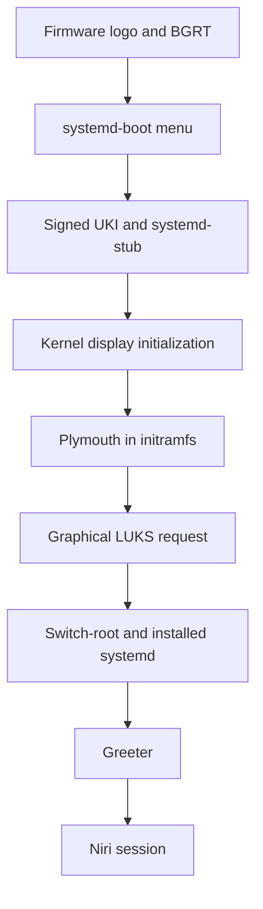

# Plymouth, early-boot presentation, and recovery

## Purpose and scope

The current boot is technically correct: systemd prints early unit progress,
the LUKS passphrase request appears when `sd-encrypt` needs it, and status
messages continue after the container opens. Nothing has bypassed encryption.
The presentation is simply exposing the real early-boot transaction.

Plymouth can replace that changing text with a consistent graphical surface,
including the encrypted-root prompt. Doing this safely is more than installing
a theme. Plymouth must exist in the initramfs, start before the encrypted root
is needed, receive systemd password requests, use an early display path, remain
inside both signed UKI build and verification workflows, and fail without
removing the recovery route.

This guide explains:

- every visual boundary from firmware to the graphical login;
- what Plymouth does and what it does not do;
- its daemon, client, theme, display, and password-agent roles;
- the relationship between KMS, SimpleDRM, `sd-encrypt`, and the US early
  keyboard layout;
- the difference between `splash`, `quiet`, a Plymouth theme, and a UKI
  `.splash` bitmap;
- a project design in which the normal UKI is graphical and the fallback UKI
  remains deliberately textual;
- staged implementation, verification, updates, diagnosis, rollback, and ISO
  recovery;
- why this work precedes TPM2-bound unlocking and later visual polish.

The handbook does not execute the described implementation. The reviewed
commands now live in chapter 19 of `arch-linux-post-install`; publishing this
article alone does not install Plymouth, alter `/etc/mkinitcpio.conf`, modify
either kernel command line, rebuild or sign a UKI, change systemd-boot, enroll
keys, or replace the current LUKS prompt.

Unless a section explicitly says otherwise, command examples run in Bash on
the installed Arch system. Package-delivery commands run separately in
PowerShell on Windows.

## Current project contract

The established boot chain is:

```text
UEFI firmware
→ signed systemd-boot
→ signed normal or fallback UKI
→ kernel and systemd-based initramfs
→ LUKS2 unlock as cryptlvm
→ LVM activation of vg0
→ ext4 root mount and switch-root
→ installed systemd
→ graphical login and Niri session
```

The current boot artifacts are:

| Artifact | Current role |
| --- | --- |
| `/boot/EFI/Linux/arch-linux.efi` | Normal host-specific UKI |
| `/boot/EFI/Linux/arch-linux-fallback.efi` | Broader UKI built without `autodetect` |
| `/etc/mkinitcpio.conf` | Common initramfs hook policy |
| `/etc/mkinitcpio.d/linux.preset` | Normal and fallback UKI output definitions |
| `/etc/kernel/cmdline` | Normal UKI command-line source after chapter 19 |
| `/etc/kernel/cmdline-fallback` | Textual fallback UKI command-line source after chapter 19 |
| `/var/lib/sbctl` | Secure Boot signing state and owner keys |
| `/boot/loader/loader.conf` | Three-second menu, normal default, editor disabled |

Post-install storage policy has extended the original kernel command line. Its
current shape is:

```text
rd.luks.name=<LUKS_UUID>=cryptlvm rd.luks.options=<LUKS_UUID>=discard zswap.enabled=0 root=/dev/mapper/vg0-root rw
```

`<LUKS_UUID>` represents the real UUID already stored on that ThinkPad. It must
never be replaced with the literal placeholder or copied from the second
machine.

Before chapter 19, Plymouth is absent, the source has no `quiet` or `splash`,
and the hook sequence is:

```text
base systemd autodetect microcode modconf kms keyboard sd-vconsole block sd-encrypt lvm2 filesystems fsck
```

That verbose state remains the known-good rollback baseline. Chapter 19 adds
Plymouth to the common hook policy but uses the fallback preset's skip list to
omit it from the fallback image. The normal source then gains `quiet splash`,
while `/etc/kernel/cmdline-fallback` preserves the exact line shown above.

## Plymouth is a presentation layer, not another boot loader

Several components can display something during boot, but they do not own the
same phase:

| Component | Phase | Can collect the LUKS passphrase? |
| --- | --- | --- |
| Firmware logo/BGRT | Firmware initialization | No |
| systemd-boot | EFI entry selection | No |
| systemd-stub UKI bitmap | UKI stub before the kernel | No |
| Plymouth | Kernel/initramfs and early installed userspace | Yes, through a systemd password agent |
| greetd/tuigreet or another greeter | Normal installed userspace | No; encrypted root is already open |
| Niri | User graphical session | No |

Plymouth does not replace:

- UEFI firmware or its vendor logo;
- systemd-boot or the three-second boot menu;
- systemd-stub inside the UKI;
- `sd-encrypt`, cryptsetup, LUKS key derivation, or LVM;
- the login manager or user authentication;
- the kernel and system journals;
- Secure Boot verification or sbctl signing.

It does not make boot faster. It controls what is drawn while the same work is
performed. Adding sleeps so an animation can finish would make boot slower and
is explicitly outside the project policy.

## The complete visual handoff



A smooth-looking boot is a sequence of handoffs, not one continuously running
program. A flicker or mode change identifies a boundary:

| Visible change | Likely handoff |
| --- | --- |
| Vendor logo disappears | Firmware to boot manager or UKI stub |
| Text menu appears | systemd-boot selected a console mode |
| Resolution changes | Simple framebuffer to native KMS |
| Spinner becomes password field | systemd created an early password request |
| Splash disappears to a blank VT | Plymouth quit before the greeter drew |
| Greeter appears, then another mode change | Login session starts Niri |

Plymouth can reduce transitions, but it cannot guarantee a seamless handoff
between unrelated greeters or every firmware/GPU combination. GDM has explicit
upstream integration; the project's independent greeter path must be tested
rather than assumed to provide the same transition.

## Why the current textual prompt is normal

The systemd-based initramfs starts several jobs in parallel. Once the LUKS
partition is found, `systemd-cryptsetup` creates a system password request.
Without Plymouth, a console password agent displays it in the stream of early
status output. Other independent jobs may print before or after the prompt.

The decisive dependency is unchanged:

```text
LUKS passphrase
→ /dev/mapper/cryptlvm
→ readable LVM metadata
→ /dev/mapper/vg0-root
→ mounted ext4 root
```

No correct passphrase means no decrypted mapper and no root mount. Continuing
status messages do not prove otherwise. Guide 05 explains this storage and
initramfs chain in detail.

## Plymouth's internal roles

Plymouth is a small coordinated system:

| Part | Responsibility |
| --- | --- |
| `plymouthd` | Own the splash state, renderers, input, and boot presentation |
| `plymouth` client | Tell the daemon to show, update, hide, quit, or ask questions |
| Renderer | Draw through DRM, framebuffer, text, or another available backend |
| Theme plugin and assets | Define appearance, animation, labels, and password entry |
| mkinitcpio `plymouth` hook | Put required binaries, configuration, theme, fonts, and units into the initramfs |
| `systemd-ask-password-plymouth` | Answer systemd password requests through Plymouth |
| Installed-system units | Carry presentation through switch-root and quit at the appropriate target |

The password agent distinction matters. `sd-encrypt` still discovers and opens
the LUKS device. It asks systemd for a secret; the Plymouth agent renders that
request and returns the entered passphrase. A theme does not decrypt the disk
and does not receive authority to bypass cryptsetup.

This is also unrelated to polkit. Polkit authorizes privileged actions in a
running system. The LUKS request happens before the encrypted root and user
session exist.

## Display foundations: framebuffer, KMS, DRM, and SimpleDRM

Plymouth needs a display before the normal graphical stack starts. Its useful
paths are:

| Display path | Source | Characteristic |
| --- | --- | --- |
| Firmware framebuffer | UEFI GOP/EFI framebuffer | Available very early but may use a limited mode |
| SimpleDRM | Kernel DRM wrapper around the firmware framebuffer | Early DRM path that can retain the firmware image smoothly |
| Native KMS | `amdgpu` on these ThinkPads | Correct native mode and full hardware display ownership |
| Text renderer | Console fallback | Usable when graphics cannot initialize |

The existing `kms` mkinitcpio hook already brings the relevant early graphics
support into the initramfs. Plymouth on current UEFI systems normally tries
SimpleDRM first, which is useful on AMD laptops because it can draw before the
full GPU driver completes initialization.

SimpleDRM has an important docking limitation: secondary displays may remain
off during early boot. A ThinkPad booted with the lid closed can therefore be
waiting at a perfectly functional LUKS prompt that is visible only on the
internal panel. The first implementation must be tested undocked with the lid
open, and docked/closed-lid behavior must be a separate test.

`plymouth.use-simpledrm=0` can disable that path, but it is a diagnostic
parameter, not a default recommendation. Changing it can introduce a later
mode set or more flicker. Add it only after reproducing a SimpleDRM-specific
failure.

## Keyboard input is an early-boot dependency

The passphrase is entered before `/` is mounted. The graphical look does not
change the early keyboard source:

- the `keyboard` hook includes input support;
- `sd-vconsole` applies `/etc/vconsole.conf` in the systemd initramfs;
- the project expects the reviewed US early keymap;
- Plymouth displays the request but does not infer the user's Niri layout.

A passphrase that appears to be rejected after adding Plymouth may actually be
using an unexpected keymap, Caps Lock state, or keyboard device. Test a wrong
passphrase intentionally once, then the known correct passphrase, and confirm
that the prompt recovers without freezing or losing input.

Do not change the LUKS passphrase to accommodate a theme. Fix the early console
configuration or theme feedback instead.

## `splash`, `quiet`, and verbosity are separate controls

| Parameter or action | Effect |
| --- | --- |
| `splash` | Tells Plymouth to show the graphical presentation |
| `quiet` | Reduces kernel and early-userspace console output |
| `Esc` during Plymouth | Temporarily reveal/toggle detailed boot messages |
| `plymouth.debug` | Enable detailed Plymouth diagnostics for a bounded test |
| `plymouth.enable=0` | Disable Plymouth for that command line |
| `disablehooks=plymouth` | Skip the mkinitcpio runtime hook when supported by that path |

`splash` without `quiet` and `quiet` without Plymouth are possible, but neither
is the intended polished result. The normal graphical UKI uses both
`quiet splash` after chapter 19.

The project deliberately avoids adding a large “silent boot” bundle such as
`loglevel=3`, `rd.udev.log_level=3`, `vt.global_cursor_default=0`, and multiple
status-suppression options at the same time. Each changes a different producer
and can conceal the first failing boundary. Start with `quiet splash`, retain
the journal, and add no further suppression without measured evidence.

`quiet` reduces presentation; it does not erase systemd journal records.
Plymouth also writes a boot log by default. The project will not send its log
to `/dev/null` merely for aesthetics.

## The recovery problem with an embedded command line

On many boot loaders, a user can press an edit key and append
`plymouth.enable=0`. This project intentionally has:

```text
editor no
```

and embeds the command line inside a signed UKI. That protects the reviewed
boot contract, but means a broken splash cannot be bypassed by casually
editing the normal entry at the systemd-boot menu.

The robust answer is a second signed artifact with a different presentation
policy:

| UKI | Initramfs | Command line | Intended use |
| --- | --- | --- | --- |
| Normal | Host-specific and includes Plymouth | Existing storage parameters plus `quiet splash` | Routine graphical boot |
| Fallback | Broad modules and skips Plymouth | Existing storage parameters without `quiet splash` | Visible passphrase, diagnostics, and driver recovery |

This expands the fallback UKI's role beyond missing drivers. It remains the
same current kernel, not a package rollback, but it becomes independent of a
bad Plymouth hook, theme, renderer, or quiet command line.

## Separate normal and fallback command-line sources

The normal preset can continue using `/etc/kernel/cmdline`. Before adding
Plymouth parameters, copy the current proven line into a fallback source:

```bash
sudo cp -a /etc/kernel/cmdline /etc/kernel/cmdline-fallback
```

The normal source will later contain the exact current values plus:

```text
quiet splash
```

The fallback source deliberately retains the pre-Plymouth line. The Linux
preset can then add:

```bash
fallback_cmdline="/etc/kernel/cmdline-fallback"
fallback_options="-S autodetect,plymouth"
```

`fallback_cmdline` selects a different embedded source for that UKI. The
comma-separated `-S` list skips both `autodetect` and the `plymouth` hook:

- skipping `autodetect` retains the current broad recovery module set;
- skipping `plymouth` prevents a broken theme or daemon from entering the
  fallback initramfs.

This file is sensitive configuration but not normally a secret. It contains
the LUKS UUID and boot policy, not the passphrase or volume key. It belongs in
the offline recovery bundle with the other boot sources, not in public
machine-generic documentation.

## Correct mkinitcpio hook placement

The package supplies a mkinitcpio `plymouth` hook. For this systemd-based,
encrypted-root design:

- `systemd` must precede `plymouth`;
- early KMS, keyboard, and console setup should be available;
- `plymouth` must precede `sd-encrypt` so it can present the first disk request;
- `lvm2`, filesystems, and fsck retain their storage order.

The intended normal hook sequence is:

```bash
HOOKS=(base systemd autodetect microcode modconf kms keyboard sd-vconsole plymouth block sd-encrypt lvm2 filesystems fsck)
```

Do not replace `sd-encrypt` with the BusyBox `encrypt` hook. Do not copy a GRUB
or dracut-specific recipe into this mkinitcpio/UKI architecture. Similar
outcomes do not imply interchangeable configuration syntax.

After package installation, inspect the actual packaged hook and local help:

```bash
pacman -Q plymouth mkinitcpio systemd systemd-ukify sbctl
mkinitcpio -H plymouth
ls -l /usr/lib/initcpio/install/plymouth /usr/lib/initcpio/hooks/plymouth
```

## Theme policy

Arch's Plymouth package provides built-in themes and currently selects `bgrt`
by default. Inspect the installed truth instead of relying on a remembered
list:

```bash
plymouth-set-default-theme
plymouth-set-default-theme -l
find /usr/share/plymouth/themes -mindepth 1 -maxdepth 1 -type d -printf '%f\n' | sort
```

The project baseline is the packaged `bgrt` theme:

- it can reuse the firmware-provided OEM logo where BGRT is available;
- it adds a spinner and password-entry presentation;
- it introduces no AUR theme or external installer;
- it provides a neutral foundation before guide 26 chooses final branding.

If BGRT is unavailable or renders poorly, the packaged `spinner` theme is the
first fallback. The project does not install `breeze-plymouth` merely because
it is polished: its visual language belongs to Plasma, while this workstation
uses Niri.

A custom theme is executable presentation logic plus assets included in the
initramfs. Review:

- package/source ownership and licence;
- theme plugin type and scripts;
- password field, error message, Caps Lock/keymap feedback, and retry behavior;
- aspect ratio, native resolution, HiDPI, and multiple displays;
- whether it delays boot to finish an animation;
- updates and removal procedure.

Never adopt a theme after testing only its spinner. Encrypted-root input is its
most important function.

### Theme selection and rebuild are distinct

The selected theme can be set with:

```bash
sudo plymouth-set-default-theme bgrt
```

Plymouth offers `-R` to rebuild an initramfs, but the project uses an explicit:

```bash
sudo mkinitcpio -P
```

That command processes the project's two named UKI presets and exposes the
sbctl post-signing output. An implicit generic “rebuild initrd” shortcut should
not obscure whether both custom UKI destinations were regenerated and signed.

## Plymouth theme versus UKI `.splash`

Mkinitcpio and ukify can embed a bitmap in the UKI's `.splash` section. This is
drawn by systemd-stub before the kernel starts. It is not a Plymouth theme.

| Property | UKI `.splash` bitmap | Plymouth theme |
| --- | --- | --- |
| Runtime | EFI stub, before kernel | Initramfs and early userspace |
| Format | Static bitmap | Theme plugin, assets, text, animation |
| Password input | Impossible | Supported through systemd's agent |
| Build source | Preset `*_splash` or `--splash` | Plymouth configuration plus mkinitcpio hook |
| Trust | Embedded and signed inside UKI | Included in initramfs and signed inside UKI |
| Recovery risk | Bad static visual resource | Renderer, theme, input, or daemon failure |

For example, mkinitcpio supports a normal-only preset source such as:

```bash
default_splash="/path/to/reviewed-image.bmp"
```

The chapter 19 Plymouth implementation does not add this. Firmware BGRT plus the
packaged theme already tests enough new boundaries. A custom UKI bitmap can be
considered with the final visual language in guide 26, and should remain absent
from the textual fallback UKI.

## Staged implementation model

This section explains the operational sequence implemented by post-install
chapter 19. Use that chapter as the executable procedure and this guide for the
architecture, alternatives, and diagnosis.

### 1. Capture the known-good state

Start from the normal UKI with the system fully updated and no failed units:

```bash
findmnt /boot
cat /etc/kernel/cmdline
grep '^HOOKS=' /etc/mkinitcpio.conf
cat /etc/mkinitcpio.d/linux.preset
sudo bootctl list
sudo bootctl kernel-inspect /boot/EFI/Linux/arch-linux.efi
sudo bootctl kernel-inspect /boot/EFI/Linux/arch-linux-fallback.efi
sudo sbctl verify
systemctl --failed --no-pager
```

Stop if `/boot` is not the mounted ESP, either UKI is absent/unsigned, or the
source and embedded command lines differ unexpectedly.

### 2. Preserve exact local sources

Do not overwrite an earlier backup with the same name. When these paths are
free, the planned copies are:

```bash
sudo cp -a /etc/mkinitcpio.conf /etc/mkinitcpio.conf.before-plymouth
sudo cp -a /etc/kernel/cmdline /etc/kernel/cmdline.before-plymouth
sudo cp -a /etc/mkinitcpio.d/linux.preset /etc/mkinitcpio.d/linux.preset.before-plymouth
sudo cp -a /etc/kernel/cmdline /etc/kernel/cmdline-fallback
```

The last file is not just a backup: it becomes the maintained command-line
source for the textual fallback UKI.

### 3. Install only the official baseline

```bash
sudo pacman -S --needed plymouth
pacman -Q plymouth
plymouth-set-default-theme
plymouth-set-default-theme -l
```

No AUR theme, theme manager, Plasma settings module, dracut, or alternative
initramfs generator is required.

### 4. Edit the three build sources

The reviewed implementation changes:

1. `/etc/mkinitcpio.conf`: insert `plymouth` after `sd-vconsole` and before
   `block`/`sd-encrypt`;
2. `/etc/kernel/cmdline`: append only `quiet splash` to the current line;
3. `/etc/mkinitcpio.d/linux.preset`: add the fallback-specific command line
   and skip list shown earlier.

The normal command line must preserve both current LUKS UUID uses, discard,
zswap disabling, root mapper, and `rw`. A documentation placeholder must never
replace a real UUID.

Review before generating anything:

```bash
grep '^HOOKS=' /etc/mkinitcpio.conf
cat /etc/kernel/cmdline
cat /etc/kernel/cmdline-fallback
cat /etc/mkinitcpio.d/linux.preset
```

### 5. Select the packaged baseline theme

```bash
sudo plymouth-set-default-theme bgrt
plymouth-set-default-theme
```

Do not use a live theme-preview command from the active Niri VT. Plymouth can
take control of the display and leave a confusing test state. The controlled
normal/fallback reboot matrix is more valuable than a five-second animation
preview because it also tests cryptsetup input and handoff.

### 6. Rebuild and verify both signed UKIs

```bash
sudo mkinitcpio -P
sudo bootctl kernel-identify /boot/EFI/Linux/arch-linux.efi
sudo bootctl kernel-identify /boot/EFI/Linux/arch-linux-fallback.efi
sudo bootctl kernel-inspect /boot/EFI/Linux/arch-linux.efi
sudo bootctl kernel-inspect /boot/EFI/Linux/arch-linux-fallback.efi
sudo sbctl verify
sudo bootctl list
```

The output must prove:

- both presets completed successfully;
- the normal build included the Plymouth hook;
- the fallback build skipped `autodetect` and `plymouth`;
- the normal UKI embeds the storage parameters plus `quiet splash`;
- the fallback UKI embeds the same storage contract without those two words;
- both files are recognized as UKIs and signed;
- `arch-linux.efi` remains the default entry.

If the sbctl post-hook did not sign an output, stop before rebooting. Diagnose
the saved signing records; do not assume the existing signature survived a UKI
rewrite.

## Controlled boot test matrix

The enhancement is not complete after one attractive screenshot.

### Normal UKI test

Boot the normal entry undocked with the lid open and verify:

1. the systemd-boot menu still appears for three seconds;
2. the selected theme appears at usable resolution;
3. the LUKS request is visible and identifies the expected disk operation;
4. an intentionally wrong passphrase produces a clear retry;
5. the correct US-keymap passphrase opens `cryptlvm`;
6. `Esc` can reveal useful detail;
7. root and home mount, zram and disk swap appear, and the greeter starts;
8. no stale spinner remains over the greeter or Niri;
9. shutdown and the next cold boot do not hang in Plymouth.

After login:

```bash
cat /proc/cmdline
sudo cryptsetup status cryptlvm
findmnt /
findmnt /home
findmnt /boot
swapon --show
systemctl --failed --no-pager
systemctl list-units 'plymouth*' --all --no-pager
journalctl -b -u plymouth-start.service -u plymouth-quit.service --no-pager
sudo sbctl verify
```

### Fallback UKI test

Reboot, select `arch-linux-fallback.efi`, and verify:

1. the textual early messages and LUKS prompt return;
2. input works with the same passphrase;
3. the broader initramfs reaches the installed system;
4. the running command line contains neither `quiet` nor `splash`;
5. Plymouth did not become a dependency of successful fallback unlock;
6. both UKIs still verify after returning to the normal entry.

```bash
bootctl status
cat /proc/cmdline
systemctl --failed --no-pager
sudo sbctl verify
```

Return to the normal UKI afterward. Failure of the fallback path is a blocker,
even if the routine graphical boot works.

### Hardware-state matrix

Test the states that change early graphics or input:

| State | What to verify |
| --- | --- |
| Cold boot on battery | Prompt appears before timeout and input works |
| Warm reboot on AC | Theme quits and restarts without stale framebuffer state |
| Lid open, undocked | Internal 1080p panel is the reliable baseline |
| Docked with external display | Prompt appears on at least one observable display |
| Lid closed while docked | No invisible prompt traps the boot indefinitely |
| USB keyboard attached | Early input works without changing the internal keyboard path |
| Wrong passphrase once | Error and retry are visible rather than appearing frozen |

Do not make the closed-lid case canonical until it is physically tested on the
actual dock and monitor. Firmware display routing is machine-specific.

## Diagnosis by the last visible boundary

| Symptom | Last proven boundary | Inspect next |
| --- | --- | --- |
| Firmware logo never reaches systemd-boot | Firmware began | NVRAM/ESP/loader, not Plymouth |
| systemd-boot rejects the UKI | Loader executed | UKI signature and sbctl records |
| UKI starts, then screen goes black before prompt | Kernel began | SimpleDRM/KMS, Plymouth hook, fallback UKI |
| Splash appears but no password field | Plymouth rendered | `sd-encrypt`, systemd password agent, theme prompt handling |
| Password field appears but correct input fails | Device and request exist | US keymap, Caps Lock, LUKS credential, input device |
| Unlock succeeds but splash never quits | Cryptsetup passed | Plymouth switch-root/quit units and greeter ordering |
| Greeter appears with a flicker | Complete boot succeeded | Presentation handoff only; not a storage failure |
| Fallback also fails before LUKS | Plymouth is probably not the common cause | Shared kernel, command line, block driver, UKI build |

The normal-versus-fallback comparison is powerful because their presentation
paths differ intentionally. A normal-only black screen strongly implicates
Plymouth, quiet presentation, or host-specific early graphics. Failure of both
points to a shared boot layer.

## Reveal messages and preserve evidence

While Plymouth is active, press `Esc` to reveal detailed status. This is the
first diagnostic action, not a failure of the polished design.

After reaching the system, inspect the current and previous boot:

```bash
journalctl -b -p warning..alert --no-pager
journalctl -b -u plymouth-start.service -u plymouth-quit.service --no-pager
journalctl -b -1 -p warning..alert --no-pager
sudo sed -n '1,240p' /var/log/boot.log
```

If normal logging is insufficient, add `plymouth.debug` to the normal source,
rebuild and verify both UKIs, reproduce once, then remove it and rebuild again.
The resulting `/var/log/plymouth-debug.log` may contain device, timing, and
prompt context; review it before sharing.

Because command-line editing is disabled and the normal line is signed inside
the UKI, debugging parameters are source changes followed by a verified
rebuild. Do not present a menu-edit shortcut that this architecture forbids.

## Common failure classes

### Black screen but passphrase input may still work

Press `Esc`, open the laptop lid, disconnect the dock, and wait for a visible
text request. If the prompt remains invisible, reboot and select the textual
fallback rather than typing secrets blindly into an unknown state.

If fallback works, compare SimpleDRM and native KMS behavior. Test
`plymouth.use-simpledrm=0` only in a deliberately rebuilt normal UKI and remove
it after the experiment unless it is proven necessary.

### Prompt appears but does not update

Some scripted themes have historically mishandled password-field updates on
systemd initramfs paths. Return to the packaged `bgrt` or `spinner` theme,
rebuild both UKIs, and test again before changing cryptsetup or the keyboard.

The AUR development build is not the first repair for a theme-specific issue.
A known packaged theme and textual fallback provide a smaller experiment.

### Wrong resolution, centering, or scale

Inspect:

```bash
journalctl -b -k --grep='drm\|simpledrm\|amdgpu\|framebuffer' --no-pager
cat /sys/class/drm/*/status 2>/dev/null
```

`DeviceScale` in `/etc/plymouth/plymouthd.conf` accepts an integer scale, not
Niri's arbitrary fractional output scale. The 1920×1080 ThinkPad panel should
not need a HiDPI override. Do not compensate for one bad custom theme by
globally changing display modes.

### Splash quits too early or too late

First determine whether the boot is actually complete:

```bash
systemd-analyze time
systemd-analyze critical-chain
systemctl status greetd.service --no-pager
systemctl status plymouth-quit.service plymouth-quit-wait.service --no-pager
```

A small blank transition before an independent greeter is cosmetic. A splash
that never quits is a unit-ordering failure. Do not add a sleep merely to show
the entire animation; it hides timing evidence and deliberately delays login.

### Messages overwrite the splash

Identify the producer before suppressing it. Kernel severity, initramfs logs,
a unit writing directly to the console, and a Plymouth renderer failure have
different remedies. `quiet` is the selected baseline; a growing collection of
silencing parameters is not.

### Package removal breaks UKI generation

If `plymouth` is removed while its hook remains in `/etc/mkinitcpio.conf`, the
next `mkinitcpio -P` can fail because the named hook is unavailable. Removal
order matters:

1. restore the non-Plymouth hook and command-line sources;
2. restore the original preset relationship;
3. rebuild and verify both signed UKIs;
4. boot-test the textual path;
5. only then remove an otherwise unneeded package.

Never reboot after a failed generation transaction merely because the old
running system still works.

## Update lifecycle

Plymouth adds new UKI inputs:

- package binaries and systemd units;
- mkinitcpio install/runtime hook;
- renderer plugins;
- selected theme descriptor, scripts, fonts, and images;
- `/etc/plymouth/plymouthd.conf` when locally changed.

Changes to any included input require regeneration before they can affect boot.
The normal maintenance relationship becomes:

```text
package or theme change
→ mkinitcpio processes normal and fallback presets
→ normal initramfs includes Plymouth
→ fallback skips Plymouth
→ ukify assembles both UKIs
→ sbctl signs both outputs
→ bootctl and sbctl verification
→ controlled reboot
```

Before rebooting after kernel, systemd, mkinitcpio, Plymouth, microcode, or
theme changes:

```bash
sudo bootctl list
sudo bootctl kernel-inspect /boot/EFI/Linux/arch-linux.efi
sudo bootctl kernel-inspect /boot/EFI/Linux/arch-linux-fallback.efi
sudo sbctl verify
```

A changed package under `/usr/share/plymouth/themes` does not alter an already
built UKI until regeneration. Conversely, deleting a selected theme and then
rebuilding can create a failure or fallback theme inside the next image.

## Secure Boot and measured-boot consequences

Plymouth does not weaken the LUKS algorithm or Secure Boot simply by drawing a
prompt. Its included binaries and theme become part of the initramfs, and the
initramfs becomes part of the signed UKI. Modifying the UKI afterward invalidates
its signature; rebuilding invokes the established sbctl signing path.

Signing answers “is this assembled artifact trusted by the enrolled key?” It
does not prove that a theme is readable, that the prompt is visible on a dock,
or that its script is well designed.

The order of roadmap work is deliberate. Adding Plymouth changes the initramfs
and therefore the UKI hash and measured-boot values. The presentation and
fallback design must be stable before post-install chapter 20 applies guide
25's TPM2 PCR policy. Otherwise a TPM-unlock experiment would be diagnosed at
the same time as a changing boot image.

A systemd-stub `.splash` bitmap is also embedded, signed, and included in the
UKI measurement model. Final visual assets therefore belong before a rigid
measurement policy or must be accommodated by a deliberate signed-policy
update design.

## Safe rollback from the textual fallback UKI

If the normal UKI fails but fallback reaches the installed system, do not keep
using fallback as the daily entry. Inspect first:

```bash
bootctl status
cat /proc/cmdline
findmnt /boot
sudo sbctl verify
```

Restore the three pre-Plymouth source files only after confirming the backup
paths:

```bash
sudo cp -a /etc/mkinitcpio.conf.before-plymouth /etc/mkinitcpio.conf
sudo cp -a /etc/kernel/cmdline.before-plymouth /etc/kernel/cmdline
sudo cp -a /etc/mkinitcpio.d/linux.preset.before-plymouth /etc/mkinitcpio.d/linux.preset
```

Then rebuild and verify:

```bash
sudo mkinitcpio -P
sudo bootctl kernel-inspect /boot/EFI/Linux/arch-linux.efi
sudo bootctl kernel-inspect /boot/EFI/Linux/arch-linux-fallback.efi
sudo sbctl verify
```

The restored preset no longer refers to `/etc/kernel/cmdline-fallback`. Keep or
remove that now-unused file only after comparing it with the restored source
and recording the rollback. The Plymouth package can remain installed while
the hook is absent; package removal is a separate cleanup decision.

## Recovery from the Arch ISO

If neither UKI reaches a usable prompt:

1. record the last visible boundary and exact error;
2. temporarily disable Secure Boot enforcement only if the signed recovery
   medium cannot start; do not clear enrolled keys;
3. boot the Arch ISO in UEFI mode;
4. open the existing LUKS2 container, activate `vg0`, and mount root, home, and
   the ESP at their documented targets;
5. read the failed sources and UKI metadata before changing them;
6. enter `arch-chroot` only when installed tooling is required;
7. restore the known-good files or correct the one identified fault;
8. run `mkinitcpio -P`, verify both UKIs and every signature;
9. leave, unmount, re-enable Secure Boot, and test normal plus fallback.

Guide 20 contains the exact existing-media reconstruction and chroot recovery
workflow. Plymouth failure does not justify formatting the ESP, recreating
LUKS, resetting sbctl keys, reinstalling the system, or deleting unknown EFI
entries.

## Alternatives and why Plymouth remains the best fit

| Approach | Advantage | Limitation for this project |
| --- | --- | --- |
| Current verbose boot | Maximum immediate visibility | Visually noisy around the LUKS request |
| `quiet` without Plymouth | Fewer messages | Still lacks an integrated graphical password agent |
| UKI static bitmap | Very early signed image | Cannot accept or explain a LUKS passphrase |
| Firmware BGRT alone | No Linux configuration | Ends before kernel/initramfs interaction |
| Plymouth | Graphical early boot plus systemd password-agent integration | Adds initramfs, display, theme, and recovery considerations |
| Different initramfs generator | May offer its own integrations | Replaces a proven mkinitcpio architecture to solve an appearance problem |
| Greeter theme | Improves login appearance | Starts only after encrypted root is already open |

Plymouth is the selected implementation because it spans the exact phase
containing the LUKS request while integrating with the existing systemd
password-agent model. It is not selected because it has the most elaborate
animations.

## Decision and validation checklist

The operational change should not begin until every answer is explicit:

1. Are both current UKIs present, boot-tested, and signed?
2. Is `/boot` definitely the mounted ESP before writing?
3. Does the real current command line include discard and `zswap.enabled=0`?
4. Are non-overwriting backups of all three build sources available?
5. Does the fallback command line preserve the exact storage contract without
   `quiet splash`?
6. Does the fallback preset skip both `autodetect` and `plymouth`?
7. Is the packaged `bgrt` theme being tested before custom assets?
8. Does the LUKS prompt work with the US early keymap, wrong-passphrase retry,
   and internal keyboard?
9. Can `Esc` reveal useful diagnostics?
10. Has lid-open, docked, and external-monitor behavior been tested separately?
11. Do both rebuilt UKIs contain their intended distinct command lines and
    valid signatures?
12. Is the Arch ISO/chroot path still understood and available?
13. Is Plymouth stable before any TPM2-bound unlock policy is enrolled?

## Project decisions

The recorded design is:

- Plymouth is the selected graphical early-boot layer in post-install chapter 19;
- the handbook explains it while the post-install chapter owns the changes;
- the official Arch package and built-in `bgrt` theme form the first baseline;
- no AUR theme, KDE control module, alternate initramfs generator, artificial
  animation delay, or broad silent-boot parameter bundle is introduced;
- the normal UKI includes Plymouth and embeds `quiet splash` after chapter 19;
- the fallback UKI skips Plymouth, retains broad modules, and embeds a
  textual command line without `quiet splash`;
- the normal and fallback sources preserve the same LUKS UUID, discard, zswap,
  root mapper, and read-write contract;
- systemd remains before Plymouth and Plymouth remains before `sd-encrypt`;
- the US keymap, wrong-passphrase retry, `Esc`, internal panel, dock, and
  external display all require physical tests;
- a UKI `.splash` bitmap is separate and deferred to final visual polish;
- all rebuilds must complete for both presets and pass sbctl verification;
- theme/package removal must follow source restoration and a verified rebuild;
- Plymouth is stabilized before post-install chapter 20 applies guide 25's
  TPM2-bound LUKS unlock design;
- the strong LUKS passphrase and textual fallback remain recovery credentials.

## Sources and further reading

- [ArchWiki: Plymouth](https://wiki.archlinux.org/title/Plymouth)
- [Arch package: Plymouth](https://archlinux.org/packages/extra/x86_64/plymouth/)
- [`plymouth-set-default-theme(1)`](https://man.archlinux.org/man/plymouth-set-default-theme.1.en)
- [`plymouth(8)`](https://man.archlinux.org/man/plymouth.8.en)
- [`plymouthd(8)`](https://man.archlinux.org/man/plymouthd.8.en)
- [`systemd-ask-password(1)`](https://man.archlinux.org/man/systemd-ask-password.1.en)
- [`mkinitcpio(8)`](https://man.archlinux.org/man/mkinitcpio.8.en)
- [`mkinitcpio.conf(5)`](https://man.archlinux.org/man/mkinitcpio.conf.5.en)
- [`ukify(1)`](https://man.archlinux.org/man/ukify.1.en)
- [`systemd-stub(7)`](https://man.archlinux.org/man/systemd-stub.7.en)
- [`kernel-command-line(7)`](https://man.archlinux.org/man/kernel-command-line.7.en)

Continue with guide 25 for the TPM2-bound LUKS design, then use post-install
chapter 20 for its ordered implementation and hardware-validation checkpoints.
