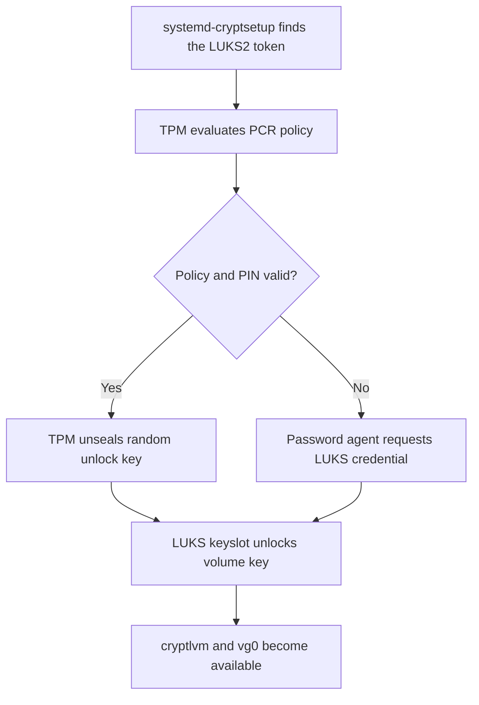
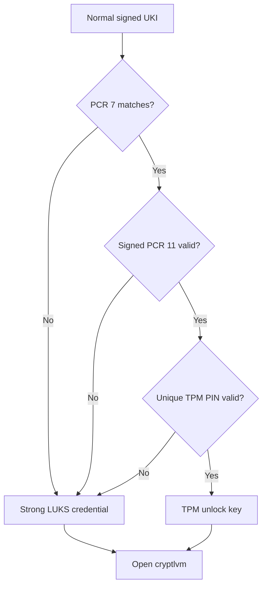

# TPM2-bound LUKS unlock, measured-boot policy, and recovery

## Purpose and scope

The current system asks for a strong LUKS2 passphrase during every boot. That
design is simple, independent of the motherboard, and already proven on both
the normal and fallback UKIs.

A TPM2 can provide a second LUKS unlock method whose secret is usable only on
the enrolled machine and only while selected boot measurements satisfy a
policy. Used carefully, this shortens the routine credential without deleting
the strong passphrase or weakening the recovery path. Used carelessly, it can
turn a firmware change into an unexpected password prompt, permit unattended
unlock of a stolen laptop, or make every kernel update require manual
reenrollment.

This guide explains:

- what a TPM2, PCR, event log, sealed secret, LUKS keyslot, and LUKS token are;
- the differences between Secure Boot, measured boot, TPM policy, disk
  encryption, and login authentication;
- why binding only to raw PCR 7 is too weak and binding directly to raw PCR 11
  is too brittle;
- signed PCR 11 policies and their relationship to UKI `.pcrsig` and
  `.pcrpkey` sections;
- the project policy of PCR 7 plus signed PCR 11, with a TPM PIN;
- why the normal UKI may request the TPM while the textual fallback UKI must
  continue to require a strong LUKS credential;
- separate Secure Boot and PCR-policy signing keys;
- update, firmware, key-rotation, testing, rollback, and ISO recovery paths;
- where `systemd-pcrlock` fits and why it is not the first implementation.

The handbook does not execute the future implementation. Publishing this
article does not install TPM packages, create keys, change either UKI, edit a
kernel command line, add or remove a LUKS keyslot, enroll the TPM, change a PIN,
clear the TPM, or alter Secure Boot. Every mutating command below is an
annotated future procedure, not an instruction to run while reading.

Unless stated otherwise, examples run in Bash on the installed Arch system.
Package-delivery commands run separately in PowerShell on Windows.

## Current project contract

The established storage and boot path is:

```text
UEFI firmware
→ signed systemd-boot
→ signed normal or fallback UKI
→ systemd-based initramfs
→ LUKS2 /dev/nvme0n1p2 opened as cryptlvm
→ LVM volume group vg0
→ ext4 root /dev/mapper/vg0-root
→ installed systemd
→ graphical login and Niri session
```

The relevant artifacts are:

| Artifact | Role |
| --- | --- |
| `/dev/nvme0n1p2` | LUKS2 container to which credentials and tokens belong |
| `/dev/mapper/cryptlvm` | Decrypted mapping created during early boot |
| `/dev/mapper/vg0-root` | Root logical volume inside the encrypted container |
| `/boot/EFI/Linux/arch-linux.efi` | Normal host-specific UKI |
| `/boot/EFI/Linux/arch-linux-fallback.efi` | Broader recovery UKI |
| `/etc/kernel/cmdline` | Normal embedded command-line source |
| `/etc/kernel/cmdline-fallback` | Planned textual fallback source from guide 24 |
| `/etc/mkinitcpio.d/linux.preset` | Normal and fallback UKI build policy |
| `/var/lib/sbctl` | Existing Secure Boot signing state and owner keys |

The current proven command-line shape is:

```text
rd.luks.name=<LUKS_UUID>=cryptlvm rd.luks.options=<LUKS_UUID>=discard zswap.enabled=0 root=/dev/mapper/vg0-root rw
```

`<LUKS_UUID>` is a placeholder for the UUID of the real container on that
specific ThinkPad. It must not be entered literally and must not be copied
between machines.

The current LUKS passphrase remains valid. TPM2 enrollment adds another
keyslot and token; it does not convert the container to another format and
must never remove the existing password slot. A separate generated recovery
key is also recommended before TPM enrollment.

Guide 24 deliberately comes first. Plymouth, the early keyboard, the normal
and textual fallback UKIs, and their command-line separation must be stable
before a TPM policy is added. Otherwise presentation, UKI measurement, and
unlock-policy failures become one indistinguishable experiment.

## Five mechanisms that answer different questions

| Mechanism | Question answered | Does not answer |
| --- | --- | --- |
| Secure Boot | May this EFI executable run under firmware policy? | May this LUKS volume decrypt? |
| Measured boot | What firmware, loader, UKI, or state contributed hashes to PCRs? | Is every measured component good? |
| TPM sealing policy | May the TPM release this sealed secret in the current measured state? | Is the logged-in user authorized? |
| LUKS2 | Does this supplied secret unlock a valid keyslot and therefore the volume key? | Is the booted OS trusted? |
| PAM login | May this identity start a user session? | Was the disk protected before login? |

Secure Boot is an enforcement decision: untrusted EFI images are rejected.
Measured boot is evidence accumulation: components extend hashes into PCRs.
The TPM can later apply a policy to that evidence. Neither operation itself
decrypts LUKS.

The layers reinforce one another only when their policy is explicit. A TPM
token bound to no PCRs merely depends on possession of the same TPM. A token
bound only to Secure Boot state does not necessarily identify the intended
UKI. A correctly measured UKI does not prove that a human is present. A login
password after unattended disk unlock is not identical to a pre-boot disk
credential.

## What the TPM is and is not

The ThinkPad's TPM2 is a security processor exposed through Linux device nodes
such as `/dev/tpm0` and `/dev/tpmrm0`. It can create keys whose private portions
do not leave the TPM, evaluate PCR policies, rate-limit failed authorization
attempts, and seal small secrets to the platform state.

It is not:

- the LUKS container or dm-crypt data path;
- a copy of the user's LUKS passphrase;
- a substitute for Secure Boot;
- a general proof that firmware or Linux is free of vulnerabilities;
- an online account or cloud recovery service;
- an encrypted backup of the SSD;
- a reason to remove all independent LUKS credentials.

When `systemd-cryptenroll` enrolls a TPM2 into LUKS2, it generates a random
unlock key. LUKS stores that key through a new keyslot. The TPM seals the
corresponding secret under a TPM key and policy. The resulting encrypted blob
and metadata are stored in a `systemd-tpm2` JSON token in the LUKS2 header.

At boot:



The sealed blob in the LUKS header is not useful by itself on another
motherboard. Conversely, clearing or replacing the TPM can make that token
unusable without damaging the LUKS ciphertext or the independent passphrase.

## LUKS keyslots and tokens are related but distinct

A LUKS2 header can contain multiple keyslots and JSON tokens:

| Object | Contains or describes | Typical project use |
| --- | --- | --- |
| Password keyslot | Key material protected by a human passphrase | Strong manual daily/recovery path |
| Recovery keyslot | Key material protected by a generated high-entropy text key | Offline emergency credential |
| TPM2 keyslot | Random key material associated with TPM enrollment | Routine normal-UKI unlock |
| `systemd-tpm2` token | TPM sealed blob, PCR policy, PIN flag, public-policy data, keyslot association | Tells systemd how to obtain the TPM key |

`cryptsetup luksDump` shows low-level header and token metadata.
`systemd-cryptenroll` presents a more concise slot-type list:

```bash
sudo systemd-cryptenroll /dev/nvme0n1p2
sudo cryptsetup luksDump /dev/nvme0n1p2
```

Neither command should be pasted publicly without review. UUIDs, token
metadata, slot structure, and policy hashes are not the volume key, but they
describe the security design and machine identity.

The rule for this project is simple: at least one tested password slot remains
throughout enrollment, testing, updates, rollback, motherboard replacement,
and TPM failure. No successful TPM boot is evidence that the manual slot may
be deleted.

## PCRs are append-only measurement registers during a boot

A Platform Configuration Register does not normally hold one file hash.
Components *extend* measurements into it:

```text
new_PCR = HASH(old_PCR || new_measurement)
```

The final value therefore depends on ordered history. A matching value says
that the same measurement sequence was reproduced; it does not explain that
sequence by itself. The TPM event log records the contributing events, and
tools can compare the event log with current PCR values.

Useful inspections are:

```bash
systemd-analyze has-tpm2
systemd-analyze identify-tpm2
systemd-analyze pcrs 7 11
journalctl -b -k --grep='tpm\|ima' --no-pager
```

The optional `tpm2-tools` package adds lower-level commands such as
`tpm2_pcrread`, but it is not necessary merely to use systemd's enrollment and
unlock path.

### PCRs relevant to this architecture

| PCR | Typical source in this design | Stability and meaning |
| --- | --- | --- |
| 0 | Core firmware code | Changes with firmware; too maintenance-heavy for the initial policy |
| 1 | Firmware configuration and selected platform data | Can contain unstable or ordinary settings; not selected |
| 4 | Boot-manager code and boot attempts | Sensitive to loader path and firmware behavior; not selected initially |
| 5 | Boot-manager configuration and GPT-related measurements | May change for reasons unrelated to UKI trust |
| 7 | Secure Boot policy and authorities | Confirms Secure Boot state/key policy; can change after db/dbx/key updates |
| 9 | Linux measurement of initrds | Changes with initramfs content and may be measured by more than one path |
| 11 | UKI sections and systemd boot phases | Designed for systemd-stub UKI policy and pre-calculation |
| 12 | Overridden command lines, credentials, addons, and selected UKI profile | Useful for advanced policy; not part of the first design |
| 15 | Machine ID, filesystem or LUKS volume-key measurements in systemd | Can pin later secrets to a specific installed root; advanced extension |

The number alone is insufficient. The component extending it and the moment
at which a secret is requested determine its meaning.

## PCR 11 and a unified kernel image

`systemd-stub` measures the defined UKI PE sections into PCR 11 in a canonical
order. Those sections cover the kernel, initramfs, embedded command line,
microcode, OS metadata, and other UKI content. It then extends boot-phase
strings such as `enter-initrd`, `leave-initrd`, `sysinit`, and `ready` as those
boundaries are reached.

This makes PCR 11 useful for answering a more specific question than PCR 7:

```text
Did this boot use UKI contents and an early phase authorized by our policy?
```

But the raw PCR 11 value changes whenever an included component changes:

- kernel update;
- microcode update;
- initramfs package, module, hook, or configuration change;
- Plymouth binary, theme, font, or image change;
- embedded command-line change;
- UKI `.splash` bitmap change;
- other included metadata or build-input change.

Binding a TPM key directly to the current raw PCR 11 value would therefore
make routine rolling-release updates fail until the token is reenrolled. That
is secure in a narrow sense but operationally brittle and contrary to this
project's update model.

## Raw PCR binding, signed policy, and pcrlock

systemd supports several policy styles. They should not be presented as
interchangeable syntax choices:

| Policy style | What is accepted | Update behavior | Project decision |
| --- | --- | --- | --- |
| No PCR binding | Same TPM regardless of measured boot | Very tolerant | Rejected: possession of the laptop is almost the whole policy |
| Raw PCR 7 | Exact current Secure Boot policy state | Usually stable; changes with trust-policy updates | Insufficient alone because it does not identify the intended UKI |
| Raw PCR 7+11 | Exact Secure Boot state and exact current UKI measurement | Breaks whenever UKI content changes | Rejected as routine policy |
| Signed PCR 11 | Any PCR 11 value signed by the enrolled policy key | New UKIs work when the build signs their predicted measurement | Selected, together with raw PCR 7 |
| `systemd-pcrlock` | Locally predicted variants assembled from event-log components and stored through a TPM NV policy | Can model more of the machine but requires policy-update choreography | Documented alternative, deferred |

Signed policy separates *which measurements are allowed* from one fixed
measurement value. LUKS enrolls the PCR-policy public key. Each approved UKI
contains a signature over its expected PCR 11 values. Kernel and initramfs
updates produce different values but remain authorized when the same protected
policy-signing private key signs them during the reviewed build.

This is not the same as Secure Boot signing:

| Signature | Verifier | Object signed | Purpose |
| --- | --- | --- | --- |
| Secure Boot PE signature | UEFI Secure Boot policy | Complete UKI executable | Permit the EFI image to execute |
| PCR-policy signature | TPM policy logic through systemd | Expected PCR 11 values/phase paths | Permit a sealed LUKS unlock key to be released |

The project keeps separate keys for these roles. sbctl remains the only Secure
Boot signing workflow. ukify signs the predicted PCR values with a dedicated
PCR-policy key; sbctl then signs the assembled UKI as before.

## `.pcrsig` and `.pcrpkey` UKI sections

When `/etc/kernel/uki.conf` supplies a PCR private/public key pair, ukify can
calculate the PCR 11 values for that build, sign them, and add:

| Section | Content |
| --- | --- |
| `.pcrsig` | JSON signatures for allowed PCR 11 values and boot phases |
| `.pcrpkey` | Public key matching those signatures |

The `.pcrsig` section cannot be included in the measurement it signs, or the
signature would recursively change its own input. systemd-stub excludes it
from PCR 11 measurement.

At boot, systemd-stub passes these sections through a synthetic initrd. Normal
systemd tmpfiles policy makes them available as:

```text
/run/systemd/tpm2-pcr-signature.json
/run/systemd/tpm2-pcr-public-key.pem
```

`systemd-cryptsetup` can then validate the current PCR 11 state against the
public key enrolled in the LUKS token. Before enrollment, the future procedure
must confirm both runtime files actually exist; a UKI inspection alone does
not prove that the initramfs handoff worked.

The selected `enter-initrd` phase is deliberate. The LUKS token should be
usable when early userspace needs to open root, not as a general TPM-unsealing
authority throughout the fully booted system.

## Recommended policy for this project

The first future implementation will use all of these conditions:

1. **Raw PCR 7 in the SHA-256 bank.** The current Secure Boot policy and
   authorities must match the state present at enrollment.
2. **Signed PCR 11 in the SHA-256 bank.** The UKI's predicted `enter-initrd`
   state must be signed by the enrolled PCR-policy key.
3. **A unique TPM PIN.** A human must authorize normal release and unattended
   disk unlock remains disabled.
4. **A strong LUKS passphrase.** It remains an independent password keyslot and
   works without the TPM.
5. **A generated recovery key.** It is stored offline and tested before TPM
   enrollment.
6. **TPM requested only by the normal UKI.** The fallback UKI deliberately
   omits `tpm2-device=auto` and therefore requests the strong LUKS credential.
7. **Separate per-ThinkPad policy keys.** No private PCR key or TPM enrollment
   is copied through Git or reused blindly on the second machine.

The policy can be summarized as:



This does not make the laptop invulnerable. It creates a maintainable
pre-boot authorization policy while preserving recovery.

## Why require a TPM PIN

Three credentials serve different purposes:

| Credential | Where checked | Intended use |
| --- | --- | --- |
| TPM PIN | TPM policy authorization during normal early boot | Shorter routine user-presence proof |
| Strong LUKS passphrase | LUKS password keyslot | Independent manual unlock and normal-path fallback |
| Generated recovery key | LUKS recovery keyslot | Offline emergency use when the passphrase or TPM path is unavailable |

Without a PIN, a stolen laptop can reach an unlocked root automatically if its
measured boot state is still authorized. The attacker still faces PAM login,
but the data-at-rest boundary has already moved into a running, unlocked
system. Exploits, physical memory attacks, recovery-service mistakes, or an
unattended logged-in session then have a larger opportunity.

With a PIN, possession of the laptop and a valid measured state are not enough.
The PIN is not sent through the normal LUKS password key derivation; it
authorizes the TPM policy. It may contain non-numeric characters despite its
name.

The PIN must:

- be unique to this purpose;
- not equal the LUKS passphrase, login password, sudo password, or keyring
  password;
- not be committed, stored in dotfiles, embedded in a UKI, or written beside
  the laptop;
- be entered carefully rather than tested with intentional failures.

Incorrect PIN attempts increment the TPM's global dictionary-attack lockout
mechanism. Repeated guesses can delay TPM use for a substantial time and may
affect other TPM-backed secrets. This guide therefore does not recommend a
wrong-PIN test. A failed or forgotten PIN is handled with the LUKS passphrase,
not by clearing the TPM.

The early prompt can exist before every later trust conclusion has been
presented to the user. A unique PIN also limits damage from a counterfeit
prompt: capturing it does not reveal the login password or LUKS passphrase.

## Normal versus fallback UKI policy

After guide 24's design is implemented, the command lines will differ in one
additional option.

Normal graphical UKI:

```text
rd.luks.name=<LUKS_UUID>=cryptlvm rd.luks.options=<LUKS_UUID>=discard,tpm2-device=auto zswap.enabled=0 root=/dev/mapper/vg0-root rw quiet splash
```

Textual fallback UKI:

```text
rd.luks.name=<LUKS_UUID>=cryptlvm rd.luks.options=<LUKS_UUID>=discard zswap.enabled=0 root=/dev/mapper/vg0-root rw
```

The comma is significant: `discard` and `tpm2-device=auto` are two options for
the same per-device `rd.luks.options=` value. Do not create competing duplicate
entries for the same UUID.

The fallback does not disable the TPM or delete its LUKS token. It simply does
not tell early `systemd-cryptsetup` to use a TPM device. It therefore tests the
independent password-agent, keyboard, LUKS passphrase, broader initramfs,
storage, and root path.

If TPM evaluation fails on the normal UKI, systemd can fall back to its
password-agent logic. The separate fallback UKI is still valuable because it
also excludes the TPM request, quiet presentation, and Plymouth dependency.

The fallback UKI may still contain `.pcrsig` and `.pcrpkey`, because the common
ukify configuration signs both builds. Those passive sections do not trigger
TPM unlock by themselves. The command-line option controls whether the token
path is attempted.

## Threat model and remaining boundaries

### Removed SSD

The TPM-sealed key cannot be unsealed on another motherboard. The strong
passphrase and recovery key still protect the removed drive. This is the
clearest TPM advantage.

### Entire laptop stolen while powered off

PCR 7, signed PCR 11, and the PIN must all pass before TPM unlock. The attacker
can still attack the unique PIN through the TPM's rate-limited interface or the
strong LUKS credentials offline according to LUKS parameters. Firmware,
hardware, and implementation vulnerabilities remain possible.

### Evil-maid modification of the ESP

Secure Boot rejects an unauthorized UKI. A changed authorized UKI also needs a
valid PCR 11 policy signature. An attacker who obtains either private signing
key, or root access while those keys are available, crosses this boundary.

### Root compromise while the system is unlocked

The root filesystem is already decrypted. Root can read data, modify build
inputs, and invoke locally accessible signing workflows. TPM unlock does not
repair a compromised running administrator context. Protecting signing keys
with more isolated hardware would be a separate architecture.

### Suspend and cold-boot attacks

Disk key material must exist in memory while the filesystem is in use. TPM
sealing protects release before unlock, not RAM after unlock. Suspend-to-RAM
keeps that state alive. A PIN reduces unattended cold boot but does not erase
the general memory boundary.

### Motherboard or TPM failure

The TPM token becomes unusable, but the LUKS passphrase and recovery key remain
valid because they are independent keyslots. Replacing a motherboard should
never require restoring an old LUKS header merely to bypass the absent TPM.

## Why raw PCR 7 alone is not selected

PCR 7 primarily describes Secure Boot policy and the authorities that
validated boot applications. It does not by itself encode all UKI contents.
Relying only on pre-boot PCRs can also leave room for a rogue operating-system
path to reach later components while the same firmware measurements remain.

PCR 7 is useful as one conjunct because it ensures the signed-PCR policy is not
being evaluated with Secure Boot simply disabled. Signed PCR 11 supplies the
missing UKI identity and update-aware authorization. Neither replaces the PIN
or recovery credentials.

## Why raw PCR 11 is not selected

Raw PCR 11 precisely identifies one measured UKI/phase sequence, but Arch
updates intentionally replace that sequence. Reenrolling the TPM after every
kernel, microcode, initramfs, Plymouth, theme, or embedded-command-line change
would be error-prone. It also creates a dangerous temptation to update and wipe
slots in one poorly reviewed maintenance step.

The signed policy authorizes a *class of explicitly signed UKI measurements*,
not every future measurement. An update is accepted only if the build has
access to the private PCR-policy key and embeds a valid signature.

## Why `systemd-pcrlock` is deferred

`systemd-pcrlock` analyzes the TPM event log, predicts allowed PCR states for
future boots, constructs combinations with `PolicyOR`, and stores an
updateable authorization policy in a TPM NV index. It can incorporate firmware
code, firmware configuration, Secure Boot policy/authority, GPT, UKI, machine
identity, filesystems, and other systemd measurement components.

That breadth is attractive, but it adds operational ownership:

- hardware must support `PolicyAuthorizeNV` and suitable SHA-256 operations;
- the event log must be complete, recognized, and consistent with current
  PCRs;
- firmware and Secure Boot changes may require temporarily relaxing and then
  regenerating selected policy components;
- `/var/lib/systemd/pcrlock.json`, TPM NV state, ESP credentials, component
  definitions, and their recovery PIN form another lifecycle;
- a rolling system creates more allowed-state variants and more failure modes
  than a signed UKI-only policy.

Useful read-only probes are:

```bash
sudo /usr/lib/systemd/systemd-pcrlock is-supported
sudo /usr/lib/systemd/systemd-pcrlock log
sudo /usr/lib/systemd/systemd-pcrlock predict
```

Do not run `make-policy`, `remove-policy`, or the `lock-*`/`unlock-*` verbs as
casual probes. They create, alter, or remove policy state.

The project starts with the narrower signed PCR 11 model because it aligns
directly with existing mkinitcpio, ukify, UKI, and sbctl responsibilities.
`systemd-pcrlock` can be evaluated later if a concrete threat model requires
firmware, GPT, filesystem, or runtime measurement coverage beyond this guide.

## Future staged implementation

The order below is part of the safety design. Do not combine stages merely
because the final enrollment command is short.

### Stage 0: stabilize the pre-TPM boot design

Before TPM work:

1. implement and cold-boot-test guide 24's Plymouth baseline;
2. verify the normal UKI uses the intended graphical command line;
3. verify the fallback UKI is textual and accepts the strong passphrase;
4. confirm the early US keymap and internal keyboard;
5. confirm both UKIs are signed and bootable under Secure Boot;
6. have a current Arch ISO and reviewed chroot procedure;
7. refresh the sensitive recovery bundle from guide 19.

TPM enrollment is blocked if the fallback or ISO path is untested.

### Stage 1: perform a read-only TPM and boot audit

```bash
systemd-analyze has-tpm2
systemd-analyze identify-tpm2
systemd-cryptenroll --tpm2-device=list
systemd-analyze pcrs 7 11
sudo sbctl status
sudo sbctl verify
bootctl status
findmnt /boot
sudo cryptsetup luksUUID /dev/nvme0n1p2
sudo systemd-cryptenroll /dev/nvme0n1p2
```

Expected foundations:

- exactly one intended TPM2 is discoverable;
- `/boot` is the ESP on `/dev/nvme0n1p1`;
- Secure Boot is enabled in user mode;
- both UKIs and systemd-boot verify;
- the device UUID matches both command-line sources;
- at least one known password slot exists;
- no unexplained TPM token already occupies a keyslot.

An unexplained existing token is inspected before removal. Do not assume it is
an abandoned experiment.

### Stage 2: ensure systemd has TPM userspace support

The required Arch package is `tpm2-tss`; `tpm2-tools` is optional for deeper
diagnosis:

```bash
pacman -Q systemd systemd-ukify cryptsetup tpm2-tss
pacman -Q tpm2-tools
```

If `tpm2-tss` is absent, the future implementation installs it through the
normal complete-upgrade transaction, not with a partial database refresh:

```bash
sudo pacman -Syu tpm2-tss
```

Do not add `tpm2-abrmd`; modern systemd uses the kernel resource-manager path.
Do not change mkinitcpio from `systemd`/`sd-encrypt` to another initramfs stack.

### Stage 3: inventory credentials and create header backups

Before adding either a recovery key or TPM token:

```bash
sudo systemd-cryptenroll /dev/nvme0n1p2
sudo cryptsetup luksDump /dev/nvme0n1p2
sudo cryptsetup open --test-passphrase /dev/nvme0n1p2
```

The last command verifies the strong passphrase without creating another
mapping. Then follow guide 19 to create a timestamped LUKS2 header backup on
the intended encrypted/offline recovery destination. Never write the backup
to the unencrypted ESP or Git.

Header backups capture keyslot and token state at one moment. Restoring an old
header later can roll back newer credential changes. Keep the before-TPM and
after-TPM versions distinct, with checksums and dates.

### Stage 4: add and test a generated recovery key

Only after a secure offline recording destination is ready:

```bash
sudo systemd-cryptenroll /dev/nvme0n1p2 --recovery-key
sudo systemd-cryptenroll /dev/nvme0n1p2
sudo cryptsetup open --test-passphrase /dev/nvme0n1p2
```

Enter the newly recorded recovery key for the test. Do not screenshot it into
a synchronized photo library, paste it into chat, store it in shell history,
or add it to the recovery repository beside an unencrypted header backup.

The strong passphrase remains. A generated recovery key is an additional
credential, not a reason to wipe the password slot.

Create another timestamped header backup after the recovery slot is tested.

### Stage 5: create a dedicated PCR-policy key pair

The future `/etc/kernel/uki.conf` should configure only PCR signing. sbctl
continues to own Secure Boot signing, so do not add sbctl's db private key or a
second Secure Boot signing workflow to this file.

```ini
[UKI]
PCRBanks=sha256

[PCRSignature:initrd]
Phases=enter-initrd
PCRPrivateKey=/etc/systemd/tpm2-pcr-private-key-initrd.pem
PCRPublicKey=/etc/systemd/tpm2-pcr-public-key-initrd.pem
```

After creating the file with root-only editing, generate the named pair:

```bash
sudo ukify genkey --config=/etc/kernel/uki.conf
sudo stat -c '%A %U:%G %n' \
    /etc/systemd/tpm2-pcr-private-key-initrd.pem \
    /etc/systemd/tpm2-pcr-public-key-initrd.pem
```

The private key must be root-readable only. The public key may be inspected,
but neither machine's key material belongs in Git. Each ThinkPad generates its
own pair even when the configuration paths are identical.

The PCR key is separate from:

- sbctl's PK, KEK, and db keys;
- the TPM Storage Root Key;
- LUKS volume and keyslot secrets;
- the TPM PIN;
- the user's SSH and GitHub keys.

Add the PCR private key and configuration to the encrypted sensitive recovery
bundle. Losing it does not destroy the LUKS volume, but it prevents future UKI
measurements from being authorized under the existing TPM token.

### Stage 6: rebuild, sign, and inspect both UKIs before enrollment

```bash
sudo mkinitcpio -P
sudo ukify inspect --section=.pcrsig:text --section=.pcrpkey:text \
    /boot/EFI/Linux/arch-linux.efi
sudo ukify inspect --section=.pcrsig:text --section=.pcrpkey:text \
    /boot/EFI/Linux/arch-linux-fallback.efi
sudo bootctl kernel-inspect /boot/EFI/Linux/arch-linux.efi
sudo bootctl kernel-inspect /boot/EFI/Linux/arch-linux-fallback.efi
sudo sbctl verify
```

Both builds may contain PCR sections because they share the ukify
configuration. They must also retain their distinct normal/fallback command
lines and valid Secure Boot signatures.

Cold boot the normal UKI once *before* enrollment and verify systemd-stub made
the PCR assets available:

```bash
sudo test -r /run/systemd/tpm2-pcr-signature.json
sudo test -r /run/systemd/tpm2-pcr-public-key.pem
sudo sha256sum \
    /run/systemd/tpm2-pcr-public-key.pem \
    /etc/systemd/tpm2-pcr-public-key-initrd.pem
```

The public-key hashes must match. Stop if the runtime files are absent or the
keys differ. Do not enroll a public key whose current UKI signature cannot be
validated.

### Stage 7: separate normal and fallback TPM requests

Edit the real normal command-line source so its existing per-device option
becomes:

```text
rd.luks.options=<LUKS_UUID>=discard,tpm2-device=auto
```

The fallback source retains:

```text
rd.luks.options=<LUKS_UUID>=discard
```

Preserve every other reviewed parameter. Use the real UUID from:

```bash
sudo cryptsetup luksUUID /dev/nvme0n1p2
```

Rebuild and inspect both UKIs again. At this stage no TPM token exists yet, so
normal boot should attempt no successful TPM unlock and then use the ordinary
passphrase. This is a useful proof that the option reaches the correct device
without removing the established path.

### Stage 8: enroll one TPM2 token last

Only after every previous checkpoint, the planned enrollment is:

```bash
sudo systemd-cryptenroll /dev/nvme0n1p2 \
    --wipe-slot=tpm2 \
    --tpm2-device=auto \
    --tpm2-pcrs=7:sha256 \
    --tpm2-public-key=/etc/systemd/tpm2-pcr-public-key-initrd.pem \
    --tpm2-public-key-pcrs=11:sha256 \
    --tpm2-signature=/run/systemd/tpm2-pcr-signature.json \
    --tpm2-with-pin=yes
```

This command is intentionally explicit:

| Option | Purpose |
| --- | --- |
| `/dev/nvme0n1p2` | Exact LUKS2 container; never substitute a guessed disk |
| `--wipe-slot=tpm2` | After successful new enrollment, remove only older TPM2 slots |
| `--tpm2-device=auto` | Use the single audited TPM2 |
| `--tpm2-pcrs=7:sha256` | Bind to the current Secure Boot policy state |
| `--tpm2-public-key=...` | Enroll the dedicated PCR-policy public key |
| `--tpm2-public-key-pcrs=11:sha256` | Accept UKI PCR 11 values signed by that key |
| `--tpm2-signature=...` | Verify that a valid policy signature exists for the current boot before writing |
| `--tpm2-with-pin=yes` | Require unique user presence at unlock |

The enrollment operation adds the new token first and wipes matching old TPM
slots only after success. It does not wipe password or recovery slots. Never
replace `tpm2` with `password`, `recovery`, or `all`.

Enter the existing strong LUKS passphrase when asked to authorize the header
change, then create the unique TPM PIN. Stop on any warning about the device,
PCR signature, public key, unsupported algorithm, or slot operation.

Immediately inspect without rebooting:

```bash
sudo systemd-cryptenroll /dev/nvme0n1p2
sudo cryptsetup luksDump /dev/nvme0n1p2
sudo sbctl verify
```

Expected slot types include password, recovery, and exactly one TPM2 entry.
The TPM token must report raw PCR 7, public-key PCR 11, and PIN use. Refresh the
timestamped header backup and sensitive inventory before the first TPM boot.

## First controlled boot tests

### Normal UKI

Cold boot the normal UKI with Secure Boot enabled and verify:

1. systemd-boot selects the intended normal image;
2. the graphical early-boot surface appears if guide 24 has been implemented;
3. the prompt identifies a TPM2 token PIN rather than the LUKS passphrase;
4. the unique correct PIN opens `cryptlvm`;
5. root, home, zram, and disk-swap policy are unchanged;
6. the greeter and Niri start normally;
7. Secure Boot and both UKI signatures still verify.

Do not intentionally submit a wrong PIN. Test error recovery by using the
fallback UKI, not by exercising dictionary lockout.

After login:

```bash
cat /proc/cmdline
sudo cryptsetup status cryptlvm
sudo systemd-cryptenroll /dev/nvme0n1p2
systemd-analyze pcrs 7 11
sudo sbctl status
sudo sbctl verify
systemctl --failed --no-pager
journalctl -b -u 'systemd-cryptsetup@cryptlvm.service' --no-pager
```

Review journal output before sharing because it can expose UUIDs, slot
numbers, policy hashes, and platform details.

### Textual fallback UKI

Reboot, select the fallback UKI, and verify:

1. early boot remains textual;
2. the prompt requests a LUKS credential, not the TPM PIN;
3. the strong passphrase opens `cryptlvm`;
4. the fallback command line contains no `tpm2-device=auto`, `quiet`, or
   `splash`;
5. the broader initramfs reaches the installed system;
6. both UKIs still verify after returning to the normal entry.

The generated recovery key should also receive a scheduled controlled boot
test, entered through this independent textual path. Do not perform that test
in public or while screen recording.

Failure of the fallback password route is a release blocker even when normal
TPM unlock works.

## Update lifecycle

### Ordinary kernel, initramfs, Plymouth, or command-line update

With signed PCR 11 policy:

```text
input changes
→ mkinitcpio builds normal and fallback initramfs
→ ukify predicts PCR 11 and embeds new .pcrsig/.pcrpkey
→ sbctl signs each completed UKI
→ inspection verifies sections, command lines, and PE signatures
→ controlled reboot validates the new normal TPM path
```

The LUKS TPM token does not need reenrollment merely because the PCR 11 value
changed. Its enrolled public key accepts the newly signed expected value.

Before rebooting after boot-critical updates:

```bash
sudo mkinitcpio -P
sudo ukify inspect --section=.pcrsig:text --section=.pcrpkey:text \
    /boot/EFI/Linux/arch-linux.efi
sudo bootctl kernel-inspect /boot/EFI/Linux/arch-linux.efi
sudo bootctl kernel-inspect /boot/EFI/Linux/arch-linux-fallback.efi
sudo sbctl verify
```

Do not reboot if either build lacks its PCR signature, has the wrong command
line, is unsigned, or failed to generate. The passphrase can recover from a
policy mismatch, but knowingly booting an incomplete update is poor change
control.

### Secure Boot key or db/dbx update

Raw PCR 7 can change when PK, KEK, db, dbx, or validating authorities change.
This is expected policy enforcement, not LUKS corruption. After an intentional
change:

1. boot with the strong passphrase;
2. verify the new Secure Boot state and intended enrolled certificates;
3. verify both UKIs and PCR-policy sections;
4. confirm the old password and recovery slots;
5. reenroll one TPM2 token with the same reviewed command, using
   `--wipe-slot=tpm2` atomically;
6. refresh the LUKS header backup;
7. test normal PIN and fallback passphrase paths again.

Do not reenroll merely to silence a PCR 7 failure before explaining why PCR 7
changed.

### Firmware update

This initial policy does not bind raw PCR 0, so ordinary firmware code changes
do not automatically require reenrollment. Firmware updates can nevertheless
alter Secure Boot databases, TPM behavior, event-log production, device
drivers, or PCR 7. Treat each update as a controlled boot-policy change:

- ensure passphrase, recovery key, fallback UKI, and ISO are available;
- verify fwupd metadata and AC/battery prerequisites;
- reboot expecting that the TPM path may fall back to the passphrase;
- inspect Secure Boot, TPM discovery, PCRs, journal, and UKIs before any
  reenrollment.

Do not clear the TPM before or after firmware updates as a routine step.

### PCR-policy key rotation

Rotating the PCR-policy key changes which future UKI measurements the LUKS
token trusts. The safe order is:

1. keep the old key and working UKIs intact;
2. create a new dedicated pair at new temporary paths;
3. build and inspect UKIs signed with the new policy key;
4. boot one through the strong passphrase if necessary;
5. enroll the new public key and atomically wipe only old TPM2 slots;
6. test normal and fallback paths;
7. update the encrypted recovery bundle;
8. retire the old private key only after the new route is proven.

Deleting the old private key before a valid new token and UKI exist can turn
the next update into an avoidable manual recovery.

## Diagnosing a failed TPM unlock

The important distinction is whether LUKS itself failed or only one credential
path failed.

| Symptom | Likely boundary | Safe next action |
| --- | --- | --- |
| No TPM2 device listed | Firmware/kernel/userspace TPM discovery | Enter LUKS passphrase; inspect device and `tpm2-tss` |
| TPM PIN prompt never appears on normal UKI | Normal command line or token discovery | Enter passphrase; inspect `rd.luks.options` and token |
| PIN accepted but policy fails | PCR 7/11, public key, signature, or TPM state | Enter passphrase; inspect current boot before reenrolling |
| Prompt asks for full LUKS passphrase | Token attempt was skipped or failed and password fallback began | Use the known credential; this is recovery, not corruption |
| Normal fails, fallback accepts passphrase | TPM, signed-PCR, Plymouth, or normal-only command line | Remain on trusted fallback and compare artifacts |
| Both UKIs reject a known passphrase | Keyboard, wrong container, damaged/changed header, or credential issue | Stop retries and use ISO/read-only inspection |
| TPM works until a kernel update | New `.pcrsig` missing/invalid or wrong policy key | Passphrase boot; inspect ukify config and rebuild |
| TPM works until Secure Boot update | Raw PCR 7 changed | Verify intended trust-policy change, then reenroll |
| Repeated PIN attempts stop TPM use | Dictionary-attack lockout | Use passphrase; do not clear TPM; inspect lockout deliberately |

Useful evidence after a passphrase recovery boot:

```bash
cat /proc/cmdline
bootctl status
sudo bootctl kernel-inspect /boot/EFI/Linux/arch-linux.efi
sudo ukify inspect --section=.pcrsig:text --section=.pcrpkey:text \
    /boot/EFI/Linux/arch-linux.efi
sudo test -r /run/systemd/tpm2-pcr-signature.json
sudo test -r /run/systemd/tpm2-pcr-public-key.pem
systemd-analyze has-tpm2
systemd-analyze pcrs 7 11
sudo systemd-cryptenroll /dev/nvme0n1p2
sudo cryptsetup luksDump /dev/nvme0n1p2
sudo sbctl status
sudo sbctl verify
journalctl -b -u 'systemd-cryptsetup@cryptlvm.service' --no-pager
```

Do not enable broad debug logging or paste a complete LUKS header dump before
the normal bounded evidence is insufficient.

## Recovery scenarios

### PCR mismatch after an intended update

Enter the strong passphrase. Confirm which UKI booted, which command line is
active, whether `.pcrsig` exists, and why PCR 7 or 11 changed. For ordinary UKI
updates, rebuild with the existing policy key rather than reenrolling. Reenroll
only when the raw PCR 7 policy or public policy key intentionally changed.

### Lost or forgotten TPM PIN

Use the strong passphrase or recovery key. From a verified boot, enroll a new
TPM2 token with a new unique PIN while atomically wiping only the old TPM2
slot. Do not try many PIN guesses, wipe password slots, or clear the TPM.

### TPM cleared, disabled, or motherboard replaced

Use the fallback UKI and strong LUKS credential. The encrypted data and manual
keyslots are independent of the missing TPM. After the replacement platform's
Secure Boot and UKIs are rebuilt and verified, audit its TPM and perform a new
enrollment. Old sealed blobs can then be removed as TPM2 slots after the new
path works.

### PCR-policy private key lost

Existing UKIs may continue to unlock because they already carry valid
signatures, but future builds cannot authorize new PCR 11 values. Boot with a
manual credential, remove or replace the broken ukify configuration, generate
a new per-machine PCR pair, rebuild and inspect both UKIs, then enroll the new
public key. The LUKS volume does not require reformatting.

### PIN dictionary lockout

Use a password keyslot. If deeper inspection is necessary, `tpm2-tools` can
report TPM dictionary-attack properties, but altering lockout configuration is
not a routine recovery command. Wait for the configured recovery interval or
follow hardware-specific, documented administration. Clearing the TPM can
destroy other TPM-backed state and is not the first remedy.

### Missing `.pcrsig` after regeneration

Do not reenroll against an unsigned or missing policy. Check:

- `/etc/kernel/uki.conf` syntax and permissions;
- PCR private/public key paths;
- mkinitcpio and ukify build output;
- `.pcrsig` and `.pcrpkey` in both UKIs;
- runtime `/run/systemd` files after boot;
- sbctl signing after UKI assembly.

Repair the build source, generate both UKIs again, inspect them, and use the
manual credential until a controlled normal boot succeeds.

### Neither UKI reaches a usable credential prompt

Use guide 20's Arch ISO path:

1. boot a trusted UEFI recovery medium;
2. identify `/dev/nvme0n1p2` without formatting it;
3. unlock with the strong passphrase or generated recovery key;
4. activate `vg0` and mount root, home, and the ESP at the documented targets;
5. inspect command-line sources, preset, ukify configuration, keys, UKIs, and
   signatures before editing;
6. chroot only when installed tooling is needed;
7. restore the manual normal command line or rebuild known-good UKIs;
8. verify signatures and unmount safely;
9. test the textual fallback first.

A TPM failure does not justify `luksFormat`, `pvcreate`, `vgcreate`, filesystem
creation, LUKS header restoration, Secure Boot key deletion, or system
reinstallation.

## Safe rollback to manual LUKS unlock

Rollback separates boot configuration from credential cleanup.

1. Boot the textual fallback and prove the strong passphrase works.
2. Remove `tpm2-device=auto` from the normal command-line source while keeping
   `discard` and every other storage parameter.
3. Rebuild both UKIs and verify their embedded command lines and Secure Boot
   signatures.
4. Cold boot the normal UKI and prove it requests and accepts the passphrase.
5. Confirm the generated recovery key and current header backup.
6. Only then remove TPM2 enrollments:

```bash
sudo systemd-cryptenroll /dev/nvme0n1p2 --wipe-slot=tpm2
sudo systemd-cryptenroll /dev/nvme0n1p2
```

7. Remove the PCR-signature configuration and private key only if they are no
   longer needed, rebuild both UKIs, and verify again.
8. Refresh the timestamped LUKS header backup and recovery inventory.

Wiping the TPM2 slot does not require clearing the physical TPM. Removing PCR
sections from UKIs is not required merely to stop using TPM unlock, but doing
so may simplify a complete rollback after the token is gone.

## Backup, privacy, and secret handling

| Material | Secret? | Storage rule |
| --- | --- | --- |
| TPM PIN | Yes | Human/offline secret store; never Git or screenshots |
| Strong LUKS passphrase | Yes | Independent remembered/offline recovery path |
| Generated recovery key | Yes | Encrypted/offline copy away from laptop |
| PCR-policy private key | Yes; authorizes future measured states | Encrypted sensitive recovery bundle, root-only locally |
| PCR-policy public key | No, but security metadata | May be inspected; no need to publish machine inventory |
| LUKS2 header backup | Sensitive metadata and credential state | Encrypted/offline, checksummed, dated, never ESP or Git |
| TPM sealed blob/token | Not plaintext unlock key, but sensitive policy metadata | Remains in LUKS2 header and its protected backups |
| sbctl private keys | Yes; Secure Boot signing authority | Existing encrypted recovery policy from guide 07/19 |

The PCR private key and sbctl db private key can both authorize dangerous boot
changes through different mechanisms. Keeping them under the encrypted root is
reasonable for this workstation but means effective root compromise can reach
them. Copy neither to `/boot`.

The repositories contain only paths, placeholders, concepts, and inspection
commands. They must never contain real UUID inventories paired with secrets,
private keys, PINs, recovery keys, raw LUKS headers, or complete recovery
bundles.

## Alternatives

| Approach | Advantage | Cost or reason not selected |
| --- | --- | --- |
| Strong LUKS passphrase only | Simplest and independent of TPM/firmware | Longer routine entry; no measured-state release policy |
| TPM2 without PIN | Fully automatic boot to login | Entire-laptop theft reaches unlocked root without user presence |
| TPM2 with PIN, no PCRs | Convenient TPM authorization | Does not bind release to intended measured boot |
| TPM2 + raw PCR 7 | Stable across most UKI updates | Secure Boot state alone does not identify the UKI |
| TPM2 + raw PCR 7+11 | Tight exact-state binding | Every UKI update changes raw PCR 11 |
| TPM2 + PCR 7 + signed PCR 11 + PIN | Update-aware UKI authorization, Secure Boot state, and user presence | Requires policy key, UKI integration, PIN, and recovery discipline |
| `systemd-pcrlock` | Rich host-local predicted measured policy | More state, hardware requirements, update choreography, and recovery complexity |
| FIDO2 token | Removable independent authenticator and user presence | Must be carried and backed up; different initramfs/device failure modes |
| Network-bound decryption | Central policy possible | Adds network and server availability before root; inappropriate for this laptop baseline |

The selected TPM policy is an accepted future improvement, not a claim that
the present passphrase-only system is defective. Remaining with manual unlock
is safer than deploying an untested automatic policy.

## Decision checklist before enrollment

1. Are Plymouth, the early keymap, and both UKIs stable?
2. Does the normal UKI boot and does the textual fallback accept the strong
   passphrase?
3. Is a current Arch ISO/chroot recovery route available?
4. Are Secure Boot, systemd-boot, and both UKIs verified?
5. Is `/dev/nvme0n1p2` definitely the intended LUKS2 device?
6. Does its real UUID match both command-line sources?
7. Is the existing strong passphrase tested with `--test-passphrase`?
8. Is a generated recovery key recorded offline and tested?
9. Do dated before/after LUKS header backups exist on encrypted/offline media?
10. Is exactly one intended TPM2 discoverable and usable through
    `systemd-analyze` and `systemd-cryptenroll`?
11. Is the PCR-policy key pair separate from sbctl and unique per ThinkPad?
12. Are the PCR private key and TPM PIN absent from Git and the ESP?
13. Do both UKIs contain `.pcrsig` and `.pcrpkey` and retain valid PE
    signatures?
14. Do the runtime PCR signature and public-key files exist after a normal
    boot?
15. Does the normal command line use one combined
    `discard,tpm2-device=auto` option for the real UUID?
16. Does fallback omit the TPM option, `quiet`, and `splash`?
17. Does enrollment bind raw PCR 7, signed PCR 11, and a unique PIN while
    wiping only old TPM2 slots?
18. Is reenrollment after Secure Boot policy change understood?
19. Is routine UKI update behavior tested without reenrollment?
20. Is rollback to passphrase-only unlock documented and rehearsable?

## Project decisions

The recorded design is:

- the current strong LUKS passphrase remains a valid independent keyslot;
- a generated offline recovery key is added and tested before TPM enrollment;
- the TPM token is an additional unlock route, not the only route;
- the recommended future normal path uses TPM2 with a unique PIN;
- unattended TPM unlock without a PIN is not selected for this laptop;
- the policy combines raw PCR 7 in SHA-256 with a signed PCR 11
  `enter-initrd` policy in SHA-256;
- raw PCR 7 alone is insufficient and raw PCR 11 is too brittle for Arch
  updates;
- PCR-policy signing uses a dedicated per-ThinkPad key pair, separate from
  sbctl's Secure Boot keys;
- ukify embeds `.pcrsig` and `.pcrpkey`; sbctl continues to sign the completed
  UKIs as before;
- both UKIs may carry PCR-policy sections, but only the normal command line
  requests `tpm2-device=auto`;
- the fallback UKI stays textual and requires the strong LUKS credential;
- normal `rd.luks.options=` combines `discard,tpm2-device=auto` for the same
  real UUID; fallback retains only `discard`;
- no password or recovery slot is ever wiped because TPM unlock works;
- PCR private keys, PINs, recovery keys, LUKS headers, and machine secrets
  never enter Git or the ESP;
- routine UKI changes are authorized by new signed PCR 11 values and do not
  require TPM reenrollment;
- an intentional PCR 7 or PCR-policy key change requires explanation,
  passphrase recovery, and controlled reenrollment;
- `systemd-pcrlock`, raw firmware PCR binding, PCR 15 root pinning, FIDO2, and
  remote attestation remain advanced alternatives rather than first steps;
- clearing the TPM is not routine enrollment, update, rollback, or recovery;
- the guide documents a future improvement and does not alter the installed
  system.

## Further deductions

### A beautiful TPM PIN prompt still represents a security boundary

Plymouth may make the request visually consistent, but the user must still
distinguish a TPM PIN from a full LUKS passphrase. Themes should label the
request clearly enough that the shorter PIN does not train the user to enter a
high-value login or disk credential into every early prompt.

### Signed PCR policy makes the build pipeline part of authorization

Once the LUKS token trusts the PCR public key, access to its private key can
authorize new UKI measurements. The mkinitcpio/ukify/sbctl pipeline is no longer
only artifact generation; it produces future TPM policy evidence. Failed builds
and unexpected key access deserve the same attention as Secure Boot signing
failures.

### The textual fallback is a credential test, not just a driver bundle

Before guide 24, fallback primarily meant broad modules. After guides 24 and
25 it also proves that graphical presentation, TPM discovery, PCR evaluation,
and the PIN are not required to unlock the disk. That makes its scheduled boot
test a direct recovery rehearsal.

### Two ThinkPads need the same policy shape, not the same secrets

The repositories reproduce file paths, phase choices, PCR selection, and
command structure. Each ThinkPad supplies its own LUKS UUID, TPM, PIN,
recovery key, header backup, sbctl state, and PCR private key. Reproducibility
does not mean cloning identity or signing authority.

### A password prompt after an update is a safe failure mode

TPM refusal means the extra credential path did not authorize the current
state. If the known LUKS passphrase still opens the verified container, the
encryption is working as designed. The right response is to explain the
measurement change, not to weaken or erase the policy until the prompt
disappears.

## Sources

- [ArchWiki: Trusted Platform Module](https://wiki.archlinux.org/title/Trusted_Platform_Module)
- [ArchWiki: systemd-cryptenroll](https://wiki.archlinux.org/title/Systemd-cryptenroll)
- [ArchWiki: dm-crypt system configuration](https://wiki.archlinux.org/title/Dm-crypt/System_configuration)
- [`systemd-cryptenroll(1)`](https://man.archlinux.org/man/systemd-cryptenroll.1)
- [`systemd-cryptsetup(8)`](https://man.archlinux.org/man/systemd-cryptsetup.8)
- [`systemd-cryptsetup-generator(8)`](https://man.archlinux.org/man/systemd-cryptsetup-generator.8)
- [`crypttab(5)`](https://man.archlinux.org/man/crypttab.5)
- [`systemd-stub(7)`](https://man.archlinux.org/man/systemd-stub.7)
- [`systemd-measure(1)`](https://man.archlinux.org/man/systemd-measure.1)
- [`ukify(1)`](https://man.archlinux.org/man/ukify.1)
- [`systemd-analyze(1)`](https://man.archlinux.org/man/systemd-analyze.1)
- [`systemd-pcrlock(8)`](https://man.archlinux.org/man/systemd-pcrlock.8)
- [systemd TPM2 PCR measurement registry](https://systemd.io/TPM2_PCR_MEASUREMENTS/)
- [`cryptsetup-open(8)`](https://man.archlinux.org/man/cryptsetup-open.8)
- [`cryptsetup-luksHeaderBackup(8)`](https://man.archlinux.org/man/cryptsetup-luksHeaderBackup.8)
- [Arch package: `tpm2-tss`](https://archlinux.org/packages/core/x86_64/tpm2-tss/)
- [Arch package: `tpm2-tools`](https://archlinux.org/packages/extra/x86_64/tpm2-tools/)
