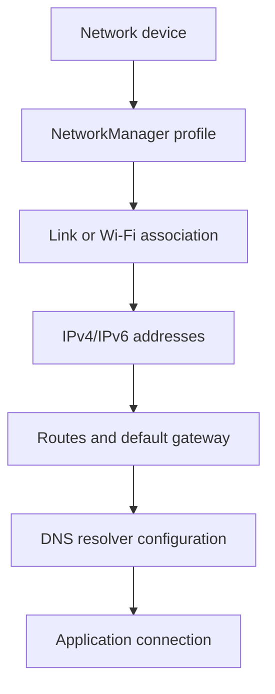
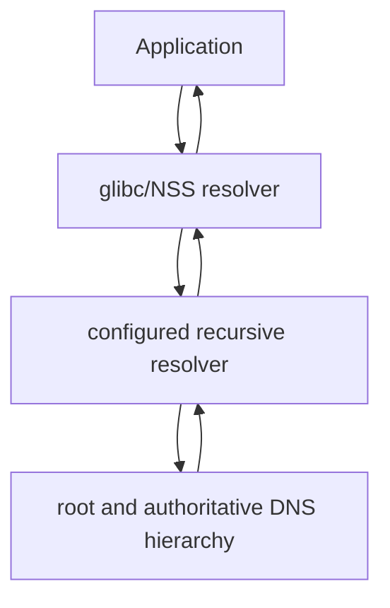

# NetworkManager, addressing, routes, and DNS

“The internet does not work” can describe failures at many unrelated layers:
the radio may be blocked, Wi-Fi association may have failed, no address may
have been assigned, no default route may exist, DNS may be wrong, or only one
remote service may be unavailable.

The useful habit is to test the path in order. This guide explains that path
and the project's conservative network policy. It does not change DNS providers,
deploy encrypted DNS, create trusted firewall zones, or turn the laptop into a
router.

## Canonical policy

| Area | Project decision |
| --- | --- |
| Network manager | NetworkManager is the only manager of ordinary interfaces |
| DHCP client | NetworkManager's internal client |
| Wi-Fi backend | The backend pulled in by the Arch NetworkManager package, currently `wpa_supplicant` in the runbook |
| Addressing | Automatic per-network IPv4 and IPv6 initially |
| DNS source | The active network's advertised configuration |
| DNS integration | NetworkManager's default mode and `/etc/resolv.conf` |
| Local caching resolver | None added by the project |
| `systemd-resolved` | Not enabled in the canonical base |
| Encrypted DNS | Deferred pending an explicit roaming/privacy design |
| Host firewall | firewalld with `public` as the default zone |
| Routing/forwarding | Laptop is an endpoint, not a router |

This policy is suitable for a laptop that moves among home, university, mobile
hotspots, and unknown networks. A DNS server reachable only on the home LAN
must not be hard-coded globally unless a fallback and reachability policy have
also been designed.

## The end-to-end path



Each transition supplies prerequisites for the next. DNS cannot repair a
missing Wi-Fi association, and changing the firewall is not a rational response
to an absent default route.

## Device, interface, and connection profile

These terms are related but not interchangeable:

| Concept | Meaning | Example |
| --- | --- | --- |
| Hardware/device | Physical or virtual networking capability | Intel/Realtek Ethernet controller, Wi-Fi radio |
| Interface | Kernel network object with a current name | `wlp3s0`, `enp2s0`, `lo` |
| NetworkManager device | NetworkManager's view and state for an interface | connected, disconnected, unavailable, unmanaged |
| Connection profile | Persistent or temporary desired configuration | SSID, authentication, IP methods, DNS, firewall zone |
| Active connection | A profile currently applied to a device | home Wi-Fi profile on `wlp3s0` |

One interface can use many profiles at different times. One Wi-Fi profile can
autoconnect whenever its SSID is available. Deleting a profile does not remove
the Wi-Fi adapter, and disconnecting a device does not necessarily delete its
saved profile.

Inspect all three views:

```bash
nmcli general status
nmcli device status
nmcli connection show
nmcli connection show --active
```

NetworkManager exports state and control through D-Bus. `nmcli`, graphical
applets, and desktop shells are clients of the same daemon; they are not
separate network managers.

## NetworkManager as the single owner

Two managers attempting to configure the same interface can race over addresses,
routes, DNS, and link state. The project therefore enables only:

```bash
systemctl is-enabled NetworkManager.service
systemctl is-active NetworkManager.service
```

It does not separately enable `dhcpcd`, `iwd`, `wpa_supplicant`, or
`systemd-networkd` as competing system managers. A backend process started and
supervised by NetworkManager is different from an independently configured
manager.

Likewise, NetworkManager and firewalld have separate jobs:

- NetworkManager establishes links, addresses, routes, and DNS policy;
- firewalld controls allowed traffic and assigns policy by zone;
- the kernel implements interfaces, routes, neighbor discovery, and packet
  filtering configured by those managers.

The project leaves a connection's `connection.zone` empty or sets it to
`public`. NetworkManager tells firewalld when the interface activates. Do not
also bind that interface manually in firewalld.

## Where connection profiles live

NetworkManager's native keyfile plugin normally stores system profiles below:

```text
/etc/NetworkManager/system-connections/
```

These files can contain Wi-Fi pre-shared keys, 802.1X identities, private-key
paths, VPN secrets, static addresses, DNS search domains, and cloned MAC policy.
They must remain root-owned with restrictive permissions and must never be
committed to a public dotfiles repository.

Use `nmcli` to inspect profiles instead of opening every keyfile:

```bash
nmcli -f NAME,UUID,TYPE,DEVICE,AUTOCONNECT connection show
nmcli connection show "<PROFILE>"
```

The complete output can reveal SSIDs, internal domains, addresses, UUIDs, and
security settings. Redact deliberately before publishing diagnostics, but do
not remove information required to understand the failure.

Global daemon configuration belongs in `/etc/NetworkManager/NetworkManager.conf`
or administrator drop-ins below `/etc/NetworkManager/conf.d/`. Connection
properties belong in connection profiles. Changing a global daemon setting to
solve one network's peculiarity is usually the wrong scope.

## Wi-Fi association and authentication

Before IP configuration, the Wi-Fi radio must be available, discover an access
point, and authenticate/associate with it.

```bash
rfkill list
nmcli radio
nmcli device wifi list
nmcli --ask device wifi connect "NETWORK_NAME"
```

`--ask` prompts for credentials rather than placing them in shell history. In
the project's first-boot procedure, `sudo nmcli --ask ...` creates a system
connection because graphical polkit authorization is not yet available.

Wi-Fi signal quality is not internet reachability. Association can succeed
while the DHCP server, gateway, DNS server, or upstream ISP is broken.

`rfkill` distinguishes:

- a soft block, normally changeable by software;
- a hard block, imposed by hardware/firmware and not overridable by a command.

Do not delete a working profile merely because one activation fails. First read
the device reason and current-boot journal.

## Ethernet and automatic profiles

For a managed Ethernet device without a saved profile, NetworkManager can create
an automatic default connection when carrier appears. “Carrier” means a
physical/link-layer connection, not successful DHCP or internet access.

```bash
ip -brief link
nmcli -f GENERAL.STATE,GENERAL.CONNECTION,WIRED-PROPERTIES.CARRIER device show "<INTERFACE>"
```

A cable can have carrier while the upstream switch provides no DHCP. Conversely,
an interface in `NO-CARRIER` state cannot exchange normal Ethernet traffic no
matter which DNS server is configured.

## DHCP is configuration delivery, not DNS itself

DHCPv4 can provide a client with:

- an IPv4 address and prefix/subnet mask;
- a lease lifetime;
- a default gateway;
- DNS server addresses and search domains;
- other network-specific options.

NetworkManager's internal DHCP client requests and applies that information.
No independent `dhcpcd.service` is required.

```bash
nmcli -f IP4.ADDRESS,IP4.GATEWAY,IP4.ROUTE,IP4.DNS,IP4.DOMAIN device show "<INTERFACE>"
ip -4 address show dev "<INTERFACE>"
ip -4 route show
```

DHCP is not a guarantee that the supplied DNS server is trustworthy or working.
It is a mechanism by which the current network can advertise configuration.

Renewal, lease expiry, and reconnects are handled as part of connection
activation. Repeatedly restarting NetworkManager discards useful state and can
hide the original failure; deactivate/reactivate the individual profile first
when that is the intended test.

## IPv4 addresses, subnets, and the default route

An IPv4 address alone is insufficient. The prefix says which addresses are
directly reachable on-link; routes say where other destinations should go.

For an illustrative address `192.168.1.42/24`:

- `192.168.1.42` identifies this host on that network;
- `/24` means the first 24 bits describe the local network;
- a gateway such as `192.168.1.1` can forward traffic outside that subnet;
- a default route selects that gateway when no more-specific route matches.

```bash
ip -4 address
ip -4 route
ip route get 1.1.1.1
```

`ip route get` asks the kernel which route, source address, and interface it
would use. It does not send a packet.

Multiple active connections can advertise default routes. Metrics and policy
routing determine which is preferred; the visually “connected” Wi-Fi is not
necessarily the path selected for every destination.

## IPv6 is not IPv4 with longer addresses

IPv6 hosts normally have at least a link-local address beginning with `fe80::`.
That proves only local-link configuration. Global connectivity also depends on
router advertisements, prefixes, routes, and possibly DHCPv6.

Common roles are divided differently from DHCPv4:

- Router Advertisements (RA) announce routers and network parameters;
- SLAAC can construct addresses from advertised prefixes;
- DHCPv6 can supply addresses and/or other configuration;
- DNS information can arrive through RA mechanisms or DHCPv6 depending on the
  network.

```bash
ip -6 address
ip -6 route
nmcli -f IP6.ADDRESS,IP6.GATEWAY,IP6.ROUTE,IP6.DNS device show "<INTERFACE>"
```

Do not disable IPv6 simply because a partial configuration is unfamiliar.
Neighbor Discovery, Router Advertisements, and Path MTU Discovery rely on
ICMPv6. Blocking all ICMPv6 breaks required control functions. This is why the
firewall baseline preserves the reviewed DHCPv6-client service and normal ICMP
handling.

IPv4 and IPv6 can fail independently. An application may try IPv6 first and
then fall back, producing delays that look like generic DNS slowness.

## Routes, gateways, and metrics

The routing table chooses an outgoing path after a destination address is
known. DNS does not choose the route; it only helps turn names into addresses.

```bash
ip route show table all
ip -6 route show table all
nmcli -f GENERAL.CONNECTION,IP4.ROUTE,IP6.ROUTE device show "<INTERFACE>"
```

A route has a destination prefix, optional next-hop gateway, interface, metric,
and sometimes a source or policy-table context. Lower metrics are generally
preferred among otherwise comparable routes, but longest-prefix matching comes
first.

VPNs complicate this deliberately: they may install a new default route or only
routes for selected private prefixes. Split tunneling and split DNS must be
designed together so the destination's address and its DNS query use compatible
paths.

## DNS: names are not connections

The Domain Name System maps names to data such as IPv4 (`A`) and IPv6 (`AAAA`)
addresses. Resolution usually involves several roles:



The laptop normally asks a recursive resolver announced by the current network.
That resolver performs or forwards the broader lookup and caches answers. Your
home router might advertise itself, AdGuard Home, Pi-hole, or another local
resolver. Those systems are upstream infrastructure from the laptop's point of
view; NetworkManager merely installs the per-connection information.

DNS returning an address does not prove that the host is reachable or that a
web server is listening. Conversely, reaching an IP address while names fail is
strong evidence that lower network layers work and the problem is resolution.

## NSS is broader than DNS

Linux applications commonly use the Name Service Switch (NSS), configured by
`/etc/nsswitch.conf`, rather than reading DNS directly. NSS can combine:

- `/etc/hosts` entries;
- the local static hostname through `nss-myhostname`;
- DNS;
- multicast or other sources when configured.

Test the application-facing resolver with:

```bash
getent ahosts archlinux.org
getent hosts "$(hostname)"
```

`getent` follows NSS policy. Tools such as `dig` are DNS-specific and can query
a chosen server directly, so they answer a different diagnostic question. A
successful `dig` does not prove that every NSS application resolves identically.

The project does not need a manual `/etc/hosts` entry for its own static
hostname because systemd's `nss-myhostname` integration provides local hostname
resolution. `/etc/hosts` remains useful for deliberate static overrides, but
it is not a general DNS configuration file.

## `/etc/resolv.conf`

The traditional resolver file declares nameserver addresses, search domains,
and resolver options. In the canonical base, NetworkManager uses its default
DNS mode and updates the effective configuration as connections change.

Inspect ownership as well as contents:

```bash
ls -l /etc/resolv.conf
readlink -f /etc/resolv.conf
cat /etc/resolv.conf
nmcli -f IP4.DNS,IP4.DOMAIN,IP6.DNS,IP6.DOMAIN device show "<INTERFACE>"
NetworkManager --print-config
```

The file might be regular or a symlink depending on the selected integration.
Do not replace it blindly. NetworkManager's `dns` and `rc-manager` settings,
the symlink target, and active local resolver must agree.

Writing a nameserver manually into a NetworkManager-managed file may appear to
work until the next activation. Making it immutable with `chattr +i` merely
prevents the manager from applying current network policy and creates a hidden
maintenance trap.

Search domains are not suffixes to trust casually. They cause single-label or
relative lookups to be tried under network-provided domains and can affect which
name an application reaches.

## Why `systemd-resolved` is not enabled yet

`systemd-resolved` is a local resolver service with caching and per-link routing
of DNS queries. When integrated correctly, NetworkManager sends it DNS servers
and domains per connection, and `/etc/resolv.conf` normally points to one of
resolved's managed files or local stub.

It can be valuable for:

- VPN split DNS;
- per-interface DNS routing domains;
- a local cache;
- DNS-over-TLS policy supported by resolved;
- consistent handling of several simultaneous links.

But enabling the service alone is incomplete. The NSS modules, NetworkManager
DNS plugin, `/etc/resolv.conf` target, per-link domains, fallback servers, and
failure behavior must form one design. A half-converted system can point
applications at `127.0.0.53` while no working stub serves it.

The current roaming laptop does not require that complexity for basic DNS, so
the project retains NetworkManager's simpler default path. This is not a claim
that resolved is inferior; it is a deferred architecture decision.

Check that current assumptions match reality:

```bash
systemctl is-enabled systemd-resolved.service
systemctl is-active systemd-resolved.service
```

If resolved is active or `/etc/resolv.conf` points into
`/run/systemd/resolve/`, diagnose that actual architecture rather than applying
the canonical direct-file assumptions.

## AdGuard Home, Pi-hole, and Unbound

These names describe different roles that can be combined:

| Component | Common role |
| --- | --- |
| AdGuard Home | Network DNS service with filtering, policy, logs, and upstream forwarding |
| Pi-hole | Network DNS filtering/sinkhole service, often forwarding upstream |
| Unbound | Recursive or forwarding validating resolver depending on configuration |
| Router DHCP | Announces address, gateway, DNS servers, and other network policy to clients |
| NetworkManager | Applies what the current network/profile provides on this laptop |

If the home DHCP server advertises AdGuard Home or Pi-hole, NetworkManager should
show that address under `IP4.DNS`/`IP6.DNS`. Hard-coding the same private address
globally on the laptop would fail away from home unless a VPN or conditional
fallback keeps it reachable.

Running both Pi-hole and AdGuard does not automatically provide redundancy.
Clients may choose either advertised server, and the two services need aligned
policy and independent reachability. Similarly, listing a public second DNS
server can bypass local filtering rather than act only after a failure.

## Encrypted DNS and privacy boundaries

Ordinary DNS is generally not encrypted between the laptop and its configured
resolver. DNS-over-TLS (DoT) and DNS-over-HTTPS (DoH) protect that transport
segment, but they do not make DNS anonymous:

- the selected resolver still sees queries and the client address;
- the destination IP remains visible to network observers;
- TLS may expose additional connection metadata;
- browser-integrated DoH can bypass system and local filtering policy;
- captive portals and split DNS can require special handling.

Choosing encrypted DNS therefore requires deciding who should see queries, how
local names/filtering work, what happens on restrictive networks, whether the
browser follows system policy, and whether fail-open or fail-closed behavior is
acceptable.

The project defers this choice rather than presenting a public resolver address
as universally more private. At home, the router/AdGuard architecture can be
improved separately; on the laptop, roaming and VPN behavior must be included.

## Static addresses and custom DNS belong to profiles

When a particular network genuinely needs static configuration, set it on that
connection profile, not globally. Relevant properties include:

```text
ipv4.method
ipv4.addresses
ipv4.gateway
ipv4.routes
ipv4.dns
ipv4.ignore-auto-dns
ipv6.method
ipv6.addresses
ipv6.routes
ipv6.dns
ipv6.ignore-auto-dns
```

`ignore-auto-dns` means advertised DNS is ignored; merely adding a DNS server
can instead combine it with automatically supplied servers. That difference is
easy to miss.

Before changing a profile, save its current non-secret settings and ensure
local TTY access. A bad static address or gateway can immediately disconnect
the machine. This handbook guide deliberately does not prescribe static values.

## A layered diagnostic sequence

Start with read-only observations and stop at the first broken boundary.

### 1. Service and radio

```bash
systemctl status NetworkManager.service --no-pager
nmcli general status
nmcli radio
rfkill list
```

### 2. Device and active profile

```bash
nmcli device status
nmcli connection show --active
ip -brief link
```

### 3. Addresses

```bash
ip -brief address
nmcli device show "<INTERFACE>"
```

An IPv4 address beginning `169.254.` is link-local and often indicates that
normal DHCPv4 configuration was not obtained. An IPv6 `fe80::` address alone
does not prove global IPv6 connectivity.

### 4. Routes

```bash
ip -4 route
ip -6 route
ip route get 1.1.1.1
```

### 5. Reachability without DNS

```bash
ping -c 3 1.1.1.1
```

ICMP can be filtered, so a failed ping is evidence, not absolute proof. Compare
it with routing and an application-layer test when necessary.

### 6. Application-facing name resolution

```bash
getent ahosts archlinux.org
cat /etc/resolv.conf
```

### 7. HTTPS and the target service

```bash
curl --fail --head https://archlinux.org/
```

This also depends on a credible system clock and valid CA certificates. A TLS
error is not automatically a DNS or firewall error.

### 8. Current-boot evidence

```bash
journalctl -b -u NetworkManager.service --no-pager
systemctl --failed
```

NetworkManager logs can contain SSIDs, addresses, domains, interface names, and
topology. Review them before posting publicly. Trace logging should be enabled
temporarily only when normal logs cannot explain a reproducible failure.

## Symptom map

| Symptom | Likely layer to inspect first | Useful distinction |
| --- | --- | --- |
| Wi-Fi interface says unavailable | radio/rfkill/driver | Hard block versus soft block versus missing firmware |
| SSID visible but activation fails | authentication/profile | Wrong credential, 802.1X policy, AP rejection |
| Connected with no IPv4 address | DHCPv4 | Association succeeded; address delivery did not |
| Address exists but no default route | DHCP/profile/routing | Local subnet may still work |
| IP ping works but names fail | resolver/DNS | Lower addressing and route layers probably work |
| `dig` works but application does not | NSS/local integration | DNS server works; application resolver path differs |
| Home names work, public names fail | local resolver/upstream | Filtering or forwarder/recursor problem |
| Public names work, home names fail | split/local DNS | Wrong server or search/routing domain |
| Some sites pause then work | IPv6, MTU, or fallback | Test address families and Path MTU; do not assume DNS |
| Browser works but `getent` fails | browser DoH/proxy | Browser may bypass system resolver |
| Network works until VPN connects | VPN routes/split DNS | Inspect per-profile routes and DNS domains |
| Wi-Fi says connected but web redirects | captive portal | Network access requires portal authentication |

## Safe recovery actions

Prefer the smallest reversible action that targets the failed layer:

```bash
nmcli connection down "<PROFILE>"
nmcli connection up "<PROFILE>"
```

If a profile was edited directly on disk, reload profile files explicitly:

```bash
sudo nmcli connection reload
```

Reloading daemon configuration is a different action:

```bash
sudo systemctl reload NetworkManager.service
```

Not every setting is reloadable; a restart can interrupt all network
connections. Do not restart NetworkManager during remote-only administration
without an out-of-band recovery route.

Avoid “fixes” that erase evidence or create competing ownership:

- deleting every connection profile;
- enabling `dhcpcd` or another manager alongside NetworkManager;
- making `/etc/resolv.conf` immutable;
- disabling IPv6 globally;
- opening firewall ports for an outbound DNS problem;
- hard-coding public DNS without considering local names, VPNs, and filtering;
- copying Wi-Fi keyfiles between machines through Git;
- posting complete connection profiles or enterprise Wi-Fi credentials.

## Read-only audit

```bash
systemctl is-enabled NetworkManager.service
systemctl is-active NetworkManager.service
nmcli general status
nmcli radio
nmcli device status
nmcli -f NAME,UUID,TYPE,DEVICE,AUTOCONNECT connection show
nmcli connection show --active
ip -brief address
ip -4 route
ip -6 route
cat /etc/resolv.conf
getent ahosts archlinux.org
systemctl is-active systemd-resolved.service
sudo firewall-cmd --get-active-zones
```

Expected relationships:

- NetworkManager is enabled and active;
- one intended profile owns each active ordinary interface;
- no competing DHCP/network service manages it;
- addresses and routes correspond to the current network;
- DNS shown by NetworkManager matches the effective resolver path;
- systemd-resolved is not part of the canonical base;
- the active interface belongs to firewalld's `public` zone unless a reviewed
  profile explicitly says otherwise.

## Project decisions in one view

| Question | Decision | Reason |
| --- | --- | --- |
| Manager | NetworkManager alone | One owner for roaming links, profiles, addresses, routes, and DNS |
| Wi-Fi creation | `nmcli --ask` initially | Avoid credentials in shell history and work before graphical authorization |
| Addressing | Automatic initially | Networks differ; avoid premature static policy |
| DHCP | NetworkManager internal client | No extra DHCP daemon or ownership conflict |
| DNS | Accept active network configuration | Works across home, university, hotspot, and recovery networks |
| Home filtering | Advertise via home DHCP/router | Keep home-only infrastructure scoped to home reachability |
| `/etc/resolv.conf` | Managed consistently by selected NetworkManager mode | Avoid stale manual edits and immutable-file workarounds |
| systemd-resolved | Deferred | Split DNS and local caching require a complete integration decision |
| Encrypted DNS | Deferred | Resolver trust, roaming, captive portals, VPNs, and fallback need joint design |
| IPv6 | Retained | It is part of modern networking and requires correct ICMP/RA handling |
| Firewall zone | `public` by default | Conservative policy for every network until explicitly classified |

## Further reading

- [ArchWiki: NetworkManager](https://wiki.archlinux.org/title/NetworkManager)
- [ArchWiki: Network configuration](https://wiki.archlinux.org/title/Network_configuration)
- [ArchWiki: Domain name resolution](https://wiki.archlinux.org/title/Domain_name_resolution)
- [ArchWiki: systemd-resolved](https://wiki.archlinux.org/title/Systemd-resolved)
- [NetworkManager reference manual](https://networkmanager.dev/docs/api/latest/NetworkManager.html)
- [`NetworkManager.conf(5)`](https://networkmanager.dev/docs/api/latest/NetworkManager.conf.html)
- [`nm-settings-nmcli(5)`](https://networkmanager.dev/docs/api/latest/nm-settings-nmcli.html)
- [`nmcli(1)`](https://networkmanager.dev/docs/api/latest/nmcli.html)
- [`ip-address(8)`](https://man.archlinux.org/man/ip-address.8)
- [`ip-route(8)`](https://man.archlinux.org/man/ip-route.8)
- [`resolv.conf(5)`](https://man.archlinux.org/man/resolv.conf.5)
- [`nsswitch.conf(5)`](https://man.archlinux.org/man/nsswitch.conf.5)
- [`systemd-resolved(8)`](https://man.archlinux.org/man/systemd-resolved.service.8)
- [RFC 1034: DNS concepts and facilities](https://www.rfc-editor.org/rfc/rfc1034)
- [RFC 1035: DNS implementation and specification](https://www.rfc-editor.org/rfc/rfc1035)
