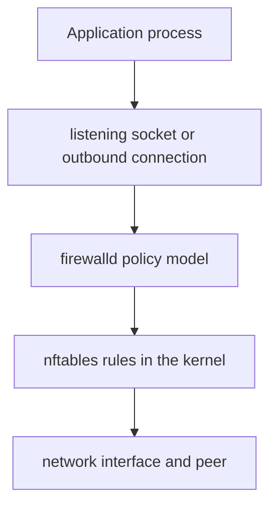
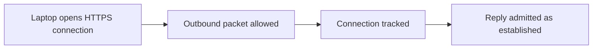
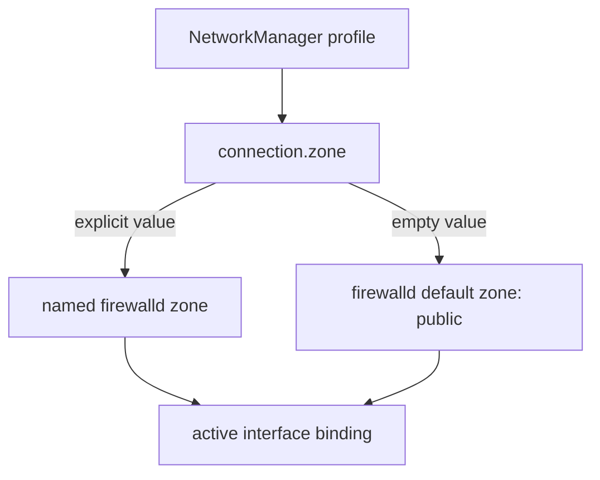
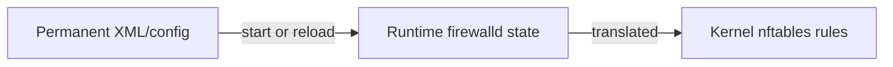

# Firewalld, nftables, zones, and host exposure

A firewall decides what network traffic may cross a policy boundary. It does
not remove listening processes, repair insecure applications, encrypt traffic,
or authenticate users. Those responsibilities remain important even when every
packet-filter check is green.

This guide explains the host firewall on the project ThinkPads. The canonical
configuration was applied by the post-install guide; the examples here favor
inspection and understanding over changing a working policy.

## Canonical workstation policy

| Area | Decision |
| --- | --- |
| Firewall manager | firewalld only |
| Kernel rule backend | nftables |
| Default zone | `public` |
| Explicit per-profile zones | Empty or `public` initially |
| Allowed public services | `dhcpv6-client` only |
| Explicit ports/protocols | None |
| SSH server | Disabled and not allowed through `public` |
| Intra-zone forwarding | Disabled in `public` |
| Inter-zone policies | None added |
| IP forwarding | Disabled for IPv4 and IPv6 |
| Masquerading/NAT | Disabled |
| Forward ports | None |
| Denied-packet logging | `off` by default |
| Outbound client traffic | Allowed |

Every home, university, hotspot, and unknown connection is treated as public
until a future requirement justifies a narrower profile-specific exception.
Being physically at home does not automatically make every device on that LAN
trusted.

## Four different layers



| Layer | Example question | Primary tool |
| --- | --- | --- |
| Application | Is `sshd` running and authenticated correctly? | `systemctl`, application config/logs |
| Socket | Which address and port accepts traffic? | `ss -lntup` |
| Policy manager | Which zone/service is intended? | `firewall-cmd` |
| Kernel filter | Which rules are actually loaded? | `nft` |

Installing `openssh` provides both client and server programs. It does not start
`sshd`. Allowing the firewalld `ssh` service would permit matching incoming
traffic; it would not start `sshd`. Starting `sshd` would create a listener; it
would not automatically alter this project's public zone.

Exposure exists only when several conditions align: a process listens on a
reachable address, routing reaches the machine, firewall policy admits the
traffic, and the service itself accepts the request.

## firewalld is a policy manager

firewalld is a long-running daemon with a D-Bus API and tools such as
`firewall-cmd`. It translates zones, services, ports, policies, and rich rules
into packet-filter rules.

nftables is the kernel-facing ruleset framework used by the canonical backend.
The kernel, not the `firewall-cmd` process, evaluates packets against the loaded
rules. Stopping firewalld normally removes the rules it owns because
`CleanupOnExit` defaults to enabled.

```bash
sudo firewall-cmd --state
systemctl status firewalld.service --no-pager
grep -E '^(FirewallBackend|DefaultZone|CleanupOnExit|LogDenied|StrictForwardPorts)' /etc/firewalld/firewalld.conf
sudo nft list tables
```

The expected backend is `nftables`. Do not also enable `nftables.service` with
an independently maintained `/etc/nftables.conf`. Both can use nftables, but two
uncoordinated owners make rule lifecycle and recovery ambiguous.

Other software such as container engines or virtualization stacks can add its
own nftables rules without enabling `nftables.service`. “Firewalld is the only
firewall manager” does not prove it is the only program capable of touching the
kernel ruleset. Audit new container/VM software separately.

## Stateful filtering and connection tracking

The firewall distinguishes a new connection from traffic related to an existing
one. Conceptually:



This is why the public zone can reject unsolicited inbound connections while
web browsing, DNS replies, Git over SSH, package downloads, and other outbound
client use still work. The return path is not treated as an unrelated incoming
server connection.

UDP has no handshake like TCP, but connection tracking can still maintain
temporary state for request/reply flows. Its behavior and timeouts differ from
TCP; an open-looking UDP socket should still be traced to its process.

Stateful filtering does not inspect application intent. A browser allowed to
make HTTPS connections can contact a malicious HTTPS server. Egress filtering,
application sandboxing, DNS policy, and user judgment address different risks.

## Input, output, and forwarding

Packets follow different logical paths:

| Path | Meaning | Workstation example |
| --- | --- | --- |
| Input | Arrives from a network and terminates on this laptop | Another host contacts a local server |
| Output | Originates from this laptop | Firefox opens HTTPS |
| Forward | Enters one interface and leaves another without terminating locally | Laptop routes hotspot clients to Ethernet |

Zone rules conveniently express traffic arriving at the host. Policies express
traffic between ingress and egress zones and can also cover broader input/output
relationships.

The laptop is an endpoint, not a router. Both kernel forwarding flags remain
disabled:

```bash
sysctl net.ipv4.ip_forward net.ipv6.conf.all.forwarding
```

Both expected values are `0`. A firewalld permission cannot forward packets if
the kernel is not configured to route them; enabling kernel forwarding alone
also does not create a safe policy or NAT design.

## Zones describe trust for traffic

A zone groups rules under a trust assumption. Incoming traffic is classified
into one ingress zone, and forwarded traffic also has an egress zone. The zone
does not detect whether a café, home, or university is genuinely safe; an
administrator or network manager supplies the binding.

List available and active zones:

```bash
sudo firewall-cmd --get-zones
sudo firewall-cmd --get-default-zone
sudo firewall-cmd --get-active-zones
sudo firewall-cmd --list-all-zones
```

An active zone is one currently bound to an interface or source. An inactive
zone can still exist permanently. The default zone supplies policy when no more
specific zone has been selected.

The predefined names are descriptions, not security certifications:

- `trusted` broadly accepts traffic and is unsuitable as a casual “home” label;
- `public` assumes other systems are not trusted and permits only selected
  incoming traffic;
- `drop` silently drops unmatched traffic;
- `block` rejects unmatched traffic;
- `home`, `work`, and `internal` ship with service choices that must be inspected
  before use.

Never switch zones based only on a friendly name. Read the complete runtime and
permanent contents first.

## How NetworkManager assigns a zone

The kernel sees interfaces, not NetworkManager profile names. NetworkManager
knows which connection profile activates each interface and informs firewalld
of the intended zone before using it.



Inspect the relationship:

```bash
nmcli -f NAME,TYPE,DEVICE connection show --active
nmcli -g connection.zone connection show "<ACTIVE_PROFILE>"
sudo firewall-cmd --get-active-zones
sudo firewall-cmd --get-zone-of-interface="<INTERFACE>"
```

An empty profile zone is valid and means the firewalld default applies. An
explicit `public` value is also valid. On this project, `home`, `work`,
`internal`, or `trusted` is unexpected until deliberately reviewed.

Do not permanently add a NetworkManager-owned interface using
`firewall-cmd --add-interface`. NetworkManager handles activation, deactivation,
and interface-name changes and re-establishes the binding after firewalld
restarts.

Source-address bindings can classify traffic separately and rich rules can
match particular sources, but they increase complexity. A source IP learned on
a LAN is not a durable identity or authentication mechanism.

## The default `public` zone

Inspect runtime and permanent state side by side:

```bash
sudo firewall-cmd --zone=public --list-all
sudo firewall-cmd --permanent --zone=public --list-all
```

The project expects:

- target `default`;
- service `dhcpv6-client` only;
- no `ssh` service;
- no explicit ports, protocols, source ports, forward ports, or rich rules;
- masquerading disabled;
- intra-zone forwarding disabled;
- no unexplained interface or source bindings in permanent XML.

With the default zone target, required ICMP handling is accepted and other
unmatched incoming traffic is rejected. `REJECT` provides an error response;
`DROP` silently discards. Silent drop is not automatically more secure and can
make diagnosis slower.

The zone target is a final unmatched behavior, not a shortcut for understanding
services and explicit rules. `ACCEPT` is especially broad and also affects
forwarding semantics.

## Services are named rule bundles

A firewalld service definition can contain ports, IP protocols, connection
tracking helpers, destination addresses, and included services. Inspect one
before enabling it:

```bash
sudo firewall-cmd --get-services
sudo firewall-cmd --info-service=ssh
sudo firewall-cmd --info-service=dhcpv6-client
```

Prefer a predefined service when it accurately describes an application. It is
more readable and can capture multiple related requirements. But a service name
is still firewall metadata:

- it is not a systemd unit;
- it does not install a package;
- it does not start a daemon;
- it does not configure application authentication;
- it does not guarantee the application uses every declared port.

The `dhcpv6-client` service allows replies needed by the IPv6 client. It is not
a general-purpose server and does not mean DHCPv6 is the only mechanism used by
IPv6. Router Advertisements, Neighbor Discovery, and other ICMPv6 functions
remain necessary.

## Ports, protocols, and sockets

A transport endpoint is normally described by address, protocol, and port.
TCP port 53 and UDP port 53 are distinct. A rule that admits a port does not
choose which local process receives it; socket binding and the kernel do that.

```bash
sudo ss -lntup
```

Interpret listener addresses:

| Address | Typical reachability |
| --- | --- |
| `127.0.0.1` or `::1` | Loopback only |
| Specific LAN address | That local interface/address |
| `0.0.0.0` | All applicable IPv4 interfaces |
| `::` or `*` | Potentially all applicable interfaces |

Binding only to loopback reduces exposure before firewall policy. Conversely,
a process on `0.0.0.0` can remain protected from the LAN by firewalld, but it is
still better to bind to the narrowest address compatible with its purpose.

Client source ports are normally ephemeral. Opening a server's destination
port is different from allowing a source-port match; avoid source-port rules
unless the protocol genuinely requires them.

## SSH demonstrates the separation

The laptop uses the OpenSSH client for GitHub:

```bash
ssh -T git@github.com
```

That is an outbound connection from an ephemeral local port to remote TCP 22.
It does not require adding `ssh` to the laptop's public zone.

An inbound SSH server would involve all of these decisions:

1. install the server binary (already supplied by the package here);
2. configure `sshd_config` and host/user authentication;
3. enable/start `sshd.service`;
4. decide which interface/address it should listen on;
5. allow the firewalld service in only the intended zone/source;
6. test logging, brute-force exposure, updates, and recovery.

The canonical base intentionally stops before step 3 and has no public SSH
exception. Verify both halves:

```bash
systemctl is-enabled sshd.service
systemctl is-active sshd.service
sudo firewall-cmd --zone=public --query-service=ssh
```

Expected results are disabled, inactive, and `no`.

## Runtime and permanent configuration

firewalld maintains two representations:

| State | Meaning | Lifetime |
| --- | --- | --- |
| Runtime | Rules effective in the running kernel policy | Lost on reload, restart, or stop unless saved |
| Permanent | Configuration files used to build future runtime state | Loaded at boot/reload/restart |

Without `--permanent`, most modification commands affect runtime only. With
`--permanent`, the change normally does not become effective until reload or a
matching runtime change.



This separation enables safe experiments: apply a temporary runtime rule, test
it, and discard it with reload. It also creates two common mistakes:

- a runtime-only fix disappears after reload/reboot;
- a permanent-only change appears to do nothing until applied.

The post-install procedure uses a controlled permanent-first pattern:

1. change permanent configuration;
2. run `firewall-cmd --check-config`;
3. reload;
4. compare runtime and permanent state.

`--runtime-to-permanent` copies the complete current runtime state over
permanent configuration. It is convenient after a deliberate runtime design,
but dangerous as a casual save button because temporary tests and unrelated
bindings can be persisted together.

## Reload is not restart or complete reload

```bash
sudo firewall-cmd --check-config
sudo firewall-cmd --reload
```

A normal reload replaces runtime policy with permanent configuration while
preserving connection-tracking state for established connections. Runtime-only
changes disappear.

`--complete-reload` also reloads netfilter kernel modules and will probably
terminate active connections because state is lost. It is reserved for severe
state problems, not ordinary configuration application.

Stopping firewalld normally removes its rules. That creates an exposure window,
so “stop the firewall and see” is not a routine diagnostic step. If a local TTY
test absolutely requires it, record state, keep the interval short, and restore
the daemon immediately; never do it through the only remote connection.

## Zone forwarding, kernel forwarding, and policies

Three concepts are frequently confused:

| Control | Question |
| --- | --- |
| Zone `forward` | May traffic be forwarded between sources/interfaces within this same zone? |
| Firewalld policy | What traffic may flow from an ingress zone to an egress zone? |
| Kernel IP forwarding | Will Linux route packets rather than treat itself only as an endpoint? |

Current firewalld zone principles allow intra-zone forwarding by default when
the zone's `forward` feature is enabled. The project explicitly removes it from
`public`. Inter-zone forwarding is denied unless a policy or other explicit
configuration permits it.

```bash
sudo firewall-cmd --zone=public --query-forward
sudo firewall-cmd --get-policies
sudo firewall-cmd --list-all-policies
sysctl net.ipv4.ip_forward net.ipv6.conf.all.forwarding
```

This keeps the workstation model simple. If the laptop later shares a VPN or
internet connection, it becomes a router and needs a new design spanning zones,
policies, forwarding, NAT, DNS/DHCP for clients, and threat boundaries.

## Masquerading, NAT, and port forwarding

Masquerading rewrites source addresses, commonly allowing several private
clients to share one external address. Destination NAT/forward ports redirect
incoming traffic to another address or port.

Neither is needed for ordinary outbound laptop traffic. The router at the edge
of the home network may perform NAT; that does not imply the laptop should.

```bash
sudo firewall-cmd --zone=public --query-masquerade
sudo firewall-cmd --zone=public --list-forward-ports
```

Expected results are `no` and an empty list. Enabling masquerade to “make the
internet work” can conceal a routing mistake and broadens the machine's role.

Container engines complicate forwarding and NAT by installing rules for
published ports. Current firewalld has a `StrictForwardPorts` option: when
disabled, DNAT created by other components may be accepted without an explicit
firewalld forward-port entry. Therefore, installing Docker/Podman/libvirt is a
mandatory point for a fresh firewall audit.

## ICMP and IPv6

ICMP is not just `ping`. It carries errors and network-control information such
as destination unreachable and Path MTU Discovery. ICMPv6 additionally supports
essential Neighbor Discovery and Router Advertisement behavior.

Blocking every ICMP type to look “stealthy” can produce connections that stall,
IPv6 that fails, or paths that work only for small packets. The project's
default target retains firewalld's required ICMP handling and adds no blanket
ICMP blocks.

Inspect, do not assume:

```bash
sudo firewall-cmd --zone=public --list-icmp-blocks
sudo firewall-cmd --zone=public --query-icmp-block-inversion
```

No blocks and no inversion are expected. IPv4 and IPv6 policy are generated
from the same higher-level configuration where applicable, but their protocols
and control traffic are not identical.

## Rich rules, sources, and IP sets

Rich rules can combine source/destination, service/port/protocol, logging,
limits, and accept/reject/drop actions. IP sets efficiently group many sources.
They are useful when a requirement cannot be expressed clearly as a simple
zone service.

They also introduce ordering and scope risks. Rich-rule priorities range from
negative (earlier) through zero to positive (later); rules with equal priority
do not have a defined mutual order. Source addresses are network locations, not
user identities.

The base has no rich rules:

```bash
sudo firewall-cmd --zone=public --list-rich-rules
sudo firewall-cmd --get-ipsets
```

Do not add a broad allow rule to override an unexplained rejection. First prove
the intended source, destination, protocol, interface zone, and listener.

## Zone and service files

Vendor definitions live below `/usr/lib/firewalld`; administrator overrides and
custom definitions live below `/etc/firewalld`. A same-named administrator file
can override packaged policy.

```bash
sudo firewall-cmd --permanent --path-zone=public
sudo firewall-cmd --permanent --path-service=ssh
sudo find /etc/firewalld -maxdepth 3 -type f -print
```

The canonical installation may create an `/etc/firewalld/zones/public.xml`
override when it removes the packaged SSH service or forwarding. That is local
policy, not unexplained duplication.

Prefer `firewall-cmd` for normal changes because it validates concepts and
updates the correct representation. If XML is edited manually, validate it
before reload. Never replace the whole vendor directory with a copied snapshot;
that would freeze definitions and hide future package improvements.

## What the firewall cannot guarantee

The firewall does not:

- patch vulnerable software;
- make weak passwords strong;
- prevent a permitted service from leaking data;
- stop malware using allowed outbound HTTPS;
- encrypt Wi-Fi, DNS, HTTP, or application protocols;
- decide whether a network is trustworthy;
- remove a listener from `ss`;
- protect a service bound only to a container namespace unless rule paths are
  audited;
- replace service sandboxing, least privilege, or backups.

Defense in depth means minimizing listeners, binding narrowly, authenticating
strongly, updating packages, and retaining firewall policy—not choosing one of
those controls as a substitute for the others.

## Read-only audit

```bash
sudo firewall-cmd --state
systemctl is-enabled firewalld.service
systemctl is-active firewalld.service
sudo firewall-cmd --get-default-zone
sudo firewall-cmd --get-active-zones
sudo firewall-cmd --zone=public --list-all
sudo firewall-cmd --permanent --zone=public --list-all
sudo firewall-cmd --get-log-denied
sudo firewall-cmd --list-all-policies
sudo ss -lntup
sudo nft list tables
systemctl is-enabled nftables.service 2>&1
systemctl is-active nftables.service 2>&1
sysctl net.ipv4.ip_forward net.ipv6.conf.all.forwarding
```

Confirm relationships:

- firewalld is enabled, active, and reports `running`;
- the default zone is `public`;
- NetworkManager's active interface is in `public`;
- runtime and permanent public-zone contents agree;
- only `dhcpv6-client` is allowed as a public service;
- there are no explicit ports, rich rules, forwarding, or masquerading;
- `sshd` and standalone `nftables.service` are inactive;
- every listener has a known process and purpose;
- kernel IP forwarding is disabled.

`nft list ruleset` provides deeper evidence but can be long and may include
rules from several owners. Use it when table inspection or behavior disagrees
with firewalld's model:

```bash
sudo nft list ruleset
```

Do not edit the generated firewalld table directly. The next reload can replace
manual changes, and current table ownership is designed to prevent external
modification.

## Diagnose by symptom

| Symptom | Inspect first | Common mistake |
| --- | --- | --- |
| Service works on loopback but not LAN | listener address, zone, allowed service | Opening a port when process only binds `127.0.0.1` |
| Port is allowed but connection refused | listener/service state | Firewall permission does not start a daemon |
| Port is allowed but connection times out | active zone, route, peer, listener, filter | Editing the wrong zone |
| Outbound web/DNS fails | address, routes, resolver, service logs | Adding inbound firewall openings |
| Rule works until reload | runtime versus permanent | Runtime-only change was never persisted |
| Permanent rule is invisible at runtime | apply/reload step | `--permanent` does not normally apply immediately |
| Interface appears in unexpected zone | NetworkManager `connection.zone` | Manual interface binding competing with profile policy |
| VPN/container changes exposure | policies/NAT/other nftables owner | Assuming only firewalld modifies packet paths |
| IPv6 behaves differently | ICMPv6, IPv6 addresses/routes/rules | Disabling IPv6 or blocking all ICMP |
| Existing session works after tightening | connection tracking | Testing only an already-established connection |

Test a new connection after policy changes. An established session may remain
admitted by state tracking even when a fresh connection would be rejected.

## Logging and evidence

Denied-packet logging is off by default to avoid noise, storage growth, and
exposure of network metadata. Check daemon warnings first:

```bash
sudo journalctl -b -u firewalld.service --no-pager
sudo firewall-cmd --get-log-denied
```

If a reproducible problem truly needs packet-denial logging, enable the narrowest
useful scope temporarily, reproduce once, and revert. Logging every dropped
broadcast or scan can flood the journal and obscure the relevant packet.

Packet captures and firewall logs can contain local addresses, MAC addresses,
hostnames, ports, VPN topology, and remote services. Review them before posting.

## Safe change pattern

For a genuine new local server requirement:

1. identify the process, listener address, transport, and exact ports;
2. decide which NetworkManager profile/zone should admit it;
3. prefer a correct predefined service over a raw port;
4. test a runtime-only change from a second local device;
5. test both allowed and denied sources and a fresh connection;
6. if correct, reproduce the narrow change permanently;
7. validate permanent configuration and reload;
8. compare runtime/permanent state and audit `ss` again;
9. document removal conditions and recovery.

Illustrative syntax—not a request to enable SSH—is:

```bash
sudo firewall-cmd --zone=public --add-service=ssh --timeout=10m
sudo firewall-cmd --zone=public --query-service=ssh
sudo firewall-cmd --reload
```

The timeout limits the runtime experiment. Reload removes it because it was not
saved permanently. Do not run this example on the canonical laptop unless an
actual SSH-server design has been approved.

For the project baseline, permanent-first changes were chosen because the exact
desired final state was predetermined and validated before reload. For exploring
an unknown service requirement, runtime-first with a timeout is safer.

## Recovery principles

When a new rule breaks access:

- keep or obtain a local TTY rather than relying on the affected network path;
- inspect active zone and runtime/permanent divergence;
- remove only the new runtime rule or use normal reload to restore known
  permanent state;
- do not flush all nftables tables blindly;
- do not reset firewalld to defaults unless prepared to lose all local policy;
- do not stop firewalld for longer than the controlled diagnostic interval;
- do not enable a second firewall manager as a rescue workaround.

Useful checks are:

```bash
sudo firewall-cmd --check-config
sudo firewall-cmd --zone=public --list-all
sudo firewall-cmd --permanent --zone=public --list-all
sudo journalctl -b -u firewalld.service -p warning --no-pager
```

If permanent configuration is known good and only runtime experiments are
wrong, a normal `firewall-cmd --reload` restores it while preserving established
connection state. Understand that runtime-only access used for the current
remote session will also disappear.

## Project decisions in one view

| Question | Decision | Reason |
| --- | --- | --- |
| High-level manager | firewalld | Dynamic, zone-aware integration with NetworkManager |
| Backend | nftables | Current Linux packet-filter framework and firewalld default |
| Standalone nftables unit | Disabled | Avoid competing lifecycle/ownership |
| Default trust | `public` | Conservative for a roaming laptop |
| Home trusted zone | Not created yet | “Home” does not make all LAN peers trusted |
| SSH opening | Removed | Client use needs no inbound exception; server is disabled |
| DHCPv6 client | Retained | Permit required IPv6 client replies without exposing a general server |
| ICMP | Required defaults retained | Preserve error handling, PMTU, and IPv6 control traffic |
| Intra-zone forwarding | Disabled in `public` | Laptop is not bridging/routing public peers |
| Inter-zone policies | None | No router/container/VPN forwarding design in base |
| Masquerade/forward ports | Disabled | Endpoint, not gateway |
| Denied logging | Off | Avoid noise; enable narrowly for diagnosis only |
| Change strategy | Explicit narrow rule, verify both states | Prevent accidental broad/persistent exposure |

## Further reading

- [ArchWiki: firewalld](https://wiki.archlinux.org/title/Firewalld)
- [ArchWiki: nftables](https://wiki.archlinux.org/title/Nftables)
- [Firewalld concepts](https://firewalld.org/documentation/concepts.html)
- [Connections, interfaces, and sources](https://firewalld.org/documentation/zone/connections-interfaces-and-sources.html)
- [Runtime versus permanent](https://firewalld.org/documentation/configuration/runtime-versus-permanent.html)
- [`firewall-cmd(1)`](https://man.archlinux.org/man/firewall-cmd.1)
- [`firewalld.conf(5)`](https://man.archlinux.org/man/firewalld.conf.5)
- [`firewalld.zones(5)`](https://man.archlinux.org/man/firewalld.zones.5)
- [`firewalld.zone(5)`](https://man.archlinux.org/man/firewalld.zone.5)
- [`firewalld.policy(5)`](https://man.archlinux.org/man/firewalld.policy.5)
- [`firewalld.service(5)`](https://man.archlinux.org/man/firewalld.service.5)
- [`firewalld.richlanguage(5)`](https://man.archlinux.org/man/firewalld.richlanguage.5)
- [Netfilter nftables documentation](https://wiki.nftables.org/)
