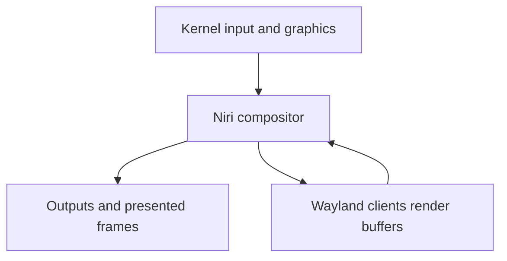
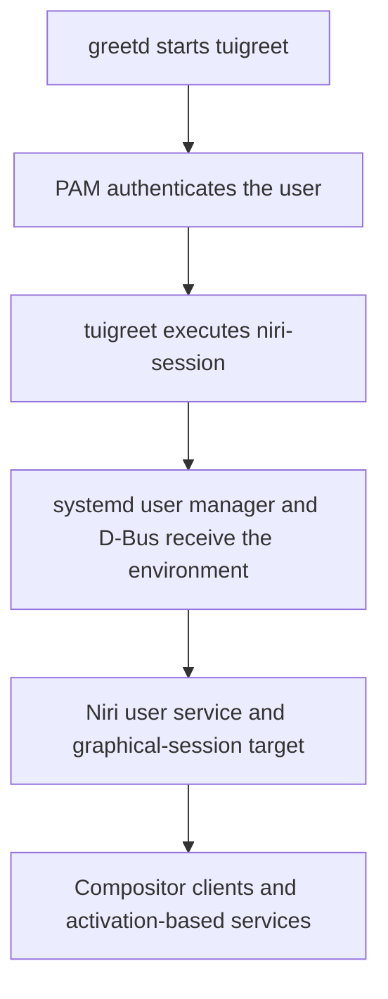
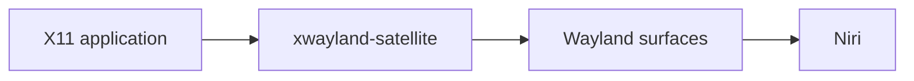
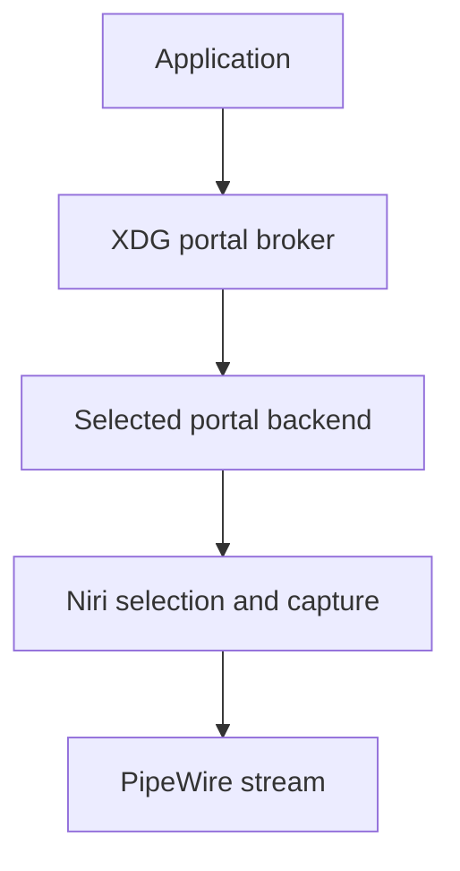

# Wayland, Niri, and the graphical session

## Purpose and scope

A desktop can appear to be one program even when it is a collection of
independent processes. On this project, Niri places windows and presents
frames, but it does not draw the status bar, display notifications, choose
applications, store secrets, authenticate privileged actions, mount removable
media, or decide when the laptop suspends.

This guide explains the boundaries that make the graphical session work:

- the Wayland compositor and its clients;
- the login and `niri-session` lifecycle;
- environment propagation to the systemd user manager and D-Bus services;
- native Wayland, X11 compatibility, IPC, and other local sockets;
- application identity, window rules, outputs, and logical coordinates;
- normal windows versus layer-shell surfaces;
- portal, PipeWire, polkit, and Secret Service integration;
- GNU Stow as the deployment mechanism for portable user configuration.

The post-install repository remains the executable procedure, and
`niri-dotfiles` remains the source of the reviewed user configuration. This
article provides the mental model and diagnostic order.

It does not yet redesign output handling, replace startup commands with custom
systemd user units, install Eww, change the greeter, or add Plymouth. Those are
separate decisions because they affect different parts of the system.

## The project desktop is a set of cooperating components

The canonical stack is deliberately modular:

| Responsibility | Project component | Scope |
| --- | --- | --- |
| Authenticate a new graphical login | greetd, tuigreet, PAM | System service and login boundary |
| Create the graphical user session | `niri-session` | User-session bootstrap |
| Display server, compositor, layout, input, and window policy | Niri | User session |
| X11 compatibility | `xwayland-satellite`, managed by Niri | User session, on demand |
| Status bar | Waybar | User session |
| Application launcher | Fuzzel | User session |
| Notifications | Mako | User D-Bus service and presentation |
| Background | swaybg | User session |
| Idle event coordination | swayidle | User session |
| Session locking and unlock authentication | swaylock plus PAM | User session and authentication |
| Graphical authorization prompt | MATE polkit agent | User session |
| Sandboxed desktop interfaces | XDG Desktop Portal broker and backends | User D-Bus services |
| Audio, video streams, and screencast transport | PipeWire and WirePlumber | User services |
| Secret Service | GNOME Keyring | User session |
| Removable-media automount request | udiskie | XDG autostart user process |
| System power, network, Bluetooth, and filtering | TLP, NetworkManager, BlueZ, firewalld | System services |

Niri is therefore a compositor, not a complete desktop environment. This is
not a defect or an incomplete installation. It means every desktop role is an
explicit choice that can be inspected or replaced without pretending all
components have the same lifecycle.

The current visible shell is:

```text
Niri        compositor, input, layout, workspaces, screenshots
Waybar      status and workspace presentation
Fuzzel      application launcher
Mako        notification service and presentation
swaybg      background
swayidle    idle and pre-sleep event coordinator
swaylock    session locker
```

Eww belongs to the widget and custom-panel category. It can present arbitrary
data and controls, but it does not become a notification daemon merely by
drawing a notification-shaped widget. Replacing Mako would also require a
component that owns the desktop notification D-Bus interface and feeds events
to the widget. The next handbook guide will compare these visible components
and their protocol boundaries in detail.

## The Wayland mental model

### The compositor is the display server

Under Wayland, Niri is both compositor and display server. Applications are
Wayland clients. In simplified form:



The arrows represent different responsibilities:

- the kernel exposes input devices and graphics/display mechanisms;
- Niri receives input, chooses which client receives it, and controls outputs;
- each client renders its own content into buffers;
- Niri arranges those buffers and composes the final image;
- clients and compositor exchange requests and events through the Wayland
  protocol over a local Unix socket.

This is why a Wayland application does not normally choose an absolute global
screen coordinate for its window. It creates surfaces and asks for roles such
as a top-level window or popup. The compositor owns global placement, focus,
stacking, workspaces, and presentation.

### A surface is not always a normal window

A Wayland surface is a rectangular stream of client-provided content. A
protocol gives that surface meaning. Common roles in this desktop include:

| Surface role | Typical project example | Who controls placement |
| --- | --- | --- |
| `xdg_toplevel` | Kitty, Firefox, Nautilus | Niri layout and window rules |
| `xdg_popup` | Application menu or tooltip | Protocol relationship to its parent |
| Layer-shell surface | Waybar, Fuzzel, Mako, swaybg | Anchors, layer rules, and compositor |
| Session-lock surface | swaylock | Secure session-lock protocol |

Layer-shell clients are not ordinary tiled windows. A bar can reserve an edge,
a launcher can appear above normal windows, notifications can occupy an overlay
region, and a background can remain behind everything. Trying to repair their
placement with normal `window-rule` entries targets the wrong protocol role.

Inspect both categories separately:

```bash
niri msg windows
niri msg layers
```

Current Niri also supports `layer-rule` entries that match a layer surface's
namespace. They are useful only after the real namespace and role have been
observed; they should not be guessed from the executable name.

## From login to a working graphical session

### The canonical lifecycle

After the base system has booted, the project follows this sequence:



Before greetd was enabled, the same graphical stack was deliberately tested
from an authenticated TTY with:

```bash
niri-session -l
```

The production greetd command runs `niri-session`. The important choice is the
session wrapper, not the particular caller.

### `niri`, `niri --session`, and `niri-session` are not equivalent

| Command | Intended role | Project use |
| --- | --- | --- |
| `niri` | Run the compositor directly, including nested development tests | Diagnosis or development only |
| `niri --session` | Ask Niri to import the session environment and start the graphical target | Lower-level session mechanism |
| `niri-session` | Integrate Niri with the supported init/user-service setup and session lifecycle | Canonical entry point |

Using bare `niri` can produce a visible compositor while leaving D-Bus-activated
services or portals with incomplete session context. A successful background
and terminal do not prove that file pickers, screen sharing, notifications, or
other activation-based components received the correct environment.

The project therefore keeps one rule:

> Start the real desktop with `niri-session`; use bare `niri` only for a
> deliberate diagnostic or nested test.

### Login, session start, and screen unlock are different authentication events

greetd asks PAM to authenticate a new login. `niri-session` creates the
graphical lifecycle after that login. swaylock protects an existing session and
uses its own PAM service to authenticate the returning user. The MATE polkit
agent asks for authorization credentials for a privileged action.

These prompts can look similar, but one successful prompt does not prove the
others work. Their detailed boundaries are covered in
[Users, permissions, sudo, and PAM](../foundations/02-users-permissions-sudo-and-pam.md)
and [Polkit authorization and XDG Desktop Portals](../workstation/10-polkit-and-xdg-desktop-portals.md).

## Environment propagation is part of the session

### Important variables

The running session exposes names that let clients find local services:

| Variable | Meaning in this project |
| --- | --- |
| `XDG_RUNTIME_DIR` | Private per-user runtime directory containing sockets and volatile state |
| `XDG_SESSION_TYPE` | Session kind; expected value is `wayland` |
| `XDG_CURRENT_DESKTOP` | Desktop identity used by applications and portal selection |
| `WAYLAND_DISPLAY` | Name or path of Niri's Wayland socket |
| `DISPLAY` | X11 display exported for Niri's Xwayland integration |
| `NIRI_SOCKET` | Niri IPC Unix socket used by `niri msg` |
| `DBUS_SESSION_BUS_ADDRESS` | User D-Bus connection when an explicit address is needed |
| `XDG_DATA_DIRS` | Search roots that include desktop entries and other shared data |

Inspect them from Kitty inside the graphical session:

```bash
printf '%s\n' \
    "XDG_RUNTIME_DIR=$XDG_RUNTIME_DIR" \
    "XDG_SESSION_TYPE=$XDG_SESSION_TYPE" \
    "XDG_CURRENT_DESKTOP=$XDG_CURRENT_DESKTOP" \
    "WAYLAND_DISPLAY=$WAYLAND_DISPLAY" \
    "DISPLAY=$DISPLAY" \
    "NIRI_SOCKET=$NIRI_SOCKET" \
    "DBUS_SESSION_BUS_ADDRESS=$DBUS_SESSION_BUS_ADDRESS"
```

Compare the environment stored by the systemd user manager:

```bash
systemctl --user show-environment | \
    grep -E '^(XDG_RUNTIME_DIR|XDG_SESSION_TYPE|XDG_CURRENT_DESKTOP|WAYLAND_DISPLAY|DISPLAY|NIRI_SOCKET|DBUS_SESSION_BUS_ADDRESS)='
```

The shell, the systemd user manager, and already running processes do not share
one magical live environment. A variable exported later in one terminal does
not retroactively rewrite every service. Session startup imports the relevant
values so services started later by systemd or D-Bus inherit coherent state.

Never hard-code `WAYLAND_DISPLAY`, `DISPLAY`, `NIRI_SOCKET`, or
`DBUS_SESSION_BUS_ADDRESS`. They identify runtime endpoints and may change
between sessions. Niri owns the Wayland, X11 compatibility, and IPC endpoints.

Do not set `GDK_BACKEND` globally either. Forcing every GTK process onto one
backend can break components that deliberately use a different backend,
including the GNOME screencast portal in Niri's supported setup.

### The main local transports

Several independent Unix sockets coexist below the runtime directory:

| Transport | Discovery | Carries |
| --- | --- | --- |
| Wayland | `WAYLAND_DISPLAY` | Surfaces, input events, output information, selections, protocol requests |
| X11 compatibility | `DISPLAY` | X11 protocol between legacy clients and Xwayland |
| Niri IPC | `NIRI_SOCKET` | Niri queries, actions, and event stream |
| User D-Bus | session-bus environment/runtime convention | Desktop service methods and signals |
| PipeWire | PipeWire runtime discovery | Audio, video, and screencast media streams |

They are all local inter-process communication, but they are not
interchangeable. A working `niri msg outputs` proves Niri IPC; it does not prove
the portal broker or PipeWire graph. A working browser window proves Wayland or
X11 presentation; it does not prove notification ownership.

## Application identity and desktop-file identity

### Native Wayland applications expose an app ID

A normal Wayland application gives its top-level surface an application ID.
Niri exposes the observed value as `app-id` and can match it in a window rule.
The title is separate and usually changes with the document, page, dialog, or
application state.

Observe before writing a rule:

```bash
niri msg pick-window
niri msg windows
niri msg --json windows
```

`pick-window` is useful when the screen contains several similar windows.
Machine-readable scripts should consume `--json`; Niri's human-readable output
is intended for people and may change formatting.

The current Firefox picture-in-picture policy is:

```kdl
window-rule {
    match app-id=r#"firefox$"# title="^Picture-in-Picture$"
    open-floating true
}
```

This rule requires both the observed Firefox ID and the exact picture-in-picture
title. Anchoring the regular expressions prevents an accidental substring from
matching unrelated windows. The title is still less stable than the app ID
because it can be localized or changed upstream; it must be re-observed if the
rule stops matching.

### App ID, desktop-file ID, and executable name are related but distinct

| Identity | Example purpose | Where it matters |
| --- | --- | --- |
| Wayland app ID | Identify a running surface | Niri window rules and task presentation |
| X11 class mapped through Xwayland | Identify a compatibility client | Niri's observed `app-id` for X11 windows |
| Desktop-file ID | Identify an installed launcher/handler | Fuzzel, MIME defaults, portals, notifications |
| Executable path/name | Start a process | Shell commands and `spawn` actions |

Well-integrated applications normally align their app ID with the basename of
their `.desktop` file, but configuration should not assume perfect alignment.
Observe the running window and inspect installed desktop files:

```bash
niri msg pick-window
grep -R '^Exec=' /usr/share/applications ~/.local/share/applications 2>/dev/null
xdg-mime query default application/pdf
```

The project's `mimeapps.list` records desktop-file IDs, not Niri regular
expressions and not executable names. Changing one identity does not
automatically repair the others.

## Window rules are ordered compositor policy

Niri evaluates matching rules in order. Later matching rules can refine values
set by earlier, more general rules. Keep general policy first and exceptions
after it.

Rule properties also have different lifetimes:

- opening properties decide initial state when the window appears;
- dynamic properties can continue to react while identity or title changes;
- some identity information may arrive after the first surface commit.

Use the current upstream documentation for each property rather than assuming
every setting can update an existing window. Validate syntax separately from
runtime matching:

```bash
niri validate
niri msg pick-window
journalctl --user -b -u niri.service --no-pager
```

`niri validate` proves that KDL parses and refers to recognized configuration
items. It cannot prove that a regular expression matches the identity an
application actually publishes.

## Outputs, modes, scale, and logical coordinates

The portable dotfiles deliberately omit output blocks until both ThinkPads and
their external-display use have been measured. Niri can select preferred modes
and place outputs automatically, so an absent block is a valid baseline.

Inspect the real state inside the session:

```bash
niri msg outputs
```

Record:

- connector name;
- manufacturer, model, and serial when available;
- active and available modes;
- the complete refresh rate, including three decimal places;
- scale;
- logical position and dimensions;
- transform and variable-refresh support where relevant.

An output rule can identify a connector or use manufacturer/model/serial
identity. A connector name is simple but may change when a dock or port changes.
Manufacturer/model/serial can describe a physical display more precisely, but
those fields are not guaranteed to be unique or populated correctly on every
device. The future host-override design will choose based on measured data, not
on a universal rule.

Wayland output positions use logical pixels. With a scale of `1.5`, physical
pixels and logical coordinates are intentionally different. This affects
layout and adjacency calculations; it does not mean the panel is running at a
lower hardware mode.

When a mode is configured, copy its exact refresh value from `niri msg outputs`.
Do not round `59.997` to `60`, invent coordinates before deciding scale, or add
shared output policy that only fits one machine.

## Niri IPC is a control and observation interface

Niri exposes a Unix socket through `NIRI_SOCKET`. The `niri msg` client uses it
to send actions or query state:

```bash
niri msg outputs
niri msg workspaces
niri msg windows
niri msg layers
niri msg --json outputs
niri msg --json windows
```

The event stream first provides the current state and then reports changes. It
is suitable for bars and integrations that need to follow workspaces, windows,
or outputs without polling continuously.

Three rules keep IPC consumers robust:

1. use JSON rather than parsing human-oriented tables;
2. tolerate new object fields after a Niri update;
3. run against the socket of the current graphical session.

From an unrelated TTY, `NIRI_SOCKET` may be missing even though Niri works. Do
not fix that by guessing a pathname. Open the command inside the session, or
deliberately obtain the current session environment while diagnosing why a
user service did not inherit it.

After a Niri package update, a new `niri msg` binary can temporarily disagree
with an older still-running compositor. Save work and restart the graphical
session before rewriting scripts or configuration around a version mismatch.

## X11 applications through Xwayland

### Compatibility path

An X11 application does not speak Wayland. In this project its path is:



Xwayland is an X server that itself behaves as a Wayland client. The satellite
adapts X11 windows to a compositor that intentionally does not contain a full
Xwayland window-management implementation.

With current compatible Niri and `xwayland-satellite` packages, Niri:

- creates the X11 socket;
- exports `DISPLAY`;
- starts `xwayland-satellite` only when an X11 client connects;
- restarts the satellite if it exits unexpectedly.

Therefore the tracked Niri configuration must not contain a manual
`spawn-at-startup "xwayland-satellite"` or a hard-coded `DISPLAY=:0`.

Test the on-demand path:

```bash
pgrep -af xwayland-satellite
glxinfo -B
pgrep -af xwayland-satellite
journalctl --user -b -u niri.service --no-pager | tail -60
```

The first process query may be empty before any X11 client exists. `glxinfo`
should trigger the compatibility server and report the AMD/Mesa renderer.

### Compatibility has real limits

Traditional X11 programs can assume they know absolute screen coordinates or
can inspect other clients. Wayland deliberately does not expose the desktop in
that form. Most ordinary X11 applications work through Xwayland, but old bars,
docks, automation tools, screen recorders, or applications that depend on
global coordinates may behave incorrectly.

Prefer a native Wayland application when both choices are equally suitable.
Do not treat the presence of Xwayland as a security failure or as evidence that
the whole session is X11; it is a compatibility boundary for individual
clients.

## Portals and screen sharing cross several boundaries

An application requesting a file chooser, screenshot, or screen-sharing stream
does not necessarily call Niri directly. The canonical path is approximately:



The project installs the GTK and GNOME portal backends. Niri's supported
screencast integration uses the GNOME backend, a correctly created D-Bus user
session, and PipeWire. A portal can also ask the compositor to present a secure
selection UI rather than granting unrestricted desktop access to the caller.

This explains several apparently contradictory observations:

- Niri can render windows while a portal is broken;
- PipeWire audio can work while screen sharing fails;
- a file chooser can work while the screencast backend fails;
- restarting a system service may not affect a user D-Bus activation problem;
- a globally forced GTK backend can break a portal even when GTK applications
  themselves still open.

Use [Polkit authorization and XDG Desktop Portals](../workstation/10-polkit-and-xdg-desktop-portals.md)
for the complete broker/backend, authorization, secrets, and diagnostic model.

## Who starts each process

The current setup uses more than one valid activation model:

| Component | Current start owner | Reason |
| --- | --- | --- |
| Niri | `niri-session` through the systemd user manager | Defines the graphical session lifecycle |
| `xwayland-satellite` | Niri, on demand | Avoids stale sockets and duplicate compatibility servers |
| Waybar, Mako, swaybg, swayidle | Niri `spawn-at-startup` | Small, explicit portable baseline |
| MATE polkit agent | Niri `spawn-at-startup` | One authentication agent per session |
| udiskie | XDG autostart desktop entry | Generic session utility, not compositor policy |
| Portals and backends | User D-Bus/systemd activation | Start when desktop interfaces are requested |
| PipeWire and WirePlumber | User socket/service activation | Per-user media lifecycle |
| greetd | System service | Exists before user authentication |
| NetworkManager, BlueZ, firewalld, TLP | System services or event-driven system units | Machine-level policy and hardware |

Niri `spawn-at-startup` does not monitor and restart a process after it exits.
That simplicity is acceptable for the current small baseline: ownership is
obvious, and a fresh session starts each component once.

A future migration of selected components to systemd user units could add
restart policy, dependency ordering, resource controls, and centralized logs.
It would also add unit files, target relationships, environment requirements,
and a duplicate-start risk during migration. No component should exist in both
`spawn-at-startup` and an enabled user unit at the same time.

The current choice should be changed only to solve a measured lifecycle
problem, not because a user unit is automatically superior to every direct
startup command.

## GNU Stow deploys configuration; it does not run the desktop

The dotfiles repository is a collection of Stow packages. Each package mirrors
the final path relative to the target home directory:

```text
niri/.config/niri/config.kdl
waybar/.config/waybar/config.jsonc
mako/.config/mako/config
kitty/.config/kitty/kitty.conf
```

With the repository as Stow's source and `$HOME` as the target, Stow creates
symbolic links from the expected user configuration path back to the tracked
file. It does not install Arch packages, start processes, enable services, or
merge program-specific syntax.

The project uses separate Stow packages because each component can be
previewed, deployed, removed, and reviewed independently. It also uses
`--no-folding` so individual tracked files remain visible as links rather than
turning an entire target directory into one directory symlink.

The normal lifecycle is:

```bash
cd ~/Projects/CycloniteRDX/niri-dotfiles
stow --simulate --verbose --no-folding --target="$HOME" niri
stow --verbose --no-folding --target="$HOME" niri
niri validate
```

After tracked paths change:

```bash
stow --restow --verbose --no-folding --target="$HOME" niri
niri validate
```

To remove only links owned by that package:

```bash
stow --delete --verbose --target="$HOME" niri
```

Inspect ownership rather than assuming a target is linked correctly:

```bash
ls -l ~/.config/niri/config.kdl
readlink -f ~/.config/niri/config.kdl
```

Never use `stow --adopt` as a conflict-resolution shortcut. `--adopt` can move
the target's existing contents into the Stow package, thereby changing the
repository. Back up and compare a conflict, decide which content is canonical,
then deploy normally.

Stow also cannot protect a tracked symlink from an application that writes
through it. For example, a graphical **Make default** action may modify the
tracked `mimeapps.list`. Git status remains part of the operating procedure.

## Configuration lookup and live reload

Niri searches the user configuration through the XDG configuration location,
normally:

```text
~/.config/niri/config.kdl
```

If no user file is available, the system fallback is
`/etc/niri/config.kdl`. The Stow link deliberately occupies the user path; it
does not edit the fallback file.

Niri live-reloads valid changes. This shortens iteration, but it does not make
an unreviewed edit safe. Use this sequence:

```bash
cd ~/Projects/CycloniteRDX/niri-dotfiles
niri validate --config niri/.config/niri/config.kdl
git diff -- niri/.config/niri/config.kdl
stow --restow --verbose --no-folding --target="$HOME" niri
niri validate
```

If a changed option cannot be applied live, restart the graphical session at a
safe checkpoint. Keep TTY recovery available while changing startup commands,
outputs, locking, or environment behavior.

## Diagnosis by boundary

Start with the visible symptom, then test the narrowest owner:

| Symptom | First checks | Likely boundary |
| --- | --- | --- |
| Niri does not start | `niri validate`; `systemctl --user status niri.service`; user journal | Config, session wrapper, graphics |
| Native applications cannot connect | `WAYLAND_DISPLAY`; Niri service and socket | Wayland session |
| `niri msg` cannot connect | `NIRI_SOCKET`; current session; Niri versions | Niri IPC |
| Only X11 application fails | `DISPLAY`; satellite process; Niri user log | Xwayland compatibility |
| Bar or notifications missing | process count; `niri msg layers`; component log | Independent layer-shell client |
| Notifications never arrive | Mako process and D-Bus ownership | Notification service, not Niri |
| File chooser fails | portal broker/backend status and user journal | XDG portals |
| Screen sharing fails | portal backend, Niri session, PipeWire, forced toolkit variables | Portal/compositor/media chain |
| Audio fails | `wpctl status`; PipeWire and WirePlumber user units | Media graph |
| Privileged GUI action has no prompt | polkit agent process and journal | Authentication-agent boundary |
| USB mounts fail | UDisks service, udiskie process, polkit decision | System/user/authorization chain |
| A rule does not match | `niri msg pick-window`; regex; rule order | Application identity |
| Wrong size or placement | `niri msg outputs`; scale; logical coordinates | Output policy |
| Duplicate bar, notifier, or agent | inspect every startup owner | Lifecycle duplication |

Useful global checks inside the session are:

```bash
niri validate
niri msg outputs
niri msg workspaces
niri msg windows
niri msg layers
systemctl --user --failed --no-pager
journalctl --user -b -u niri.service --no-pager
pgrep -a niri
pgrep -a waybar
pgrep -a mako
pgrep -a swaybg
pgrep -a swayidle
pgrep -af polkit-mate-authentication-agent
```

There should be one intentional owner for each long-running role. Multiple
processes are not automatically wrong for every application, but duplicate
bars, notification daemons, idle coordinators, or polkit agents indicate a
startup design error.

### Recovery when the graphical login loops

Switch to TTY3 with `Ctrl+Alt+F3`, log in, and inspect without repeatedly
starting new sessions:

```bash
niri validate
systemctl --user status niri.service --no-pager
journalctl --user -b -u niri.service --no-pager
systemctl --user --failed --no-pager
```

If the greeter keeps relaunching a broken session, disable it temporarily:

```bash
sudo systemctl disable --now greetd.service
```

Repair or deliberately revert the relevant tracked file, restow it, validate,
and test `niri-session -l` manually from TTY before enabling greetd again:

```bash
sudo systemctl enable --now greetd.service
```

Do not delete the dotfiles clone, hard-code runtime sockets, enable `seatd`, or
replace several session components at once as a recovery shortcut.

## Deliberately deferred improvements

The following are valid future projects, but none is required to understand or
operate the current desktop:

- compare Mako, Waybar, Fuzzel, Eww, and larger shell frameworks by protocol
  role and maintenance cost;
- design host-specific output overrides after measuring both ThinkPads;
- move selected long-running clients to reviewed systemd user units if restart
  policy or dependency ordering becomes necessary;
- preserve tuigreet and its independent TTY recovery path;
- add Plymouth only after its initramfs, encryption-prompt, Secure Boot, update,
  and recovery implications are documented;
- add themes, icon packs, cursor policy, and an actual wallpaper asset;
- consider TPM2-bound disk unlock only as a separate trust and recovery design.

Plymouth affects early userspace presentation and can integrate an encrypted
root prompt. It does not replace firmware graphics, systemd-boot, greetd, Niri,
or swaylock. A polished boot is therefore possible later, but it belongs after
the reliable boot and recovery chain rather than inside desktop configuration.

## Completion checklist

- [ ] Niri is understood as compositor and display server, not the complete desktop.
- [ ] Normal windows, layer-shell surfaces, and lock surfaces are distinguished.
- [ ] The real session starts through `niri-session`.
- [ ] Runtime sockets and their environment variables are not hard-coded.
- [ ] The user-manager environment contains the expected Wayland session values.
- [ ] App IDs are observed before writing window rules.
- [ ] Desktop-file IDs are not confused with executable names or Niri rules.
- [ ] Output modes, scale, identity, and logical coordinates are measured before configuration.
- [ ] IPC scripts use JSON and tolerate added fields.
- [ ] Xwayland starts on demand without a manual process or `DISPLAY` assignment.
- [ ] Portals, PipeWire, polkit, and notifications are diagnosed as separate boundaries.
- [ ] Each persistent session role has exactly one startup owner.
- [ ] Stow previews are reviewed and `--adopt` is not used as a shortcut.
- [ ] TTY recovery remains available before login or session changes.

## Sources

- [Wayland architecture](https://wayland.freedesktop.org/docs/book/Architecture.html)
- [Wayland protocol and interfaces](https://wayland.freedesktop.org/docs/book/Protocol.html)
- [Wayland: Xwayland architecture](https://wayland.freedesktop.org/docs/book/Xwayland.html)
- [Niri: Getting Started](https://niri-wm.github.io/niri/Getting-Started.html)
- [Niri: Important Software](https://niri-wm.github.io/niri/Important-Software.html)
- [Niri: example systemd setup](https://niri-wm.github.io/niri/Example-systemd-Setup.html)
- [Niri: configuration introduction](https://niri-wm.github.io/niri/Configuration:-Introduction.html)
- [Niri: Xwayland](https://niri-wm.github.io/niri/Xwayland.html)
- [Niri: IPC](https://niri-wm.github.io/niri/IPC.html)
- [Niri: outputs](https://niri-wm.github.io/niri/Configuration:-Outputs.html)
- [Niri: window rules](https://niri-wm.github.io/niri/Configuration:-Window-Rules.html)
- [Niri: layer-shell components](https://niri-wm.github.io/niri/Layer%E2%80%90Shell-Components.html)
- [Niri: layer rules](https://niri-wm.github.io/niri/Configuration:-Layer-Rules.html)
- [Niri: screencasting](https://niri-wm.github.io/niri/Screencasting.html)
- [Desktop Entry Specification](https://specifications.freedesktop.org/desktop-entry/latest-single/)
- [GNU Stow manual](https://www.gnu.org/software/stow/manual/stow.html)

## Next guide

Continue with the visible session components: Mako, Waybar, Fuzzel, Eww, and
the boundary between a compositor, a bar, a launcher, a notification daemon,
and a general-purpose widget system.
