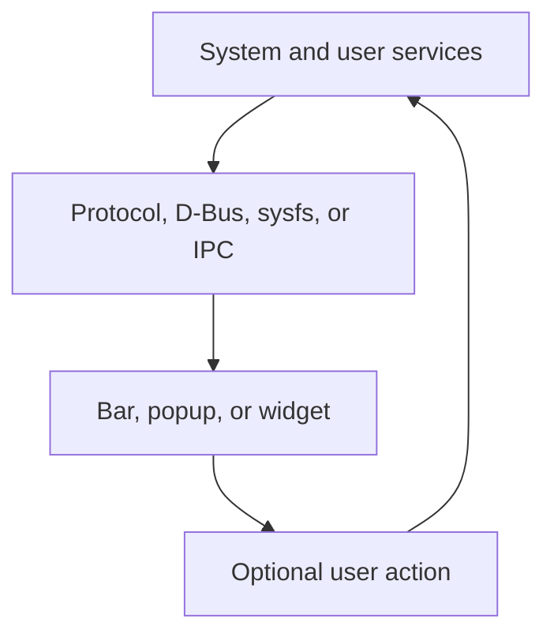
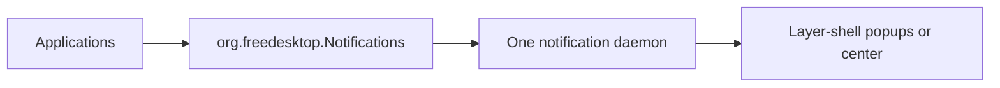
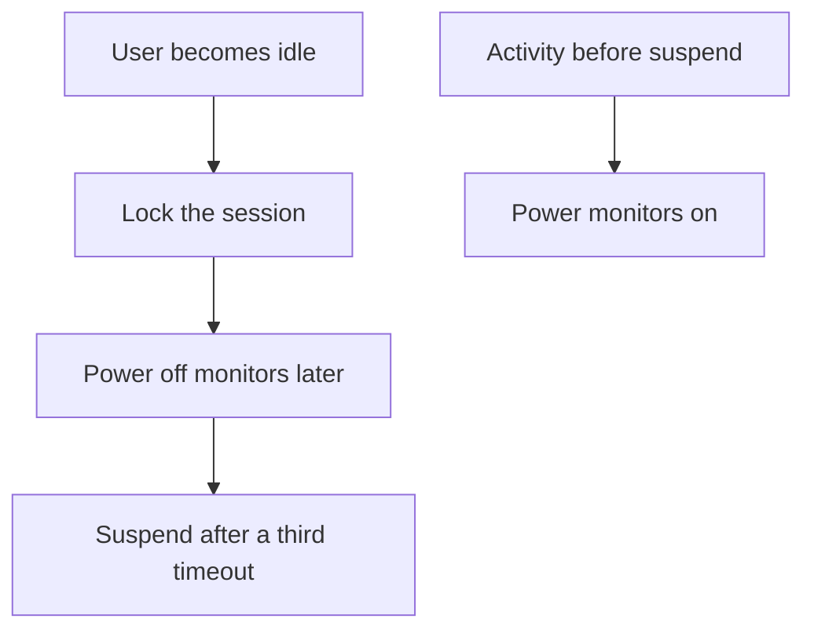

# Waybar, Fuzzel, Mako, Eww, and shell evolution

## Purpose and scope

Niri deliberately leaves most desktop presentation to other programs. This
makes the system flexible, but it also makes superficially similar components
easy to confuse:

- a bar can display network state without managing the network;
- a launcher can display applications without being a desktop shell;
- a widget system can draw notification-like boxes without owning the desktop
  notification service;
- a locker can be visible while an idle daemon remains completely invisible;
- a complete shell can replace several small programs at once without
  replacing Niri itself.

This guide explains the current modular stack and records the safe evolution
path toward a more polished desktop. The accepted future goals are:

- a more attractive lock screen than the current minimal swaylock setup;
- a richer notification experience than transient Mako popups alone;
- automatic suspend after the session has first locked and then powered off
  its displays;
- a later comparison with complete shells such as DankMaterialShell and
  Noctalia.

These are recorded design goals, not immediate configuration changes. The
current daily-driver baseline remains canonical until each replacement passes
the same authentication, suspend, recovery, and duplication tests as the
component it supersedes.

## Current project contract

The active desktop is a modular composition:

| Role | Current owner | Tracked configuration |
| --- | --- | --- |
| Compositor, layout, input, workspaces, screenshots | Niri | `niri/.config/niri/config.kdl` |
| Status bar | Waybar | `waybar/.config/waybar/` |
| Application launcher | Fuzzel | `fuzzel/.config/fuzzel/fuzzel.ini` |
| Notification service and popups | Mako | `mako/.config/mako/config` |
| Background | swaybg | Niri startup command; wallpaper package is prepared |
| Screen lock | swaylock | `swaylock/.config/swaylock/config` |
| Idle and pre-sleep coordination | swayidle | Niri startup command |
| Removable-media automount | udiskie | XDG autostart entry |
| Graphical authorization prompt | MATE polkit agent | Niri startup command |

The current startup entries are intentionally explicit:

```kdl
spawn-at-startup "/usr/lib/mate-polkit/polkit-mate-authentication-agent-1"
spawn-at-startup "waybar"
spawn-at-startup "mako"
spawn-at-startup "swaybg" "-c" "#101014"
spawn-at-startup "swayidle" "-w" "timeout" "300" "swaylock -f" "timeout" "600" "niri msg action power-off-monitors" "resume" "niri msg action power-on-monitors" "before-sleep" "swaylock -f" "lock" "swaylock -f"
```

This baseline has several advantages while learning and diagnosing the system:

- every role has a small, recognizable owner;
- failure of the bar does not terminate the compositor;
- the launcher, notifier, and background can be tested independently;
- replacement boundaries are visible;
- no shell installer silently changes system power, login, portal, or package
  policy.

Its main cost is integration work. Several configuration formats and processes
must be kept visually coherent, and a custom control center does not appear by
itself.

## Presentation is not ownership

The visible widget is often the last link in a longer chain:



For example, Waybar may show volume and invoke `wpctl`, but PipeWire carries the
audio and WirePlumber owns routing policy. A battery module reads power-supply
state, but TLP owns laptop tuning and charge thresholds. A network widget can
invoke NetworkManager, but it is not itself the network manager.

This separation is important during replacement. Installing a prettier volume
widget does not authorize removing PipeWire. Replacing Mako is different: the
new process must actually own the notification D-Bus service, not merely draw a
panel containing copied notification text.

## Waybar: status and lightweight controls

### Its role

Waybar is a layer-shell bar. Niri does not tile it as a normal application
window. Its modules observe state from different sources and optionally expose
small actions.

The current configuration uses:

| Module | Data or action boundary |
| --- | --- |
| `niri/workspaces` | Niri workspace integration |
| `niri/window` | Niri focused-window information |
| `clock` | Local date and time |
| `cpu`, `memory`, `temperature` | Kernel and system hardware state |
| `network` | Interface state; NetworkManager remains the policy owner |
| `pulseaudio` | PulseAudio-compatible API provided by PipeWire |
| `pulseaudio#microphone` | Default-source level and mute state |
| `backlight` | Kernel backlight interface; actions use `brightnessctl` |
| `battery` | Power-supply state, not TLP policy |
| `tray` | StatusNotifier items exported by applications |
| `custom/session` | Calls Niri's normal quit action |

The module name `pulseaudio` does not mean the project runs the PulseAudio
server. PipeWire's PulseAudio compatibility service exposes the expected API,
while WirePlumber remains the policy manager.

The current session item calls:

```bash
niri msg action quit
```

It ends the graphical Niri session after confirmation. It is not a power menu,
does not call `systemctl poweroff`, and does not bypass logind authorization.

### Native modules versus custom scripts

A native module normally understands the service or compositor protocol and
updates when relevant state changes. A `custom/*` module runs an arbitrary
command and parses its output. Custom modules are useful, but they create new
responsibilities:

- command timeouts and error output;
- quoting and shell-injection safety;
- polling frequency and battery cost;
- output format stability;
- absence of secrets in process arguments and tooltips;
- correct behavior when the underlying service is unavailable.

Prefer a maintained native Niri, WirePlumber, network, battery, or systemd
module when it expresses the required state. Add a script only when it solves a
specific gap and has a clear failure display.

### Styling boundary

Waybar uses JSONC for structure and GTK CSS for appearance. The stylesheet can
change spacing, typography, colors, borders, hover state, warnings, and
critical-state presentation. It cannot add a missing backend capability or
turn a bar into a notification daemon.

The current text labels deliberately work without a Nerd Font. A future icon
theme can be added, but the font package and every glyph must be tracked rather
than assuming another machine already contains them.

### Verification

```bash
pgrep -a waybar
niri msg layers
journalctl --user -b --no-pager | grep -i waybar
```

Functional checks are more valuable than process existence:

- workspace dots follow Niri;
- the focused title changes on the correct output;
- volume and microphone actions affect the PipeWire defaults;
- brightness changes the internal panel;
- network, battery, temperature, CPU, and memory update;
- tray items remain optional and do not create a second service owner;
- the exit item opens Niri's confirmation instead of powering off immediately.

## Fuzzel: application launcher and general picker

### Application mode

Fuzzel is a native Wayland application launcher. In its normal mode it searches
XDG desktop entries. Those `.desktop` files provide the visible name, icon,
executable, categories, keywords, and whether a terminal is required.

This explains why these identities are not interchangeable:

| Item | Role |
| --- | --- |
| `/usr/share/applications/firefox.desktop` | Installed launcher entry |
| `firefox.desktop` | Desktop-file ID used by MIME associations |
| `Exec=...` | Command the launcher executes |
| Wayland app ID | Identity of the resulting running surface |

Fuzzel does not scan every executable in `$PATH` and guess how to present it as
an application. A missing program can be installed but absent from the launcher
because its desktop entry is missing, hidden, malformed, or outside the XDG
search path.

Its usage cache can prioritize frequently selected applications. That cache is
generated state and does not belong in `niri-dotfiles`.

### Picker mode

With `--dmenu`, Fuzzel becomes a general-purpose chooser: it reads newline-
separated options from standard input and prints the selection to standard
output. In that mode, Fuzzel supplies presentation and selection only. The
calling script owns the data, validation, and action.

This makes one maintained launcher useful for future narrow menus without
turning it into a full desktop shell.

### Verification

```bash
fuzzel --check-config
gtk-launch firefox.desktop
```

Then open Fuzzel with `Super+D`, search for several installed applications,
launch one graphical and one terminal-marked desktop entry, and confirm the
correct icons and names appear.

If application mode works but a custom picker does not, diagnose the calling
pipeline and its standard input. If neither mode opens, inspect the Fuzzel
configuration and its layer surface rather than changing Niri window rules.

## Desktop notifications are a D-Bus service

### The protocol boundary

Applications send notifications through the FreeDesktop Notifications D-Bus
interface. The notification daemon owns the well-known bus name, accepts
requests, returns notification IDs, renders popups, reports closures, and may
invoke actions.

Only one intended daemon should own that name in a user session:



Two notification daemons do not provide redundancy. One wins D-Bus ownership,
the other fails, waits, or replaces it, making behavior depend on startup
timing.

Inspect the current owner and server identity:

```bash
busctl --user status org.freedesktop.Notifications
busctl --user call \
    org.freedesktop.Notifications \
    /org/freedesktop/Notifications \
    org.freedesktop.Notifications \
    GetServerInformation
```

### Mako's current role

Mako is a lightweight Wayland notification daemon that implements the desktop
notification specification. The project starts it explicitly from Niri so its
ownership is deterministic even if another daemon is installed for testing.

The tracked policy provides:

- top-right placement;
- a maximum of five visible notifications;
- seven-second default timeout;
- persistent high-urgency notifications;
- Noto Sans typography and the current cyan/red palette;
- explicit size, padding, border, and corner radius.

Mako also has more runtime control than its minimal appearance suggests:

```bash
makoctl list
makoctl history
makoctl dismiss
makoctl restore
makoctl mode
makoctl reload
```

It can keep a history buffer, restore the last expired notification, invoke
actions, and apply modes such as do-not-disturb styling. What it does not
provide is a large persistent control-center panel comparable to a complete
desktop shell.

Test the service with controlled messages:

```bash
notify-send "Normal test" "This notification should expire"
notify-send --urgency=critical "Critical test" "This notification requires attention"
makoctl list
makoctl history
```

Calendar reminders also traverse this notification boundary. A working GNOME
Calendar window does not prove the notification daemon received and displayed
its reminder.

### The principal modular alternative: SwayNotificationCenter

SwayNotificationCenter, packaged on Arch as `swaync`, is both a notification
daemon and a GTK control center. It adds:

- a persistent notification panel;
- keyboard navigation and actions;
- do-not-disturb control;
- configurable widgets and CSS;
- a client suitable for integration with Waybar.

It is therefore a genuine Mako replacement, not an add-on to run beside Mako.
The eventual migration must remove `spawn-at-startup "mako"`, deploy the
reviewed SwayNC configuration, start exactly one SwayNC instance, and verify
the D-Bus server identity after a fresh login.

SwayNC is the leading candidate when the project wants a richer modular
notification experience while keeping Waybar and Fuzzel. It is not selected
yet: appearance, memory use, CSS, calendar reminders, notification actions,
multi-output behavior, and rollback must first be compared on the ThinkPads.

## Eww: a widget system, not an automatic desktop service

Eww—ElKowar's Wacky Widgets—is independent of the window manager. It uses its
own `yuck` configuration language for widget structure and GTK CSS/SCSS for
appearance. An Eww daemon maintains state and creates configured windows.

Eww can be used to build:

- a bar;
- a dashboard;
- a calendar or system-monitor popup;
- media, battery, network, or sensor widgets;
- an on-screen display;
- small control panels driven by scripts or service clients.

It does not automatically provide:

- the FreeDesktop notification D-Bus service;
- an XDG application index equivalent to Fuzzel;
- a secure session locker and PAM stack;
- network, audio, Bluetooth, power, or mounting policy;
- Niri workspace semantics unless they are integrated through Niri IPC.

The distinction is data source versus presentation. Eww can draw a
notification history if another component receives, stores, and exposes the
notifications. It does not replace Mako merely because it can draw the final
boxes.

Eww's flexibility trades packaged behavior for project-owned integration:

| Benefit | Cost |
| --- | --- |
| Nearly arbitrary layout | More custom code and state flow |
| Shared visual language across widgets | Yuck plus CSS/SCSS maintenance |
| Independent of Niri | Explicit Niri IPC integration where needed |
| Can replace or augment a bar | Risk of duplicate bar or control ownership |
| Scriptable data sources | Polling, quoting, error, and resource responsibility |

Eww is most appropriate when the user wants to design and maintain the widgets
as a project in its own right. It is not the shortest route to a polished
notification center.

Useful daemon diagnostics during a future experiment are:

```bash
eww state
eww debug
eww logs
eww reload
```

## swaylock is visible; swayidle is not

### The secure lock boundary

A Wayland locker must use the session-lock protocol so the compositor knows the
session is securely covered. A normal fullscreen or layer-shell window is not
an equivalent security boundary: another surface, output change, or compositor
action could expose the desktop.

swaylock currently:

- engages `ext-session-lock-v1` through Niri;
- covers every output;
- authenticates through PAM;
- gives `swayidle -w` a readiness boundary through `swaylock -f`;
- accepts the project's password without storing it in dotfiles.

Its tracked appearance is intentionally modest. It already supports colors,
images, indicators, text, and feedback, so restyling swaylock is the lowest-risk
visual improvement. A replacement is justified when it offers a desired UI,
not merely because its package name is newer.

### Modular locker candidates

| Candidate | Visual/integration model | Project status |
| --- | --- | --- |
| Restyled swaylock | Same trusted lifecycle; richer tracked colors or background | Lowest-risk option |
| hyprlock | GPU-accelerated configurable labels, images, input fields, and effects | Leading visual candidate; recommended as a nicer locker by Niri upstream |
| gtklock | GTK theme, CSS, XML layout, and loadable modules | Extensible GTK alternative in Arch Extra |
| Shell-owned locker | Shared theme and controls with DMS or Noctalia | Evaluate only as part of the complete shell migration |

Both hyprlock and gtklock are available from Arch's official Extra repository.
Availability is not enough to approve either. A replacement must prove:

- real session-lock protocol use on Niri;
- correct PAM service and repeated password failure/success behavior;
- all-output coverage and hotplug behavior;
- keyboard-layout and input reliability;
- a command/readiness contract suitable for pre-sleep locking;
- handling of `loginctl lock-session`;
- no brief exposure before or after suspend;
- successful unlock after repeated resume cycles;
- recovery from TTY when configuration is invalid.

Do not mechanically substitute `hyprlock` or `gtklock` for every
`swaylock -f` string. Their command-line and foreground/readiness behavior must
be inspected first. The `-f` contract belongs to swaylock, not to the abstract
idea of a locker.

### swayidle has no appearance

swayidle listens for idle and logind events, then runs commands. It draws no
surface, prompt, animation, or wallpaper. There is therefore no “prettier
swayidle” in the visual sense.

Replacing the locker changes what the user sees. Replacing swayidle changes
event ownership and sequencing:

- how inactivity is measured;
- whether inhibitors are honored;
- when the locker starts;
- when displays turn off and on;
- how logind lock requests are handled;
- whether the locker is ready before suspend;
- when future automatic suspend occurs.

It is valid to keep swayidle while replacing swaylock. In fact, that is the
safest modular migration because only the visible/authentication component
changes at first.

## Future automatic suspend

The desired idle progression is:



The first two stages currently occur after five and ten idle minutes. The third
stage is deliberately unspecified. It will use a timeout greater than the
display-off timeout and request the high-level operation:

```bash
systemctl suspend
```

It will not log out. Logging out terminates Niri and the user processes that
would otherwise coordinate the remaining idle sequence.

Before implementation, the project must choose:

| Decision | Why it matters |
| --- | --- |
| Third timeout | Balances battery protection against unwanted interruption |
| Battery, AC, or both | A docked build and an unattended battery session have different risks |
| Idle owner | swayidle, DMS, Noctalia, or another coordinator; exactly one |
| Wayland inhibitors | Browsers, games, presentations, and media may ask to remain active |
| systemd inhibitors | Updates, backups, shutdown-sensitive jobs, and applications may block sleep |
| User warning | A notification or visual countdown must occur early enough to be useful |
| External displays | Docked use may look idle while serving another purpose |
| Resume tests | Lock, displays, Wi-Fi, audio, Bluetooth, TLP, and input must recover |

The command can be added to swayidle without replacing it, but only after the
inhibitor and power-source policy is designed. A shell-owned idle service can
also implement all three stages; in that case swayidle must be removed so two
timers cannot race.

Inspect inhibitors before and during long-running tests:

```bash
systemd-inhibit --list
loginctl session-status
```

Automatic suspend is not hibernation and does not require a resume image in
swap. The existing no-hibernation policy remains unchanged.

## Four evolution strategies

### 1. Polish the current modular stack

This keeps Waybar and Fuzzel, replaces Mako with SwayNC if testing succeeds,
and replaces or restyles swaylock while retaining swayidle initially.

Advantages:

- smallest change surface;
- component responsibilities remain easy to learn;
- each migration can have its own Git commit and rollback;
- no shell-specific package repository or broad installer is required;
- existing Niri bindings and Stow packages remain recognizable.

Costs:

- several visual themes must be kept consistent;
- no single settings panel owns the whole desktop;
- richer behavior may require small integrations between Waybar and SwayNC.

This is the preferred next experiment after the current baseline has run long
enough to establish reliable suspend, reminders, and session startup.

### 2. Build selected surfaces with Eww

Eww can replace Waybar or add a dashboard while Fuzzel, Mako/SwayNC, the
locker, and swayidle remain separate.

This is the most educational and customizable option, but it also transfers
more maintenance responsibility into `niri-dotfiles`. It should begin with one
bounded surface, not a simultaneous rewrite of bar, launcher, notifier, and
lock screen.

### 3. Adopt DankMaterialShell

DankMaterialShell is a complete Wayland shell built around Quickshell. It can
provide a bar, launcher, notification center, control center, wallpaper,
lock screen, greeter integration, widgets, and idle behavior.

Under Niri, DMS remains the shell; Niri remains the compositor. A DMS migration
would retire overlapping startup entries rather than run DMS beside Waybar,
Fuzzel, Mako, swaybg, and swaylock indefinitely.

DMS also exposes power controls. The project must preserve TLP plus `tlp-pd` as
the only power-profile provider. If a DMS widget does not recognize `tlp-pd`,
the correct temporary result is an unavailable widget—not installing
`power-profiles-daemon` over the selected TLP policy.

### 4. Adopt Noctalia

Current Noctalia provides a cohesive native Wayland shell layer including
bars, launcher, notification center, wallpaper, lock screen, session actions,
OSDs, widgets, and idle behaviors. It supports Niri integration and can own the
complete lock → monitor-off → suspend sequence.

Noctalia v5 is currently marked beta by its project. That may be appropriate
for a future experiment, but the canonical repositories should not chase its
configuration while the architecture is still changing. Re-evaluate the
stable release, packaging source, migration format, Niri support, resource use,
and rollback at the time of adoption.

As with DMS, a Noctalia migration replaces overlapping pieces as a coherent
transaction. It does not replace NetworkManager, PipeWire, WirePlumber, BlueZ,
UDisks, TLP, firewalld, portals, or Niri merely because it presents controls
for them.

## Comparison matrix

| Approach | Visual coherence | Custom ownership | Moving parts exposed | Migration risk | Current decision |
| --- | --- | --- | --- | --- | --- |
| Current modular stack | Moderate | Low to moderate | High and explicit | Already proven baseline | Keep canonical |
| Polished modular stack | Moderate to high | Moderate | High and explicit | Low when changed one role at a time | Preferred next experiment |
| Eww surfaces | Potentially very high | High | High and project-owned | Medium to high | Educational option, not selected |
| DankMaterialShell | High | Lower per individual component | Consolidated behind one shell | High because several roles move together | Compare later |
| Noctalia | High | Lower per individual component | Consolidated behind one shell | High; current v5 maturity must be rechecked | Compare after stabilization |

“Fewer processes” is not automatically simpler. A complete shell can hide
many services behind one process and one configuration model. Conversely,
several small processes can be simpler to diagnose because their ownership is
explicit. The useful comparison is operational responsibility, not process
count alone.

## Safe replacement procedure

Every replacement should be transactional:

1. confirm the dotfiles and post-install repositories are clean;
2. install the candidate without adding it to permanent startup;
3. validate its configuration and run it manually inside Niri;
4. keep TTY3 available and preserve the current package/config rollback;
5. stop the old owner before testing exclusive D-Bus or lock roles;
6. test function, multi-output behavior, suspend, and failure recovery;
7. create the new Stow package and update the post-install procedure;
8. remove the old startup entry in the same coordinated change;
9. restart the whole graphical session and verify each role starts once;
10. publish only after a second login and suspend/resume cycle succeed.

For a Mako-to-SwayNC migration, steps 5 and 8 are essential because the two
programs compete for `org.freedesktop.Notifications`.

For a locker migration, manual lock/unlock must succeed before editing
swayidle. Then every swayidle path—manual binding, idle timeout, logind lock,
and `before-sleep`—is updated and tested together.

For a complete shell migration, construct an ownership table first:

| Existing role | Old owner | New owner | Old startup removed? | Verified? |
| --- | --- | --- | --- | --- |
| Bar | Waybar | Shell | Required | Pending |
| Launcher | Fuzzel | Shell | Required | Pending |
| Notifications | Mako | Shell | Required | Pending |
| Background | swaybg | Shell | Required if shell owns it | Pending |
| Lock | swaylock | Shell | Required if shell owns it | Pending |
| Idle | swayidle | Shell or retained swayidle | Exactly one final owner | Pending |

Do not remove portals, the polkit authorization mechanism, Secret Service, or
system services merely because a shell draws replacement interfaces for them.

## Verification toolkit

### Current modular session

```bash
niri validate
niri msg layers
pgrep -a waybar
pgrep -a mako
pgrep -a swaybg
pgrep -a swayidle
pgrep -a swaylock
fuzzel --check-config
makoctl list
busctl --user status org.freedesktop.Notifications
systemctl --user --failed --no-pager
```

`pgrep -a swaylock` is normally empty while the session is unlocked. Start a
lock test from a safe state and confirm the process exists only while locked.

### Notification replacement

```bash
busctl --user call \
    org.freedesktop.Notifications \
    /org/freedesktop/Notifications \
    org.freedesktop.Notifications \
    GetServerInformation
notify-send "Replacement test" "Normal urgency"
notify-send --urgency=critical "Replacement test" "Critical urgency"
```

Test actions, history, do-not-disturb, calendar reminders, and behavior after a
fresh login. A pretty popup is not enough if application actions or critical
notifications are lost.

### Locker replacement

Test in this order:

1. direct manual start and successful unlock;
2. incorrect password and then correct password;
3. every connected output;
4. manual Niri lock binding;
5. `loginctl lock-session`;
6. the idle lock timeout;
7. `systemctl suspend` and resume;
8. lid-close suspend and resume;
9. external-output hotplug where available;
10. recovery through TTY3 after an intentionally invalid cosmetic setting.

Never deliberately invalidate the PAM stack for a cosmetic test.

### Idle and future suspend

Use temporarily shortened timeouts only in an uncommitted test configuration.
Keep work saved and observe:

```bash
systemd-inhibit --list
journalctl --user -b -u niri.service --no-pager
journalctl -b --no-pager | grep -Ei 'suspend|resume|sleep|lock'
```

Confirm activity before the third timeout restores monitors and cancels the
pending idle progression. Confirm media or another intentional inhibitor has
the designed effect. Restore the reviewed values before committing.

## Troubleshooting by symptom

| Symptom | Likely cause | First checks |
| --- | --- | --- |
| Notifications appear in the wrong daemon | Competing D-Bus owners | Server information, startup entries, user units |
| No notifications after replacement | New daemon failed to own the bus | User journal, process, D-Bus status |
| Notification center works but popups do not | Popup/DND/CSS/output policy | Daemon client state and config |
| Eww widget is blank | Data command or variable failed | `eww state`, `eww debug`, `eww logs` |
| Fuzzel misses one application | Desktop entry or XDG path problem | Desktop-file ID, `Exec`, `Hidden`, `NoDisplay` |
| Waybar module freezes | Backend or blocking custom script | Module logs and direct backend command |
| New locker exits immediately | Invalid config or missing PAM/protocol | Foreground output and user journal |
| Desktop flashes before suspend | Locker readiness contract is wrong | `before-sleep`, wait/foreground behavior, journal timing |
| Monitors stay off after activity | Missing or failed resume command | Idle daemon log and Niri IPC environment |
| Machine suspends during playback | Inhibitor policy is absent or ignored | Wayland and systemd inhibitor state |
| Machine never auto-suspends | Active inhibitor or competing idle owners | `systemd-inhibit --list`, process/startup audit |
| Two bars, lockers, or idle timers run | Old and new startup coexist | Niri config, XDG autostart, user units |

## Decisions recorded by this guide

- Waybar, Fuzzel, Mako, swaylock, swayidle, and swaybg remain the canonical
  daily-driver baseline today.
- A more polished modular setup is the preferred next experiment before a
  complete shell migration.
- SwayNC is the leading modular candidate to replace Mako and add a persistent
  notification center.
- hyprlock is the leading visual locker candidate; gtklock and a deeper
  swaylock theme remain valid alternatives.
- swayidle is not a visual component and can remain while the locker changes.
- Future idle policy will lock, then power off monitors, then suspend after a
  third timeout; it will not log out.
- The automatic-suspend timeout and AC/battery policy remain undecided.
- Eww can replace or add selected widgets but does not replace Mako, Fuzzel,
  swaylock, or system services without additional integration.
- DMS and Noctalia are complete-shell candidates. If selected, they will
  replace overlapping components as a coordinated migration rather than being
  layered permanently over them.
- TLP plus `tlp-pd` remains the power-profile stack regardless of which shell
  presents its state.
- Plymouth remains a separate boot-presentation project and does not belong to
  the user-session shell migration.

## Sources

- [Niri: Important Software](https://niri-wm.github.io/niri/Important-Software.html)
- [Niri: integrating desktop components](https://niri-wm.github.io/niri/Integrating-niri.html)
- [Desktop Notifications Specification](https://specifications.freedesktop.org/notification/latest/)
- [Waybar upstream](https://github.com/Alexays/Waybar)
- [fuzzel(1)](https://man.archlinux.org/man/fuzzel.1.en)
- [Mako upstream](https://github.com/emersion/mako)
- [mako(5)](https://man.archlinux.org/man/mako.5.en)
- [makoctl(1)](https://man.archlinux.org/man/makoctl.1.en)
- [SwayNotificationCenter upstream](https://github.com/ErikReider/SwayNotificationCenter)
- [swaync(1)](https://man.archlinux.org/man/swaync.1.en)
- [Eww documentation](https://elkowar.github.io/eww/)
- [swaylock upstream](https://github.com/swaywm/swaylock)
- [swayidle upstream](https://github.com/swaywm/swayidle)
- [swayidle(1)](https://man.archlinux.org/man/swayidle.1.en)
- [hyprlock documentation](https://wiki.hypr.land/Hypr-Ecosystem/hyprlock/)
- [gtklock upstream](https://github.com/jovanlanik/gtklock)
- [gtklock(1)](https://man.archlinux.org/man/gtklock.1.en)
- [DankMaterialShell documentation](https://danklinux.com/docs/)
- [Noctalia documentation](https://docs.noctalia.dev/noctalia/)

## Next guide

Continue with greetd, tuigreet, PAM, session creation, screen locking, login
failure recovery, and the future boundary between a terminal greeter and a
graphical greeter.
