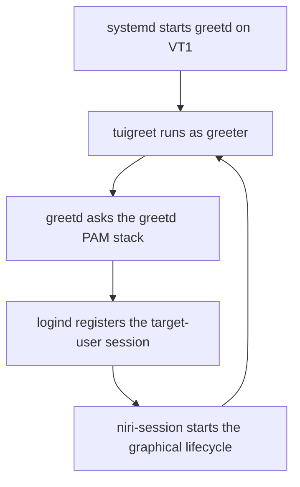

# greetd, tuigreet, PAM, and graphical login recovery

## Purpose and scope

A login screen appears to perform one simple operation: accept a username and
password, then show the desktop. In this workstation, that visible screen is
only one participant in a longer security and session-management path:

- systemd starts `greetd` on a virtual terminal;
- `greetd` runs `tuigreet` as the unprivileged `greeter` account;
- `tuigreet` collects input and speaks greetd's IPC protocol;
- `greetd` invokes the PAM policy named `greetd`;
- PAM authenticates the target account and opens its login session;
- `pam_systemd` and systemd-logind register the session, seat, and virtual
  terminal;
- greetd starts the selected command as the authenticated user;
- `niri-session` integrates Niri with the systemd user manager and D-Bus;
- ending Niri returns control to greetd, which starts the greeter again.

This guide explains that path, the current project configuration, the
difference between login and unlock, and how to recover without turning a
graphical-login failure into an unbootable machine. It complements rather than
repeats these guides:

- [Users, permissions, sudo, and PAM](../foundations/02-users-permissions-sudo-and-pam.md);
- [Systemd units, activation, and the journal](../foundations/03-systemd-units-activation-and-journal.md);
- [Bluetooth, removable media, and Secret Service](../workstation/12-bluetooth-removable-media-and-secret-service.md);
- [Wayland, Niri, and the graphical session](14-wayland-niri-and-session-architecture.md);
- [Waybar, Fuzzel, Mako, Eww, and shell evolution](15-session-components-and-shell-evolution.md).

The guide does not replace the operational installation procedure. The
post-install repository remains the source for the exact order in which the
packages, backups, PAM hooks, and service enablement are applied.

## The short mental model

The five most important boundaries are:

| Component | Owns | Does not own |
| --- | --- | --- |
| `greetd.service` | Login-session orchestration and the greeter IPC endpoint | The visible interface or Niri configuration |
| `tuigreet` | Terminal interface, username input, session selection, and password conversation | Password verification or the final user identity |
| PAM service `greetd` | Authentication, account checks, credentials, and session hooks | The desktop layout or Wayland protocol |
| systemd-logind | Login sessions, users, seats, VTs, device access, and idle/lock coordination | Password policy or graphical presentation |
| `niri-session` | Supported Niri session startup and systemd user-manager integration | Authenticating a new login |

This yields one durable rule:

> A greeter presents a login; PAM authenticates it; logind records it; the
> session command builds the desktop.

Replacing one layer does not automatically replace the others. A future
graphical greeter can retain greetd, PAM, logind, and `niri-session`. Changing
the lock screen does not change how a new login is created.

## Current project contract

The canonical daily-driver path is:

| Decision | Current value |
| --- | --- |
| Login manager | greetd |
| Greeter | tuigreet on the Linux console |
| Greeter VT | VT1 |
| Greeter system account | `greeter` |
| Target session | `niri-session` |
| Automatic login | Disabled |
| Login-keyring integration | Optional GNOME Keyring hooks in the greetd PAM stack |
| Screen locker | swaylock, using its separate PAM service |
| Recovery console | TTY3, reached with `Ctrl+Alt+F3` |
| Seat manager | systemd-logind; no separately enabled `seatd.service` |

The active `/etc/greetd/config.toml` created by the post-install procedure is:

```toml
[terminal]
vt = 1

[default_session]
command = "tuigreet --time --remember --remember-session --greeting 'Arch Linux' --cmd niri-session"
user = "greeter"
```

The `user = "greeter"` line identifies the account that draws the login
interface. It does not mean the desktop runs as `greeter`. After successful
authentication, greetd starts the selected session under the target account.

The absence of an `[initial_session]` section is equally important. In greetd,
that optional section is the autologin path. This project deliberately does
not use it.

## End-to-end login lifecycle

The normal sequence is:



The return arrow is logout: when the user session ends, greetd starts its
default greeter again. It is not a new boot and does not imply a crash.

### 1. systemd reaches the login layer

`graphical.target` represents a boot that should provide a graphical login.
It includes the ordinary multi-user system and pulls in the chosen display
manager. `display-manager.service` is a conventional alias that points at the
installed login manager, here greetd.

Inspect the relationship rather than assuming it:

```bash
systemctl get-default
systemctl is-enabled greetd.service
systemctl status greetd.service --no-pager
systemctl status display-manager.service --no-pager
readlink -f /etc/systemd/system/display-manager.service
systemctl cat greetd.service
```

`enabled` means the service is wired into future boots. `active` means it is
running now. These are independent states, as explained in the systemd guide.

Do not create a second display-manager alias or enable GDM, SDDM, LightDM, and
greetd together. There must be one intentional owner of the primary graphical
login.

### 2. greetd owns VT1

The `[terminal]` section selects VT1. The packaged systemd unit handles the
conflict with the corresponding getty so two programs do not compete for the
same console. Other gettys remain available, including the recovery TTY3.

Useful observations are:

```bash
fgconsole
systemctl status getty@tty1.service --no-pager
systemctl status getty@tty3.service --no-pager
loginctl seat-status seat0
```

The Linux virtual terminal is not a Wayland output. tuigreet draws on the
kernel console before Niri exists. Its font, resolution, and color limitations
therefore differ from applications inside Niri.

### 3. greetd starts the default greeter

When no authenticated user session is running, greetd launches the configured
default session as `greeter`. `tuigreet` receives the path to greetd's IPC
socket through `GREETD_SOCK` and uses that protocol to create and authenticate
a candidate session.

The daemon and the interface remain separate:

- greetd is the privileged orchestration boundary;
- tuigreet is replaceable presentation and interaction;
- PAM modules perform the configured authentication work;
- the `greeter` account is not the account being logged in.

This design is why a text UI, GTK greeter, or other client can sit in front of
the same daemon.

### 4. PAM authenticates the target account

greetd identifies itself to Linux-PAM with the service name `greetd`. PAM then
loads the policy for that name, normally `/etc/pam.d/greetd`, and processes its
`auth`, `account`, credential, and `session` work.

tuigreet can display PAM questions and messages, but it does not compare the
password with `/etc/shadow`. It also does not need the user's password in its
configuration, cache, or command line.

After successful authentication and account checks, greetd opens the PAM
session and starts the selected command as the target user. When the command
ends, greetd closes the PAM session.

### 5. logind registers the session

The Arch PAM stack reaches `pam_systemd.so`. Together with
`systemd-logind.service`, it associates the login with a user, seat, VT, and
session scope. It also participates in preparing the per-user runtime context
used by applications and the user service manager.

Inspect the live result inside Niri:

```bash
loginctl list-sessions
loginctl session-status
loginctl show-session auto -p Id -p Name -p User -p Seat -p VTNr -p Type -p Class -p Active -p State -p Remote
loginctl seat-status seat0
printf 'XDG_RUNTIME_DIR=%s\n' "$XDG_RUNTIME_DIR"
```

Expected high-level properties include:

- the target user's name and UID, not `greeter`;
- `seat0` and the intended VT;
- a local, active graphical Wayland session;
- a runtime directory below `/run/user/` for the target UID.

Do not add the user permanently to `audio`, `video`, or `input` merely because
a graphical client cannot reach a device. On a normal local workstation,
logind and udev grant the active session the relevant device access. Static
group membership broadens access and can conceal a broken seat or session.

Do not enable `seatd.service` alongside the logind path as a speculative fix.
The Niri package may contain seat-related libraries, but this project's
session and device ownership are deliberately based on systemd-logind.

### 6. greetd starts the selected command

The configured `--cmd niri-session` gives tuigreet its default session command.
tuigreet sends the choice to greetd; after authentication, greetd starts that
command as the target user.

This distinction is subtle but useful: tuigreet does not remain as the parent
desktop shell running with the user's identity. It requests a session through
greetd, and greetd performs the authenticated transition.

### 7. `niri-session` constructs the graphical lifecycle

`niri-session` is Niri's supported entry point for a complete session. With
systemd available, it:

- prevents a second Niri session from being started accidentally;
- resets failed user-unit state from a previous session;
- imports the login environment into the user manager;
- updates the D-Bus activation environment;
- starts and waits for `niri.service`;
- coordinates the graphical-session target and shutdown target;
- removes session-specific variables when Niri ends.

The lower-level details can change with Niri, which is precisely why the
project calls the packaged helper instead of reproducing its implementation in
a custom script.

Do not add any of the following to the greetd command:

```text
dbus-run-session
DISPLAY=:0
WAYLAND_DISPLAY=wayland-1
xwayland-satellite
```

Niri and `niri-session` own those runtime relationships. Hard-coded socket
names can point clients at a stale or nonexistent endpoint, and a second D-Bus
session can split desktop services into incompatible environments.

Inside a successful session, inspect both the compositor and its user-manager
context:

```bash
systemctl --user status niri.service --no-pager
systemctl --user is-active graphical-session.target
systemctl --user --failed --no-pager
niri msg version
niri msg outputs
systemctl --user show-environment | grep -E '^(XDG_SESSION_TYPE|XDG_CURRENT_DESKTOP|WAYLAND_DISPLAY|DISPLAY|NIRI_SOCKET)='
```

## What tuigreet remembers

The current command uses two persistence options:

| Option | Stored effect | Not stored |
| --- | --- | --- |
| `--remember` | Username from the last successful session | Password |
| `--remember-session` | Last selected session command | Password or PAM token |

The remembered session can override the `--cmd` default on later runs. If a
different session was selected manually, seeing something other than Niri on
the next login may be expected state rather than a broken default.

Current tuigreet uses `/var/cache/tuigreet` for remembered state. The package
should create it for the greeter account. Inspect it without publishing its
contents:

```bash
sudo stat -c '%U:%G %a %n' /var/cache/tuigreet
sudo find /var/cache/tuigreet -maxdepth 1 -type f -printf '%u:%g %m %f\n'
```

The cache is small convenience state, not a credential store. Nevertheless,
the remembered username is local privacy-relevant metadata. A shared machine
may reasonably omit `--remember`.

If the session choice becomes confusing, first use tuigreet's session selector
and choose Niri deliberately. Only clear the cache while no greeter instance is
writing it, and only after confirming the exact package behavior. Do not remove
the whole `/var/cache` tree.

The project keeps session selection available because it is useful for
recovery and future comparison. If the workstation later requires one fully
deterministic session, removing `--remember-session` is a valid reviewed
policy change.

## PAM is selected per application

Several prompts on this machine accept the same account password, but they use
different PAM service names and protect different state:

| Event | Typical PAM policy | Result |
| --- | --- | --- |
| TTY login | `/etc/pam.d/login` | Creates a new console login session |
| greetd login | `/etc/pam.d/greetd` | Creates a new greetd-managed session |
| swaylock unlock | `/etc/pam.d/swaylock` | Reveals an existing graphical session |
| `sudo` command | `/etc/pam.d/sudo` | Authorizes a command under another identity, subject to sudoers |
| Password change | `/etc/pam.d/passwd` | Changes the account token and runs password hooks |

An edit to `login` does not automatically edit `greetd`. An edit to `greetd`
does not automatically alter swaylock. Each application asks PAM for its named
policy.

### The four management groups

| PAM group | Question in this login path |
| --- | --- |
| `auth` | Can the claimant prove the target identity? |
| `account` | May that authenticated account log in now? |
| `password` | How is an authentication token changed? |
| `session` | What must be opened or closed around the login? |

The greetd service normally performs authentication, account, credential, and
session operations. Password changes remain the responsibility of a program
such as `passwd`, not the greeter.

### Controls are policy, not decoration

Simple PAM controls have different consequences:

- `required` records a decisive failure but may continue processing later
  modules;
- `requisite` normally returns immediately on failure;
- `sufficient` may complete a group early when earlier required work has not
  failed;
- `optional` normally does not decide the result when another module provides
  the decisive outcome.

The complete ordered stack matters. `include`, `substack`, and bracketed
controls can alter flow in ways that cannot be inferred from one isolated
line.

Inspect the active policies and their provenance:

```bash
sudo sed -n '1,200p' /etc/pam.d/greetd
sudo sed -n '1,200p' /etc/pam.d/login
sudo sed -n '1,200p' /etc/pam.d/swaylock
sudo sed -n '1,200p' /etc/pam.d/passwd
pacman -Qo /etc/pam.d/greetd /etc/pam.d/login /etc/pam.d/swaylock /etc/pam.d/passwd
```

Linux-PAM can also provide vendor policies below `/usr/lib/pam.d`. A
machine-specific file with the same service name below `/etc/pam.d` takes
precedence. Always inspect the paths that actually exist on the installed
machine and review `.pacnew` files after package updates.

Never replace `/etc/pam.d/greetd` with a complete copied `login` stack merely
because both accept passwords. Preserve the packaged greetd policy and make
the smallest reviewed additions required by this workstation.

## GNOME Keyring integration

The project adds these lines to the appropriate sections of
`/etc/pam.d/greetd` while preserving every packaged line:

```pam
auth       optional     pam_gnome_keyring.so
session    optional     pam_gnome_keyring.so auto_start
```

The authentication hook receives the password already collected by an earlier
PAM module. It does not prompt independently. The session hook can start the
daemon and use the saved authentication token to unlock the login collection.

The hooks are `optional` because GNOME Keyring is not the authority that
accepts or rejects the operating-system login. A missing or damaged keyring
must not convert an otherwise valid local account into an unusable account.
This does not make password authentication optional: the base Arch stack still
contains the decisive authentication modules.

The password-change integration remains in `/etc/pam.d/passwd`:

```pam
password   optional     pam_gnome_keyring.so
```

It lets an ordinary password change keep the login keyring password aligned.
If an administrator resets the account password without supplying the old
one, the keyring cannot necessarily be updated because its old encryption
password is unknown.

### Why autologin conflicts with automatic keyring unlock

Automatic keyring unlock depends on the password token entered during PAM
authentication. An autologin path has no user-entered password to pass to the
keyring module. It may therefore produce a desktop that opens without a login
prompt but later asks separately for the keyring password.

This is one more reason the project keeps password-based tuigreet login. It
aligns the OS login and login-keyring unlock without placing a password in a
file, command, environment variable, or dotfile.

Verify the hooks and the resulting service only after a fresh tuigreet login:

```bash
sudo grep -n 'pam_gnome_keyring' /etc/pam.d/greetd /etc/pam.d/passwd
test -e /usr/lib/security/pam_gnome_keyring.so
systemctl --user status gnome-keyring-daemon.service --no-pager
busctl --user list | grep 'org.freedesktop.secrets'
journalctl -b --no-pager | grep -Ei 'gkr-pam|gnome-keyring|greetd'
```

A running Secret Service does not prove the login collection unlocked. The
practical test is to log in through tuigreet and use an application that stores
a secret without receiving an unexpected second login-keyring prompt.

## Login, unlock, authorization, and disk unlock

The machine can legitimately ask for credentials at several layers:

| Prompt | Protects or creates | What success does not prove |
| --- | --- | --- |
| LUKS prompt in early boot | Access to the encrypted root storage | That any Linux user may log in |
| tuigreet login | A new target-user login and Niri session | That a later screen lock works |
| swaylock prompt | Access to the already running graphical session | That greetd can create a new session |
| `sudo` prompt | A sudoers-authorized command under another identity | That a graphical service action is allowed |
| polkit-agent prompt | A privileged action requested through a service | That the user has a root shell |
| Secret Service prompt | A keyring or stored secret | That the OS account password is wrong |

Reusing the same password does not merge these trust boundaries. In
particular:

- swaylock does not end and recreate Niri;
- tuigreet does not unlock an already running session;
- polkit does not replace greetd or sudo;
- the LUKS credential is not passed from early boot into greetd;
- a future TPM2 unlock would not imply autologin.

Diagnose the component named by the event rather than editing every file that
contains the word `pam`.

## Logout, lock, suspend, reboot, and poweroff

These actions have different scopes:

| Action | Expected effect |
| --- | --- |
| `swaylock -f` | Protect the current Niri session; applications keep running |
| `systemctl suspend` | Suspend the machine; the pre-sleep path must lock first |
| `niri msg action quit` | End the graphical session and return to tuigreet |
| `loginctl terminate-session ID` | Terminate a selected login session and its session processes |
| `systemctl reboot` | Stop the whole operating system and boot again |
| `systemctl poweroff` | Stop and power off the machine |

The Waybar session control currently invokes Niri's quit action. That is a
graphical logout, not a reboot and not the future automatic-idle action.

When Niri exits normally, `niri-session` coordinates its user graphical target
shutdown and returns. greetd notices that the authenticated session command
ended and launches tuigreet again. Seeing the greeter after logout is the
expected lifecycle.

The planned automatic idle sequence is lock, then monitors off, then suspend.
It will not call Niri's quit action. Logout would discard application state and
is not an acceptable substitute for power management.

## A future graphical greeter

tuigreet is intentionally conservative: it depends on the Linux console, is
easy to inspect, and does not require a Wayland compositor merely to display a
login. Its visual limits are also real.

A future graphical greeter can improve typography, background, layout,
accessibility, and integration with a chosen shell. That is a presentation
migration, not permission to blur the login architecture.

Any candidate must be evaluated against this contract:

| Requirement | Reason |
| --- | --- |
| Retain explicit password login | Avoid autologin and preserve keyring unlock |
| Continue through a reviewed PAM service | Keep authentication policy inspectable |
| Start `niri-session` | Preserve the supported Niri lifecycle |
| Run its UI unprivileged | Limit the presentation process |
| Keep TTY3 functional | Preserve recovery when graphics or themes fail |
| Avoid a second display manager | Prevent VT and login ownership conflicts |
| Avoid passwordless sudo rules | Presentation must not weaken system policy |
| Test logout back to the greeter | Prove the complete repeated-session lifecycle |

A graphical greeter has a wider failure surface than tuigreet: GPU setup,
Wayland protocols, fonts, themes, shell libraries, and configuration can all
fail before login. This is not a reason to reject it; it is a reason to retain
the independent TTY recovery path and migrate one layer at a time.

Complete shells such as DMS or Noctalia may provide their own visual greeter
story. If one is selected later, the project will first decide which process
owns the greeter presentation and which current components it replaces. It
will not stack multiple greeters or display managers permanently.

Plymouth is unrelated to this boundary. It can improve the earlier boot and
encrypted-root presentation, but it ends before the user login manager takes
over. A beautiful Plymouth prompt does not replace greetd; a beautiful greetd
frontend does not replace the LUKS prompt.

## Inspect the installed design

### Packages, binaries, and accounts

```bash
pacman -Q greetd greetd-tuigreet niri pam systemd gnome-keyring
command -v greetd tuigreet niri-session niri
getent passwd greeter
getent passwd "$USER"
```

The `greeter` account should be a system-style account used for presentation,
not the owner of the user's home or dotfiles. Do not change its shell, home,
groups, or password without a documented need.

### Configuration and ownership

```bash
sudo cat /etc/greetd/config.toml
sudo stat -c '%U:%G %a %n' /etc/greetd/config.toml /etc/pam.d/greetd
sudo grep -nE '^\[|^[[:space:]]*(vt|command|user)[[:space:]]*=' /etc/greetd/config.toml
sudo grep -n 'pam_gnome_keyring' /etc/pam.d/greetd /etc/pam.d/passwd
```

The files must be owned by root and not writable by ordinary users. The TOML
file contains no password. The greetd PAM file should contain the packaged
policy plus only the reviewed local hooks.

Before changing package-owned configuration, check for pending merge work:

```bash
sudo pacdiff --output
sudo find /etc/greetd /etc/pam.d -maxdepth 1 -type f \( -name '*.pacnew' -o -name '*.pacsave' \) -print
```

Reviewing a `.pacnew` is part of package maintenance. Blindly replacing the
current PAM policy can discard local keyring hooks; blindly keeping an ancient
policy can miss required package changes.

### System and user service state

```bash
systemctl is-enabled greetd.service
systemctl is-active greetd.service
systemctl status greetd.service --no-pager
systemctl --failed --no-pager
systemctl --user status niri.service --no-pager
systemctl --user is-active graphical-session.target
systemctl --user --failed --no-pager
```

The system service exists before authentication. The Niri user service belongs
to the authenticated user's manager. Running `systemctl status niri.service`
without `--user` asks the wrong manager.

### Session and process state

```bash
loginctl list-sessions
loginctl session-status
loginctl seat-status seat0
pgrep -a greetd
pgrep -a tuigreet
pgrep -a niri
```

Inside Niri, one active user session and one Niri instance are expected. While
that user session runs, tuigreet normally is not the active interface. After
logout, tuigreet should reappear.

Do not treat every additional login session as a leak. An intentionally open
TTY3 recovery shell is a second session. Use `loginctl session-status ID` to
identify each one before terminating anything.

## Safe testing procedure

Login infrastructure should be tested while a known-good authenticated path
remains open.

### Before changing anything

1. Switch to TTY3 with `Ctrl+Alt+F3`.
2. Log in and leave that shell open.
3. Return to Niri and save all work.
4. Back up the exact files that will change with metadata preserved.
5. Record the current service, package, and session state.

Example backups use explicit filenames:

```bash
sudo cp --archive /etc/greetd/config.toml /etc/greetd/config.toml.before-login-change
sudo cp --archive /etc/pam.d/greetd /etc/pam.d/greetd.before-login-change
```

Do not overwrite an older known-good backup without first deciding which
version it represents.

### Validate in increasing scope

1. Review the TOML and PAM diff before restarting anything.
2. Confirm a second TTY login still succeeds.
3. Validate the Niri configuration.
4. End the current graphical session deliberately.
5. Start or restart greetd from the recovery TTY.
6. Enter one deliberately wrong password and confirm rejection.
7. Enter the correct password and confirm Niri starts.
8. Confirm keyring unlock, session properties, and user services.
9. Lock and unlock the existing session separately.
10. Exit Niri and verify that tuigreet returns.
11. Log in a second time to test the repeated lifecycle.
12. Reboot only after every live test passes.

Useful pre-reboot checks are:

```bash
niri validate
sudo systemctl status greetd.service --no-pager
journalctl -b -u greetd.service --no-pager
journalctl --user -b -u niri.service --no-pager
loginctl list-sessions
systemctl --user --failed --no-pager
```

PAM and journal output can contain usernames, paths, session identifiers, and
other local details. Review and redact it before publishing a diagnostic log.

## Diagnose by where the chain stops

| Symptom | Likely boundary | First evidence |
| --- | --- | --- |
| Boot reaches a blank VT and no prompt | greetd unit, VT conflict, or greeter command | `systemctl status greetd`; greetd journal; `systemctl cat greetd` |
| tuigreet appears but rejects every correct password | greetd PAM stack, account state, or keyboard layout | `/etc/pam.d/greetd`; PAM journal; test TTY login separately |
| Wrong password is accepted | Critical PAM policy error | Stop testing, retain authenticated recovery shell, restore policy |
| Authentication succeeds then tuigreet returns immediately | Selected session or `niri-session`/Niri failure | greetd journal and user `niri.service` journal |
| Another desktop starts instead of Niri | Remembered or manually selected session | tuigreet session selector and `/var/cache/tuigreet` metadata |
| Niri starts but portals or desktop services fail | Session environment or user-manager lifecycle | `niri-session` entry point; user environment; failed user units |
| Niri reports that a session is already running | Stale or genuinely active user session | `loginctl list-sessions`; `systemctl --user status niri` |
| Keyring asks for its password after login | greetd-specific GNOME Keyring PAM hooks or password mismatch | greetd PAM lines; keyring journal; recent password reset |
| swaylock rejects the password while tuigreet works | swaylock PAM policy, not greetd | `/etc/pam.d/swaylock`; locker journal |
| No audio, graphics, or input access after login | logind seat/session/device assignment | `loginctl session-status`; `seat-status`; device ACLs |
| Logout leaves a black screen | greetd did not relaunch its default session or VT is wrong | greetd status/journal; active VT |
| TTY3 is unavailable | getty state, kernel console, or broader input problem | `getty@tty3.service`; earlier boot logs |
| Duplicate greeter or VT contention | More than one display manager enabled | display-manager alias and enabled manager units |

### The logs belong to different managers

Use the system journal for greetd:

```bash
journalctl -b -u greetd.service --no-pager
journalctl -b -u systemd-logind.service --no-pager
journalctl -b --no-pager | grep -Ei 'greetd|tuigreet|pam|session|logind'
```

Use the authenticated user's journal for Niri:

```bash
journalctl --user -b -u niri.service --no-pager
journalctl --user -b --no-pager | grep -Ei 'niri|graphical-session|dbus|portal'
```

If authentication succeeds and the session command immediately fails, the
greetd journal may show the boundary while the detailed compositor error lives
in the user journal. Reading only one side produces an incomplete diagnosis.

### Confirm the keyboard boundary

The console keymap used by tuigreet and the Niri keyboard layout are separate
configuration layers. If punctuation or password characters behave
unexpectedly only at the greeter, inspect the console keymap:

```bash
localectl status
sudo cat /etc/vconsole.conf
```

Do not rewrite the Niri input configuration to fix a console-only symptom.
Conversely, a correct tuigreet keymap does not prove Niri's layout is correct.

## Recovery

### If TTY3 still works

Save work before stopping greetd. From the already authenticated recovery
shell:

```bash
sudo systemctl disable --now greetd.service
systemctl is-enabled greetd.service
systemctl is-active greetd.service
```

Stopping greetd can terminate the graphical session it owns. It is not a
harmless inspection command and should not be run from an unsaved desktop.

Restore only the file known to be faulty and only from a backup that exists:

```bash
sudo test -e /etc/greetd/config.toml.before-niri
sudo test -e /etc/pam.d/greetd.before-gnome-keyring
```

The original post-install rollback, when both backups are present, is:

```bash
sudo cp --archive /etc/greetd/config.toml.before-niri /etc/greetd/config.toml
sudo cp --archive /etc/pam.d/greetd.before-gnome-keyring /etc/pam.d/greetd
```

Test the desktop manually before re-enabling the login manager:

```bash
niri validate
niri-session -l
```

After exiting the successful manual session:

```bash
sudo systemctl enable --now greetd.service
```

Do not delete the dotfiles clone, loosen permissions, enable autologin, add
passwordless sudo, or hard-code runtime environment variables as a shortcut.

### If new logins fail but an old shell is open

Do not close the old shell and do not reboot. That existing authenticated
session is the recovery asset. Restore the last known-good PAM file, inspect
the diff, then test a new TTY login. PAM changes should always be approached
with this scenario in mind.

### If no local login works

Use the Arch installation medium and the documented storage/boot recovery
procedure:

1. boot the trusted installation environment;
2. unlock LUKS and activate LVM;
3. mount the installed root and EFI System Partition at the documented paths;
4. enter the installed system with `arch-chroot`;
5. restore the known-good greetd or PAM file;
6. disable greetd if the graphical path must remain out of the next boot;
7. exit, unmount safely, and boot normally;
8. test TTY login before rebuilding the graphical path.

Do not improvise device names. Use the identifiers and mount topology recorded
for the actual ThinkPad. PAM files do not require UKI regeneration; a boot
configuration change might.

## Security boundaries and common anti-patterns

### Do not store credentials in the greeter configuration

`/etc/greetd/config.toml` needs a command and presentation policy, not a user
password. Never place a password in:

- TOML arguments;
- environment variables;
- wrapper scripts;
- dotfiles;
- tuigreet themes;
- passwordless sudo rules for an interactive prompt.

### Do not run the presentation as root

The `greeter` account exists to keep the user-interface process unprivileged.
Changing `user = "greeter"` to `root` would enlarge the impact of a greeter
bug without improving the authentication design.

### Do not confuse remembered state with authentication

A prefilled username is not autologin. A remembered session is not an
authentication token. Conversely, removing the remembered username does not
harden the PAM stack; it changes only presentation and local privacy.

### Do not weaken PAM to repair a frontend

If tuigreet cannot render, launch, or communicate, making authentication
modules `optional` does not repair it. Diagnose the service, VT, IPC, and
command boundary. PAM changes are justified only by a PAM requirement.

### Do not terminate unidentified sessions

Before using `loginctl terminate-session`, inspect the ID. It may be the Niri
session, the recovery TTY, or another intentional login. Terminating the wrong
one can remove the only working recovery path.

### Treat hardening scores as evidence, not a verdict

`systemd-analyze security greetd.service` can show the service unit's sandbox
exposure, but a login manager necessarily needs capabilities and interfaces
that ordinary daemons do not. A score is not permission to add arbitrary unit
overrides. Any hardening change must preserve VT control, PAM, user switching,
session creation, and device access.

## Alternatives and trade-offs

| Approach | Strength | Cost or risk | Project status |
| --- | --- | --- | --- |
| Manual TTY login plus `niri-session -l` | Smallest and best recovery baseline | No dedicated login UI; manual command | Retained as recovery path |
| greetd plus tuigreet | Small, inspectable, independent of graphical shell | Console aesthetics and separate configuration | Current canonical path |
| greetd plus graphical frontend | Better visual integration while retaining greetd | Wider GPU/theme/protocol failure surface | Future candidate |
| GDM, SDDM, or another full display manager | Mature integrated features | Larger dependency and policy surface; possible desktop coupling | Not selected |
| greetd initial session/autologin | Fast unattended entry | Weakens physical-login boundary and cannot supply keyring password | Rejected |

The preferred future improvement is not predetermined. It will be chosen after
the shell, theme, locker, notification, and output work makes its dependencies
clear. tuigreet remains the fallback until the replacement survives bad
password, correct password, repeated logout/login, suspend/resume, package
upgrade, and TTY recovery tests.

## Decisions recorded by this guide

- greetd remains the login manager and tuigreet remains the current greeter.
- VT1 belongs to the greeter path; TTY3 remains the independent recovery path.
- `greeter` is the unprivileged presentation account, not the desktop user.
- The project has no `[initial_session]` and therefore no greetd autologin.
- `--remember` and `--remember-session` retain convenience state, never a
  password; remembered session selection can override the default command.
- `niri-session` remains the only canonical production entry point for Niri.
- greetd, TTY login, swaylock, sudo, and password changes use distinct PAM
  service policies.
- GNOME Keyring hooks extend the greetd stack without replacing its decisive
  authentication modules.
- systemd-logind remains the seat and session owner; `seatd.service` is not
  enabled as a parallel manager.
- Logging out of Niri returns to tuigreet; locking and suspending do not log
  out.
- A future graphical greeter may replace tuigreet's presentation only after
  preserving PAM, `niri-session`, password login, repeated-session behavior,
  and TTY recovery.
- Plymouth and TPM2 unlock remain separate early-boot projects.

## Completion checklist

- [ ] `greetd.service` and `display-manager.service` relationships are understood.
- [ ] VT1 and the recovery TTY3 have distinct, working owners.
- [ ] The `greeter` account is not confused with the authenticated target user.
- [ ] `/etc/greetd/config.toml` contains no `[initial_session]` or password.
- [ ] `--remember` and `--remember-session` are understood as non-credential state.
- [ ] The active greetd PAM policy and its package provenance have been inspected.
- [ ] GNOME Keyring hooks exist in the intended PAM groups without replacing the base stack.
- [ ] A wrong tuigreet password fails and the correct password starts Niri.
- [ ] `loginctl` reports the expected user, seat, VT, type, and active state.
- [ ] Niri starts through `niri-session`, with no manual D-Bus or display variables.
- [ ] The user manager has no failed units after login.
- [ ] A fresh login unlocks the login keyring without an unexpected extra prompt.
- [ ] swaylock is tested separately from greetd login.
- [ ] Exiting Niri returns to tuigreet and a second login succeeds.
- [ ] Disabling greetd and starting Niri manually from TTY remains understood.
- [ ] Installation-media recovery is available if no PAM login succeeds.

## Sources

- [greetd(1)](https://man.archlinux.org/man/greetd.1.en)
- [greetd(5)](https://man.archlinux.org/man/greetd.5.en)
- [greetd upstream](https://git.sr.ht/~kennylevinsen/greetd)
- [greetd package](https://archlinux.org/packages/extra/x86_64/greetd/)
- [tuigreet(1)](https://man.archlinux.org/man/tuigreet.1.en)
- [tuigreet upstream](https://github.com/tuigreet/tuigreet)
- [greetd-tuigreet package](https://archlinux.org/packages/extra/x86_64/greetd-tuigreet/)
- [pam(8)](https://man.archlinux.org/man/pam.8.en)
- [pam.conf(5)](https://man.archlinux.org/man/pam.conf.5.en)
- [pam_systemd(8)](https://man.archlinux.org/man/pam_systemd.8.en)
- [systemd-logind.service(8)](https://man.archlinux.org/man/systemd-logind.service.8.en)
- [loginctl(1)](https://man.archlinux.org/man/loginctl.1.en)
- [systemd.special(7)](https://man.archlinux.org/man/systemd.special.7.en)
- [GNOME Keyring PAM integration](https://wiki.gnome.org/Projects/GnomeKeyring/Pam)
- [Niri `niri-session` implementation](https://github.com/YaLTeR/niri/blob/main/resources/niri-session)
- [Niri example systemd setup](https://niri-wm.github.io/niri/Example-systemd-Setup.html)

## Next guide

Continue with Niri outputs, physical versus logical dimensions, fractional
scaling, refresh modes, lid and external-monitor behavior, and per-host
configuration for the two ThinkPads without forking the portable dotfiles.
