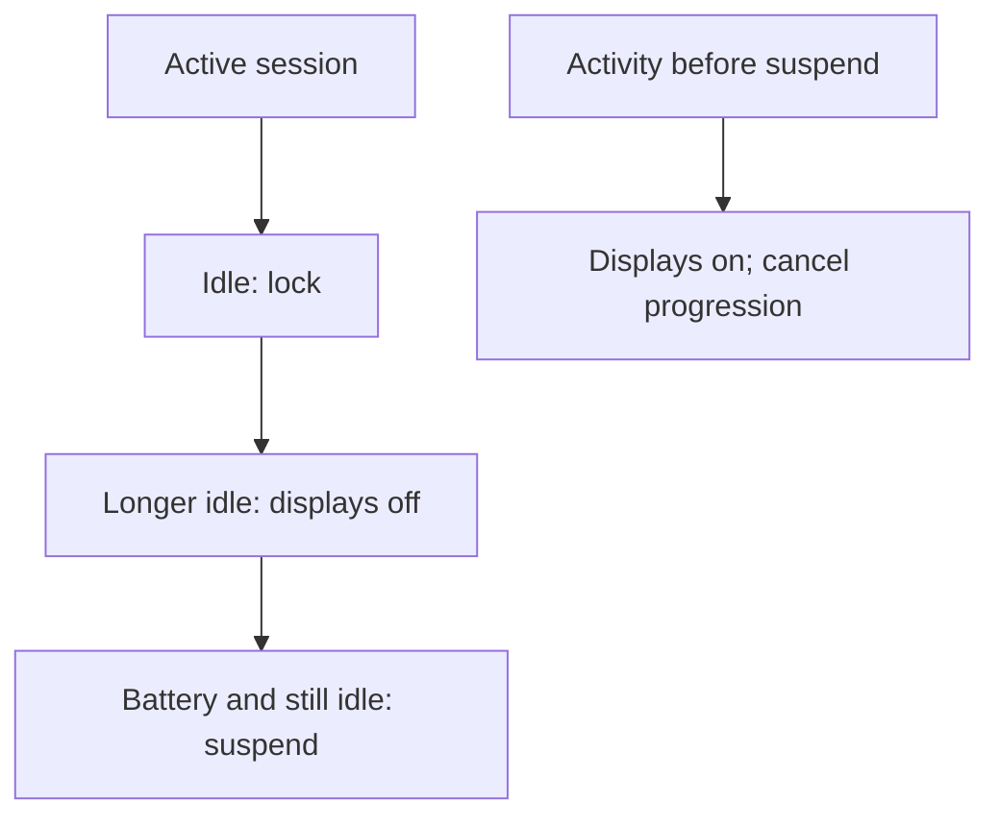
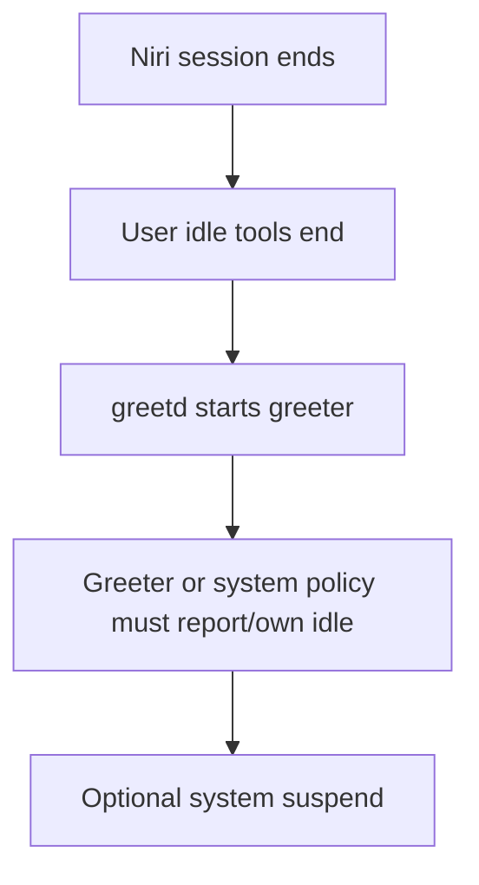

# Desktop polish, modular-shell architecture, and automatic suspend

## Purpose and scope

A polished Wayland desktop is not one theme package. It is a coordinated set
of choices spread across several independent boundaries:

- GTK and Qt applications;
- icon and cursor lookup;
- fonts and scale;
- the wallpaper and output geometry;
- the bar, launcher, notifications, on-screen displays, and widgets;
- the screen locker and login greeter;
- idle, monitor-power, and suspend policy;
- recovery when any graphical component fails.

The modularity is valuable because each role can be understood and replaced.
It is also the reason that installing several attractive projects at once can
produce duplicate bars, competing notification daemons, two idle timers, or a
login screen that no longer has a proven recovery path.

This guide closes the handbook's first planned extension map by selecting the
long-term desktop architecture and defining how it will evolve. It does not
apply the changes itself. Package installation and system policy belong in
`arch-linux-post-install`; portable user configuration and visual assets belong
in `niri-dotfiles`.

The project decision is now explicit:

- build a personal modular desktop around Niri;
- keep the existing small components as a working recovery baseline;
- replace one role at a time, with an ownership table and rollback for every
  migration.

The project does not carry a complete-shell migration in its roadmap. This
guide assumes a clean Arch installation built through the runbook,
post-install, and dotfiles repositories; it does not document cleanup of a
previous desktop or shell.

## The selected architecture

Niri remains the compositor. The desktop shell is a composition maintained by
this project rather than a monolithic shell product.

| Role | Initial owner | Intended evolution |
| --- | --- | --- |
| Compositor, outputs, workspaces, input | Niri | Keep |
| Bar and compact status | Waybar | Restyle first; replace only if an Eww bar later proves worthwhile |
| Application launcher | Fuzzel | Restyle and keep until a concrete capability is missing |
| Notification service | Mako | Replace experimentally with SwayNotificationCenter |
| Notification history and control panel | None beyond Mako tools | Add through SwayNotificationCenter |
| Wallpaper renderer | swaybg | Keep initially; wrap or replace only for desired transitions or per-output behavior |
| Qt 6 appearance | qt6ct with Fusion | Keep as the sole Qt 6 widget-theme owner; evaluate exceptions per application |
| Screen locker | swaylock | Restyle first, then compare hyprlock or gtklock |
| Idle and pre-sleep coordination | swayidle | Keep as sole owner; call the reviewed battery-aware helper at 30 minutes |
| Custom dashboard and widgets | None | Introduce Eww for one bounded surface at a time |
| Login manager | greetd | Keep |
| Login presentation | tuigreet | Keep as the selected and proven frontend |
| Hardware power policy | TLP plus `tlp-pd` | Keep; no shell may introduce a second provider |

The table is a dependency contract, not merely a list of preferred programs.
At any moment there must be exactly one intended owner for an exclusive role.

## One owner per role

Some programs can coexist because they do different work. Others implement an
exclusive protocol or act on the same event stream.

| Relationship | Safe? | Reason |
| --- | --- | --- |
| Waybar and Fuzzel | Yes | Bar and launcher are different roles |
| Waybar and an Eww dashboard | Yes, if surfaces do not duplicate ownership | A dashboard can complement the bar |
| Mako and SwayNC | No | Both compete for the desktop notification D-Bus name |
| swaylock and swayidle | Yes | Locker and idle coordinator are different roles |
| swayidle and a second shell idle timer | No | Two timers can race to lock, blank, or suspend |
| swaybg and a shell wallpaper daemon | Normally no | Both try to own the background surfaces |
| TLP and `power-profiles-daemon` | No in this project | Competing hardware power-policy providers |
| greetd and a greetd frontend | Yes | Daemon and presentation are different layers |
| greetd and a second display manager | No | Both try to own graphical login and VTs |

The diagnostic question is always:

> Which process owns the protocol, event, or surface—not which program draws
> the most visible widget?

An Eww network widget does not replace NetworkManager. A Waybar audio control
does not replace PipeWire. A graphical power button does not replace logind or
polkit. A beautiful password field is not secure unless a real session locker
and PAM authenticate it.

## Preserve a recovery baseline

Building a custom desktop does not mean deleting every known-good component on
the first day. The existing Stow packages are useful recovery material:

```text
niri/
waybar/
fuzzel/
mako/
wallpapers/
swaylock/
kitty/
theme/
qt6ct/
```

The safest repository design keeps independently deployable packages. A new
candidate gets its own configuration and migration commit. The old package is
removed from startup only when the new owner is proven. Its history remains in
Git even after it is no longer deployed.

Keep these recovery paths throughout the work:

- TTY3 reachable with `Ctrl+Alt+F3`;
- manual `niri-session` startup from a TTY;
- the known-good tuigreet configuration;
- a valid minimal Niri configuration;
- Git history for every replaced Stow package;
- package-cache or installation-media access when the graphical session cannot
  start.

Cosmetic work must never require weakening PAM, enabling autologin, adding
passwordless power commands, or removing the independent TTY path.

## Visual consistency has several layers

### A palette is not a toolkit theme

A palette is a small set of semantic colors. A toolkit theme is code and data
that decide how application widgets use color, spacing, borders, focus, and
states. A shell stylesheet is yet another consumer.

The project should first define semantic tokens such as:

| Token | Meaning |
| --- | --- |
| `background` | Main low-emphasis surface |
| `surface` | Raised panel, popup, or control background |
| `surface-alt` | Secondary or selected surface |
| `foreground` | Normal text and icons |
| `muted` | Secondary text |
| `accent` | Focus, active workspace, or selected control |
| `warning` | Attention without immediate failure |
| `critical` | Authentication, battery, temperature, or destructive warning |
| `success` | Confirmed healthy or completed state |

Those names can then be mapped into Waybar CSS, Fuzzel colors, SwayNC CSS,
Eww SCSS, the locker, Kitty, and wallpapers. Do not make every component parse
one generated file until the manual mappings are understood. A premature
theme generator hides precedence and makes a single syntax error break several
surfaces at once.

### GTK 3, GTK 4, and libadwaita are not identical

GTK applications do not all consume theme settings in the same way:

- GTK 3 applications commonly follow the configured GTK theme and icon theme;
- GTK 4 applications use GTK 4 resources and settings;
- libadwaita applications deliberately control more of their own visual
  language and may honor light/dark preference without accepting arbitrary
  third-party widget styling;
- applications can ship their own CSS or ignore parts of the desktop theme.

Therefore the goal is coherent appearance, not forcing every application into
pixel-identical widgets. A maintained Adwaita-compatible path is safer than
copying unreviewed CSS into GTK 4 application directories.

Typical user-level GTK setting locations are:

```text
~/.config/gtk-3.0/settings.ini
~/.config/gtk-4.0/settings.ini
```

The files can express preferences such as theme, icon theme, font, and dark
appearance where supported. Their exact values will be chosen in the later
implementation package after the installed applications are inventoried.

Use `gsettings` only when the corresponding schema exists and the setting is
actually read by the application. A successful `gsettings set` command does
not prove that a non-GNOME session or a particular application consumes it.

### Qt is a separate toolkit boundary

Qt applications do not automatically become visually identical to GTK
applications. A platform-theme plugin or a tool such as `qt6ct` can configure
fonts, icons, palette, and style for Qt 6 applications, but its environment
selection affects all matching clients.

The selected project path is now deliberately narrow:

| Boundary | Decision |
| --- | --- |
| Qt generation | Qt 6 only |
| Platform theme | qt6ct from the official Arch repository |
| Widget style | Qt's built-in Fusion style |
| Palette | Project-owned Midnight Circuit color scheme |
| Icons and fonts | Papirus Dark, Noto Sans 10, Noto Sans Mono 10 |
| Standard dialogs | XDG Desktop Portal through qt6ct |
| Session selection | `QT_QPA_PLATFORMTHEME=qt6ct` in Niri's environment block |
| Display backend | Qt automatic selection; no global `QT_QPA_PLATFORM` |

`QT_QPA_PLATFORMTHEME` chooses the provider for platform palettes, fonts,
theme hints, and native-dialog integration. It is not the same variable as
`QT_QPA_PLATFORM`, which chooses a window-system plugin such as Wayland or XCB.
Conflating the two makes diagnosis needlessly difficult.

Niri is the single environment owner because Fuzzel and the applications it
launches are descendants of Niri. The selected block is:

```kdl
environment {
    QT_QPA_PLATFORMTHEME "qt6ct"
}
```

This scope intentionally does not reach unrelated compositors. Niri documents
that its local environment block also does not update the systemd user
manager's global environment. A future Qt program started directly by a
systemd user unit would therefore need an explicit consumer review rather than
a second global export added speculatively.

The project does not force `QT_QPA_PLATFORM=wayland`. Current Qt can select its
Wayland plugin in the Niri session, while leaving XCB/XWayland available for an
application with a real compatibility requirement. `QT_QPA_PLATFORM=wayland`
or `QT_QPA_PLATFORM=xcb` is useful as a one-process diagnostic prefix, not as a
permanent catch-all.

The tracked qt6ct configuration uses
`standard_dialogs=xdgdesktopportal`. This preserves the portal boundary already
established for Niri instead of pulling in a KDE file picker. Current Arch
packages place `libqwayland.so` and `libqxdgdesktopportal.so` in `qt6-base`,
which is a dependency of qt6ct. The separately named `qt6-wayland` package is
not required for this client appearance setup under that packaging layout;
always recheck current package metadata before installation.

The portable files are:

```text
~/.config/qt6ct/qt6ct.conf
~/.config/qt6ct/colors/midnight-circuit.conf
```

Qt6ct records a custom color-scheme path as an absolute path. The two supported
machines use the canonical `neon` account, so the reviewed file names
`/home/neon/...`. Reuse under another account requires changing that one line
before deployment. Hiding a second untracked copy elsewhere would be less
portable, not more.

Qt palette files contain active, disabled, and inactive groups. Each group maps
21 ordered Qt color roles, including window text, buttons, base, window,
selection, links, tooltips, and placeholder text. Checking only the main
background misses disabled or unfocused states where contrast failures often
appear.

Qt6ct primarily controls QWidget applications. Qt Quick controls, KDE
Frameworks applications, sandboxed packages, and self-themed programs may
consume different layers or override parts of the result. Qt 5 also does not
read the Qt 6 configuration. Treat each exception as an application boundary;
do not stack `qt5ct`, Kvantum, Plasma settings, `QT_STYLE_OVERRIDE`, and several
environment exports simply because one program differs.

Useful inspection commands are:

```bash
printf 'QT_QPA_PLATFORMTHEME=%s\n' "$QT_QPA_PLATFORMTHEME"
printenv QT_QPA_PLATFORM || true
printenv QT_STYLE_OVERRIDE || true
pacman -Q qt6ct qt6-base qt6-svg
pacman -Qo /usr/lib/qt6/plugins/platformthemes/libqt6ct.so
pacman -Qo /usr/lib/qt6/plugins/platforms/libqwayland.so
pacman -Qo /usr/lib/qt6/plugins/platformthemes/libqxdgdesktopportal.so
grep -E '^(color_scheme_path|custom_palette|icon_theme|standard_dialogs|style)=' \
  ~/.config/qt6ct/qt6ct.conf
```

Qt6ct is itself a settings editor and can write geometry or other state when it
closes. If its live file is a GNU Stow link into Git, use the post-install
chapter's temporary `XDG_CONFIG_HOME` procedure for inspection. Launch the
normal settings entry only for an intentional configuration change, then
review the repository diff.

### Icons are named resources

Applications and desktop entries usually request icon names, not absolute PNG
paths. The XDG icon-theme lookup algorithm resolves those names through a
theme, its inherited themes, available sizes, and fallback locations.

A complete icon theme should therefore:

- include a valid `index.theme`;
- inherit an established fallback, normally `hicolor`;
- provide common application and symbolic icons at suitable sizes;
- remain legible on both dark and light surfaces;
- be installed through a package or a reviewed local asset directory;
- be tested in Fuzzel, Nautilus, GTK dialogs, tray items, and notifications.

A missing icon in one launcher does not always mean the theme is broken. The
desktop entry may request a nonexistent name, the application may ship only an
absolute icon, or a cache may need refresh.

Useful inspection commands include:

```bash
grep -R '^Icon=' /usr/share/applications ~/.local/share/applications 2>/dev/null
find /usr/share/icons ~/.local/share/icons -maxdepth 2 -name index.theme -print 2>/dev/null
gtk4-icon-browser
```

The last command exists only when the relevant GTK development/demo package is
installed; it is an optional diagnostic, not a baseline dependency.

### Cursor theme and cursor size

The cursor crosses more boundaries than it appears to:

- Niri draws or coordinates the compositor cursor;
- Wayland clients can select cursor shapes;
- XWayland clients use Xcursor lookup;
- GTK and Qt may read toolkit settings;
- the greeter and locker may run under a different user or environment.

The selected theme and size must agree across the session. Common indicators
are:

```bash
printf 'XCURSOR_THEME=%s\n' "$XCURSOR_THEME"
printf 'XCURSOR_SIZE=%s\n' "$XCURSOR_SIZE"
gsettings get org.gnome.desktop.interface cursor-theme 2>/dev/null
gsettings get org.gnome.desktop.interface cursor-size 2>/dev/null
```

Do not solve a cursor mismatch by setting the same variable in `.bashrc`, Niri,
an XDG autostart file, and `/etc/environment`. Choose one session-level owner,
then configure the compositor/toolkits only where their own explicit setting
is required.

Test the cursor over:

- Niri decorations and overview;
- GTK 3 and GTK 4 applications;
- Kitty;
- an XWayland application;
- the locker;
- both internal and external displays at their real scales.

### Fonts and icon fonts

Text fonts, monospace fonts, emoji fonts, and icon fonts solve different
problems. The existing Noto and Liberation base should remain. A Nerd Font may
be added only if a reviewed Waybar or Eww design really uses its glyphs.

Every visible glyph creates a package dependency. A bar that silently relies
on a font installed on only one ThinkPad is not reproducible. Prefer ordinary
text or named theme icons when they communicate the state clearly.

## Wallpaper policy

A wallpaper is both an asset and a session surface. The current baseline uses
swaybg with a solid color, so a missing image can never prevent the session
from starting.

The first reviewed wallpaper package should include:

- one selected image with a known license and source;
- an optimized desktop-sized derivative rather than an unnecessarily large
  original;
- attribution and license information beside the asset;
- a repository-relative deployment path below
  `~/.local/share/wallpapers/`;
- a fallback solid color;
- explicit behavior for crop, fit, and multi-output use.

Do not reference a file under `~/Downloads`, a browser cache, or a machine-
specific absolute path. Do not commit personal photographs or images with
unclear redistribution rights to a public repository.

### One renderer, even with several outputs

swaybg can display a static color or image and remains a good first owner. A
future wrapper or Eww control can select among reviewed files, but it should
signal one background renderer rather than spawn a new one on every click.

If a future tool adds transitions or per-output wallpapers, its adoption must
remove the swaybg startup entry in the same change. Test:

- the internal panel alone;
- external display hotplug;
- mixed aspect ratios and scaling;
- Niri restart or full logout/login;
- missing or unreadable image fallback;
- memory use with the actual image resolution.

Wallpaper-derived dynamic color is optional. It can be attractive, but it
turns an image change into a broad configuration change. Start with one fixed,
reviewed palette; automate derivation only after every consumer and rollback
path is understood.

## Notifications: Mako, SwayNC, and Eww

### Mako remains a sound baseline

Mako is still a good notification daemon for a modular Niri desktop. It is
small, implements the FreeDesktop notification service, supports actions and
urgency, and exposes history through `makoctl`.

Its limitation for this project is not correctness. It is the absence of the
large, persistent, integrated notification and quick-control panel the user
wants.

### SwayNotificationCenter is the selected first replacement experiment

SwayNotificationCenter combines a notification daemon with a GTK control
center. That makes it a real Mako replacement and a useful intermediate step:

- the project learns the D-Bus notification boundary;
- a persistent history becomes visible;
- do-not-disturb and actions can be tested;
- Waybar can remain while notification presentation evolves;
- CSS can share the project palette.

It must not run beside Mako. The migration transaction is:

1. install SwayNC without permanent startup;
2. stop Mako temporarily inside a test session;
3. start SwayNC in the foreground and inspect errors;
4. test normal, critical, actionable, calendar, and media notifications;
5. test its panel on every output and scale;
6. create a separate Stow package and Waybar binding if desired;
7. remove Mako startup and add SwayNC startup in one reviewed commit;
8. log out and in, then verify the D-Bus server identity;
9. retain the Mako package in Git history for rollback.

The decisive checks are:

```bash
busctl --user status org.freedesktop.Notifications
busctl --user call \
    org.freedesktop.Notifications \
    /org/freedesktop/Notifications \
    org.freedesktop.Notifications \
    GetServerInformation
notify-send "Normal test" "Notification path"
notify-send --urgency=critical "Critical test" "Must remain visible"
```

### Eww does not replace the notification daemon

Eww can build a beautiful panel, history view, or notification-related widget.
It does not automatically own `org.freedesktop.Notifications`, receive all
notification methods, store actions, or implement the protocol lifecycle.

The selected architecture is therefore:

- SwayNC receives and owns notifications;
- Eww may later display complementary state or open the SwayNC panel;
- only custom code deliberately written against a notification backend could
  make Eww part of a full replacement.

Reimplementing a standards-compliant notification daemon is not a useful first
Eww exercise. A bounded dashboard is.

## Eww as the custom-shell learning layer

Eww is selected as an experimental widget framework, not as a mandatory owner
of every desktop surface.

### Start with a dashboard

The first Eww project should be one toggleable dashboard containing read-only
or narrowly controlled information such as:

- clock and calendar;
- battery and TLP profile;
- CPU, memory, and temperature;
- PipeWire volume and microphone state;
- NetworkManager connection summary;
- Bluetooth state;
- media metadata;
- session actions that still call the proper system interfaces.

This teaches Eww's daemon, windows, variables, polling, listeners, Yuck, and
SCSS without immediately replacing the proven bar, launcher, notifications,
locker, and idle chain.

### Data ownership remains outside Eww

For every widget, record:

| Question | Example |
| --- | --- |
| Authoritative source | `wpctl`, NetworkManager D-Bus, Niri IPC, sysfs |
| Update model | Event subscription preferred; bounded polling if necessary |
| Failure display | `Unavailable`, hidden module, or explicit error state |
| Action | Named command with validated arguments |
| Privilege | None, polkit-mediated service action, or deliberately unavailable |
| Secret exposure | Never print tokens, SSIDs if privacy policy forbids it, or command-line secrets |

Avoid high-frequency shell polling. A one-second process spawn for several
widgets wastes battery and creates confusing error streams. Prefer maintained
event listeners and native clients; use slower polling only for data that
changes slowly.

### Waybar remains until replacement earns its cost

An Eww bar is possible, but it requires project-owned Niri workspace updates,
tray behavior, output selection, CSS, click actions, and failure handling.
Restyling the working Waybar teaches the visual system first. Replace it only
if the desired layout cannot be expressed cleanly or maintaining the custom
integration is itself part of the goal.

## Locker evolution

### Restyle before replacing

swaylock already uses the required session-lock protocol and has a proven PAM
and pre-suspend path. Changing its image, colors, typography, indicator, and
layout within its supported options is the lowest-risk visual improvement.

The wallpaper shown while locked must not reveal private notification content,
calendar details, clipboard history, window thumbnails, or secrets. A blurred
live desktop may look attractive but can still disclose readable information
and depends on a secure capture pipeline.

### A replacement has security obligations

hyprlock and gtklock remain candidates. A custom Eww fullscreen window is not a
locker: normal layer-shell or fullscreen surfaces do not provide the session-
lock security contract.

Any replacement must prove:

- Niri session-lock protocol support;
- a reviewed PAM service;
- incorrect and correct password behavior;
- all-output coverage and hotplug;
- keyboard layout and accessibility;
- a reliable ready/foreground contract before suspend;
- `loginctl lock-session` behavior;
- repeated suspend/resume without a desktop flash;
- TTY recovery from an invalid cosmetic configuration.

Replace the manual lock command first. Only after it is stable should the
swayidle lock, idle, and `before-sleep` commands be changed together.

## swayidle remains the first idle coordinator

swayidle has no visual design to improve. It receives idle and logind events
and invokes commands. Retaining it while changing visible components reduces
the number of simultaneous variables.

The current progression is:

| Idle time | Current action |
| --- | --- |
| 5 minutes | Start swaylock |
| 10 minutes | Ask Niri to power off monitors |
| User activity | Ask Niri to power monitors on |
| 30 minutes | Call the battery-only `idle-suspend` helper |
| Before any coordinated sleep | Start swaylock and wait |

The selected chapter 18 automatic-suspend policy is:

| State | Initial reviewed policy |
| --- | --- |
| Battery | Lock at 5 minutes, displays off at 10, suspend at 30 |
| AC power | Lock and displays off, but no automatic suspend initially |
| Lid close | Existing logind policy remains authoritative |
| Manual suspend | Existing lock-before-sleep path remains authoritative |
| Hibernation | Still not configured |

The 30-minute value is an initial policy, not a universal optimum. It is
longer than both visible stages, preserves the user's requested ordering, and
can be adjusted after observing real work. Battery-only deployment avoids
interrupting long docked builds before the inhibitor behavior has been proven.

## Automatic suspend is a sequence, not one timer

The selected session path is:



The ordering protects both privacy and hardware state:

1. the locker must cover the session;
2. displays may then power down;
3. suspend is requested only after a longer interval;
4. resume must return behind the locker;
5. ordinary activity before suspend cancels the later stages.

Do not implement this as three unrelated startup scripts. One idle coordinator
must own the progression.

### Power-source awareness

swayidle does not become a hardware power manager merely because it invokes
the final action. The narrow helper reads UPower's boolean `OnBattery` property
and requests suspend only for `b true`. It fails closed—does nothing—when the
power source cannot be determined.

The helper should not:

- change TLP profiles;
- write arbitrary sysfs values;
- parse translated human-readable output when a stable machine interface
  exists;
- use `sudo` or embed a password;
- force suspend past active inhibitors;
- terminate the graphical session.

It calls `systemctl --check-inhibitors=yes suspend`. logind, systemd sleep
units, the kernel, and the pre-sleep locker retain their established roles.

### Idle inhibitors

Wayland applications may inhibit compositor idle handling during video,
presentations, or other interactive work. System services and applications may
also hold logind/systemd sleep inhibitors around updates, backups, recording,
or shutdown-sensitive operations.

Inspect both the session and system view during testing:

```bash
loginctl session-status
loginctl show-session auto -p IdleHint -p IdleSinceHint -p IdleSinceHintMonotonic
systemd-inhibit --list
```

An inhibitor is evidence, not an obstacle to bypass automatically. Identify
its owner and reason. Do not add `--ignore-inhibitors` to a cosmetic idle
workflow.

Downloads and compilations do not necessarily create inhibitors. Decide
whether the application should be configured to inhibit sleep, whether AC
power already prevents automatic suspend, or whether a manual temporary
keep-awake control is needed. A custom dashboard can later expose such a
control by starting a bounded `systemd-inhibit` scope; it must also show when
that scope is active and how to end it.

### Lock-before-suspend is non-negotiable

The current `before-sleep` path waits for swaylock readiness. A future locker
may use a different readiness mechanism. The string `-f` is a swaylock option,
not a generic locker contract.

Test the final path with:

- a manual `systemctl suspend` request;
- lid-close suspend;
- the shortened automatic timeout;
- incorrect then correct unlock credentials;
- internal and external outputs;
- repeated resume cycles;
- Wi-Fi, audio, Bluetooth, TLP, cursor, and input state after resume.

If the desktop appears briefly before the locker, automatic suspend is not
ready even if the hardware slept successfully.

## Suspension after logout is a different problem

Logging out ends Niri and the user-session processes, including swayidle and
Eww. They cannot continue a timer after the session no longer exists.

The post-logout state is owned by greetd and its greeter presentation:



`IdleAction=` in `logind.conf` is a system-wide mechanism, but logind acts only
when the relevant sessions correctly report idle state. A console or graphical
greeter may not provide the same idle hints as Niri. Enabling a global
`IdleAction=suspend` without verifying those hints can either do nothing or
suspend at surprising times.

Therefore the project separates two milestones:

1. implement and prove automatic suspend inside the authenticated Niri session;
2. later evaluate post-logout suspend using the selected greeter's own idle
   support or a verified logind design.

The second milestone must test the login screen, no active user session,
remote or secondary sessions, inhibitors, and recovery. It will not be smuggled
into the first swayidle change.

## Keep tuigreet as the login presentation

greetd remains the login manager and tuigreet remains its selected frontend.
The user-session theme does not need to extend into the login surface, whose
small configuration and proven TTY recovery path are more valuable than visual
uniformity.

Any future reconsideration would be a separate security-sensitive project. It
would have to preserve greetd, PAM, logind, the unprivileged greeter account,
the `niri-session` command, return after logout, and TTY recovery. No graphical
greeter change is part of the current roadmap.

## Repository design for the custom desktop

### Independent Stow packages

Keep role boundaries visible in `niri-dotfiles`. The current and plausible
future layout is:

```text
theme/
    .config/gtk-3.0/settings.ini
    .config/gtk-4.0/settings.ini
wallpapers/
    .local/share/wallpapers/...
swaync/
    .config/swaync/...
eww/
    .config/eww/...
hyprlock/ or gtklock/
    .config/<locker>/...
scripts/
    .local/bin/...
```

The `scripts` package now exists for the chapter 18 helper. The remaining
candidate directories are a design sketch, not permission to create them all
at once. Each package appears only when its first reviewed file is ready.

### Separate portable, generated, and machine state

| State | Repository policy |
| --- | --- |
| Palette, CSS, widget structure, bindings | Track when portable |
| Wallpaper with reviewed license | Track if size and redistribution are appropriate |
| App usage history | Do not track |
| Notification history | Do not track |
| Clipboard history | Do not track |
| Cached thumbnails and generated colors | Normally do not track; regenerate |
| Output connector names and scale | Host override, not portable theme |
| Secrets, weather API keys, tokens | Never track |
| Greeter system configuration | Document in post-install, not user Stow package |

If a GUI writes directly into a Stow-managed file, Git will see the change
through the symlink. Review it before commit. Generated state should live in a
separate untracked path so ordinary runtime use does not dirty the repository.

### Small scripts need contracts

A custom modular desktop naturally accumulates scripts. Every tracked script
should define:

- input and output;
- dependencies;
- timeout or blocking behavior;
- exit-status meaning;
- quoting and validation;
- behavior when a service is absent;
- whether it is safe to run several times;
- logging destination;
- privilege and secret boundaries.

Do not turn one large `desktop.sh` into a hidden second shell manager. Narrow
helpers are easier to test and replace.

## Implementation phases and current progress

After the visual and Qt foundations, these phases are independent migration
tracks rather than a strict calendar. Automatic suspend was ready to implement
as chapter 18 because its owner, policy, rollback, and tests were already
closed. SwayNC, Eww, and a possible locker replacement still require separate
visual and interaction choices, so they do not block the power-policy change.

### Phase 0 — establish the clean modular baseline

Before adding visual changes:

1. complete the reviewed runbook and post-install path without adding a
   complete third-party shell;
2. deploy the independent Niri, Waybar, Fuzzel, Mako, wallpaper, swaylock, and
   Kitty Stow packages;
3. verify that Niri starts each selected session component exactly once;
4. prove manual `niri-session`, tuigreet login, logout, TTY3 recovery, locking,
   monitor power, and manual suspend;
5. confirm that the three repositories are clean and synchronized;
6. record this state as the known-good baseline for later component
   replacements.

The clean installation should not use a broad shell installer as an
intermediate step. Every later package and configuration file is introduced by
the phase that owns it, so Git history explains how the desktop was assembled.

### Phase 1 — visual foundation

1. choose one palette and semantic token map;
2. choose GTK appearance, icon theme, cursor theme and size, UI font, and
   monospace font;
3. add one licensed wallpaper plus attribution and fallback color;
4. apply the palette to the existing Waybar, Fuzzel, Mako, swaylock, and Kitty;
5. test GTK 3, GTK 4/libadwaita, XWayland, portals, and mixed display scale;
6. publish the theme and wallpaper as independent Stow packages.

This produces a coherent desktop before changing protocol owners.

### Phase 1a — Qt 6 appearance boundary

1. install only qt6ct from the official repository and inspect its dependency
   and plugin ownership;
2. add the independent qt6ct Stow package and one Niri environment value;
3. select Fusion, the project palette, Papirus Dark, Noto fonts, and XDG portal
   dialogs;
4. leave `QT_QPA_PLATFORM` and `QT_STYLE_OVERRIDE` unset globally;
5. test the Qt6ct QWidget itself on native Wayland with a temporary config copy;
6. retest portal dialogs, scaling, icons, and repository cleanliness;
7. evaluate every later Qt 6 application at its actual QWidget, Qt Quick, KDE
   Frameworks, or sandbox boundary.

This is a separate reversible post-install chapter because the GTK visual
foundation does not require Qt infrastructure.

### Phase 2 — richer notifications

1. compare SwayNC manually with the current Mako behavior;
2. design and test the panel, actions, do-not-disturb, and history;
3. replace Mako transactionally;
4. integrate one Waybar button or Fuzzel action to open the center;
5. test GNOME Calendar reminders and critical notifications after a new login.

### Phase 3 — custom Eww dashboard

1. create one toggleable dashboard;
2. add data sources one at a time;
3. prefer event streams over rapid polling;
4. implement unavailable and error states;
5. measure idle CPU, wakeups, and memory;
6. keep Waybar and Fuzzel until the dashboard is stable.

### Phase 4 — improved lock screen

1. fully style swaylock first;
2. compare hyprlock and gtklock only if swaylock cannot express the desired
   result;
3. validate PAM and the session-lock protocol;
4. replace every lock path as one coordinated change;
5. repeat multi-output and suspend/resume testing.

### Phase 5 — automatic session suspend (chapter 18)

1. add battery-source detection with a fail-closed helper;
2. validate both power-source branches without sleeping;
3. retain lock at 5 minutes and monitor-off at 10 minutes;
4. add battery-only suspend at 30 minutes;
5. test Wayland and system inhibitors;
6. verify repeated resume behind the locker;
7. force the complete event chain with swayidle's documented signal;
8. observe the real timers before considering automatic suspend on AC.

### Phase 6 — post-logout idle with tuigreet

1. retain the current greetd and tuigreet configuration;
2. preserve TTY3 recovery;
3. verify which idle state the greeter session reports to logind;
4. prove login, keyring unlock, logout return, and repeated sessions;
5. only then decide whether post-logout automatic suspend is justified.

### Phase 7 — decide whether Eww should replace Waybar

By this point the project will know the actual cost of custom widgets. Replace
Waybar only if the desired bar behavior justifies maintaining Niri workspace,
tray, output, action, and error integration. Keeping Waybar beside an Eww
dashboard remains a fully modular end state.

## Validation matrix

Every phase must be tested on the real ThinkPads, not only judged from a
screenshot.

| Area | Required checks |
| --- | --- |
| Startup | Exactly one process per selected role after fresh login |
| Outputs | Internal, external, hotplug, mixed scale, lid behavior |
| Themes | GTK 3, GTK 4/libadwaita, Qt if present, XWayland, portals |
| Icons | Launcher, file manager, notifications, tray, symbolic contrast |
| Cursor | Compositor, clients, XWayland, locker, greeter |
| Notifications | Normal, critical, actions, history, DND, calendar reminders |
| Locker | Bad/good password, all outputs, hotplug, pre-sleep readiness |
| Idle | Lock, display off/on, cancellation, inhibitors, battery-only suspend |
| Resume | Locked return, Wi-Fi, audio, Bluetooth, input, TLP, outputs |
| Logout | Return to one greeter; no stale session components |
| Recovery | TTY3, manual Niri, revert one Stow package and one commit |
| Resources | Idle CPU, wakeups, memory, polling processes |

Useful inventory commands include:

```bash
niri validate
niri msg layers
systemctl --user --failed --no-pager
systemctl --user list-units --type=service --state=running --no-pager
pgrep -a waybar
pgrep -a fuzzel
pgrep -a mako
pgrep -a swaync
pgrep -a eww
pgrep -a swaybg
pgrep -a swayidle
pgrep -a swaylock
busctl --user status org.freedesktop.Notifications
systemd-inhibit --list
loginctl session-status
```

Fuzzel normally runs only while the launcher is visible, and swaylock only
while the session is locked. An empty `pgrep` for those two in the ordinary
unlocked state is expected.

## Troubleshooting by symptom

| Symptom | Likely boundary | First checks |
| --- | --- | --- |
| Two bars or panels | Duplicate startup owners | Niri startup, XDG autostart, user units |
| Notifications appear twice or not at all | Competing or absent D-Bus daemon | Server identity, Mako/SwayNC processes, user journal |
| Eww panel is blank | Failed listener, command, or variable | `eww state`, `eww debug`, `eww logs` |
| High idle CPU or battery drain | Rapid polling or restart loop | Process tree, user journal, wakeup measurements |
| Icons are blank squares | Missing theme, name, or font glyph | desktop entry, icon lookup, font package |
| Cursor changes between windows | Conflicting compositor/toolkit/Xcursor settings | environment and toolkit settings |
| GTK applications disagree | Toolkit or libadwaita boundary | app toolkit, settings source, dark preference |
| Wallpaper disappears on hotplug | Renderer/output policy | renderer process, output name, fallback color |
| Desktop flashes before suspend | Locker readiness race | swayidle command, locker foreground behavior, journal |
| Machine never auto-suspends | Inhibitor, AC policy, failed helper, second idle owner | power source, inhibitors, logs, process audit |
| Machine suspends during media | Idle-inhibit path absent or ignored | compositor protocol, player behavior, idle owner |
| Suspend works in Niri but not after logout | User idle coordinator has exited | greeter idle support and logind IdleHint |
| Graphical login fails after theming | Greeter asset, permissions, compositor, or PAM | TTY3, greetd journal, restore tuigreet |

## Rollback principles

### User-session component

For a failed bar, notification, Eww, wallpaper, or locker change:

1. move to TTY3 if the session cannot be used;
2. stop the new user process;
3. remove its startup entry or user unit;
4. restore the previous Stow package/commit;
5. validate Niri;
6. start a fresh manual session;
7. inspect the user journal before retrying.

Do not delete runtime history to hide an error before collecting the evidence.

### Automatic suspend

If suspend triggers unexpectedly:

1. remove or comment only the third idle timeout/helper call;
2. retain lock and monitor-off behavior;
3. inspect power-source detection and both inhibitor paths;
4. review the previous boot and suspend journal;
5. retest with temporary timeouts under supervision.

If resume fails, automatic suspend remains disabled until manual and lid
suspend again pass the complete hardware verification.

### Greeter or post-logout policy

If a greeter or post-logout idle-policy change fails:

1. switch to TTY3;
2. inspect `greetd.service` and the current boot journal;
3. restore the known-good tuigreet command;
4. restart greetd only when no unsaved graphical session is active;
5. prove login and logout before rebooting.

Never “repair” the greeter by enabling autologin or weakening PAM.

## Decisions recorded by this guide

- Niri plus independently selected components is the chosen long-term desktop.
- No complete-shell migration is part of the installation or roadmap.
- The existing Waybar/Fuzzel/Mako/swaybg/swaylock/swayidle stack remains the
  reproducible recovery baseline while the modular desktop evolves.
- Waybar and Fuzzel are styled before any replacement is considered.
- SwayNC is the first selected protocol-owner experiment and may replace Mako.
- Eww begins as a bounded dashboard; it does not replace the notification
  daemon, locker, idle coordinator, or system services.
- swaylock is styled first; hyprlock and gtklock remain later candidates.
- swayidle remains the first coordinator for lock, monitor power, pre-sleep,
  and the new automatic-suspend stage.
- The initial automatic-suspend policy is 30 minutes on battery only, after
  lock at 5 minutes and display-off at 10 minutes; AC suspend remains manual or
  lid-driven initially.
- Post-logout automatic suspend is a separate greeter/logind project because
  user-session timers end at logout.
- greetd remains the login manager and tuigreet remains the selected frontend.
- TLP plus `tlp-pd` remains the sole hardware power-profile provider.
- qt6ct plus Fusion is the sole Qt 6 widget-appearance path; Niri exports only
  `QT_QPA_PLATFORMTHEME=qt6ct`, while Qt retains automatic platform selection.
- Qt standard dialogs use the XDG Desktop Portal provider; Qt 5, Kvantum,
  Plasma settings, and a global `QT_STYLE_OVERRIDE` are outside this phase.
- Theme, icon, cursor, wallpaper, modular-component, and idle changes will be
  delivered as independent, reversible phases.

## Sources

- [ArchWiki: GTK](https://wiki.archlinux.org/title/GTK)
- [ArchWiki: Qt](https://wiki.archlinux.org/title/Qt)
- [ArchWiki: Uniform look for Qt and GTK applications](https://wiki.archlinux.org/title/Uniform_look_for_Qt_and_GTK_applications)
- [Arch package: qt6ct](https://archlinux.org/packages/extra/x86_64/qt6ct/)
- [Arch package files: qt6-base](https://archlinux.org/packages/extra/x86_64/qt6-base/files/)
- [qt6ct upstream](https://www.opencode.net/trialuser/qt6ct)
- [Qt Platform Abstraction](https://doc.qt.io/qt-6/qpa.html)
- [Niri environment configuration](https://niri-wm.github.io/niri/Configuration:-Miscellaneous.html#environment)
- [XDG Desktop Portal design](https://flatpak.github.io/xdg-desktop-portal/docs/design-considerations.html)
- [ArchWiki: Icons](https://wiki.archlinux.org/title/Icons)
- [ArchWiki: Cursor themes](https://wiki.archlinux.org/title/Cursor_themes)
- [XDG Icon Theme Specification](https://specifications.freedesktop.org/icon-theme-spec/latest/)
- [Niri: Important Software](https://niri-wm.github.io/niri/Important-Software.html)
- [Desktop Notifications Specification](https://specifications.freedesktop.org/notification/latest/)
- [Mako upstream](https://github.com/emersion/mako)
- [SwayNotificationCenter upstream](https://github.com/ErikReider/SwayNotificationCenter)
- [Eww documentation](https://elkowar.github.io/eww/)
- [swaylock upstream](https://github.com/swaywm/swaylock)
- [swayidle upstream](https://github.com/swaywm/swayidle)
- [swayidle(1)](https://man.archlinux.org/man/swayidle.1.en)
- [UPower D-Bus interface](https://upower.freedesktop.org/docs/UPower.html)
- [systemctl(1)](https://man.archlinux.org/man/systemctl.1)
- [systemd inhibitor locks](https://systemd.io/INHIBITOR_LOCKS/)
- [gtklock upstream](https://github.com/jovanlanik/gtklock)
- [hyprlock documentation](https://wiki.hypr.land/Hypr-Ecosystem/hyprlock/)
- [logind.conf(5)](https://www.freedesktop.org/software/systemd/man/latest/logind.conf.html)
- [systemd-inhibit(1)](https://www.freedesktop.org/software/systemd/man/latest/systemd-inhibit.html)
- [greetd upstream](https://sr.ht/~kennylevinsen/greetd/)
