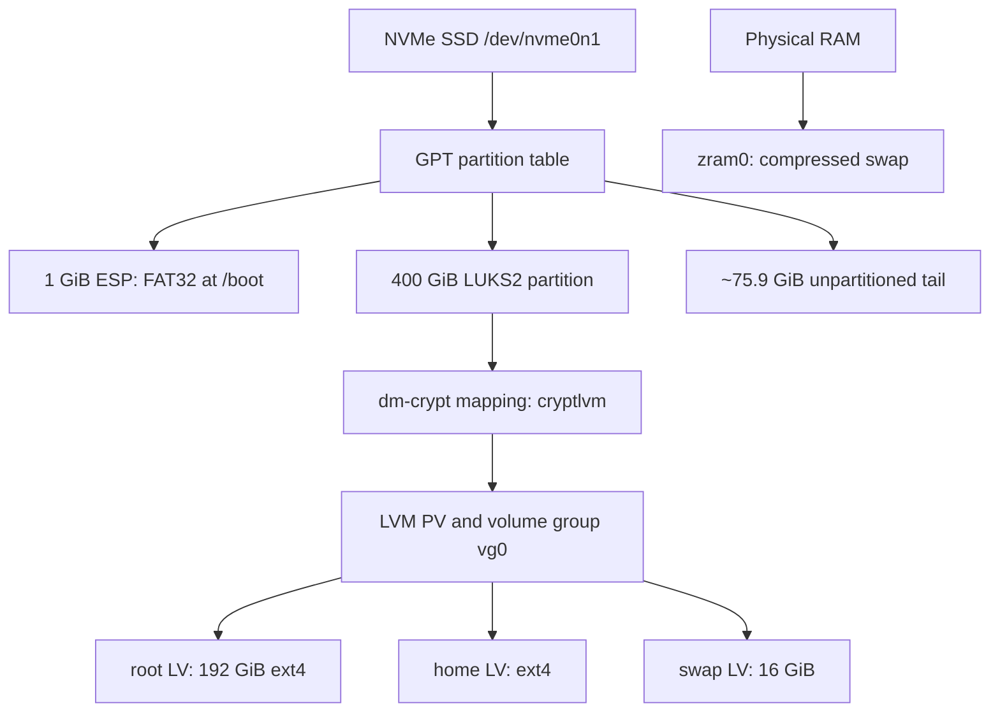

# Storage layers, encryption, memory, and discard

Storage is easiest to understand as a stack. A command can report free space,
an identifier, or an error at one layer without saying anything equivalent
about the layers above or below it. Before changing storage, first identify the
layer that owns the object.

This guide explains the project layout and the reasoning behind it. It is not a
replacement for the installation runbook, and its diagnostic examples are not
instructions to repartition a working machine.

## The project layout

The canonical internal drive is a nominal 512 GB NVMe SSD. Manufacturers use
decimal gigabytes; Linux tools commonly display binary gibibytes, so the same
drive appears as roughly 476.9 GiB. That is not missing capacity.



The volume group deliberately retains about 256 MiB of unallocated extents.
That small reserve is different from both free space inside a filesystem and
the unpartitioned SSD tail.

| Capacity description | Owner | What can consume it |
| --- | --- | --- |
| Free blocks reported by `df` | ext4 | Files and filesystem metadata |
| Free extents reported by `vgs` | LVM volume group | New or enlarged logical volumes and temporary LVM needs |
| Unpartitioned tail reported by partitioning tools | GPT/device layer | A future partition, or SSD controller headroom if it remains unused |
| Unused physical pages | Memory manager | Programs, page cache, zram, and the kernel |

Moving capacity between these categories is a real storage operation, not a
rename. It can require resizing several layers in the correct order.

## One object, several names

`/dev/nvme0n1`, `/dev/nvme0n1p2`, and `/dev/dm-0` are kernel-assigned device
names. They are useful observations, but they are not all stable identities.
Discovery order and mapping state can change them.

| Identifier or path | Identifies | Typical project use |
| --- | --- | --- |
| `/dev/nvme0n1p2` | Current kernel path to a partition | Interactive inspection after confirming the device |
| `PARTUUID=` | GPT partition entry | Firmware/boot or partition-level references where appropriate |
| LUKS UUID | LUKS container | `rd.luks.name=` and `rd.luks.options=` in the UKI command line |
| `/dev/mapper/cryptlvm` | Open dm-crypt mapping | The decrypted block device presented to LVM |
| LVM LV path | Logical volume | Clear administrative inspection and root command line |
| Filesystem UUID | ext4 filesystem or swap signature | Persistent `/etc/fstab` entries |
| Mount point | Mounted filesystem namespace | Application-facing access such as `/home` |

An identifier belongs to a layer. A filesystem UUID cannot identify the LUKS
container that encloses it, and the LUKS UUID cannot mount the ext4 filesystem
inside an LV.

Inspect several layers together:

```bash
lsblk -o NAME,PATH,TYPE,SIZE,FSTYPE,FSVER,UUID,PARTUUID,MOUNTPOINTS
sudo blkid
findmnt --real
```

Do not copy an identifier from an example. Read it from the target machine and
verify its parentage in the `lsblk` tree.

## NVMe and GPT

NVMe describes the storage protocol and controller interface. GPT describes
how ranges of logical blocks on that device are assigned to partitions. A GPT
partition is only a bounded range with metadata such as a type and PARTUUID;
creating one does not automatically format or encrypt it.

In this project:

- the first partition is the EFI System Partition (ESP), formatted FAT32;
- the second partition contains LUKS2;
- the remaining tail is intentionally outside all partitions.

The ESP cannot be hidden inside the encrypted container because UEFI firmware
must read the boot files before Linux has loaded dm-crypt. Its contents are
therefore not confidential. Secure Boot supplies authenticity for signed boot
artifacts; it does not encrypt the ESP.

Partitioning tools are inherently capable of destructive writes. For an audit,
prefer read-only views such as:

```bash
lsblk -o NAME,SIZE,TYPE,FSTYPE,PARTTYPENAME,PARTUUID,MOUNTPOINTS
sudo fdisk --list /dev/nvme0n1
```

Always confirm model, serial, capacity, and current mounts before any command
that writes a partition table.

## LUKS2 and dm-crypt

LUKS2 is the on-disk container format. Its header stores metadata and keyslots.
A passphrase does not normally encrypt every data block directly: it unlocks
key material that gives access to the volume key used for block encryption.
This design permits changing or adding a passphrase without re-encrypting the
whole data area.

dm-crypt is the live kernel mapping. After successful unlock, it exposes a
decrypted block view at `/dev/mapper/cryptlvm`; writes to that view are encrypted
before reaching the partition. Closing the mapping removes the live view but
does not erase the ciphertext on disk.

```bash
sudo cryptsetup status cryptlvm
sudo cryptsetup luksDump /dev/nvme0n1p2
```

`luksDump` reveals metadata, not file contents, but its output can still expose
security-relevant configuration. Do not publish it casually.

### Header backup and recovery boundary

The LUKS header is essential. Filesystem data can remain physically intact yet
be inaccessible if the header and all usable keyslots are lost. A header backup
is therefore valuable, but it is sensitive: together with the encrypted device,
it preserves the material needed for offline passphrase attempts.

Keep a verified header backup offline, encrypted, and separate from the laptop.
Do not commit it to these repositories or place it beside an unencrypted disk
image. A header backup is also point-in-time security state: restoring an old
one can restore keyslots that were later removed.

Never run `cryptsetup luksFormat` as a repair attempt. It creates a new header
and can destroy access to the existing encrypted data. Recovery begins with
read-only identification, backups where possible, and the exact error message.

## LVM: PV, VG, and LV

The open `cryptlvm` mapping is initialized as an LVM physical volume (PV). The
PV supplies physical extents to volume group `vg0`; the VG allocates those
extents to logical volumes (LVs).

```bash
sudo pvs
sudo vgs
sudo lvs -a -o +devices
```

The project has three LVs:

| LV | Contents | Purpose |
| --- | --- | --- |
| `vg0/root` | ext4 | Operating system and system-wide data |
| `vg0/home` | ext4 | User data and per-user configuration |
| `vg0/swap` | swap signature | Encrypted disk-backed fallback swap |

LVM naming and device-mapper naming can render the same LV as
`/dev/vg0/root`, `/dev/mapper/vg0-root`, or a `/dev/dm-*` device. The tree and
LVM metadata establish whether they refer to the same object.

The small free extent reserve is intentional. LVM snapshots may also require
VG space, but a snapshot is not a backup: it depends on the same device and can
be invalidated when its allocated copy-on-write space fills.

LVM metadata backups do not back up filesystem contents. Similarly,
`vgcfgrestore` repairs LVM metadata; it does not reconstruct lost ext4 data.

## ext4 and reserved blocks

The root and home LVs each contain an independent ext4 filesystem. A filesystem
turns a block device into directories, files, allocation maps, inodes, and
metadata.

ext4 journals metadata. With its normal `data=ordered` mode, file data is
written to its final location before related metadata is committed to the
journal. Journal replay helps restore filesystem consistency after an unclean
shutdown; it is not version history and it is not a backup of user files.

The project reserves 1% of root for privileged recovery and filesystem
operation under low-space conditions, while home uses 0%. That percentage is
filesystem policy, not unused LVM space.

```bash
findmnt -no SOURCE,FSTYPE,OPTIONS /
findmnt -no SOURCE,FSTYPE,OPTIONS /home
df -hT / /home
sudo tune2fs -l /dev/vg0/root
sudo tune2fs -l /dev/vg0/home
```

`df` describes mounted filesystem capacity. `du` totals reachable directory
entries. They can differ because of reserved blocks, metadata, sparse files,
open-but-deleted files, snapshots at another layer, or different mount points.

Do not run a repairing `e2fsck` against a mounted filesystem. The manual warns
that doing so is generally unsafe; even a nominally read-only check can report
misleading results while the filesystem changes. Root recovery normally means
booting another environment or arranging an offline check.

### Resizing is a layered operation

Growing and shrinking are not mirror images:

- to grow, enlarge the lower container/LV before growing the filesystem;
- ext4 can normally grow while mounted;
- ext4 shrinking requires it to be unmounted;
- when shrinking, reduce the filesystem safely before reducing its LV;
- shrinking a LUKS partition or moving partition boundaries adds further risk.

No resize should begin without a current backup, a verified recovery medium,
an exact layer diagram, and enough power. This conceptual guide deliberately
does not provide copy-and-paste resize commands.

## Mounting and `/etc/fstab`

A filesystem existing on an LV does not imply that it is mounted. A mount joins
that filesystem to the current directory tree. `/etc/fstab` declares persistent
mount and swap policy for the normal system; it is input to systemd generators,
not a log of what is currently active.

```bash
cat /etc/fstab
findmnt --verify
findmnt /
findmnt /home
findmnt /boot
swapon --show
```

The initramfs first finds root from the signed UKI command line. After the
handoff, the normal system uses its generated mount and swap units, including
the policy derived from `fstab`. Prefer filesystem UUIDs in `fstab` so kernel
enumeration changes do not redirect a mount.

`nofail`, automount, timeout, and dependency options change failure semantics;
they should not be added merely to silence an error. A failed required mount
can be the safer outcome when mounting the wrong or incomplete filesystem would
hide data or let services write into the underlying directory.

## Swap, zram, and zswap

Swap provides the memory manager with somewhere to evict anonymous memory
pages. It is not ordinary file storage and does not simply add its nominal size
to physical RAM performance.

The project combines two swap devices:

| Device | Backing | Priority | Role |
| --- | --- | --- | --- |
| `/dev/zram0` | Compressed pages held in RAM | 100 | Preferred fast swap |
| `vg0/swap` | SSD blocks inside LUKS2 | Lower/default | Capacity fallback |

The zram configuration declares `zram-size = ram / 2` with zstd compression.
That size is maximum uncompressed data capacity, not RAM reserved at boot.
Memory is consumed as pages are stored, plus compression metadata. Compression
trades CPU work for reduced memory consumption and can avoid slower disk I/O.

```bash
zramctl
swapon --show --output=NAME,TYPE,SIZE,USED,PRIO
free -h
systemctl status systemd-zram-setup@zram0.service --no-pager
```

`free` may add both nominal swap capacities. That number is neither extra
physical RAM nor a promise that zram can always achieve a particular
compression ratio.

zswap is different: it is a compressed cache in front of another swap device.
The project disables it with `zswap.enabled=0` so it cannot intercept pages
before the intended zram device. Avoid running zram and zswap together merely
because both mention compression.

### Swap encryption and hibernation

The disk swap LV is inside the LUKS2 container, so its contents are encrypted at
rest when the container is closed. zram disappears with RAM at power-off.

Ordinary swap does not enable hibernation by itself. Hibernation writes a system
image to persistent storage and requires an explicit, tested resume path. This
project currently supports suspend but deliberately has no `resume=` parameter
and no hibernation policy. The 16 GiB LV remains fallback swap only.

## TRIM and discard through the stack

When a file is deleted, ext4 usually marks its blocks reusable; the SSD cannot
infer that those logical blocks no longer contain live filesystem data. A
discard request communicates that fact down the block stack so the controller
can manage flash more effectively.

For root and home, the path is:

```text
ext4 -> LVM LV -> dm-crypt/LUKS mapping -> NVMe device
```

Every layer must support and pass the request. `lsblk -D` shows discard limits
at block-device layers, while a successful filesystem trim tests the practical
path.

```bash
lsblk -D
grep -o 'rd.luks.options=[^ ]*' /proc/cmdline
sudo cryptsetup status cryptlvm
systemctl status fstrim.timer --no-pager
systemctl list-timers --all fstrim.timer --no-pager
sudo fstrim --listed-in /etc/fstab:/proc/self/mountinfo --verbose --dry-run
```

The signed UKI command line contains:

```text
rd.luks.options=<LUKS-UUID>=discard
```

That permits discard through the early-opened dm-crypt mapping. The project
does not add ext4's continuous `discard` mount option. Instead it enables
`fstrim.timer`, which batches the operation weekly. This avoids issuing a
discard synchronously for every filesystem deletion.

The first post-install verification runs:

```bash
sudo fstrim --verbose /
sudo fstrim --verbose /home
```

The byte count reported by `fstrim` is the range submitted for discard. It does
not prove immediate physical erasure, and repeated runs can report similar
ranges. SSD firmware decides how and when flash cells are reclaimed.

### Encryption trade-off

Allowing discard through dm-crypt leaks allocation information: an observer of
the encrypted device may distinguish regions reported as unused. It does not
reveal the plaintext of allocated blocks. The project accepts this limited
leakage for routine SSD maintenance; environments with a different threat model
may choose not to pass discard.

Do not use `blkdiscard` as a test. It discards block-device ranges directly and
can destroy all accessible data on the target.

Do not change LVM's `issue_discards` for this design. That setting concerns
discarding storage after LVM operations such as reducing/removing LVs; normal
filesystem discard already passes through LVM. Enabling it can also make later
metadata restoration unable to recover data from extents the SSD has discarded.

## The unpartitioned SSD tail

Leaving roughly 75.9 GiB outside all partitions limits the host-visible working
area and can give the SSD controller additional headroom, often called manual
overprovisioning. This may help garbage collection and sustained writes.

The nuance matters: space is most reliably useful to the controller when those
logical blocks have never been written, have been securely erased according to
the device's supported procedure, or have previously received valid discard.
Deleting a partition entry only changes GPT metadata; it does not prove that
the old LBAs were discarded.

The tail is:

- not a backup;
- not hidden secure storage;
- not a substitute for factory spare area;
- not a substitute for periodic TRIM inside active filesystems;
- not interchangeable with free extents inside `vg0`.

Preserve it unless a later, deliberate capacity decision replaces the current
policy.

## A read-only audit

The following sequence moves from hardware toward mounted filesystems and
memory-backed swap without changing storage:

```bash
lsblk -o NAME,PATH,TYPE,SIZE,FSTYPE,FSVER,UUID,PARTUUID,MOUNTPOINTS
sudo blkid
findmnt --real
sudo cryptsetup status cryptlvm
sudo pvs
sudo vgs
sudo lvs -a -o +devices
df -hT / /home /boot
swapon --show --output=NAME,TYPE,SIZE,USED,PRIO
zramctl
lsblk -D
```

Expected relationships matter more than transient `/dev/dm-*` numbers:

- the ESP is FAT32 and mounted at `/boot`;
- partition 2 is LUKS2 and opens as `cryptlvm`;
- `cryptlvm` is the PV backing `vg0`;
- `vg0` contains `root`, `home`, and `swap`;
- root is 192 GiB and swap is 16 GiB;
- root and home are independent ext4 filesystems;
- zram has priority 100 and disk swap has lower priority;
- the encrypted partition is 400 GiB, with the intentional disk tail outside it.

## Diagnosing by layer

| Symptom | Start at | Useful evidence |
| --- | --- | --- |
| Firmware cannot find a boot entry | ESP/GPT | `bootctl status`, `efibootmgr -v`, ESP mount and files |
| LUKS prompt fails | LUKS header/keyslot | exact error, `cryptsetup luksDump`, correct UUID and keyboard layout |
| `vg0` is absent after unlock | dm-crypt/LVM | `cryptsetup status`, `pvs`, `vgscan`, `lvs` |
| Root mounts but `/home` fails | fstab/ext4 | `findmnt --verify`, `journalctl -b`, UUID and filesystem state |
| `df` says full but VG has space | ext4 versus LVM | `df`, `du`, `vgs`; free VG extents do not enlarge ext4 automatically |
| zram is absent | generator/user configuration | config syntax, generated unit, journal, `zramctl` |
| TRIM says unsupported | full discard path | `lsblk -D`, UKI command line, mapping status, filesystem support |
| Swap path appears as `/dev/dm-*` | device mapper | `lsblk` parent tree and `swapon --show` |

Capture evidence before restarting or trying repairs:

```bash
journalctl -b -p warning..alert --no-pager
journalctl -b -u systemd-cryptsetup@cryptlvm.service --no-pager
systemctl --failed
```

The exact cryptsetup unit name can differ when the mapping is created solely in
the initramfs, so absence of that normal-system unit is not by itself evidence
that encryption failed.

## Recovery principles

1. Stop writes and identify the failing layer.
2. Confirm the physical target by model, serial, size, and parent tree.
3. Record identifiers, commands, and exact errors.
4. Prefer read-only inspection and image irreplaceable media when practical.
5. Confirm backups and bootable recovery media before structural changes.
6. Unlock and activate existing layers; do not recreate them as a first step.
7. Run filesystem repair only offline and only against the correct LV.
8. Treat partition edits, `luksFormat`, `pvcreate`, `vgcfgrestore`, LV reduction,
   `mkfs`, `mkswap`, and `blkdiscard` as potentially destructive operations.

Encryption protects confidentiality of a powered-off, locked device. It does
not replace backups, detect every form of corruption, protect data after unlock,
or prevent an authenticated administrator from deleting it.

## Project decisions in one view

| Question | Decision | Reason |
| --- | --- | --- |
| Partitioning | 1 GiB ESP + 400 GiB encrypted partition + tail | Boot compatibility, encrypted working set, controller headroom |
| Encryption | One LUKS2 container for LVM | Root, home, and disk swap share encryption-at-rest boundary |
| Volumes | Separate root, home, and swap LVs | Explicit capacity and roles without separate encrypted containers |
| Filesystem | ext4 for root and home | Mature, straightforward recovery and maintenance model |
| VG reserve | About 256 MiB free | Small operational buffer, not user capacity |
| Memory pressure | zram first, encrypted disk swap second | Prefer compressed RAM while retaining fallback capacity |
| zswap | Disabled | Avoid a second compressed layer intercepting pages before zram |
| Hibernation | Not configured | Avoid an untested resume path and different security lifecycle |
| SSD maintenance | Weekly `fstrim.timer` through dm-crypt | Batched discard with an explicitly accepted allocation leak |
| Continuous ext4 discard | Not enabled | Avoid synchronous discard on every deletion |
| LVM `issue_discards` | Unchanged | Not required for filesystem TRIM; preserves safer metadata-recovery options |

## Further reading

- [ArchWiki: Device file](https://wiki.archlinux.org/title/Device_file)
- [ArchWiki: Partitioning](https://wiki.archlinux.org/title/Partitioning)
- [ArchWiki: dm-crypt](https://wiki.archlinux.org/title/Dm-crypt)
- [ArchWiki: LVM](https://wiki.archlinux.org/title/LVM)
- [ArchWiki: ext4](https://wiki.archlinux.org/title/Ext4)
- [ArchWiki: fstab](https://wiki.archlinux.org/title/Fstab)
- [ArchWiki: Swap](https://wiki.archlinux.org/title/Swap)
- [ArchWiki: zram](https://wiki.archlinux.org/title/Zram)
- [ArchWiki: Solid state drive](https://wiki.archlinux.org/title/Solid_state_drive)
- [`lsblk(8)`](https://man.archlinux.org/man/lsblk.8)
- [`blkid(8)`](https://man.archlinux.org/man/blkid.8)
- [`cryptsetup(8)`](https://man.archlinux.org/man/cryptsetup.8)
- [`cryptsetup-luksHeaderBackup(8)`](https://man.archlinux.org/man/cryptsetup-luksHeaderBackup.8)
- [`lvm(8)`](https://man.archlinux.org/man/lvm.8)
- [`ext4(5)`](https://man.archlinux.org/man/ext4.5)
- [`e2fsck(8)`](https://man.archlinux.org/man/e2fsck.8)
- [`fstab(5)`](https://man.archlinux.org/man/fstab.5)
- [`swapon(8)`](https://man.archlinux.org/man/swapon.8)
- [`zram-generator.conf(5)`](https://man.archlinux.org/man/zram-generator.conf.5)
- [`fstrim(8)`](https://man.archlinux.org/man/fstrim.8)
