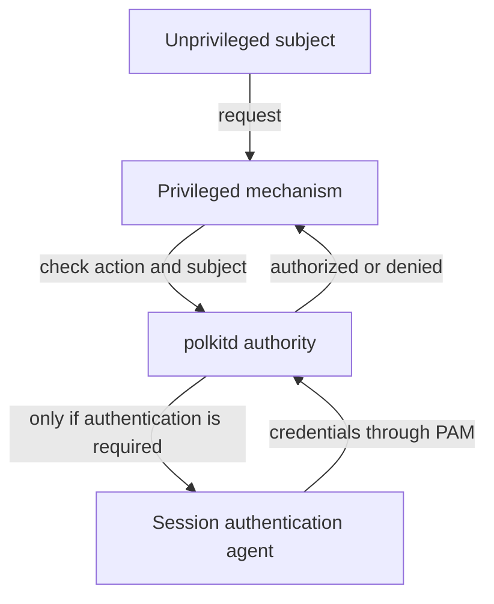
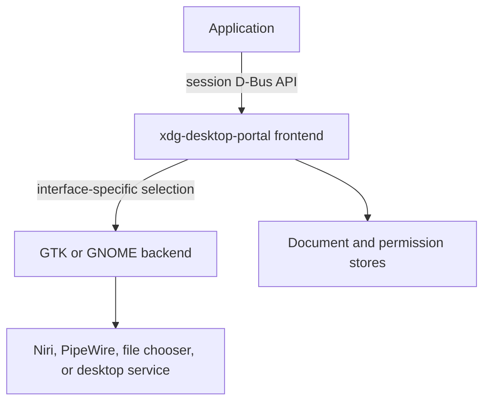

# Polkit authorization and XDG Desktop Portals

Polkit and XDG Desktop Portals both appear when a graphical application asks
the desktop to do something on its behalf. That superficial similarity causes
them to be confused, but they solve different problems:

- polkit decides whether an unprivileged subject may request a privileged
  action from a cooperating system service;
- a portal exposes a desktop capability through a stable session API and can
  mediate what an application receives;
- the polkit authentication agent only presents an identity prompt when the
  policy requires authentication;
- a portal backend implements a portal interface for the current desktop;
- neither component replaces `sudo`, PAM, the compositor, PipeWire, Mako, or a
  Secret Service provider.

This guide explains those boundaries and the exact Niri design used by the
project. The post-install repository remains the source of executable setup;
the commands here favor inspection, verification, and recovery.

## Canonical project design

| Responsibility | Project component | Scope and lifecycle |
| --- | --- | --- |
| Authorization authority | `polkitd` from `polkit` | System service on the system bus |
| Graphical authentication UI | `mate-polkit` agent | Exactly one process in each Niri user session |
| Portal frontend or broker | `xdg-desktop-portal` | D-Bus-activated user service on the session bus |
| General portal backend | `xdg-desktop-portal-gtk` | User service selected per supported interface |
| Niri screencast and desktop integration | `xdg-desktop-portal-gnome` | User service selected per supported interface |
| Portal preference | Niri's packaged `niri-portals.conf` | Selected from `XDG_CURRENT_DESKTOP=niri` |
| Graphical session setup | `niri-session` | Imports the environment into the user manager |
| Screen/audio graph | PipeWire and WirePlumber | Per-user media services |
| Desktop notifications | Mako | Session notification daemon, not a portal backend |
| Stored application secrets | GNOME Keyring | Secret Service provider; distinct from polkit |

The project does not install several authentication agents and hope one wins.
It does not enable portal services as system daemons, define blanket polkit
rules for `wheel`, or set `GDK_BACKEND` globally.

## Choose the right mental model

| Tool or framework | Principal question | Typical example |
| --- | --- | --- |
| Unix permissions | Can this process access this object using its current credentials? | Read a file owned by the user |
| `sudo` | May this user run this command under another identity? | Run `pacman -Syu` as root from a shell |
| PAM | How should this service authenticate or establish a session? | Validate a login or sudo password |
| polkit | May this subject request this named privileged action? | Ask UDisks to mount a device |
| XDG Desktop Portal | How may this application use a desktop capability? | Select a file or share one monitor |
| Secret Service | Where may an application store and retrieve credentials? | Unlock and read an application secret |

Authentication proves an identity. Authorization decides whether that identity
and its context may perform an operation. A password dialog can participate in
authorization, but displaying a dialog is not the decision itself.

For example, clicking **Mount** in a file manager can involve several layers:

1. Nautilus asks the UDisks system service to perform a storage operation.
2. UDisks identifies the caller and asks polkit about a named action.
3. Existing policy may authorize, deny, or request authentication.
4. If authentication is required, the registered MATE agent shows the dialog.
5. PAM verifies the supplied credentials.
6. polkit returns an authorization result.
7. UDisks validates the request and performs or refuses the operation.

No XDG FileChooser portal is required merely because the request originated in
a graphical file manager. Conversely, a sandboxed editor can use the
FileChooser portal to obtain one user-selected file without gaining root
privileges and without invoking polkit.

## System bus and session bus

The two frameworks normally occupy different trust and lifecycle boundaries.

| Bus | Participants in this guide | Meaning |
| --- | --- | --- |
| System D-Bus | `polkitd`, UDisks, NetworkManager, logind, privileged mechanisms | Machine-wide services and subjects from multiple sessions |
| Session D-Bus | Portal broker, portal backends, desktop applications, GNOME Keyring | One user's login session and desktop integration |

The bus is transport and service discovery, not the policy by itself. A D-Bus
method can still perform its own validation, ask polkit, expose a portal
request, or reject the caller for another reason.

## How polkit is divided



### Subject

The subject is the process or session making the request. Polkit can evaluate
context including:

- user and group membership;
- process and session identity;
- whether the session is local;
- whether it is the active session on its seat;
- the system unit associated with a process;
- action-specific details supplied by the mechanism.

“The user is in `wheel`” is therefore only one possible input. A local active
graphical session can legitimately receive a different default from a remote or
inactive session.

### Action

An action is a stable namespaced identifier for a privileged operation, such as
an operation exposed by UDisks, NetworkManager, logind, or `pkexec`. The
software that defines the operation installs an XML `.policy` file under:

```text
/usr/share/polkit-1/actions/
```

The policy declaration includes a human-readable description and message plus
implicit defaults for different session contexts. Inspect installed actions:

```bash
pkaction
pkaction --verbose | less
pkaction --action-id org.freedesktop.policykit.exec --verbose
```

Do not infer an action ID from a window label. Inspect the policy supplied by
the mechanism and correlate it with the journal.

### Mechanism

The mechanism is the privileged program that offers the action. It remains
responsible for:

- defining actions with an appropriate granularity;
- identifying the actual caller;
- supplying trustworthy request details;
- asking the authority before acting;
- validating all parameters;
- enforcing the returned decision.

Polkit does not make an arbitrary application privileged. The application must
talk to a mechanism designed to cooperate with polkit. A badly designed or
vulnerable mechanism is not repaired merely by adding an authorization check.

### Authority

`polkitd` is the system authority. It evaluates vendor policy, administrator
rules, subject context, and temporary authorizations. It communicates over the
system bus and normally runs as its own unprivileged system account.

Check its state without assuming the unit must have been manually enabled:

```bash
systemctl status polkit.service --no-pager
systemctl show polkit.service -p ActiveState -p SubState -p UnitFileState
busctl --system list | grep -F org.freedesktop.PolicyKit1
```

Activation can start a service when it is first requested. `static` or an
activation relationship is not the same thing as “broken because not enabled.”

### Authentication agent

The agent is a session UI. It registers with polkit so the authority can ask a
human to prove an identity when policy returns an authentication requirement.

It does **not**:

- decide the policy;
- run privileged operations itself;
- become `polkitd`;
- grant every prompt it displays;
- replace PAM;
- implement a desktop portal.

In this project Niri starts exactly one agent:

```text
/usr/lib/mate-polkit/polkit-mate-authentication-agent-1
```

The executable is selected because it is small and desktop-independent enough
for the assembled Niri session. Its MATE origin does not require running the
MATE desktop.

Inspect it from inside Niri:

```bash
pgrep -af '[/]usr/lib/mate-polkit/polkit-mate-authentication-agent-1'
```

Exactly one matching process is expected. Zero means graphical authentication
cannot be presented normally; more than one can cause competing prompts or
registration errors. Installing several agent packages is harmless only while
one agent is actually started for the session.

An SSH or bare TTY process may not be associated with the graphical agent.
Textual programs can use a textual agent such as `pkttyagent` when appropriate.
Do not treat the absence of a graphical dialog in an unrelated session as a
portal failure.

## Policy defaults and authorization results

A `.policy` action can distinguish three broad caller contexts:

| Default | Context |
| --- | --- |
| `allow_any` | Caller not covered by a local console-session category |
| `allow_inactive` | Local but inactive session |
| `allow_active` | Active local session |

Each can resolve to one of these policies:

| Value | Meaning |
| --- | --- |
| `no` | Deny implicitly |
| `yes` | Authorize without authentication |
| `auth_self` | Authenticate as the session owner |
| `auth_admin` | Authenticate as an administrative identity |
| `auth_self_keep` | Authenticate as self and retain temporary authorization |
| `auth_admin_keep` | Authenticate as an administrator and retain it temporarily |

`auth_admin` does not necessarily mean “type the root password.” The configured
administrator identities can include users in a group such as `wheel`. On a
machine with no usable root password, the current administrator can therefore
authenticate using that administrator's own password.

The `*_keep` forms trade repeated prompts for cached authorization. They need
care: a cached decision is associated principally with the action and subject,
while request details can change. A rule whose safety depends on changing
details should not casually return a retained authorization.

## Administrator rules

Local rules live in:

```text
/etc/polkit-1/rules.d/*.rules
```

Vendor rules normally live in:

```text
/usr/share/polkit-1/rules.d/*.rules
```

Polkit sorts files by basename across both locations. With equal basenames, the
file in `/etc` is processed before the file in `/usr`. Registered rule
functions are then consulted in order until one produces a decisive result.
A rule that returns no decision allows evaluation to continue.

Rules use a constrained JavaScript language. This is not a reason to paste a
generic snippet from the internet. A safe local rule should:

- name the smallest possible action or namespace;
- constrain the exact subject properties that matter;
- avoid unconditional `YES` for a broad group;
- return no decision for unrelated requests;
- explain why the exception exists;
- be tested from a recoverable local session;
- be reviewed again after the mechanism changes.

This illustrative fragment is deliberately **not** part of the project policy:

```javascript
polkit.addRule(function(action, subject) {
    if (action.id === "org.example.single-action" &&
        subject.local && subject.active &&
        subject.isInGroup("example-operators")) {
        return polkit.Result.AUTH_ADMIN;
    }
});
```

It shows narrow matching and an authentication requirement. It must not be
installed with the fictional action ID, and it should not be broadened to
“every action for `wheel`.” The current project needs no custom polkit rule.

Inspect configuration ownership before editing anything:

```bash
sudo find /etc/polkit-1/rules.d -maxdepth 1 -type f -print
find /usr/share/polkit-1/rules.d -maxdepth 1 -type f -print
pacman -Qo /usr/share/polkit-1/actions/*.policy 2>/dev/null | less
```

Rules are reloaded when their directories change. A syntax error or overly
broad early result can affect future authorization checks immediately; keep a
root-capable TTY available when experimenting on another system.

## `pkexec` is a test and a specific mechanism

The post-install guide uses this harmless command to prove the graphical path:

```bash
pkexec /usr/bin/true
printf 'pkexec exit status: %s\n' "$?"
```

It should produce the graphical prompt and exit with status `0` after correct
authentication. That proves the authority, agent, and authentication path can
cooperate for the `org.freedesktop.policykit.exec` action.

It does not prove that UDisks, NetworkManager, or another mechanism defines and
checks its own actions correctly. It also does not prove that portals work.

`pkexec` deliberately constructs a minimal, safer environment for the target
program. Do not use it as a recipe for starting an entire graphical file
manager or editor as root. Root-owned configuration files and privileged GUI
plugins create risks that a purpose-built privileged mechanism avoids.

## How XDG Desktop Portals are divided



### Frontend or broker

`xdg-desktop-portal` owns the application-facing
`org.freedesktop.portal.Desktop` name on the session bus. It provides stable,
cross-desktop D-Bus interfaces, validates requests, coordinates common portal
infrastructure, and delegates implementation to a selected backend.

An application should not need to know whether GTK, GNOME, KDE, or another
desktop component ultimately displays the chooser. The broker supplies the
consistent public API.

### Backend

A backend implements one or more `org.freedesktop.impl.portal.*` interfaces for
a desktop. Different backends support different interface sets and integrate
with different compositors or UI toolkits.

Having GTK and GNOME backends installed is therefore not equivalent to running
two firewalls or two notification daemons. The broker selects an implementation
for each requested interface. A fallback backend can handle ordinary dialogs
while another provides compositor-specific screencasting.

Installing every available backend is still a bad strategy. Ambiguous
selection, mismatched desktop dependencies, and competing implementations make
diagnosis harder. Install the set intended by the compositor and inspect its
preference file.

## Backend selection and `portals.conf`

Selection is configuration-driven. The broker uses `XDG_CURRENT_DESKTOP` to
look for a desktop-specific file such as:

```text
/usr/share/xdg-desktop-portal/niri-portals.conf
```

The official Arch `niri` package owns this file. Inspect rather than replace it
blindly:

```bash
printf 'XDG_CURRENT_DESKTOP=%s\n' "$XDG_CURRENT_DESKTOP"
pacman -Qo /usr/share/xdg-desktop-portal/niri-portals.conf
sed -n '1,160p' /usr/share/xdg-desktop-portal/niri-portals.conf
```

A preference file uses an INI-like format:

```ini
[preferred]
default=gtk
org.freedesktop.impl.portal.ScreenCast=gnome
```

This is an explanatory example, not a replacement for the packaged Niri file.
Each value is an ordered semicolon-separated backend list. An interface-specific
entry overrides `default` for that interface.

Configuration precedence begins with the user's XDG configuration, then
administrator configuration, user data, and system data. A generic user file:

```text
~/.config/xdg-desktop-portal/portals.conf
```

can therefore override the Niri package default. That is useful for a deliberate
per-user design and dangerous as a forgotten workaround. Diagnose all likely
sources before adding one:

```bash
find ~/.config/xdg-desktop-portal /etc/xdg/xdg-desktop-portal \
    /usr/local/share/xdg-desktop-portal /usr/share/xdg-desktop-portal \
    -maxdepth 1 -type f -name '*portals.conf' -print 2>/dev/null
```

After package upgrades, compare the packaged file before preserving an old
override. A locally copied full file does not inherit new upstream interface
choices automatically.

## Activation and the graphical environment

The broker and backends are D-Bus-activatable user services. They inherit
variables from the systemd user manager's activation environment, not
automatically from whichever interactive shell happens to launch a client.

Important variables include:

- `XDG_CURRENT_DESKTOP`, used to select portal configuration;
- `WAYLAND_DISPLAY`, used to reach the compositor;
- `DISPLAY` and `XAUTHORITY` when X11 integration is relevant;
- `XDG_DATA_DIRS`, used to find desktop and service data.

This is why the project starts the compositor through:

```bash
niri-session -l
```

rather than bare `niri`. The session helper integrates Niri with the user
manager and graphical-session lifecycle. Portal units can then start on demand
with the correct environment.

Inspect both the shell and manager environments from Kitty:

```bash
printf '%s\n' \
    "shell XDG_CURRENT_DESKTOP=$XDG_CURRENT_DESKTOP" \
    "shell WAYLAND_DISPLAY=$WAYLAND_DISPLAY"
systemctl --user show-environment | grep -E \
    '^(XDG_CURRENT_DESKTOP|XDG_SESSION_TYPE|WAYLAND_DISPLAY|DISPLAY|XDG_DATA_DIRS)='
```

Do not set `GDK_BACKEND` globally. Niri upstream warns that doing so breaks the
GNOME screencast portal. A per-application workaround should also be treated as
a specific compatibility experiment, not exported to the complete session.

## Portal interfaces are separate capabilities

| Interface | What it mediates | Important cooperating component |
| --- | --- | --- |
| FileChooser | User-selected files or save destinations | GTK/GNOME chooser and Documents portal |
| OpenURI | Opening a link or file with an appropriate application | MIME associations and app chooser |
| Screenshot | An application requesting an image of screen content | Backend and compositor |
| ScreenCast | A captured monitor, window, or virtual source | Backend, compositor, PipeWire |
| Notification | An application submitting a desktop notification | Notification implementation/daemon |
| Inhibit | Delaying idle, suspend, logout, or session switching | Session and power integration |
| Settings | Reading desktop appearance and related settings | Desktop backend and settings schemas |
| Secret | A sandbox-oriented per-application secret interface | A compatible secret backend |

Support is per interface. One successful call cannot certify the whole stack.

## FileChooser and the Documents portal

A sandboxed application cannot normally browse arbitrary host paths. The
FileChooser portal lets the desktop display a trusted chooser and grants access
only to the files selected by the user.

The grant can involve the Documents portal, which exposes selected filesystem
objects through a FUSE mount. On the host it is commonly visible under:

```text
/run/user/UID/doc
```

Inside a Flatpak sandbox the projected path can differ. The application should
use the returned URI or file descriptor rather than assume the original host
path is directly visible.

A selected document can remain accessible across sessions when the portal
stores a persistent grant. This is not equivalent to granting the application
the entire containing directory.

In the project, Nautilus is installed and can satisfy the GNOME portal's file
chooser integration. The GTK backend is also present as the general fallback.
If a file chooser fails while screencasting works, inspect the selected
FileChooser backend and its dependencies instead of reinstalling PipeWire.

## Screenshot: application request versus Niri action

Niri's bindings:

```text
Print       -> Niri interactive screenshot
Ctrl+Print  -> focused output
Alt+Print   -> focused window
```

invoke compositor functionality directly for the logged-in user. They are not
evidence that the `org.freedesktop.portal.Screenshot` interface works.

The Screenshot portal is used when an application requests a screenshot
through the standard API. Its backend mediates that request and returns the
result to the application. Diagnose the two paths independently:

- if the Print binding fails, inspect Niri configuration and compositor logs;
- if Niri captures correctly but an application portal fails, inspect portal
  backend selection and the user journal.

## ScreenCast, the compositor, and PipeWire

Screen sharing requires several components to cooperate:

1. the application creates a portal screencast session;
2. the portal asks which source types are desired;
3. the selected backend obtains sources from the compositor;
4. the user selects or approves a monitor, window, or other offered source;
5. the portal returns access to restricted PipeWire streams;
6. the application consumes those streams.

PipeWire transports frames and enforces stream access supplied through the
portal integration. It does not decide which window the user intended to share
and does not replace the portal picker. WirePlumber manages the media graph; it
does not become the authorization agent.

A blank stream can therefore occur even when audio works. Working audio proves
that PipeWire runs, not that the screencast backend can communicate correctly
with Niri or that the application received the expected node.

Modern screencast interfaces can support restore tokens and persistent choices.
A repeated session might not present the identical prompt. Persistence still
belongs to portal policy and can be revoked; it is not a blanket polkit
authorization.

## Permission store

The portal permission store associates applications, resources, and stored
decisions. It can remember document grants or decisions used by particular
portal implementations.

Consequences for diagnosis:

- absence of a second prompt does not automatically mean mediation was
  bypassed;
- reinstalling a backend does not necessarily erase stored permissions;
- an application ID matters, especially for sandboxed applications;
- revocation should target the relevant application/resource rather than
  deleting the complete user configuration directory.

If Flatpak is installed later, its permission commands can inspect and revoke
portal-related grants. That workflow belongs with the future Flatpak policy;
the current project does not install Flatpak merely to inspect native apps.

## Portals and application sandboxes

Portals were designed primarily to let sandboxed applications request narrow
desktop capabilities without opening broad holes in the sandbox. They can also
be used by unsandboxed applications because they provide consistent,
desktop-native integration.

The security boundary differs by packaging:

| Application | What the portal adds |
| --- | --- |
| Sandboxed | Mediated access to resources otherwise outside the sandbox |
| Unsandboxed | Consistent desktop API and user interaction, but not a general filesystem sandbox |

A native application using FileChooser may already have ordinary Unix access
to the file it selects. The portal still standardizes the chooser; it does not
retroactively sandbox the process.

Likewise, a portal is not a general “run as root” channel. It exposes specific
capabilities, returns deliberately limited resources, and can involve user
choice without administrator authentication.

## Mako, notification portal, and Eww

These components occupy different levels:

| Component | Role |
| --- | --- |
| Notification portal | Standard API through which an application can submit or withdraw a notification |
| Mako | Wayland notification daemon that presents desktop notifications |
| Eww | Widget and panel toolkit used to build custom UI |

Mako does not become a polkit agent or a portal broker. Eww can display custom
widgets, but it does not replace the notification protocol or portal merely by
drawing a notification-shaped window. Replacing Mako with an Eww-based system
would require a separate notification service and state design, not only a
widget layout.

## Secret Service, PAM, and the Secret portal

GNOME Keyring in this project provides the standard Secret Service used by
applications to store credentials. PAM integration can unlock the login
keyring during login. That is separate from:

- polkit, which authorizes named privileged actions;
- the polkit agent, which requests credentials for an authorization check;
- the portal broker, which routes desktop capability requests;
- the portal Secret interface, which exposes a sandbox-oriented
  per-application secret through a compatible backend.

The same installed package can participate in more than one integration, but
the protocols and security decisions remain distinct. The later Secret Service
guide will cover keyring creation, unlock timing, PAM ordering, storage, and
recovery in depth.

## Verify the project implementation

Run these checks inside a normal Niri session unless a subsection says
otherwise.

### 1. Verify installed packages and ownership

```bash
pacman -Q \
    polkit \
    mate-polkit \
    xdg-desktop-portal \
    xdg-desktop-portal-gtk \
    xdg-desktop-portal-gnome \
    niri
pacman -Qo \
    /usr/lib/mate-polkit/polkit-mate-authentication-agent-1 \
    /usr/share/xdg-desktop-portal/niri-portals.conf
```

Package ownership distinguishes a vendor file under `/usr` from a local
administrator override.

### 2. Verify the system authority

```bash
systemctl status polkit.service --no-pager
busctl --system status org.freedesktop.PolicyKit1
journalctl -b -u polkit.service --no-pager
```

The service must not be failed. Normal journal entries should be interpreted in
context; the existence of an authentication cancellation is not a daemon
failure.

### 3. Verify exactly one graphical agent

```bash
pgrep -af '[/]usr/lib/mate-polkit/polkit-mate-authentication-agent-1'
```

Then use the non-mutating `pkexec /usr/bin/true` test. Cancel once as well as
completing it once so the application path handles both outcomes.

### 4. Inspect action policy before changing it

```bash
pkaction --action-id org.freedesktop.policykit.exec --verbose
sudo find /etc/polkit-1/rules.d -maxdepth 1 -type f -print
```

An empty local-rule directory is valid. Do not create a rule just to make the
inspection produce output.

### 5. Verify the graphical activation environment

```bash
printf '%s\n' \
    "XDG_SESSION_TYPE=$XDG_SESSION_TYPE" \
    "XDG_CURRENT_DESKTOP=$XDG_CURRENT_DESKTOP" \
    "WAYLAND_DISPLAY=$WAYLAND_DISPLAY"
systemctl --user show-environment | grep -E \
    '^(XDG_SESSION_TYPE|XDG_CURRENT_DESKTOP|WAYLAND_DISPLAY|DISPLAY)='
```

Expected values identify a Wayland Niri session and a valid Wayland display.
If the shell is correct but the user manager is missing variables, inspect how
the session was launched before restarting individual backends.

### 6. Inspect backend preference

```bash
sed -n '1,160p' /usr/share/xdg-desktop-portal/niri-portals.conf
find ~/.config/xdg-desktop-portal /etc/xdg/xdg-desktop-portal \
    -maxdepth 1 -type f -name '*portals.conf' -print 2>/dev/null
```

Explain every higher-precedence file. Delete nothing until its contents and
origin are recorded.

### 7. Verify the user services

```bash
systemctl --user start xdg-desktop-portal.service
systemctl --user --no-pager --full status \
    xdg-desktop-portal.service \
    xdg-desktop-portal-gtk.service \
    xdg-desktop-portal-gnome.service
systemctl --user --failed --no-pager
```

The frontend must run when requested. A backend can remain inactive until an
interface selects it, but no related unit should be failed. Do not enable these
units globally or as root.

Inspect the session bus and journal:

```bash
busctl --user list | grep -E 'org.freedesktop.(portal|impl.portal)'
journalctl --user -b \
    -u xdg-desktop-portal.service \
    -u xdg-desktop-portal-gtk.service \
    -u xdg-desktop-portal-gnome.service \
    --no-pager
```

### 8. Perform interface-level tests

Use real applications after the structural checks:

1. open an upload or open-file action and confirm the chooser appears;
2. select a harmless file, then repeat and cancel;
3. request browser screen sharing and verify that source selection appears;
4. share one expected source and confirm the remote preview is not blank;
5. stop sharing and confirm the indicator and PipeWire stream disappear;
6. use Niri's Print binding separately and save a compositor screenshot.

The two screenshot paths and the file/screencast interfaces must be recorded as
separate results.

## Troubleshooting by symptom

| Symptom | Most likely boundary | First evidence |
| --- | --- | --- |
| Privileged GUI action does nothing | Mechanism, polkit policy, or missing agent | System journal plus agent process |
| Authorization says “not authorized” without a dialog | Policy denied or no interaction allowed | Action defaults, rule result, active/local session |
| Prompt appears in terminal instead of graphically | Caller not associated with graphical agent | Session identity and agent registration |
| Two different password dialogs compete | Multiple authentication agents | Process list and autostarts |
| `pkexec` works but mounting fails | UDisks action or mechanism request | UDisks and polkit journal, action ID |
| Portal service is inactive before first use | Possibly normal D-Bus activation | Trigger one interface, then inspect status |
| File chooser works but screen sharing fails | ScreenCast backend/compositor path | Preference file and GNOME portal journal |
| Screen-share picker opens but preview is blank | Backend-to-Niri or PipeWire stream path | GNOME portal, Niri, PipeWire logs |
| Niri screenshots work but app screenshots fail | Screenshot portal path | Interface selection and portal journal |
| Audio works but screen sharing fails | Portal/compositor path, not basic PipeWire startup | Screencast-specific logs and nodes |
| App does not ask again | Stored portal grant or temporary authorization | Identify whether the request used portal or polkit |
| Portal chooses an unexpected toolkit | Higher-precedence `portals.conf` or desktop identity | `XDG_CURRENT_DESKTOP` and all config sources |
| Portal works from one login method only | Activation environment differs | `systemctl --user show-environment` comparison |
| Mako shows native notifications but a sandboxed app cannot notify | Notification portal/backend path | Portal journal and application ID |

Do not collapse all D-Bus errors into “polkit is broken.” Note the bus name,
object/interface, user or system journal, and exact request that failed.

## Safe recovery

If graphical authorization or portals regress after a configuration change:

1. switch to a local TTY with `Ctrl+Alt+F2` and log in;
2. record the changed file and package versions;
3. inspect failed system and user units;
4. restore only the relevant local override;
5. log out of the graphical session and start a clean `niri-session`;
6. repeat the structural check before the application-level test.

Useful read-only evidence:

```bash
systemctl --failed --no-pager
systemctl --user --failed --no-pager
journalctl -b -u polkit.service --no-pager
journalctl --user -b \
    -u niri.service \
    -u xdg-desktop-portal.service \
    -u xdg-desktop-portal-gtk.service \
    -u xdg-desktop-portal-gnome.service \
    --no-pager
```

For an accidental user portal override, move the exact file aside so it is
recoverable, then restart the login session. Do not delete all of `~/.config`,
the permission store, or the complete keyring.

For a duplicate agent, remove the extra autostart or user unit. Killing all
agents is only a temporary diagnostic step; one reviewed agent must start with
the next graphical session.

Avoid these “repairs”:

- returning `polkit.Result.YES` for every action requested by `wheel`;
- running the affected graphical application as root;
- changing permissions recursively under `/usr/share/polkit-1`;
- starting portal backends with `sudo`;
- enabling every installed backend and depending on lexical chance;
- exporting `GDK_BACKEND` globally;
- deleting persistent portal or keyring data before identifying it;
- restarting random services without collecting the first failure logs.

## Project verification checklist

- [ ] `polkit.service` is healthy on the system bus.
- [ ] Exactly one MATE authentication agent runs inside Niri.
- [ ] `pkexec /usr/bin/true` succeeds after a graphical prompt.
- [ ] No unreviewed custom polkit rule grants broad passwordless access.
- [ ] Niri was started through `niri-session`, not bare `niri`.
- [ ] The systemd user-manager environment identifies Niri and Wayland.
- [ ] The packaged `niri-portals.conf` is present and its ownership is known.
- [ ] Every higher-precedence portal override is deliberate.
- [ ] The portal frontend and selected backends have no failed user units.
- [ ] FileChooser works for success and cancellation.
- [ ] ScreenCast offers the intended source and returns a working stream.
- [ ] Niri's direct screenshot bindings are tested separately.
- [ ] Mako, GNOME Keyring, PAM, PipeWire, and portals are not treated as
      interchangeable components.

## Sources

- [polkit reference manual](https://polkit.pages.freedesktop.org/polkit/polkit.8.html)
- [`pkexec(1)`](https://polkit.pages.freedesktop.org/polkit/pkexec.1.html)
- [XDG Desktop Portal documentation](https://flatpak.github.io/xdg-desktop-portal/)
- [Portal configuration and backend selection](https://flatpak.github.io/xdg-desktop-portal/docs/portals.conf.html)
- [Portal system integration](https://flatpak.github.io/xdg-desktop-portal/docs/system-integration.html)
- [Portal design considerations](https://flatpak.github.io/xdg-desktop-portal/docs/design-considerations.html)
- [FileChooser portal](https://flatpak.github.io/xdg-desktop-portal/docs/doc-org.freedesktop.portal.FileChooser.html)
- [Documents portal and FUSE](https://flatpak.github.io/xdg-desktop-portal/docs/documents-and-fuse.html)
- [ScreenCast portal](https://flatpak.github.io/xdg-desktop-portal/docs/doc-org.freedesktop.portal.ScreenCast.html)
- [Portal and PipeWire integration](https://flatpak.github.io/xdg-desktop-portal/docs/pipewire.html)
- [Niri important software](https://github.com/niri-wm/niri/wiki/Important-Software)
- [Arch package file list for Niri](https://archlinux.org/packages/extra/x86_64/niri/files/)
- Offline project snapshot: ArchWiki articles **Polkit** and
  **XDG Desktop Portal**.
