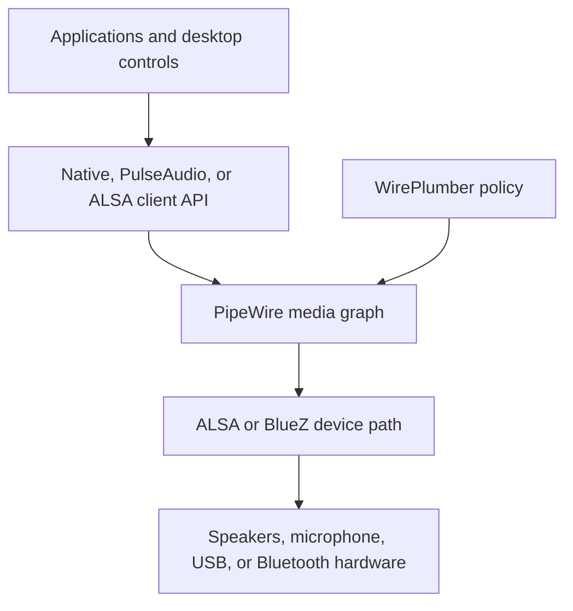
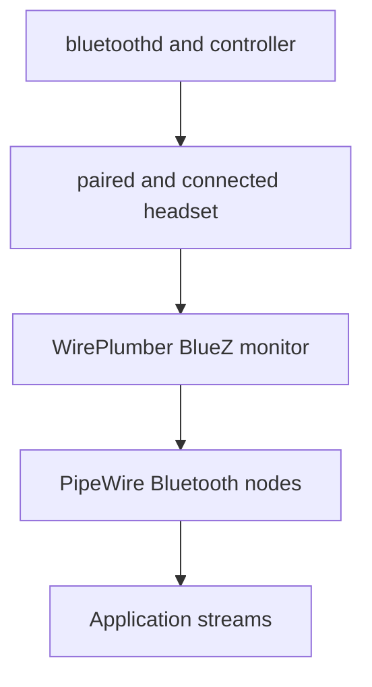

# PipeWire, WirePlumber, and audio routing

Linux audio becomes easier to diagnose once its layers stop being described as
one indistinct “sound service.” PipeWire transports and processes media in a
graph. WirePlumber discovers devices and applies session policy to that graph.
ALSA exposes kernel audio hardware and also provides a client API. BlueZ owns
Bluetooth pairing and transport. Compatibility servers let existing
PulseAudio and ALSA applications join the same PipeWire graph.

This guide explains those boundaries for the project ThinkPads. The canonical
stack was installed and tested by the post-install repository; this article is
for understanding, inspection, diagnosis, and safe future customization.

## Canonical project design

| Responsibility | Project component |
| --- | --- |
| Kernel sound drivers and hardware control | ALSA in the Linux kernel |
| Multimedia graph and data transport | `pipewire` |
| Audio support and device integration | `pipewire-audio` |
| Session policy and automatic routing | `wireplumber` |
| PulseAudio-compatible server | `pipewire-pulse` |
| ALSA default-device redirection | `pipewire-alsa` |
| Console hardware and mixer diagnostics | `alsa-utils` |
| Graph and policy control | `wpctl` |
| Graphical profiles, routes, defaults, and streams | `pavucontrol` |
| Bluetooth controller, pairing, and connection | BlueZ |
| Bluetooth audio discovery and policy | WirePlumber's BlueZ monitor |
| Niri media keys | `wpctl` commands in `niri-dotfiles` |
| Bar indicators and controls | Waybar's PulseAudio-compatible modules |

The system deliberately does **not** install the PulseAudio daemon,
`pulseaudio-bluetooth`, or the deprecated `pipewire-media-session`. It does not
run audio as a system-wide root service, add the user to the `audio` group, or
apply low-latency settings before measuring a real problem.

## The stack from application to hardware



| Layer | What a successful check proves | What it does not prove |
| --- | --- | --- |
| Kernel/ALSA | The driver exposed a sound card or PCM | PipeWire selected or routed it |
| PipeWire | The per-user media server accepts clients | A usable default device exists |
| WirePlumber | Policy manager is running | Every profile and route is correct |
| Compatibility API | That class of application can connect | Native PipeWire or another API works |
| Device route | Audio reaches a selected physical port | Every application uses that route |
| Application stream | One client is linked and producing data | Hardware quality or Bluetooth RF is good |

This is why “the service is active” and “sound works” are different results.

## ALSA is both a kernel subsystem and a userspace API

ALSA supplies the kernel drivers that expose the ThinkPad codec, HDMI audio,
USB audio devices, and low-level mixer controls. Userspace programs access
those devices through `alsa-lib`.

Three related concepts often receive the same “ALSA device” label:

| Concept | Example | Meaning |
| --- | --- | --- |
| Card | Built-in HD Audio controller | One logical sound card with controls and PCMs |
| PCM | Playback or capture endpoint | Raw sample stream presented by a card or plugin |
| Mixer control | Speaker, capture gain, mute switch | Hardware or driver-level control |

Inspect hardware enumeration:

```bash
cat /proc/asound/cards
aplay -l
arecord -l
```

These commands can succeed even when PipeWire is stopped because they query
ALSA hardware. Conversely, a device can appear in PipeWire through a virtual or
network path without being a local ALSA card.

The `pipewire-alsa` package installs ALSA configuration that makes compatible
applications using the default ALSA PCM enter PipeWire. This lets the server
mix them with other clients. It does not replace the kernel drivers.

Avoid forcing an ordinary application to a raw hardware PCM such as
`hw:0,0`. Direct hardware access can bypass policy, format conversion, and
mixing, and can hold a device exclusively. It is useful only as a deliberate
low-level diagnostic after recording the normal graph state.

## PipeWire is a graph, not only an audio daemon

PipeWire handles audio, video, MIDI, and other media as objects in a graph. The
same architecture supports ordinary desktop playback, microphones, Bluetooth,
professional-audio clients, cameras, and portal-provided screencast streams.

The important object types are:

| Object | Meaning |
| --- | --- |
| Core | The PipeWire server connection and global registry |
| Client | An application or service connected to the server |
| Device | A physical or logical device that can create nodes |
| Node | A producer, consumer, filter, or application media stream |
| Port | An input or output connection point on a node |
| Link | A negotiated connection between an output port and input port |
| Metadata | Policy-oriented values such as defaults and target choices |

Conceptually, local music playback looks like this:


A microphone reverses the media direction: the hardware capture node produces
samples and an application's recording node consumes them.

### Sink and source terminology

From an application's perspective:

- an audio **sink** consumes playback data, such as speakers or headphones;
- an audio **source** produces capture data, such as a microphone;
- a **monitor source** exposes a copy of what is playing through a sink.

“Source” does not always mean physical microphone. Selecting a sink monitor in
a recording application captures system playback instead of the room.

### Nodes and devices are different

One device can expose several nodes. A built-in sound card can provide analog
playback, analog capture, HDMI outputs, and pro-audio nodes depending on its
active profile. A Bluetooth headset can expose high-quality playback and a
lower-bandwidth duplex mode.

Changing the device profile can destroy one set of nodes and create another.
Numeric object IDs can consequently change without any package or hardware
failure.

## PipeWire provides mechanism; WirePlumber provides policy

PipeWire can register objects, negotiate formats, exchange buffers, and run the
graph. It intentionally does not encode the complete desktop policy for every
new device or stream.

WirePlumber is the session and policy manager. In the normal `main` profile it:

- monitors ALSA devices and creates appropriate device/node objects;
- monitors BlueZ for connected Bluetooth audio devices;
- selects device profiles and routes;
- chooses default playback, capture, and video nodes;
- links new application streams to suitable targets;
- reacts to hotplug, jack availability, and disconnection;
- restores deliberate user choices and per-application state;
- participates in access control and portal integration.

Without WirePlumber, the PipeWire daemon can be active while hardware nodes are
missing or application streams remain unlinked. Replacing it with another
session manager would be a policy change, not a second harmless frontend.

The old `pipewire-media-session` was an example session manager and is not part
of this project.

## Device, profile, route, default, and stream target

These five levels solve different selection problems.

| Level | Question | Example |
| --- | --- | --- |
| Device | Which logical card is this? | Built-in HD Audio controller |
| Profile | Which capabilities should the device expose? | Analog stereo duplex |
| Route/port | Which physical connector should a node use? | Speakers, headphones, internal mic |
| Default node | Where should new automatic streams normally connect? | Built-in analog stereo sink |
| Stream target | Where should this particular application stream go? | Celluloid to Bluetooth headphones |

### Profiles

A profile selects a coordinated operating mode for a device. Common examples
include:

- analog stereo output;
- analog stereo duplex, with playback and capture;
- HDMI or DisplayPort output;
- high-fidelity Bluetooth playback;
- Bluetooth headset duplex mode;
- `off`;
- pro audio for specialist workflows.

If a microphone is missing, check whether the card is using an output-only
profile before editing kernel or WirePlumber configuration. `pavucontrol`'s
**Configuration** tab makes this relationship visible.

The `pro-audio` profile is not a generic quality upgrade. It exposes hardware
more directly and can create many nodes, lose convenient automatic routing, or
require application-side channel handling. The daily-driver profile should
remain the normal stereo/duplex option unless a measured professional-audio
workflow needs otherwise.

### Routes and ports

Within a profile, a route selects a physical path such as internal speakers,
wired headphones, line out, headset microphone, or internal microphone.
Availability can come from jack detection.

A valid playback node with the wrong route can show moving level meters while
the expected connector remains silent. Route diagnosis therefore comes after
node discovery and before latency tuning.

### Default nodes

WirePlumber automatically ranks available nodes. A user selection made with:

```bash
wpctl set-default ID
```

is remembered and outranks automatic priority while that choice is usable.
The command primarily sets the target for new automatically connected streams.
Existing streams can follow depending on policy, or can be moved explicitly in
`pavucontrol`.

Undo a remembered choice and return to automatic selection with:

```bash
wpctl clear-default
```

Use the command deliberately: without an ID it clears all configured default
categories, including playback, capture, and video.

### Per-application stream targets

Every active application playback or recording stream is itself a node. A user
can move that stream to another sink or source without changing the global
default. WirePlumber can remember the application-specific choice.

This is why a single application can continue using headphones after the
default switches back to speakers. Inspect the **Playback** or **Recording**
tab while the application is actively producing or requesting media.

## Compatibility does not mean several audio servers

### PulseAudio applications

`pipewire-pulse` runs a PulseAudio-compatible protocol server connected to the
PipeWire graph. Programs using `libpulse`, including `pactl`, `pavucontrol`, and
Waybar's module named `pulseaudio`, can therefore work without the PulseAudio
daemon.

Confirm the actual server:

```bash
pactl info | grep -E 'Server Name|Server Version|Default Sink|Default Source'
```

The server name should identify PulseAudio **on PipeWire**. Seeing the word
“PulseAudio” in an application or module name does not prove the legacy daemon
is installed.

Audit the packages instead:

```bash
pacman -Q pipewire-pulse
pacman -Q pulseaudio pulseaudio-bluetooth 2>&1
```

The first package is expected; the two legacy server packages are not.

### ALSA applications

`pipewire-alsa` makes the default ALSA PCM use PipeWire. Low-level enumeration
still reports actual ALSA cards and devices. Therefore:

- `aplay -l` answers “which hardware PCMs exist?”;
- ordinary `aplay FILE` can use the configured default and enter PipeWire;
- a forced `aplay -D hw:...` bypasses the normal shared route.

### JACK applications

PipeWire can support JACK clients, but the project does not install
`pipewire-jack` merely because PipeWire is capable of doing so. Add it only
when a real JACK application or production workflow requires that API, then
test it as a separate package change.

### Native PipeWire applications

Native clients connect directly to PipeWire. A Pulse-compatible client and a
native client can still appear in the same graph and share the same hardware
through WirePlumber policy.

## User services, sockets, and lifecycle

The audio graph belongs to the logged-in user's systemd manager. Important
units include:

```text
pipewire.socket
pipewire.service
pipewire-pulse.socket
pipewire-pulse.service
wireplumber.service
```

Sockets can activate servers when a client connects. Presets and user targets
can also start WirePlumber. A unit's `enabled`, `static`, or `indirect` state is
not a functional audio test.

Inspect the complete relationship as the normal user:

```bash
systemctl --user status \
    pipewire.socket \
    pipewire.service \
    pipewire-pulse.socket \
    pipewire-pulse.service \
    wireplumber.service \
    --no-pager
systemctl --user list-dependencies wireplumber.service --no-pager
```

Do not prefix these commands with `sudo`. Root has a different user manager and
runtime directory. A root-owned PipeWire process is not a repair for a broken
desktop session.

Do not manually enable every unit when socket activation and the installed
user-session preset already work. The project tests active behavior after
`niri-session` starts.

## Reading `wpctl status`

Start with:

```bash
wpctl status
```

The hierarchy can include:

- **Devices**: cards and Bluetooth devices;
- **Sinks**: playback nodes;
- **Sources**: microphone, capture, or monitor nodes;
- **Filters**: processing or virtual nodes;
- **Streams**: active application playback/capture;
- **Video**: camera and video nodes;
- **Default Configured Devices**: remembered explicit defaults.

An asterisk normally marks the current default. The numerical IDs are live
registry IDs, useful for immediate commands but not stable configuration
identifiers.

Inspect a current object:

```bash
wpctl inspect ID
wpctl inspect --associated ID
```

Replace `ID` with a value from the same `wpctl status` snapshot. For a current
default, special identifiers avoid copying a dynamic number:

```bash
wpctl inspect @DEFAULT_AUDIO_SINK@
wpctl inspect @DEFAULT_AUDIO_SOURCE@
```

Useful properties include:

| Property | Diagnostic use |
| --- | --- |
| `media.class` | Sink, source, stream, or device role |
| `node.name` | Stable candidate for configuration matching |
| `node.description` | Human-readable label |
| `device.name` | Stable candidate for device-rule matching |
| `device.api` | ALSA, BlueZ, or another backend |
| `object.serial` | Runtime serial often safer than short live ID for tooling |
| `priority.session` | Input to automatic default selection |

Never put a short numeric ID from `wpctl status` into a persistent rule. Use a
stable property such as `node.name` or `device.name` after verifying that it is
unique on both ThinkPads.

## `pavucontrol` is still appropriate

Despite its PulseAudio name, `pavucontrol` controls this stack through the
PulseAudio-compatible server. Its tabs correspond to different graph/policy
levels:

| Tab | What it changes or displays |
| --- | --- |
| Playback | Active application output streams and their target sinks |
| Recording | Active application capture streams and their target sources |
| Output Devices | Sink volume, mute, default, and physical port |
| Input Devices | Source gain, mute, default, and physical port |
| Configuration | Device/card profiles and available capability sets |

Playback and Recording entries usually exist only while an application has an
active stream. Open the application and start playback or capture before
concluding that its entry is missing.

Use `pavucontrol` before writing rules for ordinary choices. A graphical manual
selection is reversible, reveals the available profiles/routes, and lets
WirePlumber remember the user's intent.

## Volume, mute, gain, and amplification

`wpctl` accepts floating-point or percentage values:

```bash
wpctl get-volume @DEFAULT_AUDIO_SINK@
wpctl set-volume @DEFAULT_AUDIO_SINK@ 40%
wpctl set-volume -l 1.0 @DEFAULT_AUDIO_SINK@ 5%+
wpctl set-volume @DEFAULT_AUDIO_SINK@ 5%-
wpctl set-mute @DEFAULT_AUDIO_SINK@ toggle
wpctl set-mute @DEFAULT_AUDIO_SOURCE@ toggle
```

`1.0` represents 100%. Values above it are software amplification, not extra
hardware capability. They can clip or amplify noise. The Niri and Waybar
output-volume increase commands deliberately use `-l 1.0` to cap the result.

Mute and volume are separate state. A node at 0% is not necessarily marked
muted, and a muted node can retain its previous volume for later unmute.

Capture “volume” is input gain. Raising it can amplify room noise and analog
noise as well as speech. Diagnose the selected source and route before setting
the microphone permanently above 100%.

Per-stream volume is separate from device volume. An application can be quiet
even while the sink is at 100%, or can have its own mute restored by
WirePlumber.

## Niri media keys and Waybar

The tracked Niri configuration uses:

| Key | Command target |
| --- | --- |
| Volume up/down | `@DEFAULT_AUDIO_SINK@` |
| Speaker mute | `@DEFAULT_AUDIO_SINK@` |
| Microphone mute | `@DEFAULT_AUDIO_SOURCE@` |

These special identifiers resolve when the key is pressed. They follow the
current default rather than a hard-coded ThinkPad node ID.

Waybar's `pulseaudio` and `pulseaudio#microphone` modules use the compatible
PulseAudio protocol but execute `wpctl` for clicks and scrolls. They are control
surfaces; closing Waybar does not stop PipeWire, and restarting PipeWire does
not require restarting Niri.

The ThinkPad microphone-mute LED is a useful indicator only when the driver and
desktop state remain synchronized. Verify the actual source state:

```bash
wpctl get-volume @DEFAULT_AUDIO_SOURCE@
```

A lit or dark LED alone is not proof that applications can or cannot record.

## Bluetooth audio crosses two stacks

BlueZ and PipeWire solve different halves of Bluetooth audio:



BlueZ owns discovery, pairing, trust, connection, and Bluetooth protocols.
WirePlumber observes connected audio endpoints, chooses profiles, and exposes
PipeWire nodes. A device can therefore be paired and connected in
`bluetoothctl` while no usable audio sink exists yet.

### A2DP and headset profiles

| Mode | Primary purpose | Playback | Microphone |
| --- | --- | --- | --- |
| A2DP | Music and high-quality media | Higher-quality stereo | Normally unavailable |
| HFP/HSP | Calls and headset use | Lower-bandwidth duplex audio | Available |
| LE Audio/BAP | Newer Bluetooth audio roles | Device-dependent | Device-dependent |

The exact codec and capability set depends on the headset, controller, BlueZ,
PipeWire build, and negotiated profile. Installing a codec library does not
force a headset to support that codec.

WirePlumber can switch from A2DP to a headset profile when an application opens
the headset microphone, then restore the previous profile afterward. A sudden
drop in playback quality during a call is therefore often expected duplex
behavior, not corruption.

Before disabling automatic switching, decide which requirement matters:

- high-quality playback with no headset microphone;
- duplex headset microphone with reduced playback quality;
- use of the ThinkPad's built-in microphone while retaining A2DP output.

The third option often avoids a profile change: select the Bluetooth sink as
output and the built-in source as input in `pavucontrol` or the calling
application.

Do not install `pulseaudio-bluetooth`. The Arch `pipewire-audio` package already
provides the project's Bluetooth audio path.

### Bluetooth diagnosis order

```bash
systemctl status bluetooth.service --no-pager
rfkill list bluetooth
bluetoothctl show
bluetoothctl devices Connected
wpctl status
pactl list cards
```

Ask in order:

1. does the kernel expose an unblocked controller?
2. is `bluetoothd` running?
3. is the expected device paired and connected?
4. did WirePlumber create a BlueZ device?
5. does its active profile create the desired sink/source?
6. is that node default or targeted by the application?

Restarting the PipeWire server cannot pair a device; removing and re-pairing a
device cannot repair a failed user PipeWire service.

## Sample rate, quantum, and latency

PipeWire schedules connected nodes as a graph. Two values help describe a
processing cycle:

- **rate**: samples per second, commonly 48,000 Hz for a desktop graph;
- **quantum**: frames processed per graph cycle.

One quantum of theoretical duration is:

$$
t = \frac{Q}{f_s}
$$

where $Q$ is the quantum in frames and $f_s$ is the rate in samples per
second.

For 1024 frames at 48 kHz:

$$
t = \frac{1024}{48000}\ \mathrm{s} \approx 21.3\ \mathrm{ms}
$$

This is not complete end-to-end latency. Hardware buffers, resampling,
Bluetooth encoding and radio transport, application buffering, and multiple
graph periods add delay.

Resampling is normal when a stream or hardware clock differs from the graph
rate. For a general laptop, forcing every advertised sample rate, 192 kHz, or a
tiny quantum can increase CPU use and instability without audible benefit.

Inspect the live graph while audio plays:

```bash
pw-top
```

`pw-top` shows node activity, rate, quantum, CPU time, and error/xrun-related
counters. A single historical counter is less informative than a counter that
increases exactly when clicks occur.

Do not tune latency until the test states:

- the application and device used;
- wired, USB, or Bluetooth transport;
- sample rate and quantum;
- CPU load and power state;
- whether errors rise in `pw-top`;
- whether the symptom survives a normal reboot.

## Real-time scheduling and resource limits

Low-latency media benefits from timely scheduling. PipeWire and the desktop
session use the distribution's systemd and real-time integration. Ordinary
desktop audio does not require membership in the legacy `audio` group.

Do not pre-emptively add unlimited memlock, extreme real-time priorities, or
custom thread settings. Incorrect values can harm the whole system and hide a
driver, powersaving, or Bluetooth problem.

Look for evidence first:

```bash
journalctl --user -b -u pipewire.service -u wireplumber.service --no-pager
pw-top
systemctl --user show pipewire.service -p LimitRTPRIO -p LimitMEMLOCK
```

Warnings must be read alongside audible behavior and increasing error counts.

## Configuration versus remembered state

WirePlumber intentionally remembers ordinary choices. Its state directory is:

```text
~/.local/state/wireplumber/
```

It can contain separate state for:

- configured default nodes;
- the last profile selected for a device;
- routes, volumes, mutes, and channel volumes;
- per-application stream properties and targets;
- Bluetooth profile autoswitch restoration;
- settings explicitly saved at runtime.

This is **state**, not administrator configuration. A preference can survive a
restart even when no custom `.conf` exists.

Inspect without editing:

```bash
find ~/.local/state/wireplumber -maxdepth 1 -type f -print 2>/dev/null
wpctl status
wpctl settings
```

Use the narrowest correction:

- wrong default node: `wpctl set-default` or `wpctl clear-default`;
- wrong current route/profile: `pavucontrol`;
- wrong per-application target: move that active stream;
- saved dynamic setting: inspect and reset that setting;
- corrupt or irreducible state: only then consider a controlled reset.

Some WirePlumber releases provide a `wpctl reset` subcommand. Check the
installed command set first:

```bash
wpctl --version
wpctl --help | grep -w reset
```

Only when `reset` is listed, preview its effect without changing anything:

```bash
wpctl reset --dry-run
```

Do not follow the preview with `wpctl reset`, `--wireplumber-config`, or
`--all` unless the scope has been reviewed and the useful configuration/state
has been backed up. Those forms delete progressively more user data. On an
older release without this subcommand, do not replace it with an improvised
recursive deletion.

## Permanent configuration and precedence

The package owns defaults below `/usr/share`; the administrator or user should
add small fragments instead of copying the complete vendor file.

| Scope | Recommended location |
| --- | --- |
| Distribution defaults | `/usr/share/wireplumber/` |
| Host-wide local policy | `/etc/wireplumber/wireplumber.conf.d/*.conf` |
| Per-user policy | `~/.config/wireplumber/wireplumber.conf.d/*.conf` |

WirePlumber loads fragments from lower- to higher-priority locations so local
administrator and user values can override distribution data. Within each
location, `.conf` fragments are processed alphanumerically.

WirePlumber 0.5 uses SPA-JSON `.conf` fragments. Old advice that creates:

```text
~/.config/wireplumber/main.lua.d/
~/.config/wireplumber/policy.lua.d/
~/.config/wireplumber/bluetooth.lua.d/
```

targets WirePlumber 0.4 and must be migrated, not copied into this project.

Before adding a rule, obtain stable properties:

```bash
wpctl status
wpctl inspect ID
```

A minimal illustrative rename rule has this shape:

```ini
monitor.alsa.rules = [
  {
    matches = [
      { node.name = "alsa_output.example.analog-stereo" }
    ]
    actions = {
      update-props = { node.description = "Example speakers" }
    }
  }
]
```

The fictional node name makes this an example, not a file to install. A real
rule should match the inspected `node.name` or `device.name`, explain its
purpose, and be tested on both ThinkPads before entering shared dotfiles.

PipeWire's own daemon and compatibility-server fragments live under analogous
paths such as:

```text
/etc/pipewire/pipewire.conf.d/
~/.config/pipewire/pipewire.conf.d/
~/.config/pipewire/pipewire-pulse.conf.d/
```

Most device, profile, route, and linking decisions belong to WirePlumber, not a
PipeWire daemon fragment. Choose the owner of the behavior before choosing the
directory.

## Tools and the question each answers

| Tool | Best first question |
| --- | --- |
| `aplay -l`, `arecord -l` | Did ALSA enumerate playback/capture hardware? |
| `alsamixer` | Is a low-level hardware control muted or at zero? |
| `speaker-test` | Can a controlled test reach playback channels? |
| `wpctl status` | Which devices, nodes, defaults, and streams exist now? |
| `wpctl inspect` | Which properties identify this object? |
| `wpctl get-volume` | What are the current volume and mute state? |
| `pavucontrol` | Which profile, route, default, and per-app target is selected? |
| `pactl info` | Does the PulseAudio-compatible server answer? |
| `pactl list short sinks` | Which Pulse-compatible playback nodes exist? |
| `pactl list short sources` | Which capture/monitor nodes exist? |
| `pw-top` | Which nodes run, and do timing errors increase? |
| `pw-dump` | What is the complete PipeWire object snapshot? |
| `journalctl --user` | Why did a user service or monitor fail? |

`pw-dump` produces a large JSON description useful for comparison:

```bash
pw-dump > /tmp/pipewire-graph.json
```

The dump can include application and device metadata. Review it before sharing
and remove only that known temporary file when finished:

```bash
rm /tmp/pipewire-graph.json
```

## Complete local verification

Run ordinary commands as the logged-in user from Kitty inside Niri.

### 1. Verify packages and exclude overlapping servers

```bash
pacman -Q \
    pipewire \
    pipewire-audio \
    pipewire-alsa \
    pipewire-pulse \
    wireplumber \
    alsa-utils \
    pavucontrol \
    bluez \
    bluez-utils
pacman -Q pulseaudio pulseaudio-bluetooth pipewire-media-session 2>&1
```

The canonical packages must exist. The three overlapping or deprecated
packages should be absent.

### 2. Verify user-service health

```bash
systemctl --user is-active \
    pipewire.service \
    pipewire-pulse.service \
    wireplumber.service
systemctl --user --failed --no-pager
```

All three should report `active`, with no unexplained failed user unit.

### 3. Verify each API boundary

```bash
pactl info | grep -E 'Server Name|Default Sink|Default Source'
wpctl status
aplay -l
arecord -l
```

Interpret them separately: Pulse-compatible connection, PipeWire policy view,
ALSA playback hardware, and ALSA capture hardware.

### 4. Inspect current defaults

```bash
wpctl get-volume @DEFAULT_AUDIO_SINK@
wpctl get-volume @DEFAULT_AUDIO_SOURCE@
wpctl inspect @DEFAULT_AUDIO_SINK@
wpctl inspect @DEFAULT_AUDIO_SOURCE@
```

Confirm the sink is the intended speakers/headphones and the source is a real
microphone rather than a monitor source.

### 5. Test speakers conservatively

```bash
wpctl set-volume @DEFAULT_AUDIO_SINK@ 40%
wpctl set-mute @DEFAULT_AUDIO_SINK@ 0
speaker-test -c 2 -t wav -l 1
```

The voice should alternate left and right. Stop immediately if the level is
uncomfortable or the selected default is an unexpected external device.

### 6. Test capture without retaining private audio

First close applications that might own or monitor the microphone. Confirm the
source, unmute it, and record a short intentional phrase:

```bash
wpctl set-mute @DEFAULT_AUDIO_SOURCE@ 0
arecord -d 5 -f cd /tmp/arch-audio-test.wav
aplay /tmp/arch-audio-test.wav
rm /tmp/arch-audio-test.wav
```

The final command removes only the named test file. Do not record surrounding
conversation and do not retain the file after verification.

### 7. Verify desktop controls

Test:

- volume up and down;
- speaker mute and unmute;
- microphone mute and unmute;
- Waybar values after each action;
- the microphone LED alongside actual `wpctl` state;
- `pavucontrol` opening and showing the same current devices.

The controls should change one current default, not a stale hard-coded ID.

### 8. Test application routing

Play audio simultaneously in Firefox and Celluloid. With `pavucontrol` open:

1. identify both playback streams;
2. change the volume of only one stream;
3. move one stream to another available sink, if a safe second sink exists;
4. stop both applications;
5. confirm their stream nodes disappear.

Do not create a virtual sink merely to complete this test.

### 9. Test Bluetooth conditionally

With a real headset available:

1. pair and connect it through Blueman or `bluetoothctl`;
2. confirm its device and sink appear in `wpctl status`;
3. select high-fidelity playback and play known audio;
4. start a microphone test and observe whether the profile changes;
5. stop capture and confirm high-quality playback returns;
6. disconnect and verify the built-in sink/source become usable again.

Record which microphone was selected; using the built-in microphone can avoid
the Bluetooth duplex quality trade-off.

### 10. Test suspend and hotplug

After successful baseline tests:

1. play ordinary audio;
2. suspend and resume;
3. confirm the same device or a sensible fallback returns;
4. connect and disconnect wired headphones;
5. reconnect the Bluetooth device if one was used;
6. inspect `wpctl status`, then the journal only if behavior changed.

This catches device lifecycle failures that a fresh-login test cannot.

## Troubleshooting by symptom

| Symptom | Likely layer | First evidence |
| --- | --- | --- |
| No cards in `aplay -l` | Kernel driver, firmware, or hardware | `lspci -k`, `dmesg`, `/proc/asound/cards` |
| ALSA sees card; `wpctl` does not | WirePlumber ALSA monitor/profile | WirePlumber journal and object status |
| `wpctl` cannot connect | PipeWire service/runtime directory | User service and socket status |
| `pactl` says connection refused | `pipewire-pulse` boundary | Pulse socket/service and journal |
| Sink exists but no sound | Mute, volume, profile, route, or stream target | `wpctl`, `pavucontrol`, active stream |
| Level meter moves; wrong connector is silent | Route/port selection | Output Devices port and jack availability |
| Only one application is silent | Per-stream volume/target or client API | Playback tab while stream is active |
| Browser works; ALSA application fails | ALSA compatibility/client choice | `pipewire-alsa`, application device setting |
| Microphone missing | Output-only profile or wrong input route | Configuration and Input Devices tabs |
| Recording captures desktop audio | Monitor source selected | Default/stream source name |
| Media key changes no audible volume | Wrong default or app targets another sink | Special-ID inspection and playback stream |
| Volume above 100% distorts | Software amplification/clipping | `wpctl get-volume` and app volume |
| Wired headphones do not take over | Jack detection, route, or saved choice | Route availability and default state |
| Bluetooth connected; no audio node | BlueZ profile or WirePlumber BlueZ monitor | `bluetoothctl`, WirePlumber journal |
| Bluetooth playback becomes poor during a call | HFP/HSP duplex profile | Active profile and selected microphone |
| A2DP sounds good but headset mic is absent | Expected A2DP capability boundary | Device profiles |
| Audio does not return after BT disconnect | Saved target/default or selection policy | Configured defaults and available nodes |
| Pops or crackles under load | Timing xrun, driver, power, or Bluetooth RF | `pw-top` counters and journal |
| Audio fails only after suspend | Device/driver resume or policy restoration | Before/after graph and current-boot journal |
| Sound works as root, not as user | Wrong test context and session ownership | Runtime directory and user services |
| Mic LED disagrees with bar | Driver/LED synchronization or wrong source | Actual default-source mute state |

Follow the first boundary that diverges. Reinstalling every audio package before
identifying that boundary destroys evidence and rarely repairs a wrong route.

## Journal-led diagnosis

Capture current state before restarting anything:

```bash
wpctl status
pactl info
systemctl --user --failed --no-pager
journalctl --user -b \
    -u pipewire.service \
    -u pipewire-pulse.service \
    -u wireplumber.service \
    --no-pager
```

For Bluetooth, add the system daemon log:

```bash
journalctl -b -u bluetooth.service --no-pager
```

Correlate timestamps with connect, play, capture, suspend, or resume actions.
Warnings printed once at startup are weaker evidence than a new error at the
exact moment the graph fails.

Temporary WirePlumber debug logging can be enabled at runtime on current
versions:

```bash
wpctl set-log-level D
```

Reproduce the issue briefly, collect the user journal, then restore the normal
level:

```bash
wpctl set-log-level -
```

Debug logs can be large and may include application/device names. Do not leave
debug logging active indefinitely.

## Safe recovery sequence

Use the smallest step that matches the failed layer.

### Wrong default, route, or profile

1. open `pavucontrol`;
2. select the expected profile and port;
3. set the intended sink/source as default;
4. move the existing application stream if necessary;
5. use `wpctl clear-default` only when a stale explicit default blocks automatic
   selection.

No service restart is required for an ordinary selection error.

### WirePlumber policy stopped reacting

After collecting logs:

```bash
systemctl --user restart wireplumber.service
wpctl status
```

This restarts policy management without unnecessarily destroying the PipeWire
server first. Applications may reconnect or be relinked.

### PipeWire or compatibility server failed

After recording the first failure:

```bash
systemctl --user restart \
    pipewire.service \
    pipewire-pulse.service \
    wireplumber.service
systemctl --user --failed --no-pager
wpctl status
pactl info
```

Some applications need to restart their stream after the server restarts. A
clean logout and login is the stronger session-lifecycle test if the manual
restart produces an ambiguous partial recovery.

### A local fragment caused the regression

From a TTY or a working terminal:

1. identify the exact new file under `~/.config/wireplumber`,
   `/etc/wireplumber`, or `~/.config/pipewire`;
2. move that one file aside with a descriptive backup name;
3. restart the owning user service;
4. verify the baseline before editing the fragment again.

Do not delete package files under `/usr/share` or the complete configuration
tree.

### State appears corrupt

First check whether the installed `wpctl` supports a managed reset:

```bash
wpctl --version
wpctl --help | grep -w reset
```

If it does, preview the exact scope:

```bash
wpctl reset --dry-run
```

Prefer clearing one default or correcting one profile. If a full state reset is
eventually justified, back up `~/.local/state/wireplumber`, close media
applications, and use the managed reset workflow provided by the installed
version. Do not add `--wireplumber-config` or `--all` unless deleting user
configuration is also an explicit decision. If no managed reset exists, stop
WirePlumber and consult the documentation for that exact version before
touching its state directory.

## Changes intentionally deferred

The daily-driver baseline does not yet add:

- EasyEffects, equalizers, convolution, or noise suppression;
- virtual sinks, loopbacks, or simultaneous-output devices;
- network audio, RTP, AirPlay, or RAOP discovery;
- JACK compatibility and professional-audio profiles;
- forced codecs or experimental BlueZ roles;
- custom sample rates, resampler quality, quantum, or latency;
- system-wide multi-user audio;
- per-device WirePlumber rules without measured hardware evidence.

Each can be useful. Each also changes routing, latency, privacy, CPU use, or
recovery and therefore deserves its own requirement and verification.

## Project verification checklist

- [ ] ALSA enumerates the built-in playback and capture hardware.
- [ ] PipeWire, PipeWire-Pulse, and WirePlumber are healthy user services.
- [ ] PulseAudio clients report a PipeWire-compatible server.
- [ ] No PulseAudio daemon or deprecated session manager overlaps the stack.
- [ ] `wpctl status` shows expected devices, sinks, sources, and defaults.
- [ ] The default source is a microphone, not an unintended monitor source.
- [ ] Speaker output works at a controlled volume on both channels.
- [ ] A short intentional microphone recording works and is deleted.
- [ ] Niri keys, Waybar, `wpctl`, and `pavucontrol` agree on mute and volume.
- [ ] Application streams can be identified and routed independently.
- [ ] Wired hotplug and suspend/resume restore a sensible route.
- [ ] A tested Bluetooth headset exposes the expected profile and nodes.
- [ ] The A2DP versus headset-microphone trade-off is understood.
- [ ] Numeric runtime IDs are not stored in persistent configuration.
- [ ] User choices in WirePlumber state are distinguished from `.conf` policy.
- [ ] No latency, codec, or DSP tweak exists without a measured requirement.

## Sources

- [PipeWire overview](https://docs.pipewire.org/page_overview.html)
- [PipeWire object design](https://docs.pipewire.org/page_objects_design.html)
- [PipeWire session-manager responsibilities](https://docs.pipewire.org/page_session_manager.html)
- [`pipewire-pulse(1)`](https://docs.pipewire.org/page_man_pipewire-pulse_1.html)
- [`pipewire-props(7)`](https://docs.pipewire.org/page_man_pipewire-props_7.html)
- [`pw-top(1)`](https://docs.pipewire.org/page_man_pw-top_1.html)
- [`pw-dump(1)`](https://docs.pipewire.org/page_man_pw-dump_1.html)
- [WirePlumber documentation](https://pipewire.pages.freedesktop.org/wireplumber/)
- [`wpctl(1)`](https://pipewire.pages.freedesktop.org/wireplumber/man/wpctl.html)
- [WirePlumber configuration fragments](https://pipewire.pages.freedesktop.org/wireplumber/daemon/configuration/modifying_configuration.html)
- [WirePlumber file and state locations](https://pipewire.pages.freedesktop.org/wireplumber/daemon/locations.html)
- [WirePlumber Bluetooth configuration](https://pipewire.pages.freedesktop.org/wireplumber/daemon/configuration/bluetooth.html)
- [WirePlumber linking policy](https://pipewire.pages.freedesktop.org/wireplumber/policies/linking.html)
- [Arch package: `pipewire-audio`](https://archlinux.org/packages/extra/x86_64/pipewire-audio/)
- [Arch package: `pipewire-pulse`](https://archlinux.org/packages/extra/x86_64/pipewire-pulse/)
- [Arch package: `wireplumber`](https://archlinux.org/packages/extra/x86_64/wireplumber/)
- Offline project snapshot: ArchWiki articles **PipeWire**, **WirePlumber**, and
  **Bluetooth headset**.
