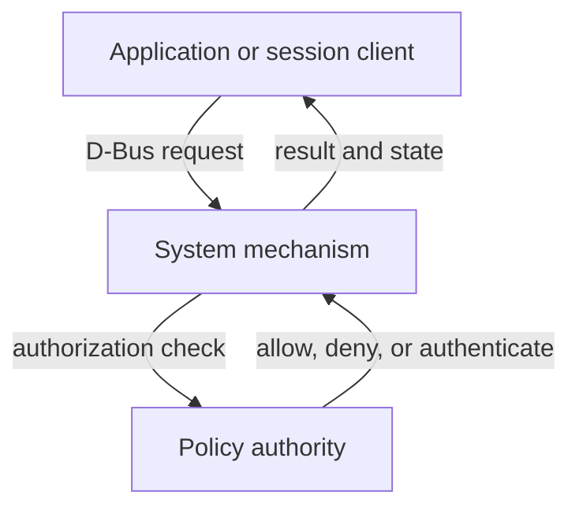
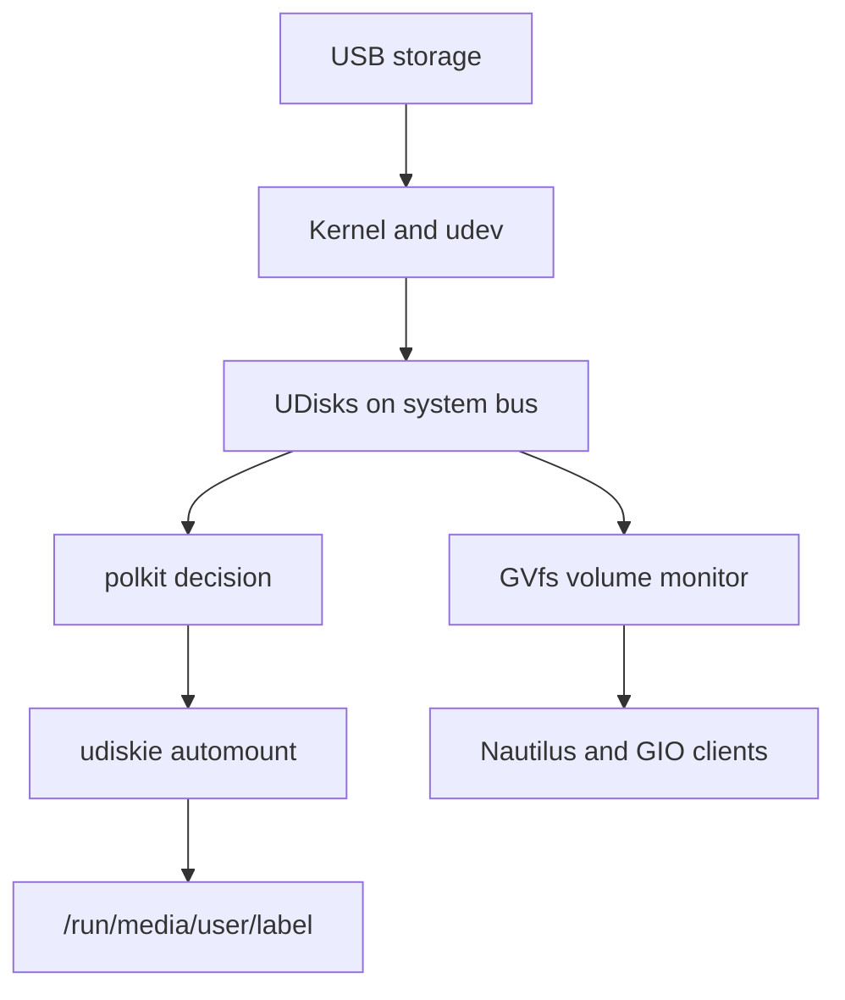
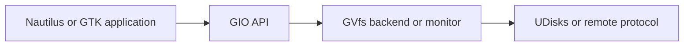

# Bluetooth, removable media, and Secret Service

## Purpose and scope

A desktop can make Bluetooth devices, USB drives, Android phones, and saved
credentials look like four unrelated features. Underneath, they share several
important patterns:

- a privileged system service owns hardware or machine-wide operations;
- applications communicate with that service over D-Bus;
- polkit may authorize a storage operation according to session context;
- user-session services provide presentation, automation, or application APIs;
- PAM can pass the login credential to a session service at authentication
  time.

Confusing these layers leads to predictable mistakes: starting system daemons
inside Niri, adding the user to powerful groups, enabling every unit shown by
`systemctl`, storing secrets in dotfiles, or editing the wrong PAM service
file.

This guide explains the design selected by this project:

| Responsibility | Project component | Scope |
| --- | --- | --- |
| Bluetooth protocol daemon | BlueZ `bluetoothd` | System |
| Bluetooth administration client | `bluetoothctl` from `bluez-utils` | Command-line client |
| Graphical Bluetooth client and agent | Blueman | User session |
| Bluetooth audio transport | BlueZ plus PipeWire/WirePlumber | System and user session |
| Storage operation service | UDisks 2 | System |
| Removable-media automounter | udiskie | User session |
| GTK file and volume integration | GIO plus GVfs | User session |
| Android file access | `gvfs-mtp` | User session |
| Standard credential API | Secret Service | User session protocol |
| Secret Service implementation | GNOME Keyring | User session |
| Secret Service client library and CLI | libsecret and `secret-tool` | Application/client |
| Login-keyring unlock | `pam_gnome_keyring.so` | PAM service used for login |

The post-install repository remains the executable installation procedure.
This article supplies the mental model, inspection commands, failure
boundaries, and recovery reasoning.

The guide does not enable Bluetooth PAN or DUN networking, OBEX file receiving,
unknown BlueZ experimental features, network shares, automatic unlocking of
arbitrary encrypted disks, a blank keyring password, automatic login, or broad
passwordless polkit rules. Bluetooth audio routing itself is covered by the
preceding PipeWire and WirePlumber guide.

## Canonical project design

The installed package set is:

```text
bluez
bluez-utils
blueman
udisks2
udiskie
gvfs
gvfs-mtp
gnome-keyring
libsecret
```

Only `bluetooth.service` is deliberately enabled as a new system service.
UDisks, GVfs, and GNOME Keyring use activation mechanisms; they are not enabled
as conventional always-on system daemons by this project.

The Niri dotfiles deploy one XDG autostart entry:

```ini
[Desktop Entry]
Type=Application
Name=Udiskie
Comment=Automatically mount removable media
TryExec=udiskie
Exec=udiskie --no-notify
Terminal=false
```

That entry makes udiskie the single proactive removable-media automounter.
`--no-notify` prevents udiskie from duplicating the desktop notification
policy, while absence of `--tray` prevents another permanent tray item. The
automount behavior itself remains enabled.

The Secret Service design is equally deliberate:

- GNOME Keyring owns `org.freedesktop.secrets` on the user bus;
- libsecret clients use the standard API instead of knowing the provider's
  storage format;
- the login collection uses the same password as the `neon` account;
- PAM receives that password during an ordinary password-based login and
  unlocks the collection;
- `/etc/pam.d/login` covers the manual TTY path;
- `/etc/pam.d/greetd` covers the final tuigreet/greetd path;
- `/etc/pam.d/passwd` keeps the collection password synchronized when the
  account password changes.

There is no automatic login. There is no blank keyring password. Generated
state under `~/.local/share/keyrings/` never belongs in Git.

## One recurring architecture: mechanism, policy, and presentation

These features become easier to understand when each process is assigned one
role.



For removable storage:

- Nautilus, udiskie, or `udisksctl` is the client;
- `udisksd` is the privileged mechanism;
- polkit evaluates the UDisks action and current session;
- the MATE polkit agent presents a password prompt only when policy requires
  authentication.

For Bluetooth:

- Blueman or `bluetoothctl` is the client;
- `bluetoothd` owns the system Bluetooth state and protocol operations;
- a Bluetooth pairing agent handles confirmation, PIN, or passkey interaction;
- that pairing agent is **not** the polkit authentication agent.

For stored application credentials:

- an application or `secret-tool` is the client;
- GNOME Keyring implements the Secret Service on the user bus;
- a collection may be locked or unlocked;
- PAM participates only at login or password-change time.

The same D-Bus transport appears in all three cases, but D-Bus is only the
communication channel. It does not itself authorize a mount, pair a device,
or decrypt a keyring.

## System bus and user bus boundaries

BlueZ and UDisks expose machine-wide objects on the **system bus**:

| Bus name | Owner | Typical objects |
| --- | --- | --- |
| `org.bluez` | `bluetoothd` | Adapters, remote devices, profiles, transports |
| `org.freedesktop.UDisks2` | `udisksd` | Drives, block devices, partitions, filesystems |

GNOME Keyring and GVfs expose per-login-session functionality on the **user
bus**:

| Bus name | Owner | Typical role |
| --- | --- | --- |
| `org.freedesktop.secrets` | GNOME Keyring | Collections and secret items |
| `org.gnome.keyring` | GNOME Keyring | Provider-specific interfaces |
| `org.gtk.vfs.Daemon` | GVfs | Virtual filesystem coordination |
| `org.gtk.vfs.UDisks2VolumeMonitor` | GVfs | Storage visibility for GIO clients |
| `org.gtk.vfs.MTPVolumeMonitor` | `gvfs-mtp` | Android/media-player discovery |

Use the matching bus when inspecting a name:

```bash
busctl --system status org.bluez
busctl --system status org.freedesktop.UDisks2
busctl --user status org.freedesktop.secrets
busctl --user status org.gtk.vfs.Daemon
```

A missing user-bus name from a bare TTY does not prove that its package is
broken. The normal test belongs inside the Niri session started by
`niri-session`, where the user manager and session bus have the expected
environment.

## Bluetooth from radio to application

### The layers

Bluetooth is not one daemon and one icon. The useful layers are:

| Layer | Example in this project | Responsibility |
| --- | --- | --- |
| Physical radio | ThinkPad Bluetooth controller | Transmit and receive radio frames |
| Kernel driver | Commonly `btusb` plus Bluetooth kernel modules | Expose the controller to Linux |
| Radio blocking | rfkill | Record software and hardware block state |
| System protocol daemon | BlueZ `bluetoothd` | Manage adapters, devices, pairing, services, profiles |
| D-Bus client | `bluetoothctl` or Blueman | Request operations and present state |
| Pairing agent | `bluetoothctl` agent or Blueman agent | Confirm identity, PIN, or passkey |
| Profile consumer | PipeWire, input stack, or another service | Implement the selected device function |

A loaded `btusb` module does not mean `bluetoothd` is running. A running daemon
does not mean the radio is powered. A powered adapter does not mean any device
is paired. A paired device does not have to be connected.

### BR/EDR and Low Energy

BlueZ can manage Bluetooth Classic, formally BR/EDR, and Bluetooth Low Energy
(LE). A device may expose one bearer or both:

- headphones and legacy audio commonly depend on Classic profiles;
- keyboards and mice may use Classic HID or LE HID;
- sensors commonly advertise through LE;
- a dual-mode device can expose services through both bearers.

Discovery therefore does not always produce a stable public-looking hardware
address. LE privacy can use random addresses during discovery. Identify a
device by the expected name, physical interaction, advertised role, and
pairing confirmation—not by accepting the first unfamiliar address printed by
a scan.

### Adapter states are different controls

`rfkill` and BlueZ power are related but not interchangeable:

| State | Meaning |
| --- | --- |
| Hard blocked | Firmware or physical control denies radio use; software cannot override it |
| Soft blocked | Linux rfkill policy currently disables the radio |
| BlueZ `Powered: no` | Adapter exists but BlueZ has not powered it |
| BlueZ `Discoverable: yes` | Other devices may discover this host for a bounded period |
| BlueZ `Pairable: yes` | Incoming pairing requests may be accepted |
| BlueZ `Discovering: yes` | This host is actively scanning |

Inspect before changing anything:

```bash
rfkill list bluetooth
systemctl is-enabled bluetooth.service
systemctl is-active bluetooth.service
bluetoothctl show
```

If the adapter is only soft blocked, change that one radio:

```bash
sudo rfkill unblock bluetooth
bluetoothctl power on
```

Do not use `rfkill unblock all` merely to fix Bluetooth. It can alter an
intentional Wi-Fi or WWAN state. A hard block must be resolved at the hardware,
firmware, or platform level.

BlueZ's D-Bus `Powered` property is not intrinsically persistent across adapter
restart. Distribution defaults or BlueZ policy may power it automatically
when the service starts. Diagnose the effective behavior rather than adding a
custom `main.conf` option pre-emptively.

### Pairing, bonding, trusting, and connecting

These words describe different state:

| State | Meaning |
| --- | --- |
| Discovered | BlueZ has seen an advertisement or inquiry response |
| Paired | The pairing exchange completed and established an encrypted relationship |
| Bonded | Pairing information was saved persistently |
| Trusted | Local policy marks the remote device as trusted |
| Connected | A transport connection exists now |
| Services resolved | BlueZ completed service discovery for the device |

The distinction matters during diagnosis. A device can be bonded and trusted
while switched off, so `Connected: no` is then normal. Conversely, a temporary
connection during pairing is not proof that the bond was saved.

Use `info` for the complete state of one deliberately selected device:

```bash
bluetoothctl devices
bluetoothctl info DEVICE_MAC_ADDRESS
```

Replace the placeholder with the address printed for that device. Never paste
an example address from documentation.

`trust` is not a stronger cryptographic pairing. It changes local policy about
future behavior, especially reconnection and incoming interactions. Trust only
devices you own or deliberately administer.

### Pairing agents are not polkit agents

A Bluetooth pairing agent can:

- display or ask for a PIN;
- display a passkey;
- ask whether two passkeys match;
- authorize a Bluetooth service request.

A polkit authentication agent asks a user to authenticate for a named
privileged action. They use different protocols and register with different
services. The MATE polkit agent cannot replace a BlueZ pairing agent, and a
Blueman dialog cannot authorize a UDisks polkit action merely because both
dialogs ask a question.

For a transparent console pairing test:

```text
bluetoothctl
power on
agent on
default-agent
scan on
devices
pair DEVICE_MAC_ADDRESS
trust DEVICE_MAC_ADDRESS
connect DEVICE_MAC_ADDRESS
scan off
info DEVICE_MAC_ADDRESS
quit
```

Confirm every numeric comparison or code on both devices. Stop the scan after
the intended device is found. Leaving continuous discovery running wastes
power and clutters the device cache.

Blueman provides the graphical equivalent. Do not run a permanent
`bluetoothctl` interactive shell in parallel simply to keep an agent alive if
Blueman already supplies the graphical agent for the session.

The Arch Blueman package owns `/etc/xdg/autostart/blueman.desktop`. In this
project, `niri-session` starts the standard XDG desktop-autostart target, so the
package can launch one `blueman-applet` process without adding another command
to the Niri dotfiles. Inspect that ownership and process explicitly:

```bash
pacman -Qo /etc/xdg/autostart/blueman.desktop
pgrep -a -x blueman-applet
```

The applet can provide the session pairing agent and, once Waybar supplies a
StatusNotifier host, its tray item. It remains a client of the system BlueZ
daemon; it is not a second Bluetooth stack.

### Remove, disconnect, and untrust are not synonyms

- `disconnect DEVICE` ends the current connection but keeps pairing data;
- `untrust DEVICE` clears the local trust flag but keeps the device object and
  bond;
- `remove DEVICE` removes cached information and bonding information from the
  adapter.

Use removal when intentionally starting a clean re-pair, not as the first
response to a transient disconnect:

```text
bluetoothctl
disconnect DEVICE_MAC_ADDRESS
remove DEVICE_MAC_ADDRESS
quit
```

The remote device may also retain the old bond. Remove the laptop from the
remote device's saved-device list before repeating pairing when keys have
become inconsistent.

### Profiles determine what a connection does

Pairing creates a relationship; a **profile** gives the connection a purpose.
Examples include audio, keyboard/mouse input, battery information, and network
access.

For headphones, BlueZ exposes transports and PipeWire/WirePlumber create audio
objects. A device that is connected in BlueZ but absent from `wpctl status` is
therefore a cross-layer problem. Inspect both:

```bash
bluetoothctl info DEVICE_MAC_ADDRESS
wpctl status
systemctl --user status pipewire.service wireplumber.service --no-pager
```

Profile selection, A2DP quality, headset microphones, HFP/HSP, and stream
routing are explained in
[PipeWire, WirePlumber, and audio routing](11-pipewire-wireplumber-and-audio-routing.md).

Bluetooth keyboards and mice instead enter the kernel input path. They do not
need PipeWire. Do not enable wake-from-suspend for a device merely because it
can connect; BlueZ exposes a separate `WakeAllowed` property, and the project
leaves that capability off until suspend behavior is deliberately tested.

### Bluetooth is not automatically IP networking

Normal Bluetooth audio, HID, and LE traffic is not an IP listener and is not
opened by a firewalld TCP/UDP service. This does **not** mean Bluetooth is
outside security review.

Bluetooth PAN or DUN can create an IP-capable network interface. If that
feature is later enabled, NetworkManager and firewalld must classify the new
interface and its traffic. The project does not currently enable PAN, DUN,
always-discoverable mode, or Bluetooth network sharing.

OBEX file receiving is another separate service. Blueman being installed does
not authorize an always-running inbox. The project does not install or enable
a Bluetooth file-transfer server.

## Removable-media architecture

### From USB insertion to a visible directory



Each layer contributes something different:

1. the kernel discovers the drive and creates block devices;
2. udev records device properties;
3. UDisks represents drives, partitions, filesystems, and capabilities over
   the system bus;
4. polkit evaluates whether this caller may request the operation;
5. udiskie requests mounts automatically in the graphical session;
6. GVfs lets GIO applications observe volumes and use non-POSIX backends;
7. Nautilus presents the result.

Neither udiskie nor Nautilus performs a privileged `mount(2)` system call on
its own. They ask UDisks.

### UDisks is the mechanism

UDisks exposes `org.freedesktop.UDisks2` on the system bus. It can enumerate
storage and perform operations such as:

- mount and unmount a filesystem;
- unlock and lock supported encrypted devices;
- create or remove loop devices;
- eject removable media;
- request that a drive be powered off;
- expose drive health and metadata where supported.

The daemon validates the object and checks authorization. A GUI request does
not become safe merely because it arrived through D-Bus.

The intended command-line client is `udisksctl`:

```bash
udisksctl status
udisksctl info --block-device /dev/sdX1
udisksctl mount --block-device /dev/sdX1
udisksctl unmount --block-device /dev/sdX1
udisksctl power-off --block-device /dev/sdX
```

`/dev/sdX` and `/dev/sdX1` are placeholders. Resolve the actual whole-drive
and partition names every time:

```bash
lsblk -o NAME,PATH,TYPE,SIZE,FSTYPE,LABEL,UUID,MOUNTPOINTS,MODEL,TRAN
```

Choosing the wrong block device can affect the installed system. Never infer a
device name only from an old command history.

### Polkit evaluates the context

UDisks has fine-grained actions for removable filesystems, system devices,
other seats, other users, encrypted volumes, power-off, and other operations.
The default policy normally treats a user in an active local session more
favorably for a removable device attached to that seat than:

- an inactive session;
- a remote session;
- a device attached to another seat;
- a drive classified as a system device.

This is why an ordinary USB stick can mount without a password while an
internal system partition requests administrator authentication. The behavior
does not imply that the user gained unrestricted `mount` capability.

Do not “fix” a prompt by:

- adding `neon` to `disk` or another broad storage group;
- creating a rule that returns `YES` for every UDisks action;
- running the file manager as root;
- replacing udiskie with `sudo mount` scripts.

First identify the exact device classification, session state, and action:

```bash
loginctl session-status
udisksctl info --block-device /dev/sdX1
journalctl -b -u udisks2.service --no-pager
journalctl -b _COMM=polkitd --no-pager
```

The project already has one graphical polkit agent. A missing authentication
dialog is an agent/session problem, not evidence that broad authorization is
required.

### Activation is not enablement

The UDisks package supplies integration that lets D-Bus start the daemon when a
client requests `org.freedesktop.UDisks2`. Therefore:

- `udisksctl status` can activate it;
- a file manager or volume monitor can activate it;
- the daemon may remain running after activation;
- `systemctl is-enabled udisks2.service` does not need to say `enabled`.

Do not run:

```bash
sudo systemctl enable udisks2.service
```

The relevant tests are whether the bus name resolves, the unit is healthy when
used, and operations follow policy:

```bash
busctl --system status org.freedesktop.UDisks2
systemctl status udisks2.service --no-pager
udisksctl status
```

### udiskie is automation, not another storage daemon

udiskie watches UDisks and requests appropriate operations for the logged-in
user. Its default daemon behavior includes automount. The project starts:

```text
udiskie --no-notify
```

It does not start udiskie as root, enable a system unit, or place its command
inside the Niri configuration. The portable XDG autostart entry is appropriate
because udiskie is a generic session utility rather than a compositor feature.

Inspect the deployed link and process:

```bash
readlink -f ~/.config/autostart/udiskie.desktop
pgrep -a -x udiskie
```

Exactly one process is expected in a fresh Niri session. Two automounters can
race, duplicate prompts, or make it unclear which policy mounted a device.
Keep udiskie as the single proactive automounter; let file managers act as
clients and views rather than introducing another background automount daemon.

udiskie's optional password cache for encrypted removable media is not enabled.
The project does not store removable-drive passphrases in its autostart entry
or dotfiles.

### A mount is not a permanent filesystem definition

A UDisks mount below `/run/media/$USER/` is session-oriented:

- its path is created at runtime;
- the label can influence the final directory name;
- it disappears after unmount;
- it is not an `/etc/fstab` entry;
- it is not a stable application-data path.

Use `/etc/fstab` with stable identifiers for deliberately persistent local
filesystems. Use UDisks for interactive removable media. Do not make a USB
stick permanent merely to obtain a predictable `/dev/sdX1` name; that name is
not stable.

Inspect the real result:

```bash
lsblk -o NAME,FSTYPE,LABEL,UUID,MOUNTPOINTS
findmnt --real
```

### Unmount, eject, and power off

These actions are related but distinct:

| Action | Effect |
| --- | --- |
| Unmount | Detach a mounted filesystem and flush the required filesystem state |
| Lock | Close a previously unlocked encrypted mapping |
| Eject | Request media removal from a device such as an optical drive |
| Power off/detach | Prepare a whole drive for safe removal and request transport-level removal/power-down |

For one known USB drive, identify all its partitions, close open files, then
unmount the mounted filesystems:

```bash
lsblk -o NAME,TYPE,FSTYPE,LABEL,MOUNTPOINTS /dev/sdX
udisksctl unmount --block-device /dev/sdX1
```

When appropriate for that whole USB device:

```bash
udisksctl power-off --block-device /dev/sdX
```

Alternatively, udiskie can unmount and detach a selected mounted device:

```bash
udiskie-umount --detach '/run/media/neon/DEVICE_LABEL'
```

Replace the path with the exact mountpoint. Quote paths containing spaces.

Do not use forced unmount as the routine answer to “target is busy.” First
close terminals whose current directory is on the drive, file-manager windows,
media players, editors, and copy operations. Re-run `findmnt` and `lsblk`.

Powering off a multi-slot reader or enclosure can affect several logical drives
behind one physical USB device. Inspect the topology before requesting it.

### Automount is a convenience with a threat boundary

Mounting unknown media causes the kernel or userspace filesystem implementation
to parse attacker-controlled structures. Autorun is not part of this project,
but “nothing launches” does not make arbitrary media harmless.

For normal owned USB drives, udiskie's automount is an accepted convenience.
For media of unknown origin:

- do not insert it into the daily-driver system merely to identify it;
- do not unlock an unknown encrypted container;
- do not execute software or open active documents from it;
- consider a disposable, isolated analysis environment;
- treat USBGuard or a stricter device policy as a separate future project.

Disabling the firewall does not make removable media safer, and enabling the
firewall does not inspect a local filesystem.

## GIO, GVfs, and MTP

### GIO is the application-facing abstraction

GIO gives GLib applications abstractions such as files, drives, volumes,
mounts, streams, application handlers, and asynchronous I/O. An application
can therefore work with a `GFile` that represents:

- an ordinary path;
- an SFTP location;
- an MTP object on a phone;
- another backend-specific URI.

The object need not map directly to a kernel-mounted POSIX filesystem.

### GVfs supplies implementations and volume monitors

GVfs extends GIO with user-session daemons, backends, and volume monitors. In
the current Arch package, relevant components include:

- `gvfsd`, the coordinating daemon;
- `gvfsd-fuse`, a compatibility bridge for some non-GIO applications;
- `gvfs-udisks2-volume-monitor`, which presents UDisks volumes to GIO;
- per-backend daemons and D-Bus activation files;
- user units started on demand.

The conceptual relationship is:



GVfs does not replace UDisks for privileged block-device operations. UDisks
does not replace GVfs for application-facing virtual filesystems. udiskie does
not replace either one; it adds automount policy to the user session.

### Local filesystem mount versus GVfs location

A conventional USB filesystem mounted through UDisks normally appears below:

```text
/run/media/neon/LABEL
```

A remote or virtual GVfs location can instead be represented by a URI and may
be bridged under:

```text
/run/user/UID/gvfs/
```

The bridge path is runtime state. Do not put its generated names into dotfiles,
`/etc/fstab`, backup source definitions, or scripts intended to work across
machines. Prefer the application's GIO URI or discover the current mount.

Inspect GIO-visible mounts without assuming a path:

```bash
gio mount --list --detail
```

Inspect activated services:

```bash
systemctl --user status \
    gvfs-daemon.service \
    gvfs-udisks2-volume-monitor.service \
    gvfs-mtp-volume-monitor.service \
    --no-pager
```

An inactive backend before any application requests it can be normal. A failed
unit during an actual access attempt is not.

### MTP is not USB mass storage

Modern Android phones usually expose files through Media Transfer Protocol
(MTP), not as a raw block device. Consequences include:

- `lsblk` may not show a mountable phone filesystem;
- `mount /dev/...` is the wrong model;
- the phone remains in control of which objects are visible;
- the screen may need to be unlocked;
- USB mode must normally be changed from charging to file transfer;
- a charge-only cable cannot carry MTP data.

`gvfs-mtp` adds an MTP volume monitor and backend. Nautilus can then display
the phone through GIO. Inspect the session:

```bash
gio mount --list --detail
systemctl --user status gvfs-mtp-volume-monitor.service --no-pager
journalctl --user -b -u gvfs-mtp-volume-monitor.service --no-pager
```

The phone may appear with an `mtp://` URI. Its GVfs/FUSE representation can
change between connections, so discover it instead of hard-coding it.

If MTP fails, check in this order:

1. unlock the phone;
2. select its **File transfer** USB mode;
3. try a known data-capable cable and another port;
4. confirm `gvfs-mtp` is installed;
5. close another program that may exclusively own the device;
6. inspect the user journal and kernel log;
7. reconnect only after the previous attempt has released the device.

Do not install a second MTP stack at random while GVfs still owns the active
attempt. Parallel clients can make an exclusivity failure look like missing
driver support.

### Backends are capabilities, not a mandate to enable services

Installing base GVfs does not mean every possible remote protocol has been
selected. Arch splits several integrations into packages. This project
deliberately installs `gvfs-mtp` but does not yet add:

- SMB discovery or credentials;
- NFS browsing;
- GNOME Online Accounts;
- cloud storage providers;
- Avahi-based network discovery.

Add one backend only for a documented use case, then review its network,
credential, and firewall implications. A file manager showing a **Network**
location is not proof that network sharing is configured safely.

## Secret Service and GNOME Keyring

### Protocol, provider, client, and collection

“The keyring” can refer to several different things. Use these precise terms:

| Term | Meaning in this project |
| --- | --- |
| Secret Service | Standard D-Bus API at `org.freedesktop.secrets` |
| GNOME Keyring | Service implementation and encrypted collection storage |
| libsecret | Client library for Secret Service |
| `secret-tool` | libsecret command-line client |
| Collection | Group of secret items that can be locked or unlocked |
| Login collection | Collection intended to unlock with the account login |
| Item | One secret plus label, attributes, and other properties |
| Attributes | Key/value metadata used to find an item |

An application asks the standard service to store or retrieve an item. It
should not parse `~/.local/share/keyrings/` itself.

### Labels and attributes are not the secret

`secret-tool` demonstrates the object model:

```bash
printf '%s' 'temporary-test-secret' | secret-tool store \
    --label='Arch handbook verification' \
    project arch-handbook \
    purpose verification

secret-tool lookup \
    project arch-handbook \
    purpose verification

secret-tool clear \
    project arch-handbook \
    purpose verification
```

The bytes passed on standard input are the secret. `project`, `purpose`, their
values, and the label are lookup/display metadata. Do not put a password,
token, private key, or recovery phrase in an attribute name, attribute value,
or label.

Use unique attributes. Storing another value with the same attribute set can
update the existing item rather than create an independent one.

The example is intentionally disposable. Never use a real credential merely
to prove the service works.

### Encryption at rest and access while unlocked

Three protection layers have different jobs:

| Layer | Protects against | Does not by itself protect against |
| --- | --- | --- |
| LUKS | Offline reading of the laptop filesystem without disk unlock | A process after the system is booted and unlocked |
| Keyring collection encryption | Reading stored item secrets while that collection is locked | Same-user applications while the collection is unlocked and accessible |
| Application sandbox and bus policy | Some cross-application access paths | Every unsandboxed process running as the same desktop user |

GNOME Keyring is useful, but it is not a magical boundary between all programs
owned by `neon`. An unsandboxed malicious process running as the user is already
inside a powerful trust boundary and may interact with the session, observe
input, read many user files, or request secrets from an unlocked service.

Therefore:

- keep untrusted software out of the session;
- do not treat the keyring as a substitute for package review;
- do not commit its state;
- do not make the login collection password blank;
- lock the session when leaving the computer;
- preserve full-disk encryption for powered-off protection.

### GNOME Keyring is not a full password-manager workflow

GNOME Keyring supplies application credential storage and cryptographic
services. It does not by itself provide the cross-device vault, browser
workflow, sharing model, recovery design, and deliberate user-facing
organization expected from a dedicated password manager.

A dedicated password manager can coexist as an application, but only one
provider can own `org.freedesktop.secrets` at a time. Replacing GNOME Keyring
as the Secret Service provider is a separate migration:

1. identify every current client;
2. export or recreate required credentials safely;
3. change the provider and activation ownership;
4. remove overlapping startup paths;
5. verify login, portals, Git clients, browsers, and applications;
6. preserve rollback.

Do not start two providers and rely on whichever acquires the bus name first.

### Service activation

The Arch GNOME Keyring package supplies:

- `gnome-keyring-daemon`;
- a systemd user service and socket;
- D-Bus service files, including `org.freedesktop.secrets`;
- XDG autostart entries for supported components;
- `pam_gnome_keyring.so`.

This project does not add a manual
`gnome-keyring-daemon --start` command to Niri. Modern session and activation
mechanisms must own one daemon instance.

Inspect rather than enable blindly:

```bash
systemctl --user status \
    gnome-keyring-daemon.socket \
    gnome-keyring-daemon.service \
    --no-pager
busctl --user status org.freedesktop.secrets
pgrep -a -f '^/usr/bin/gnome-keyring-daemon'
```

`active` after a client request is useful. A socket or D-Bus-activated unit
does not need a hand-created `WantedBy=default.target` link.

### PAM supplies login-time integration

PAM has four module types. GNOME Keyring uses three:

| PAM type | Project purpose |
| --- | --- |
| `auth` | Receive the successful login credential for keyring unlock |
| `session` | Start/connect the session component and complete unlock setup |
| `password` | Keep the login-collection password synchronized with account password changes |

The selected hooks are:

```pam
auth       optional     pam_gnome_keyring.so
session    optional     pam_gnome_keyring.so auto_start
password   optional     pam_gnome_keyring.so
```

`optional` means a keyring failure should not by itself reject a valid login.
It does **not** make arbitrary editing safe. A malformed PAM file, wrong
include, or damaged required line can still lock users out.

The keyring password must match the account password for silent unlock. It does
not need to equal the LUKS passphrase, and this project does not attempt to pass
the early-boot LUKS credential directly into greetd.

### PAM is selected by the authenticating application

PAM configuration is not one global file. Each PAM-aware program names a
service, and that service file can include shared stacks:

```text
login  -> /etc/pam.d/login  -> shared Arch stacks
greetd -> /etc/pam.d/greetd -> shared Arch stacks
passwd -> /etc/pam.d/passwd -> password-change stack
```

Adding `pam_gnome_keyring.so` to `/etc/pam.d/login` affects `login`. It does
not automatically affect greetd merely because both authenticate the same
Linux account.

That distinction is central to this project's staged rollout:

1. chapter 07 first adds the hooks to `/etc/pam.d/login` while Niri still starts
   after manual TTY login;
2. chapter 11 later installs and enables greetd;
3. before greetd becomes the normal entry point, equivalent `auth` and
   `session` hooks must be added to `/etc/pam.d/greetd`;
4. `/etc/pam.d/passwd` remains shared for deliberate account-password changes.

The corrected chapter 11 backs up `/etc/pam.d/greetd`, preserves its existing
package policy, and adds only:

```pam
auth       optional     pam_gnome_keyring.so
session    optional     pam_gnome_keyring.so auto_start
```

Do not replace the complete greetd policy with a copied `login` file. The two
applications may need different program-specific rules even when they include
the same Arch base stacks.

### Why autologin conflicts with automatic keyring unlock

PAM can pass a password only when authentication supplies one. With automatic
login there may be no login password available to unlock the collection.

Setting a blank password on the keyring avoids the prompt by removing useful
at-rest protection for that collection. Hard-coding the account or keyring
password in a command, environment variable, dotfile, or greetd configuration
is worse.

The project therefore keeps password-based tuigreet login. This simultaneously
preserves:

- authentication at session start;
- automatic login-collection unlock;
- no credential in Git;
- a simple recovery model through another TTY.

### Password changes can desynchronize the collection

When `passwd` changes the account password, its
`password optional pam_gnome_keyring.so` hook can update the login collection
while the old credential is available.

Desynchronization can still occur when:

- the keyring password was changed separately;
- the account password was reset through a path that did not run the hook;
- the hook was absent or failed;
- an old keyring was copied from another installation.

The symptom is usually an extra keyring unlock prompt or a message that the
login password no longer matches the keyring.

Do not delete `~/.local/share/keyrings/` as the first fix. That directory can
contain the only stored copy of application credentials. First:

1. back up the directory to encrypted offline storage;
2. confirm whether the collection contains required secrets;
3. use a supported keyring-management UI if one is deliberately installed;
4. change the collection password with knowledge of the old password;
5. recreate the collection only after accepting that its stored secrets will
   be lost.

## Verify the complete project stack

Run the following checks inside a normal Niri session reached through tuigreet.
Use a TTY only where explicitly stated.

### 1. Verify package ownership

```bash
pacman -Q \
    bluez \
    bluez-utils \
    blueman \
    udisks2 \
    udiskie \
    gvfs \
    gvfs-mtp \
    gnome-keyring \
    libsecret

pacman -Qo \
    /usr/bin/bluetoothctl \
    /usr/bin/udisksctl \
    /usr/bin/udiskie \
    /usr/bin/secret-tool \
    /usr/lib/security/pam_gnome_keyring.so
```

Every path must be owned by the expected official package. Do not replace a
packaged PAM module or service binary with a downloaded script.

### 2. Verify system services and buses

```bash
systemctl is-enabled bluetooth.service
systemctl is-active bluetooth.service
busctl --system status org.bluez

udisksctl status
busctl --system status org.freedesktop.UDisks2

systemctl --failed --no-pager
```

Bluetooth must be enabled and active. UDisks must answer after activation. No
failed system unit should be hidden to make the checklist pass.

### 3. Verify Bluetooth state

```bash
rfkill list bluetooth
bluetoothctl show
bluetoothctl devices
```

For each deliberately paired device:

```bash
bluetoothctl info DEVICE_MAC_ADDRESS
```

Confirm the expected `Paired`, `Bonded`, `Trusted`, and current `Connected`
state. Remove an unknown trusted device after identifying how it appeared.

If testing headphones, cross-check the media graph:

```bash
wpctl status
```

### 4. Verify the automounter and UDisks path

```bash
pgrep -a -x udiskie
readlink -f ~/.config/autostart/udiskie.desktop
udisksctl status
```

Insert only a non-essential, owned test drive. Then:

```bash
lsblk -o NAME,TYPE,SIZE,FSTYPE,LABEL,UUID,MOUNTPOINTS,MODEL,TRAN
findmnt -t vfat,exfat,ntfs,ntfs3,ext4
```

The filesystem should mount below `/run/media/neon/`. Open and read a disposable
test file. Close every application using it, unmount it, and verify the
mountpoint disappears before unplugging.

### 5. Verify GVfs and MTP activation

```bash
gio mount --list --detail
systemctl --user --failed --no-pager
systemctl --user status \
    gvfs-daemon.service \
    gvfs-udisks2-volume-monitor.service \
    gvfs-mtp-volume-monitor.service \
    --no-pager
```

Do not require the MTP service to remain active when no phone has requested it.
If an Android device is available, unlock it, select file-transfer mode, and
confirm Nautilus and `gio mount --list --detail` see the same intended device.

### 6. Verify the effective PAM hooks

Keep a working recovery TTY open before auditing or changing PAM:

```bash
sudo grep -n 'pam_gnome_keyring' \
    /etc/pam.d/login \
    /etc/pam.d/greetd \
    /etc/pam.d/passwd

test -e /usr/lib/security/pam_gnome_keyring.so
```

Expected roles:

| File | Expected hooks |
| --- | --- |
| `/etc/pam.d/login` | `auth` and `session ... auto_start` |
| `/etc/pam.d/greetd` | `auth` and `session ... auto_start` |
| `/etc/pam.d/passwd` | `password` |

Review the complete service files without invoking an interactive pager as
root:

```bash
sudo sed -n '1,220p' \
    /etc/pam.d/login \
    /etc/pam.d/greetd \
    /etc/pam.d/passwd
```

A matching grep line does not prove that the rest of the PAM stack is intact
or that the hook is in the intended section.

### 7. Verify Secret Service and unlock behavior

After a fresh password-based tuigreet login:

```bash
systemctl --user is-active gnome-keyring-daemon.service
busctl --user status org.freedesktop.secrets
pgrep -a -f '^/usr/bin/gnome-keyring-daemon'
```

Then use the disposable `secret-tool` transaction:

```bash
printf '%s' 'temporary-test-secret' | secret-tool store \
    --label='Arch handbook verification' \
    project arch-handbook \
    purpose verification

secret-tool lookup \
    project arch-handbook \
    purpose verification

secret-tool clear \
    project arch-handbook \
    purpose verification
```

The lookup must print the disposable value, and clear must remove it. The test
must not ask for the login-keyring password separately immediately after a
successful tuigreet login.

### 8. Verify no unintended exposure or tracked state

```bash
sudo ss -lntup
sudo firewall-cmd --get-active-zones
git -C ~/Projects/CycloniteRDX/niri-dotfiles status --short
```

Normal Bluetooth, UDisks, GVfs, and Secret Service operation does not require a
new public TCP/UDP port or firewalld service. The dotfiles tree must not contain
keyring files, Bluetooth bonds, device identifiers, removable-media contents,
or credentials.

## Troubleshooting by boundary

### No Bluetooth controller appears

Inspect from the bottom upward:

```bash
rfkill list
lsusb
lsmod | grep -E '^btusb|^bluetooth'
journalctl -b -k --no-pager | grep -Ei 'bluetooth|btusb|firmware'
systemctl status bluetooth.service --no-pager
bluetoothctl list
```

Interpret the first failing boundary:

- absent from hardware enumeration suggests firmware, USB, or platform state;
- present but hard blocked requires hardware/firmware action;
- driver or firmware errors belong to the kernel boundary;
- a healthy controller with failed `bluetooth.service` belongs to BlueZ;
- a working `bluetoothctl show` with a broken tray is only a session-client
  problem.

Do not edit `/etc/bluetooth/main.conf` until the failure has been located and a
specific option is justified.

### Pairing repeatedly fails

Check:

1. the intended device is in pairing mode;
2. it is not connected to another host;
3. an agent is registered;
4. both sides show and confirm the same code;
5. the old bond is removed on both sides if keys are stale;
6. the journal records the actual authentication reason.

```bash
journalctl -b -u bluetooth.service --no-pager
bluetoothctl info DEVICE_MAC_ADDRESS
```

Do not blindly mark the device trusted before a successful, identified pairing.

### A paired device will not reconnect

`Paired: yes` and `Bonded: yes` prove stored relationship state, not that the
remote device is awake, in range, or exposing the required profile. Check
`Connected`, `ServicesResolved`, battery, radio state, and whether another host
owns the connection.

For audio, inspect WirePlumber after BlueZ. For input, inspect kernel input
events after BlueZ. Do not erase the bond until transient connection causes
have been ruled out.

### USB media does not automount

Check the layers in order:

```bash
lsblk -o NAME,TYPE,SIZE,FSTYPE,LABEL,MOUNTPOINTS,MODEL,TRAN
udisksctl status
pgrep -a -x udiskie
loginctl session-status
systemctl --user --failed --no-pager
journalctl -b -u udisks2.service --no-pager
journalctl --user -b --no-pager | grep -Ei 'udiskie|udisks|gvfs'
```

Likely boundaries:

- no block device: cable, enclosure, kernel, or hardware;
- device but no recognizable filesystem: filesystem or support package;
- UDisks error: mechanism, media, or policy;
- polkit denial without a dialog: session or authentication-agent issue;
- UDisks works manually but no automount: udiskie/autostart issue;
- mount exists but Nautilus does not show it: GVfs/GIO presentation issue.

Do not add a permanent `fstab` entry to hide an udiskie startup failure.

### Unmount reports that the target is busy

Confirm the exact mount:

```bash
findmnt '/run/media/neon/DEVICE_LABEL'
lsblk -o NAME,FSTYPE,LABEL,MOUNTPOINTS
```

Close:

- terminals whose current directory is below the mount;
- editors and media players using a file;
- file-manager windows showing the device;
- copy, indexing, or checksum operations.

Retry ordinary unmount. Forced unmount can cause data loss or leave an
application with an invalid view; it is not the routine solution.

### Nautilus sees a drive but not the phone

A USB drive and MTP phone follow different paths. For the phone:

- unlock the screen;
- select file-transfer/MTP mode;
- verify the cable carries data;
- inspect `gvfs-mtp-volume-monitor.service`;
- close other MTP clients;
- reconnect and inspect `gio mount --list --detail`.

The absence of a phone from `lsblk` is expected under MTP.

### Secret Service name is missing

Inside Niri:

```bash
systemctl --user status \
    gnome-keyring-daemon.socket \
    gnome-keyring-daemon.service \
    --no-pager
journalctl --user -b -u gnome-keyring-daemon.service --no-pager
busctl --user list | grep -E 'org\.freedesktop\.secrets|org\.gnome\.keyring'
```

Check package ownership and activation files before adding a manual daemon
command. Starting a second daemon can mask the original activation failure.

### The service exists but the login collection stays locked

Identify how this session authenticated:

```bash
loginctl session-status
sudo grep -n 'pam_gnome_keyring' \
    /etc/pam.d/login \
    /etc/pam.d/greetd \
    /etc/pam.d/passwd
journalctl -b --no-pager | grep -Ei 'gkr-pam|gnome-keyring|greetd'
```

If the session came from greetd, hooks only in `/etc/pam.d/login` are
insufficient. If hooks are present but a separate unlock password is requested,
investigate password mismatch rather than adding duplicate daemon startups.

### A PAM edit prevents new logins

Keep the original authenticated session open while testing PAM. From that
session or a previously opened recovery TTY:

```bash
sudo cp --archive \
    /etc/pam.d/greetd.before-gnome-keyring \
    /etc/pam.d/greetd
sudo systemctl restart greetd.service
```

If the failure affects manual `login` instead:

```bash
sudo cp --archive \
    /etc/pam.d/login.before-gnome-keyring \
    /etc/pam.d/login
```

Use the verified Arch ISO and chroot recovery procedure if no authenticated
local session remains. Restore the exact known backup; do not improvise a new
PAM stack while locked out.

## Alternatives and trade-offs

### Manual UDisks versus udiskie

| Approach | Advantage | Cost |
| --- | --- | --- |
| `udisksctl` only | Every mount is explicit and easy to attribute | More manual work |
| udiskie | Convenient, desktop-independent automount | Parses owned removable media automatically |
| Full desktop media manager | Integrated settings and presentation | Adds desktop-specific policy and possible overlap |

The project chooses udiskie because the Niri session is assembled from small
components and owned removable media should work automatically. A more
hostile-device environment could deliberately choose manual UDisks instead.

### GVfs versus direct kernel mounts

Use a kernel-visible filesystem mount for ordinary local filesystems and
persistent system paths. Use GIO/GVfs for application-friendly access to MTP
and remote/virtual resources. They overlap through the desktop, but neither
model replaces the other universally.

### GNOME Keyring versus another Secret Service provider

GNOME Keyring is selected because it is mature, packaged, integrates with PAM
and the current GTK-oriented workstation, and supplies the expected Secret
Service. KWallet or a password manager with Secret Service support could be a
valid alternative, but provider replacement requires a complete activation and
credential migration—not an additional autostart line.

## Changes intentionally deferred

The canonical baseline does not yet add:

- Bluetooth PAN, DUN, tethering, or network sharing;
- OBEX push or an always-running Bluetooth inbox;
- experimental BlueZ interfaces or kernel features;
- Bluetooth wake-from-suspend;
- custom `/etc/bluetooth/main.conf` policy;
- automatic unlock or cached passwords for removable LUKS devices;
- USBGuard policy;
- custom UDisks polkit rules or mount-option overrides;
- SMB, NFS, WebDAV, cloud, or discovery backends;
- GNOME Online Accounts;
- a replacement Secret Service provider;
- a blank keyring password or autologin;
- keyring state in dotfiles;
- network printing or printer discovery.

Each can be useful, but each adds a distinct trust, network, credential, or
recovery decision. They should be introduced by a guide with a concrete use
case.

## Completion checklist

- [ ] BlueZ is the only enabled Bluetooth system daemon.
- [ ] rfkill, BlueZ power, discovery, pairing, trust, and connection are
      understood as separate states.
- [ ] Only identified devices are bonded and trusted.
- [ ] Bluetooth audio is diagnosed across both BlueZ and PipeWire layers.
- [ ] Bluetooth PAN, OBEX receiving, experimental features, and wake remain
      disabled unless explicitly selected later.
- [ ] UDisks answers on the system bus without manual unit enablement.
- [ ] Storage operations are authorized through UDisks and polkit, not broad
      group membership or root file managers.
- [ ] Exactly one udiskie process starts through the reviewed XDG autostart
      entry.
- [ ] Owned test media mounts below `/run/media/neon/` and unmounts safely.
- [ ] Unmount and whole-drive power-off are understood as different actions.
- [ ] GVfs exposes UDisks volumes to GIO applications.
- [ ] `gvfs-mtp` handles Android MTP without treating the phone as a block
      filesystem.
- [ ] GNOME Keyring owns `org.freedesktop.secrets` in the user session.
- [ ] Labels and lookup attributes do not contain secrets.
- [ ] `/etc/pam.d/login` covers manual TTY login.
- [ ] `/etc/pam.d/greetd` covers tuigreet login.
- [ ] `/etc/pam.d/passwd` synchronizes deliberate password changes.
- [ ] A fresh tuigreet login unlocks the login collection without an extra
      keyring-password prompt.
- [ ] A disposable `secret-tool` item can be stored, retrieved, and removed.
- [ ] No keyring state, Bluetooth bond, device identifier, or credential is
      tracked by Git.
- [ ] No unexplained IP listener, firewalld rule, or failed unit was introduced.
- [ ] PAM backups and a working TTY recovery path remain available.

## Sources

- [BlueZ `bluetoothd(8)`](https://man.archlinux.org/man/bluetoothd.8)
- [BlueZ `bluetoothctl(1)`](https://man.archlinux.org/man/bluetoothctl.1)
- [BlueZ Adapter D-Bus API](https://man.archlinux.org/man/org.bluez.Adapter.5)
- [BlueZ Device D-Bus API](https://man.archlinux.org/man/org.bluez.Device.5)
- [Arch `blueman` package contents](https://archlinux.org/packages/extra/x86_64/blueman/files/)
- [ArchWiki: Bluetooth](https://wiki.archlinux.org/title/Bluetooth)
- [ArchWiki: Bluetooth headset](https://wiki.archlinux.org/title/Bluetooth_headset)
- [UDisks reference manual](https://storaged.org/doc/udisks2-api/latest/udisks.8.html)
- [`udisksctl(1)`](https://storaged.org/doc/udisks2-api/latest/udisksctl.1.html)
- [UDisks authorization checks](https://storaged.org/doc/udisks2-api/latest/udisks-polkit-actions.html)
- [ArchWiki: Udisks](https://wiki.archlinux.org/title/Udisks)
- [udiskie upstream documentation](https://github.com/coldfix/udiskie/wiki/Usage)
- [GIO overview](https://docs.gtk.org/gio/overview.html)
- [Arch `gvfs` package contents](https://archlinux.org/packages/extra/x86_64/gvfs/files/)
- [Arch `gvfs-mtp` package contents](https://archlinux.org/packages/extra/x86_64/gvfs-mtp/files/)
- [ArchWiki: File manager functionality](https://wiki.archlinux.org/title/File_manager_functionality)
- [Secret Service specification](https://specifications.freedesktop.org/secret-service-spec/latest/)
- [libsecret API documentation](https://gnome.pages.gitlab.gnome.org/libsecret/)
- [`secret-tool(1)`](https://man.archlinux.org/man/secret-tool.1)
- [Arch `gnome-keyring` package contents](https://archlinux.org/packages/extra/x86_64/gnome-keyring/files/)
- [ArchWiki: GNOME Keyring](https://wiki.archlinux.org/title/GNOME/Keyring)
- [`pam(8)`](https://man.archlinux.org/man/pam.8)
- [`pam.d(5)`](https://man.archlinux.org/man/pam.d.5)

## Next guide

Continue with TLP, logind, idle handling, and suspend. That guide will explain
why a power-profile daemon, the kernel's platform profile, battery thresholds,
login/session policy, swayidle, swaylock, and the actual suspend mechanism are
related but not interchangeable.
