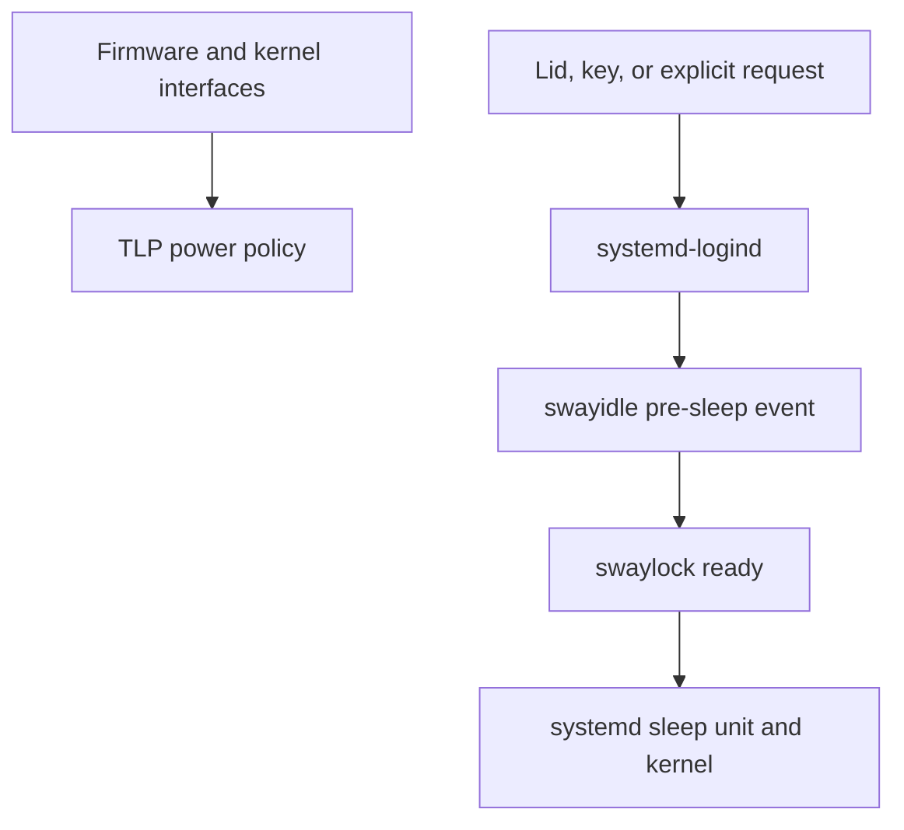

# TLP, logind, idle handling, and suspend

## Purpose and scope

A laptop desktop makes several different operations look like one feature
called “power management”:

- choosing whether performance or battery life has priority;
- limiting battery charging to reduce long-term wear;
- reacting to the charger, lid, and hardware sleep key;
- deciding whether the kernel uses shallow or deep suspend;
- locking the graphical session before the hardware sleeps;
- turning displays off after inactivity without suspending the machine;
- restoring devices, networking, and power policy after resume.

No single program owns that entire chain. Treating TLP, logind, swayidle, and
swaylock as interchangeable power managers leads to duplicated policy, races,
and difficult diagnosis.

This guide explains the design selected by this project for the two ThinkPad
T14 Gen 1 AMD machines:

| Responsibility | Project component | Scope |
| --- | --- | --- |
| Hardware power and charging behavior | ThinkPad firmware and embedded controller | Hardware |
| Kernel hardware interface | `thinkpad_acpi`, AMD drivers, power-supply and platform-profile sysfs | Kernel |
| Laptop tuning policy | TLP | System |
| Standard three-profile desktop API | `tlp-pd` | System D-Bus service |
| Lid, sleep key, sessions, and sleep coordination | `systemd-logind` | System |
| Execution of suspend | systemd sleep units and the kernel | System and kernel |
| Wayland inactivity and pre-sleep events | swayidle | User session |
| Screen covering and unlock authentication | swaylock plus PAM | User session and authentication |
| Display power commands | Niri | User session |

The post-install repository remains the executable procedure. This article
provides the mental model, precedence rules, inspection commands, failure
boundaries, and recovery reasoning.

The canonical setup does **not** configure hibernation, suspend-then-hibernate,
automatic suspend on AC or after logout, custom fan curves, undervolting,
overclocking, `powertop --auto-tune`, `tlp-rdw`, or a second power manager.

## Canonical project policy

The resulting behavior is:

| Event or state | Result |
| --- | --- |
| Connected to AC | TLP selects `performance` automatically |
| Running on battery | TLP selects `balanced` automatically |
| Manual maximum saving | `tlpctl power-saver` |
| Normal battery charging | Start below 75%, stop at 80% |
| Temporary travel charge | `sudo tlp fullcharge BAT0` |
| Suspend key | Suspend |
| Lid on battery | Suspend |
| Lid on external power | Suspend |
| Lid while docked or using multiple displays | Ignore |
| Five idle minutes | Lock |
| Ten idle minutes | Power displays off, without suspending |
| User activity after display timeout | Power displays on |
| Thirty idle minutes on battery | Request suspend while honoring inhibitors |
| Thirty idle minutes on external power | Stay awake |
| Any systemd-coordinated sleep | Lock before the machine sleeps |
| Hibernation | Not configured |

Two local configuration snippets express the system policy:

```ini
# /etc/tlp.d/10-thinkpad-battery.conf
START_CHARGE_THRESH_BAT0=75
STOP_CHARGE_THRESH_BAT0=80
```

```ini
# /etc/systemd/logind.conf.d/70-thinkpad-suspend.conf
[Login]
SleepOperation=suspend
HandleSuspendKey=suspend
HandleHibernateKey=ignore
HandleLidSwitch=suspend
HandleLidSwitchExternalPower=suspend
HandleLidSwitchDocked=ignore
```

The Niri configuration starts one user-session idle coordinator:

```kdl
spawn-at-startup "swayidle" "-w" \
    "timeout" "300" "swaylock -f" \
    "timeout" "600" "niri msg action power-off-monitors" \
    "resume" "niri msg action power-on-monitors" \
    "timeout" "1800" "$HOME/.local/bin/idle-suspend" \
    "before-sleep" "swaylock -f" \
    "lock" "swaylock -f"
```

The tracked file uses one physical KDL line; it is wrapped here only to make
the event sequence readable.

## One chain, several owners

The clean model is mechanism, policy, event, and presentation:



The two branches meet only during sleep and resume:

- TLP configures power-related kernel and hardware interfaces and reapplies
  volatile values when relevant events occur.
- logind receives lid, key, and D-Bus requests and coordinates the selected
  sleep operation.
- swayidle listens to the graphical session and to logind events.
- swaylock protects the already running user session.
- systemd invokes the kernel sleep mechanism.
- after resume, services and drivers restore their state; TLP reapplies policy
  where necessary.

Installing two programs that can write the same CPU, platform, PCIe, USB, or
radio controls does not create a stronger policy. It creates competing writers.
The last one to react to an event wins temporarily, so the observed behavior
can depend on timing.

## TLP is policy, not a continuously running tuner

### Event-driven application

TLP groups settings into profiles and applies them on events such as:

- system boot;
- AC adapter connection or removal;
- manual profile selection;
- selected device events;
- suspend and resume.

Many Linux power controls are volatile values exposed through `sysfs`. They
do not become permanent merely because a process wrote them once. TLP owns the
job of selecting and reapplying one coherent set of values.

This is why the following command is the right way to apply a changed TLP
configuration immediately:

```bash
sudo tlp start
```

It is also why `systemctl status tlp.service` can be misleading. The boot
service applies the policy and exits successfully; it is not meant to remain
`active (running)`. Inspect TLP through its own status view:

```bash
sudo tlp-stat -s
```

### Profiles, power source, and holds

TLP 1.9 and later provides three profiles:

| Profile | Parameter suffix | Project use |
| --- | --- | --- |
| `performance` | `_AC` | Automatic on AC |
| `balanced` | `_BAT` | Automatic on battery |
| `power-saver` | `_SAV` | Manual exceptional saving |

The names describe groups of TLP parameters. They are not direct promises
about a fixed CPU frequency, fan speed, or battery runtime.

Inspect and select them without root through `tlp-pd`:

```bash
tlpctl list
tlpctl get
tlpctl performance
tlpctl balanced
tlpctl power-saver
```

A manual selection is different from the normal AC/battery automatic choice.
After an experiment, the project returns to the source-based policy by
reapplying TLP:

```bash
sudo tlp start
```

`tlpctl launch` can hold a profile while one command runs:

```bash
tlpctl launch --profile performance --reason "local build" make -j8
tlpctl list-holds
```

The hold is released when the command exits, when the user chooses another
profile, or when the requesting application releases it. This is useful for a
measured workload; it is not necessary for ordinary browsing or compilation.

### What `tlp-pd` does

`tlp-pd` implements the standard D-Bus power-profile interface used by desktop
controls. It lets an unprivileged session inspect or request TLP profiles. It
does not replace TLP's hardware tuning engine and is not a second tuning
policy.

The relationship is:

| Component | Owns |
| --- | --- |
| `tlp` | Profile contents and hardware settings |
| `tlp-pd` | Standard profile-selection API and profile holds |
| `tlpctl` | Command-line client for that API |
| A future bar widget | Presentation and user selection only |

`power-profiles-daemon` and `tuned-ppd` implement overlapping profile APIs or
policy. They remain absent. A bar may show the current profile later, but it
must talk to the selected provider rather than starting another provider.

### TLP configuration precedence is program-specific

TLP currently reads:

1. intrinsic defaults;
2. `/etc/tlp.d/*.conf` in lexical order;
3. `/etc/tlp.conf` last.

For the same parameter, the last active occurrence wins. Consequently, a
setting uncommented in `/etc/tlp.conf` overrides every earlier
`/etc/tlp.d/*.conf` value.

This is intentionally different from systemd's configuration model. The
suffix `.d` is a convention, not a universal Linux precedence engine. Each
program defines how it discovers, orders, merges, and overrides its files.

Inspect what TLP actually loaded:

```bash
sudo tlp-stat -c
sudo tlp-stat --cdiff
grep -RnsE '^[[:space:]]*(START|STOP)_CHARGE_THRESH' \
    /etc/tlp.d /etc/tlp.conf
```

The project uses `10-thinkpad-battery.conf` because it is focused, reviewable,
and easy to remove. The number is descriptive ordering, not a guarantee that
it overrides `/etc/tlp.conf`.

## Battery thresholds are battery care, not power saving

### What 75/80 means

The embedded controller performs the actual charging decision:

- charging may start when AC is present and the reported level is below 75%;
- charging stops when it reaches 80%;
- connecting the charger at 78% should not immediately start a new small
  charge cycle.

The 5-point gap is hysteresis. It prevents repeated start/stop cycling around
one threshold. Limiting the maximum charge reduces usable unplugged capacity
in exchange for a battery-care policy suited to machines that spend
significant time on AC.

This does not reduce the CPU's current consumption and does not itself extend
runtime for the current charge. TLP's battery-care documentation deliberately
separates charge thresholds from power saving.

### Hardware support comes first

Threshold support depends on laptop vendor, kernel driver, TLP version, and
the individual battery. Verify it rather than copying a configuration from
another laptop:

```bash
sudo tlp-stat -b
ls -1 /sys/class/power_supply
```

On the project ThinkPad, TLP should report the ThinkPad battery-care plugin
through `thinkpad_acpi`. The parameter qualifier `BAT0` is a TLP configuration
name and must be checked against TLP's report; it should not be inferred only
from a displayed battery label.

Both thresholds must be configured together. Read the effective controller
values:

```bash
cat /sys/class/power_supply/BAT0/charge_control_start_threshold
cat /sys/class/power_supply/BAT0/charge_control_end_threshold
```

Expected values are `75` and `80`.

### Full charge and recalibration are different operations

For a trip, temporarily request the vendor's full-charge behavior:

```bash
sudo tlp fullcharge BAT0
```

The configured thresholds return on the next boot or after:

```bash
sudo tlp setcharge
```

`tlp recalibrate` deliberately discharges and recharges a battery so its
controller can update capacity estimates. It is not routine maintenance and
does not restore lost chemical capacity. Use it only to investigate inaccurate
state-of-charge or runtime estimates and only after reading the complete
procedure.

## Platform profiles are firmware policy hints

Modern laptops may expose:

```text
/sys/firmware/acpi/platform_profile
/sys/firmware/acpi/platform_profile_choices
```

The kernel interface selects among platform-defined operating biases. A
profile can affect several dimensions at once, such as power limits,
temperature targets, fan behavior, and performance preference. It does not
report the performance actually achieved.

Inspect the project hardware:

```bash
cat /sys/firmware/acpi/platform_profile_choices
cat /sys/firmware/acpi/platform_profile
lsmod | grep thinkpad_acpi
```

The T14 should expose `low-power`, `balanced`, and `performance` through the
ThinkPad kernel integration. TLP can include platform-profile selection in its
own profiles.

Three similarly named ideas must remain separate:

| Layer | Example | Meaning |
| --- | --- | --- |
| TLP profile | `balanced` | A complete set of TLP settings |
| Kernel platform profile | `balanced` | Firmware/platform bias selected through sysfs |
| CPU policy | governor, EPP, boost | Processor-specific controls |

They may be coordinated, but they are not aliases. A `performance` platform
profile cannot override cooling limits, ambient temperature, firmware safety
policy, or the physical airflow available to the laptop.

Do not add `thinkfan`, `thermald`, `ryzenadj`, a `powertop` auto-tune unit, or
custom CPU limits merely because the interfaces exist. Add another writer only
for a measured problem, after identifying exactly which setting it owns and
which existing owner it replaces.

## logind owns system sleep requests and lid policy

### What logind sees

`systemd-logind` tracks seats, sessions, users, hardware power keys, lid
switches, and inhibitor locks. A lid event can result in a system action
without Niri or swayidle being the component that selected that action.

The project configures logind because it must work consistently from:

- the Niri session;
- a recovery TTY;
- manual `systemctl suspend`;
- the hardware suspend key;
- lid close on battery and AC.

The local snippet lives at:

```text
/etc/systemd/logind.conf.d/70-thinkpad-suspend.conf
```

For systemd configuration, package files normally live under `/usr` and local
administrator overrides under `/etc`. Drop-ins are sorted lexically across the
recognized directories; a later scalar setting overrides an earlier one.
systemd recommends the 60–90 range for local administrator drop-ins, which is
why this project uses `70-`.

Always inspect the merged configuration:

```bash
systemd-analyze cat-config systemd/logind.conf
```

Reading only the local file proves what was requested, not what logind will
receive after all sources are merged.

### Lid selection order

logind distinguishes three lid contexts:

| Context | Project option | Result |
| --- | --- | --- |
| Docked or more than one display connected | `HandleLidSwitchDocked=ignore` | Continue running |
| External power, not docked | `HandleLidSwitchExternalPower=suspend` | Suspend |
| Battery, not docked | `HandleLidSwitch=suspend` | Suspend |

The docked rule also applies when logind detects more than one display; a
physical docking station is not required. Immediately after boot or resume,
logind normally waits before trusting lid events so the kernel has time to
detect docks and external displays.

### `SleepOperation` and explicit actions

`SleepOperation=` controls what the generic logind `sleep` action may choose.
Current systemd defaults can consider several operations. The project restricts
that generic choice to:

```ini
SleepOperation=suspend
```

This does not enable suspend support; it prevents a generic sleep request from
selecting hibernation or suspend-then-hibernate. An explicit
`systemctl suspend` already asks for suspend directly.

### Do not restart logind casually

Restarting `systemd-logind` can disrupt or invalidate active login sessions,
their device ownership, and the graphical seat. After changing its policy,
verify the merged file, save work, and reboot through the known-good boot
path. A reboot also tests that the policy survives startup.

## Suspend is not hibernation

The power states have different persistence and prerequisites:

| Operation | Main state location | Power use | Project status |
| --- | --- | --- | --- |
| Suspend | RAM remains powered | Low, nonzero | Configured |
| Hibernation | RAM image written to persistent swap/storage | Effectively off | Not configured |
| Hybrid sleep | Hibernation image plus immediate suspend | Low until power loss | Not configured |
| Suspend then hibernate | Suspend first, hibernate later | Changes over time | Not configured |

The existing encrypted disk swap is a memory-pressure fallback. Its mere
existence does not create a correct hibernation design. Hibernation additionally
requires a suitable image target, resume discovery in the boot path, initramfs
support, capacity planning, encryption reasoning, and tests.

### `s2idle` and deep suspend

Linux exposes supported system states in:

```bash
cat /sys/power/state
cat /sys/power/mem_sleep
```

`/sys/power/state` should include `mem`. `/sys/power/mem_sleep` describes
which suspend variant `mem` uses:

- `s2idle` is a software-oriented idle state with broad compatibility and
  typically more hardware left in a wake-capable state;
- `deep` normally maps to suspend-to-RAM with more platform participation.

Square brackets mark the selected variant:

```text
s2idle [deep]
```

For the project ThinkPad, deep sleep is selected through the UEFI
`Config → Power → Sleep State → Linux` setting. Prefer a supported firmware
choice over forcing a kernel command-line override. A deeper-looking state is
not automatically better if the firmware or devices cannot resume reliably.

### The systemd-to-kernel path

A normal request follows this simplified path:

1. a user, lid event, or application requests suspend through logind/systemd;
2. logind announces preparation for sleep and honors applicable inhibitors;
3. swayidle receives `before-sleep` and starts the locker;
4. systemd reaches `suspend.target` and runs `systemd-suspend.service`;
5. systemd performs its sleep preparation and asks the kernel for `mem`;
6. firmware and devices enter the selected suspend variant;
7. a permitted wake event resumes the kernel;
8. systemd, drivers, networking, session components, and TLP restore state.

Do not execute `systemd-suspend.service` directly and do not write to
`/sys/power/state` for ordinary use. Use the high-level command:

```bash
systemctl suspend
```

Generic executables under `/usr/lib/systemd/system-sleep/` run around the
kernel transition, but systemd describes this mechanism as a local compatibility
hook. User-session applications should use logind's sleep preparation and
inhibitor APIs. The project therefore does not create a custom sleep script to
call swaylock.

## Locking, idleness, and display power are separate

### swaylock

swaylock creates a lock surface for the current Wayland session and
authenticates the unlock through PAM. Its configuration controls appearance;
it does not contain a password and it does not suspend the system.

The `-f` option asks swaylock to detach only after the session has been locked.
At that point the compositor guarantees that sensitive content is no longer
visible. This readiness boundary is essential before suspend.

### swayidle

swayidle listens for compositor inactivity and, when built with systemd
support, logind events. It does not authenticate and does not decide the
project's lid policy.

Its relevant events are:

| Event | Meaning in this project |
| --- | --- |
| `timeout 300` | Start swaylock after five inactive minutes |
| `timeout 600` | Ask Niri to power off displays |
| `resume` | Ask Niri to power displays on after activity |
| `timeout 1800` | Call the fail-closed battery-only suspend helper |
| `before-sleep` | Start swaylock before system sleep |
| `lock` | Respond to a logind session-lock request |

The swayidle `-w` option waits for a launched command. Together with
`swaylock -f`, it means the pre-sleep command returns only after swaylock has
established the protected surface. swayidle then releases its delay inhibitor
and systemd may continue.

The delay is bounded by logind's `InhibitDelayMaxSec=`. It is a short ordering
mechanism, not a way to prevent sleep indefinitely.

### Niri display power

`niri msg action power-off-monitors` turns outputs off from the running
graphical session. It does not suspend RAM, stop applications, or trigger the
lid policy. Activity invokes the paired power-on action.

This distinction is deliberate:

- screen blanking saves display power and provides visual quiet;
- locking creates an authentication boundary;
- suspend changes machine power state.

The post-baseline extension suspends after 30 idle minutes only when UPower
reports battery operation. On AC, the timer records a safe skip. Long work that
does not implement a sleep inhibitor should run on AC or inside an explicit
`systemd-inhibit --what=sleep` scope. Manual suspend and lid close remain
independent explicit paths.

### The explicit lock binding

The Niri binding includes:

```kdl
Super+Alt+L allow-inhibiting=false {
    spawn "swaylock" "-f"
}
```

`allow-inhibiting=false` makes the explicit security action available even
when normal compositor shortcuts are inhibited, for example by an application.
It is unrelated to systemd sleep inhibitor locks.

## Inhibitors explain apparent policy failures

Applications may request inhibitor locks so a destructive transition is
blocked or delayed:

| Inhibitor class | Example purpose |
| --- | --- |
| `sleep` | Prevent or delay sleep during a critical operation |
| `shutdown` | Finish saving state before power-off |
| `idle` | Prevent automatic idle action during playback |
| `handle-lid-switch` | Let a desktop environment take over raw lid handling |

Modes have different strength:

- `block` prevents the operation until the inhibitor disappears or an
  authorized caller explicitly overrides it;
- `delay` postpones sleep or shutdown only up to logind's limit;
- `block-weak` has weaker enforcement for privileged or same-user requests.

Inspect active locks:

```bash
systemd-inhibit --list
systemd-inhibit --list --what=sleep
systemd-inhibit --list --what=handle-lid-switch
```

A **low-level** `handle-lid-switch` inhibitor means logind deliberately stops
handling the lid; its `HandleLidSwitch*=` configuration then does not apply.
Desktop environments use this when they own lid policy themselves. The
project does not give Niri that ownership.

A **high-level** `sleep` inhibitor controls the requested sleep operation
rather than raw lid event ownership. systemd's defaults treat lid-triggered
actions differently from power and sleep keys, so diagnose the inhibitor type
instead of assuming every “inhibit sleep” request affects every path equally.

To see the concept safely:

```bash
systemd-inhibit --what=sleep --why="documentation test" sleep 60
```

In another terminal, inspect the list. Stop the test with `Ctrl+C`. Do not use
an inhibitor as a permanent substitute for correct idle or application policy.

## End-to-end verification

### 1. Confirm there is one power-policy stack

```bash
pacman -Q tlp tlp-pd
pacman -Q power-profiles-daemon tuned tuned-ppd auto-cpufreq 2>&1
systemctl is-enabled tlp.service tlp-pd.service
systemctl is-active tlp-pd.service
sudo tlp-stat -s
```

TLP and `tlp-pd` should be installed and enabled. `tlp-pd` should be running.
The competing packages should be absent.

### 2. Inspect effective TLP configuration and profiles

```bash
sudo tlp-stat -c
sudo tlp-stat --cdiff
tlpctl list
tlpctl get
cat /sys/firmware/acpi/platform_profile_choices
cat /sys/firmware/acpi/platform_profile
```

Disconnect and reconnect AC, waiting a few seconds each time:

```bash
sudo tlp-stat -s
tlpctl get
cat /sys/firmware/acpi/platform_profile
```

The project expects balanced on battery and performance on AC. Record all
three views if they disagree; they represent different layers.

### 3. Confirm battery care

```bash
sudo tlp-stat -b
cat /sys/class/power_supply/BAT0/charge_control_start_threshold
cat /sys/class/power_supply/BAT0/charge_control_end_threshold
```

Expected controller values are 75 and 80. A battery already above 80% does not
have to discharge immediately; the threshold controls future charging.

### 4. Confirm merged logind policy

```bash
systemd-analyze cat-config systemd/logind.conf
loginctl seat-status seat0
systemd-inhibit --list
```

Check the final effective `SleepOperation` and `Handle*` values. Note external
display state and any low-level lid inhibitor.

### 5. Confirm sleep-state support

```bash
cat /sys/power/state
cat /sys/power/mem_sleep
```

`mem` and `[deep]` are expected on the canonical ThinkPad setup.

### 6. Confirm one idle coordinator and a working locker

Inside Niri:

```bash
pgrep -a swayidle
swaylock -f
```

There should be one swayidle process. Verify that a wrong password fails and
the account password unlocks. Then use `Super+Alt+L` and verify the same path.

### 7. Test suspend behind the lock

Save work and keep a recovery TTY available. From Niri:

```bash
systemctl suspend
```

After wake, the lock surface must appear before any desktop content. Repeat
with lid close on battery and on AC. Test docked or multi-display behavior
separately; it should remain running by design.

Inspect the current boot:

```bash
journalctl -b -u systemd-suspend.service --no-pager
journalctl -b --no-pager | grep -Ei 'suspend|sleep|swayidle|swaylock'
sudo tlp-stat -s
nmcli general status
systemctl --failed --no-pager
systemctl --user --failed --no-pager
```

## Troubleshooting by boundary

### The TLP profile does not change with AC state

Inspect:

```bash
sudo tlp-stat -s
tlpctl get
tlpctl list-holds
upower -d
journalctl -b -u tlp-pd.service --no-pager
```

Possible boundaries are:

- the kernel or UPower does not report the source change;
- a manual profile or application hold remains active;
- `tlp-pd` is inactive;
- another manager writes overlapping controls;
- the observation confuses a TLP profile with the platform profile.

Release the intentional hold or reapply automatic policy with
`sudo tlp start`. Do not repeatedly restart unrelated services.

### Charge thresholds are ignored

Check in this order:

```bash
sudo tlp-stat -b
sudo tlp-stat -c
sudo tlp-stat --cdiff
grep -RnsE '^[[:space:]]*(START|STOP)_CHARGE_THRESH' \
    /etc/tlp.d /etc/tlp.conf
cat /sys/class/power_supply/BAT0/charge_control_start_threshold
cat /sys/class/power_supply/BAT0/charge_control_end_threshold
```

Likely causes include unsupported hardware, a wrong TLP battery qualifier, an
`/etc/tlp.conf` value overriding the drop-in, only one of the required pair
being configured, or a temporary `fullcharge` operation still active.

Do not install an old out-of-tree ThinkPad module on this machine to force
support that `thinkpad_acpi` did not report.

### Closing the lid does nothing

Inspect:

```bash
systemd-analyze cat-config systemd/logind.conf
systemd-inhibit --list --what=handle-lid-switch
loginctl seat-status seat0
journalctl -b -u systemd-logind.service --no-pager
```

Check whether:

- a low-level inhibitor gave lid ownership to another program;
- a dock or second display selected `HandleLidSwitchDocked=ignore`;
- the lid event reached the kernel and logind;
- the close happened during the post-boot or post-resume hardware-detection
  holdoff;
- the local drop-in was misspelled or lacks the `.conf` suffix.

Do not delete the docked rule simply to make an intended multi-display state
suspend.

### Suspend starts and immediately resumes

An enabled wake source or unstable device may wake the system. Gather evidence:

```bash
journalctl -b -u systemd-suspend.service --no-pager
journalctl -b -k --no-pager | grep -Ei 'wake|wakeup|suspend|acpi'
cat /proc/acpi/wakeup
```

Record whether the event occurs on AC, battery, lid, manual suspend, with USB
devices, or with a dock. Change one suspected wake source at a time and retain
a recovery route. Do not disable a list of devices copied from another model.

### Resume hangs or required hardware disappears

After a forced restart, preserve the previous boot evidence:

```bash
journalctl -b -1 -u systemd-suspend.service --no-pager
journalctl -b -1 -k --no-pager
```

Compare firmware revision, kernel version, connected peripherals, and sleep
variant. Test a current complete system update and the supported UEFI sleep
choice before adding driver parameters. Do not switch to hibernation as a
workaround for an unexplained suspend failure.

### Resume exposes an unlocked desktop

Stop relying on suspend outside a supervised environment. Verify:

```bash
pgrep -a swayidle
journalctl -b --no-pager | grep -Ei 'PrepareForSleep|swayidle|swaylock'
swaylock -f
```

Confirm the exact Niri startup line contains swayidle `-w` and the
`before-sleep "swaylock -f"` action, that only one idle manager exists, and
that swaylock can authenticate manually.

Do not add a blind delay such as `sleep 2`. The supported readiness and
inhibitor mechanisms already express the required ordering.

### Battery drain during suspend is unexpectedly high

First establish whether the machine actually stayed suspended:

```bash
journalctl -b --no-pager | grep -Ei 'suspend entry|suspend exit|wakeup'
cat /sys/power/mem_sleep
```

Measure battery level and elapsed time over repeatable tests. Consider wake
events, the selected `s2idle`/`deep` mode, firmware revisions, docks, USB
devices, network wake features, and battery health. A single overnight
percentage without start/end timestamps is not enough to identify a cause.

## Alternatives and deferred work

### Other power managers

`power-profiles-daemon` offers a smaller standard-profile service and is often
appropriate for integrated desktop environments. tuned and `tuned-ppd` offer a
broader system-tuning framework. `auto-cpufreq` focuses on dynamic CPU policy.
They are alternatives to evaluate, not additions to stack over TLP.

TLP remains the project choice because it combines event-driven laptop tuning,
the profile API through `tlp-pd`, and ThinkPad battery thresholds in one
reviewable policy.

### Automatic idle suspend

The selected extension adds a third stage without adding a second coordinator:

1. swayidle locks the existing graphical session after five minutes;
2. it powers the displays off after ten minutes;
3. after 30 minutes it calls `~/.local/bin/idle-suspend`;
4. the helper reads UPower's boolean `OnBattery` D-Bus property;
5. only `b true` reaches `systemctl --check-inhibitors=yes suspend`.

“Lock” is deliberate wording. Logging out would terminate Niri and its user
processes, including swayidle. Automatic logout and post-logout greeter sleep
are different policies.

The helper is a condition around the request, not another power manager. It
does not change TLP, write sysfs, use `sudo`, loop, or create a timer. External
power and unknown state return without sleeping. `--check-inhibitors=yes`
states the safety boundary explicitly: a blocking sleep inhibitor makes the
automatic request fail instead of being silently overridden.

Wayland idle inhibition and logind sleep inhibition remain separate. A player
that implements the Wayland protocol can stop swayidle's progression. A build
that merely keeps CPUs busy is not user input and may need an explicit scope:

```bash
systemd-inhibit --what=sleep --mode=block \
  --why="Local build must finish" make -j"$(nproc)"
```

That protects the final sleep request, not screen locking or monitor power.
Unattended upgrades remain safer on AC, where this project never
auto-suspends.

If a sleep inhibitor blocks the 30-minute attempt and later disappears while
the user remains inactive, the helper does not start a retry clock. New input
resets swayidle and a later complete idle cycle may try again. This fail-closed
choice avoids a detached timer suspending after activity resumed.

### Hibernation

Hibernation deserves a separate storage-and-boot design. It must account for
the encrypted swap mapping, resume image discovery, initramfs and UKI changes,
image capacity, Secure Boot, failure recovery, and the interaction with zram.
It is not a one-line extension to logind.

### Fan and performance customization

Custom fan curves, AMD power limits, undervolting, and workload-specific TLP
values remain deferred until measurements demonstrate a need. “More tuning”
is not an objective; predictable ownership and verifiable behavior are.

## Completion checklist

- [ ] TLP is the only high-level hardware power manager.
- [ ] `tlp-pd` exposes performance, balanced, and power-saver profiles.
- [ ] AC and battery changes select the intended automatic profiles.
- [ ] TLP configuration sources and their precedence are understood.
- [ ] `BAT0` reports supported battery care and effective 75/80 thresholds.
- [ ] Temporary full charge is distinguished from recalibration.
- [ ] TLP, platform, and CPU policy profiles are not treated as aliases.
- [ ] The merged logind configuration matches the project lid policy.
- [ ] Docked or multi-display lid behavior is intentionally ignored.
- [ ] `mem` and `[deep]` are present on the project hardware.
- [ ] Hibernation remains unconfigured.
- [ ] One swayidle process owns inactivity and pre-sleep coordination.
- [ ] swaylock authenticates correctly and is ready before suspend proceeds.
- [ ] Five minutes locks and ten minutes powers displays off.
- [ ] Thirty idle minutes suspend only on battery; AC remains awake.
- [ ] UPower failure and active inhibitors leave the system awake.
- [ ] Manual and lid-triggered suspend both resume behind the locker.
- [ ] Inhibitor locks can be inspected and interpreted.
- [ ] Networking, TLP, and system/user units are healthy after resume.

## Sources

- [Project guide: Configuration files, drop-ins, and precedence](../foundations/01-configuration-files-and-drop-ins.md)
- [TLP: Introduction and configuration precedence](https://linrunner.de/tlp/settings/introduction.html)
- [TLP: Usage and status](https://linrunner.de/tlp/usage/index.html)
- [TLP: `tlpctl` and profile holds](https://linrunner.de/tlp/usage/tlpctl.html)
- [TLP: Battery care](https://linrunner.de/tlp/settings/battery.html)
- [Linux kernel: Platform profile selection](https://docs.kernel.org/userspace-api/sysfs-platform_profile.html)
- [systemd: `logind.conf`](https://man.archlinux.org/man/logind.conf.5)
- [systemd: Inhibitor locks](https://systemd.io/INHIBITOR_LOCKS/)
- [systemd: `systemd-inhibit`](https://man.archlinux.org/man/systemd-inhibit.1)
- [systemd: `systemctl`](https://man.archlinux.org/man/systemctl.1)
- [systemd: Sleep-state logic](https://man.archlinux.org/man/systemd-sleep.8)
- [UPower D-Bus interface](https://upower.freedesktop.org/docs/UPower.html)
- [swayidle manual](https://man.archlinux.org/man/swayidle.1)
- [swaylock manual](https://man.archlinux.org/man/swaylock.1)
- [ArchWiki: Power management](https://wiki.archlinux.org/title/Power_management)
- [ArchWiki: Suspend and hibernate](https://wiki.archlinux.org/title/Power_management/Suspend_and_hibernate)
- [ArchWiki: TLP](https://wiki.archlinux.org/title/TLP)
- [ArchWiki: Lenovo ThinkPad T14 (AMD) Gen 1](https://wiki.archlinux.org/title/Lenovo_ThinkPad_T14_(AMD)_Gen_1)

## Next guide

Continue with the graphical stack itself: Wayland's client/compositor model,
Niri's role, Xwayland-satellite, environment propagation, application identity,
outputs, IPC, and the boundary between compositor configuration and independent
session services.
